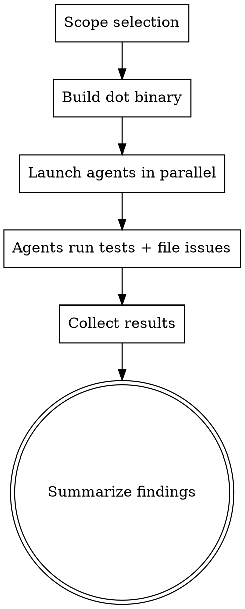

# Full App Stress Test

Orchestrate parallel subagents to test every user-facing feature of `dot`. Each agent runs in an isolated sandbox, exercises a specific domain, and files beads issues for anything broken, confusing, or missing.

## Safety

CRITICAL: No agent may touch the real `$HOME` or any real config files. Every agent operates exclusively inside `/tmp/dot-test-<name>-<ts>/`.

## Process



### Step 1: Scope Selection

Present this prompt to the user:

```
Which agents should run?
- All agents (full comprehensive test)
- Pick agents (multi-select)

Available agents:
1. Core Lifecycle - manage/unmanage/remanage cycles
2. Adopt + Clone - file adoption and repo cloning
3. Config + Doctor + Status - inspection commands
4. Ignore + Translation - dotfile rules and ignore patterns
5. Real Shell Configs - bash/zsh/fish configs verified by shells
6. Real Tool Configs - git/vim/tmux/ssh configs verified by programs
7. Stress + Error Recovery - robustness and adversarial conditions
```

### Step 2: Build

Build once, all agents share the binary:

```bash
DOTBIN="/tmp/dot-stress-test-bin"
mkdir -p "$DOTBIN"
cd /Volumes/Development/dot && go build -o "$DOTBIN/dot" ./cmd/dot/
```

Verify: `$DOTBIN/dot --help`

### Step 3: Launch Agents

Launch selected agents in parallel using the Task tool with `subagent_type: "general-purpose"`. Run them in background (`run_in_background: true`).

Each agent prompt MUST include:
1. The sandbox setup preamble (below)
2. The agent-specific test list
3. The issue filing instructions

### Step 4: Collect and Summarize

After all agents complete, run `bd list --status=open` and summarize:
- Total issues filed by type (bug/task/feature)
- Total issues by priority (P1/P2/P3/P4)
- Which agents found issues
- Any P1 issues that need immediate attention

---

## Sandbox Setup Preamble

Include this VERBATIM at the start of every agent prompt:

```
## Setup

You are testing the dot CLI tool. You MUST operate exclusively in an isolated sandbox.
NEVER reference, read, or modify anything in the real $HOME or real config files.

Run this setup first:

AGENT_NAME="<agent-name>"
TS=$(date +%s)
SANDBOX="/tmp/dot-test-${AGENT_NAME}-${TS}"
mkdir -p "$SANDBOX/home/.config" "$SANDBOX/packages"
export HOME="$SANDBOX/home"
export XDG_CONFIG_HOME="$SANDBOX/home/.config"
unset DOT_CONFIG

DOTBIN="/tmp/dot-stress-test-bin"
DOT="$DOTBIN/dot"
PKGDIR="$SANDBOX/packages"
TARGET="$SANDBOX/home"

Verify: $DOT --help

For ALL dot commands, always pass: --dir "$PKGDIR" --target "$TARGET"

## Issue Filing

When you find a bug, UX issue, or missing feature, file a beads issue:

- Bugs (broken behavior): bd create --title="[<agent-name>] description" --type=bug --priority=2
- Data loss risk: bd create --title="[<agent-name>] description" --type=bug --priority=1
- UX issues (confusing output): bd create --title="[<agent-name>] description" --type=task --priority=3
- Missing features: bd create --title="[<agent-name>] description" --type=feature --priority=3
- Nice-to-have polish: bd create --title="[<agent-name>] description" --type=task --priority=4

Include in --description: reproduction steps, expected behavior, actual behavior (with output).

Do NOT file issues for:
- Behaviors that match --help descriptions exactly
- Known limitations in help text
- Issues that are clearly environmental (missing programs, permissions)

## Test Execution

Run each test. For each test:
1. State what you are testing
2. Run the commands
3. Check expected vs actual behavior
4. If unexpected: file a beads issue
5. Continue to next test (do not stop on failure)

After all tests, write a summary of pass/fail counts and issues filed.
```

---

## Agent Test Specifications

### Agent 1: core-lifecycle

```
Tests for the fundamental manage/unmanage/remanage cycle:

1. Create package: mkdir -p "$PKGDIR/vim" && echo 'set nocompatible' > "$PKGDIR/vim/dot-vimrc"
   Manage it: $DOT manage vim --dir "$PKGDIR" --target "$TARGET"
   Verify: test -L "$TARGET/.vimrc" && readlink "$TARGET/.vimrc"

2. Create 3 packages (zsh, tmux, git), manage all at once.
   Verify all symlinks created.

3. Unmanage single package (vim). Verify symlink removed.
   Check parent dirs cleaned up if empty.

4. Manage 3 packages. Unmanage --all --yes. Verify all removed.

5. Create package, manage it, then unmanage --purge.
   Verify package directory itself is deleted.

6. Manage a package. Remanage without changing anything.
   Expected: "No changes detected" info message (not error).

7. Manage a package. Modify a file in the package. Remanage.
   Expected: success message showing changes applied.

8. Try to manage reserved names: "dot", ".dot", "dot-config"
   Expected: clear error about reserved name for each.

9. Try to manage a package that does not exist in package dir.
   Expected: clear error message.

10. Try to unmanage a package not in the manifest.
    Expected: ErrPackageNotFound error.

11. Run manage --dry-run. Verify NO symlinks created. Verify output shows plan.
    Run unmanage --dry-run. Verify NO symlinks removed. Verify output shows plan.

12. Create empty package (directory with no files). Manage it.
    Expected: "no operations required" or similar.

13. Create package with only .git/ and .DS_Store (default ignored files). Manage.
    Expected: no operations (all files ignored).

14. Create package with deeply nested structure (4 levels).
    Manage, verify all levels linked. Unmanage, verify all cleaned up.

15. Manage same package twice without unmanaging.
    Expected: either no-op or clear message.
```

### Agent 2: adopt-clone

```
Tests for file adoption and repository cloning:

1. Create a real file: echo 'alias ll="ls -la"' > "$TARGET/.bashrc"
   Adopt it: $DOT adopt .bashrc bash --dir "$PKGDIR" --target "$TARGET"
   Verify: file moved to $PKGDIR/bash/, symlink at $TARGET/.bashrc points to package.

2. Unmanage the adopted package (no flags).
   Verify: file restored to $TARGET/.bashrc as real file (not symlink).

3. Re-adopt. Then unmanage --no-restore.
   Verify: file stays in package dir, symlink removed, original location empty.

4. Re-create and adopt. Then unmanage --purge.
   Verify: package directory deleted entirely.

5. Adopt with auto-derived name:
   echo 'config' > "$TARGET/.ssh_config"
   $DOT adopt "$TARGET/.ssh_config" --dir "$PKGDIR" --target "$TARGET"
   Check what package name was derived.

6. Create a nested file: mkdir -p "$TARGET/.config/nvim" && echo 'set rtp' > "$TARGET/.config/nvim/init.vim"
   Adopt with explicit package name: $DOT adopt nvim "$TARGET/.config/nvim/init.vim" --dir "$PKGDIR" --target "$TARGET"

7. Clone test: Create a local git repo with packages:
   REPO="$SANDBOX/dotfiles-repo"
   mkdir -p "$REPO/dot-vim" "$REPO/dot-zsh"
   echo 'set nocompatible' > "$REPO/dot-vim/dot-vimrc"
   echo 'export ZSH=yes' > "$REPO/dot-zsh/dot-zshrc"
   cd "$REPO" && git init && git add -A && git commit -m "init"

   Clone it: $DOT clone "$REPO" --dir "$SANDBOX/cloned" --target "$TARGET" --force
   Verify packages installed.

8. Create .dotbootstrap.yaml in the repo:
   cat > "$REPO/.dotbootstrap.yaml" << 'YAML'
   version: "1.0"
   packages:
     - name: dot-vim
       required: true
     - name: dot-zsh
       required: false
   profiles:
     minimal:
       description: "Just vim"
       packages: [dot-vim]
   defaults:
     profile: minimal
   YAML
   git -C "$REPO" add -A && git -C "$REPO" commit -m "add bootstrap"

   Clone with profile: $DOT clone "$REPO" --profile minimal --dir "$SANDBOX/cloned2" --target "$TARGET" --force
   Verify only vim installed (not zsh).

9. Clone bootstrap generation:
   $DOT clone bootstrap --dir "$PKGDIR" --dry-run
   Verify valid YAML output listing discovered packages.

10. Edge: try to adopt a file that already exists in the package.
    Expected: clear error or merge behavior.
```

### Agent 3: config-doctor-status

```
Tests for inspection and configuration commands:

1. $DOT config init --dir "$PKGDIR" --target "$TARGET"
   Verify: config file created at $XDG_CONFIG_HOME/dot/config.yaml, valid YAML.

2. $DOT config init --dir "$PKGDIR" --target "$TARGET"
   Expected: error (already exists).
   $DOT config init --force --dir "$PKGDIR" --target "$TARGET"
   Expected: success (overwrites).

3. $DOT config get directories.package
   $DOT config set directories.package "$PKGDIR"
   $DOT config get directories.package
   Verify value changed.

4. $DOT config list --dir "$PKGDIR" --target "$TARGET"
   Verify all sections present in output.

5. $DOT config path
   Verify path shown with existence status.

6. Create old-style config with ignore.overrides:
   cat > "$XDG_CONFIG_HOME/dot/config.yaml" << 'YAML'
   directories:
     package: "."
   ignore:
     overrides: ["keep-me.txt"]
   YAML
   $DOT config upgrade --yes
   Verify: overrides migrated to negation patterns.

7. $DOT config upgrade -y (short flag)
   Verify: works same as --yes.

8. With no packages installed:
   $DOT status --dir "$PKGDIR" --target "$TARGET"
   Expected: "No packages installed"

9. Manage a package, then:
   $DOT status vim --dir "$PKGDIR" --target "$TARGET"
   Verify: shows package details (links, installed time).

10. $DOT status nonexistent-pkg --dir "$PKGDIR" --target "$TARGET"
    Expected: 'Package "nonexistent-pkg" is not installed'

11. Test all format flags:
    $DOT status --format text --dir "$PKGDIR" --target "$TARGET"
    $DOT status --format json --dir "$PKGDIR" --target "$TARGET"  # validate JSON
    $DOT status --format yaml --dir "$PKGDIR" --target "$TARGET"  # validate YAML
    $DOT status --format table --dir "$PKGDIR" --target "$TARGET"

12. $DOT list --dir "$PKGDIR" --target "$TARGET" --sort name
    $DOT list --dir "$PKGDIR" --target "$TARGET" --sort links
    $DOT list --dir "$PKGDIR" --target "$TARGET" --sort date
    $DOT list --dir "$PKGDIR" --target "$TARGET" --show-target
    Verify each produces valid output.

13. Doctor with healthy installation:
    $DOT doctor --dir "$PKGDIR" --target "$TARGET"; echo "EXIT: $?"
    Expected: exit code 0.

14. Manually break a symlink (rm the source file). Run doctor.
    Expected: exit code 2, broken link reported.

15. Create orphaned symlink (ln -s /nonexistent "$TARGET/.orphan"). Run doctor.
    Expected: exit code 1, orphan reported.

16. $DOT doctor --scan-mode off --dir "$PKGDIR" --target "$TARGET"
    $DOT doctor --scan-mode scoped --dir "$PKGDIR" --target "$TARGET"
    $DOT doctor --scan-mode deep --dir "$PKGDIR" --target "$TARGET"

17. $DOT doctor --format json --dir "$PKGDIR" --target "$TARGET" | python3 -m json.tool
    $DOT doctor --format yaml --dir "$PKGDIR" --target "$TARGET"
    $DOT doctor --verbose --dir "$PKGDIR" --target "$TARGET"

18. Test --no-color: $DOT list --no-color --dir "$PKGDIR" --target "$TARGET" | grep -c $'\033'
    Expected: 0 escape codes.
    NO_COLOR=1 $DOT list --dir "$PKGDIR" --target "$TARGET" | grep -c $'\033'
    Expected: 0 escape codes.
```

### Agent 4: ignore-translation

```
Tests for dotfile translation rules and ignore patterns:

1. Translation: dot-vimrc -> .vimrc
   mkdir -p "$PKGDIR/vim" && echo 'config' > "$PKGDIR/vim/dot-vimrc"
   $DOT manage vim --dir "$PKGDIR" --target "$TARGET"
   Verify: test -L "$TARGET/.vimrc"

2. Directory mapping: dot-ssh -> .ssh/
   mkdir -p "$PKGDIR/dot-ssh" && echo 'Host *' > "$PKGDIR/dot-ssh/config"
   $DOT manage dot-ssh --dir "$PKGDIR" --target "$TARGET"
   Verify: test -L "$TARGET/.ssh" (whole-directory symlink)

3. No-prefix package: plain name, no translation
   mkdir -p "$PKGDIR/scripts" && echo '#!/bin/sh' > "$PKGDIR/scripts/hello.sh"
   $DOT manage scripts --dir "$PKGDIR" --target "$TARGET"
   Verify symlinks created WITHOUT dot prefix translation.

4. Per-package .dotignore:
   mkdir -p "$PKGDIR/app" && echo 'data' > "$PKGDIR/app/dot-config"
   echo 'notes.txt' > "$PKGDIR/app/.dotignore"
   echo 'ignore me' > "$PKGDIR/app/notes.txt"
   $DOT manage app --dir "$PKGDIR" --target "$TARGET"
   Verify: dot-config linked, notes.txt NOT linked, .dotignore NOT linked.

5. .dotignore with negation:
   mkdir -p "$PKGDIR/neg"
   echo -e '*.log\n!important.log' > "$PKGDIR/neg/.dotignore"
   echo 'debug' > "$PKGDIR/neg/debug.log"
   echo 'keep' > "$PKGDIR/neg/important.log"
   echo 'data' > "$PKGDIR/neg/dot-config"
   $DOT manage neg --dir "$PKGDIR" --target "$TARGET"
   Verify: debug.log NOT linked, important.log IS linked, dot-config IS linked.

6. Default ignore patterns:
   mkdir -p "$PKGDIR/deftest/.git" && echo 'ref' > "$PKGDIR/deftest/.git/HEAD"
   echo 'x' > "$PKGDIR/deftest/.DS_Store"
   echo 'x' > "$PKGDIR/deftest/.dotignore"
   echo 'x' > "$PKGDIR/deftest/.dotbootstrap.yaml"
   echo 'real' > "$PKGDIR/deftest/dot-file"
   $DOT manage deftest --dir "$PKGDIR" --target "$TARGET"
   Verify: .git, .DS_Store, .dotignore, .dotbootstrap.yaml NOT linked. dot-file IS linked.

7. --no-defaults flag:
   mkdir -p "$PKGDIR/nodef" && echo 'x' > "$PKGDIR/nodef/.DS_Store"
   echo 'real' > "$PKGDIR/nodef/dot-rc"
   $DOT manage nodef --no-defaults --dir "$PKGDIR" --target "$TARGET"
   Verify: .DS_Store IS now linked (defaults disabled).

8. --no-dotignore flag:
   mkdir -p "$PKGDIR/nodi" && echo 'skip.txt' > "$PKGDIR/nodi/.dotignore"
   echo 'data' > "$PKGDIR/nodi/skip.txt"
   echo 'main' > "$PKGDIR/nodi/dot-main"
   $DOT manage nodi --no-dotignore --dir "$PKGDIR" --target "$TARGET"
   Verify: skip.txt IS linked (dotignore disabled).

9. --ignore custom pattern:
   mkdir -p "$PKGDIR/cust" && echo 'x' > "$PKGDIR/cust/file.bak"
   echo 'real' > "$PKGDIR/cust/dot-real"
   $DOT manage cust --ignore '*.bak' --dir "$PKGDIR" --target "$TARGET"
   Verify: file.bak NOT linked, dot-real IS linked.

10. --max-file-size:
    mkdir -p "$PKGDIR/big"
    dd if=/dev/zero of="$PKGDIR/big/dot-large" bs=1024 count=200 2>/dev/null
    echo 'small' > "$PKGDIR/big/dot-small"
    $DOT manage big --max-file-size 100K --dir "$PKGDIR" --target "$TARGET"
    Verify: dot-large NOT linked (too big), dot-small IS linked.

11. Deeply nested structure (4 levels):
    mkdir -p "$PKGDIR/deep/dot-config/a/b/c"
    echo 'leaf' > "$PKGDIR/deep/dot-config/a/b/c/file.txt"
    $DOT manage deep --dir "$PKGDIR" --target "$TARGET"
    Verify: entire nested structure linked correctly.

12. Special characters in filenames:
    mkdir -p "$PKGDIR/special"
    echo 'x' > "$PKGDIR/special/dot-file with spaces"
    echo 'x' > "$PKGDIR/special/dot-file-normal"
    $DOT manage special --dir "$PKGDIR" --target "$TARGET"
    Check behavior with spaces in filename.

13. Empty directories in package:
    mkdir -p "$PKGDIR/emptydir/dot-config/subdir"
    echo 'x' > "$PKGDIR/emptydir/dot-config/file.txt"
    $DOT manage emptydir --dir "$PKGDIR" --target "$TARGET"
    Check how empty subdirectories are handled.
```

### Agent 5: real-shell-configs

```
Tests with real shell configs verified by running the actual shells:

IMPORTANT: All paths must be within $SANDBOX. Never source anything outside it.

1. Bash config:
   mkdir -p "$PKGDIR/bash"
   cat > "$PKGDIR/bash/dot-bashrc" << 'SH'
   export DOT_TEST_VAR="dot-works-bash"
   alias dot_test_alias='echo hello-from-dot'
   SH
   $DOT manage bash --dir "$PKGDIR" --target "$TARGET"
   Verify symlink: test -L "$TARGET/.bashrc"
   Verify bash reads it:
   bash --rcfile "$TARGET/.bashrc" -c 'echo $DOT_TEST_VAR'
   Expected output: "dot-works-bash"

2. Zsh config (if zsh available):
   mkdir -p "$PKGDIR/zsh"
   cat > "$PKGDIR/zsh/dot-zshrc" << 'SH'
   export DOT_TEST_VAR="dot-works-zsh"
   SH
   $DOT manage zsh --dir "$PKGDIR" --target "$TARGET"
   ZDOTDIR="$TARGET" zsh -c 'source "$HOME/.zshrc"; echo $DOT_TEST_VAR'
   Expected: "dot-works-zsh"

3. POSIX sh profile:
   mkdir -p "$PKGDIR/profile"
   cat > "$PKGDIR/profile/dot-profile" << 'SH'
   DOT_TEST_VAR="dot-works-profile"
   export DOT_TEST_VAR
   SH
   $DOT manage profile --dir "$PKGDIR" --target "$TARGET"
   sh -c '. "$HOME/.profile"; echo $DOT_TEST_VAR'
   Expected: "dot-works-profile"

4. Fish config (if fish available):
   mkdir -p "$PKGDIR/fish/dot-config/fish"
   cat > "$PKGDIR/fish/dot-config/fish/config.fish" << 'FISH'
   set -gx DOT_TEST_VAR "dot-works-fish"
   FISH
   $DOT manage fish --dir "$PKGDIR" --target "$TARGET"
   XDG_CONFIG_HOME="$TARGET/.config" fish -c 'echo $DOT_TEST_VAR'
   Expected: "dot-works-fish"

5. Modify and remanage:
   echo 'export DOT_TEST_VAR="dot-works-v2"' > "$PKGDIR/bash/dot-bashrc"
   $DOT remanage bash --dir "$PKGDIR" --target "$TARGET"
   bash --rcfile "$TARGET/.bashrc" -c 'echo $DOT_TEST_VAR'
   Expected: "dot-works-v2"

6. Full lifecycle:
   Create config -> manage -> verify shell loads -> modify -> remanage -> verify updated.
   Then unmanage -> verify symlink gone.
```

### Agent 6: real-tool-configs

```
Tests with real program configs verified by running the programs:

IMPORTANT: All paths must be within $SANDBOX. Never reference real config files.

1. Git config:
   mkdir -p "$PKGDIR/git"
   cat > "$PKGDIR/git/dot-gitconfig" << 'GIT'
   [user]
       name = Dot Test User
       email = dot-test@example.com
   [init]
       defaultBranch = main
   GIT
   $DOT manage git --dir "$PKGDIR" --target "$TARGET"
   Verify: GIT_CONFIG_GLOBAL="$TARGET/.gitconfig" git config user.name
   Expected: "Dot Test User"

2. Vim config (if vim available):
   mkdir -p "$PKGDIR/vim"
   cat > "$PKGDIR/vim/dot-vimrc" << 'VIM'
   set number
   set tabstop=4
   VIM
   $DOT manage vim --dir "$PKGDIR" --target "$TARGET"
   Verify vim reads it:
   vim -u "$TARGET/.vimrc" -es -c 'echo &number' -c 'qa!' 2>&1
   Expected output should contain "1" (number is set).

3. Tmux config (if tmux available):
   mkdir -p "$PKGDIR/tmux"
   cat > "$PKGDIR/tmux/dot-tmux.conf" << 'TMUX'
   set -g default-terminal "screen-256color"
   set -g history-limit 5000
   TMUX
   $DOT manage tmux --dir "$PKGDIR" --target "$TARGET"
   Verify tmux parses it without error:
   tmux -f "$TARGET/.tmux.conf" start-server \; kill-server 2>&1
   Expected: no errors.

4. SSH config:
   mkdir -p "$PKGDIR/dot-ssh"
   cat > "$PKGDIR/dot-ssh/config" << 'SSH'
   Host test-host
       HostName 192.168.1.1
       User testuser
       Port 2222
   SSH
   $DOT manage dot-ssh --dir "$PKGDIR" --target "$TARGET"
   Verify ssh parses it:
   ssh -F "$TARGET/.ssh/config" -G test-host 2>&1 | grep -i hostname
   Expected: "hostname 192.168.1.1"

5. GPG config (if gpg available):
   mkdir -p "$PKGDIR/dot-gnupg"
   cat > "$PKGDIR/dot-gnupg/gpg.conf" << 'GPG'
   keyserver hkps://keys.openpgp.org
   GPG
   $DOT manage dot-gnupg --dir "$PKGDIR" --target "$TARGET"
   Verify gpg reads it:
   GNUPGHOME="$TARGET/.gnupg" gpg --list-keys 2>&1
   Should not error on config parse (may show "no keys" which is fine).

6. Adopt workflow with git:
   Create a gitconfig in HOME directly:
   cat > "$TARGET/.gitconfig" << 'GIT'
   [user]
       name = Original User
   GIT
   Adopt it: $DOT adopt .gitconfig git-adopted --dir "$PKGDIR" --target "$TARGET"
   Verify git still reads it:
   GIT_CONFIG_GLOBAL="$TARGET/.gitconfig" git config user.name
   Expected: "Original User"
   Unmanage: $DOT unmanage git-adopted --dir "$PKGDIR" --target "$TARGET"
   Verify file restored (not symlink):
   test ! -L "$TARGET/.gitconfig" && GIT_CONFIG_GLOBAL="$TARGET/.gitconfig" git config user.name
   Expected: "Original User"
```

### Agent 7: stress-recovery

```
Tests for robustness, error handling, and adversarial conditions:

1. Bulk manage: Create 20 packages, each with 2-3 files.
   for i in $(seq 1 20); do
     mkdir -p "$PKGDIR/pkg-$i"
     echo "file1" > "$PKGDIR/pkg-$i/dot-file1"
     echo "file2" > "$PKGDIR/pkg-$i/dot-file2"
   done
   Manage all 20: $DOT manage $(seq -f 'pkg-%.0f' 1 20) --dir "$PKGDIR" --target "$TARGET"
   Verify all 20 managed. Check status shows 20 packages.

2. Rapid manage/unmanage cycle:
   for i in $(seq 1 5); do
     $DOT manage pkg-1 --dir "$PKGDIR" --target "$TARGET" 2>/dev/null
     $DOT unmanage pkg-1 --dir "$PKGDIR" --target "$TARGET" 2>/dev/null
   done
   Verify clean state after (no leftover symlinks or manifest entries).

3. Manual symlink deletion + recovery:
   $DOT manage pkg-1 --dir "$PKGDIR" --target "$TARGET"
   rm "$TARGET/.file1"
   $DOT doctor --dir "$PKGDIR" --target "$TARGET"; echo "EXIT: $?"
   Expected: reports broken/missing link.
   $DOT remanage pkg-1 --dir "$PKGDIR" --target "$TARGET"
   Verify: symlink recreated.

4. Replace symlink with real file:
   $DOT manage pkg-2 --dir "$PKGDIR" --target "$TARGET"
   rm "$TARGET/.file1" && echo 'real file' > "$TARGET/.file1"
   $DOT remanage pkg-2 --dir "$PKGDIR" --target "$TARGET" 2>&1
   Check behavior: should detect conflict or handle gracefully.

5. Conflicting packages:
   mkdir -p "$PKGDIR/conflict-a" "$PKGDIR/conflict-b"
   echo 'a' > "$PKGDIR/conflict-a/dot-shared"
   echo 'b' > "$PKGDIR/conflict-b/dot-shared"
   $DOT manage conflict-a --dir "$PKGDIR" --target "$TARGET"
   $DOT manage conflict-b --dir "$PKGDIR" --target "$TARGET" 2>&1
   Expected: conflict error (not silent overwrite).

6. Read-only target directory:
   mkdir -p "$SANDBOX/readonly-target"
   chmod 555 "$SANDBOX/readonly-target"
   $DOT manage pkg-1 --dir "$PKGDIR" --target "$SANDBOX/readonly-target" 2>&1; echo "EXIT: $?"
   Expected: clear permission error. Cleanup: chmod 755 "$SANDBOX/readonly-target"

7. Corrupt manifest:
   $DOT manage pkg-1 --dir "$PKGDIR" --target "$TARGET"
   echo '{invalid json' > "$TARGET/.dot-manifest.json"
   $DOT status --dir "$PKGDIR" --target "$TARGET" 2>&1
   $DOT doctor --dir "$PKGDIR" --target "$TARGET" 2>&1
   $DOT manage pkg-2 --dir "$PKGDIR" --target "$TARGET" 2>&1
   Check: graceful handling, not panic or crash.

8. Very long package name:
   LONGNAME=$(python3 -c "print('a' * 200)")
   mkdir -p "$PKGDIR/$LONGNAME" && echo 'x' > "$PKGDIR/$LONGNAME/dot-file"
   $DOT manage "$LONGNAME" --dir "$PKGDIR" --target "$TARGET" 2>&1
   Check: handles gracefully (either works or clear error).

9. Package with 100+ files:
   mkdir -p "$PKGDIR/bigpkg"
   for i in $(seq 1 120); do echo "f$i" > "$PKGDIR/bigpkg/dot-file-$i"; done
   $DOT manage bigpkg --dir "$PKGDIR" --target "$TARGET"
   Verify: all 120 files linked. Check status shows correct link count.

10. Batch mode:
    $DOT manage pkg-3 --batch --dir "$PKGDIR" --target "$TARGET" 2>&1
    $DOT status --batch --dir "$PKGDIR" --target "$TARGET" 2>&1
    $DOT unmanage pkg-3 --batch --yes --dir "$PKGDIR" --target "$TARGET" 2>&1
    Verify: no interactive prompts, clean output.

11. Exit codes:
    $DOT manage pkg-1 --dir "$PKGDIR" --target "$TARGET"; echo "manage: $?"
    $DOT manage nonexistent --dir "$PKGDIR" --target "$TARGET" 2>/dev/null; echo "bad manage: $?"
    $DOT doctor --dir "$PKGDIR" --target "$TARGET"; echo "healthy doctor: $?"
    Expected: 0 for success, non-zero for errors.

12. Unmanage --all with nothing installed:
    $DOT unmanage --all --yes --dir "$PKGDIR" --target "$TARGET" 2>&1
    Expected: clear message (not error/panic).
```

---

## Post-Run

After all agents complete:

1. `bd list --status=open` to see all filed issues
2. Summarize: count by type, priority, and agent
3. Highlight any P1 (data loss risk) issues
4. Report pass/fail ratio from each agent's summary
