# Release Workflow Diagram

## Overview

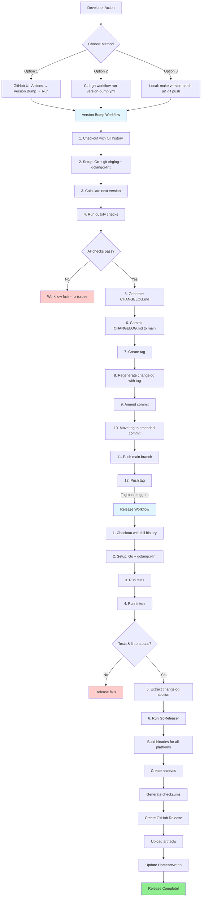

## Sequential Flow

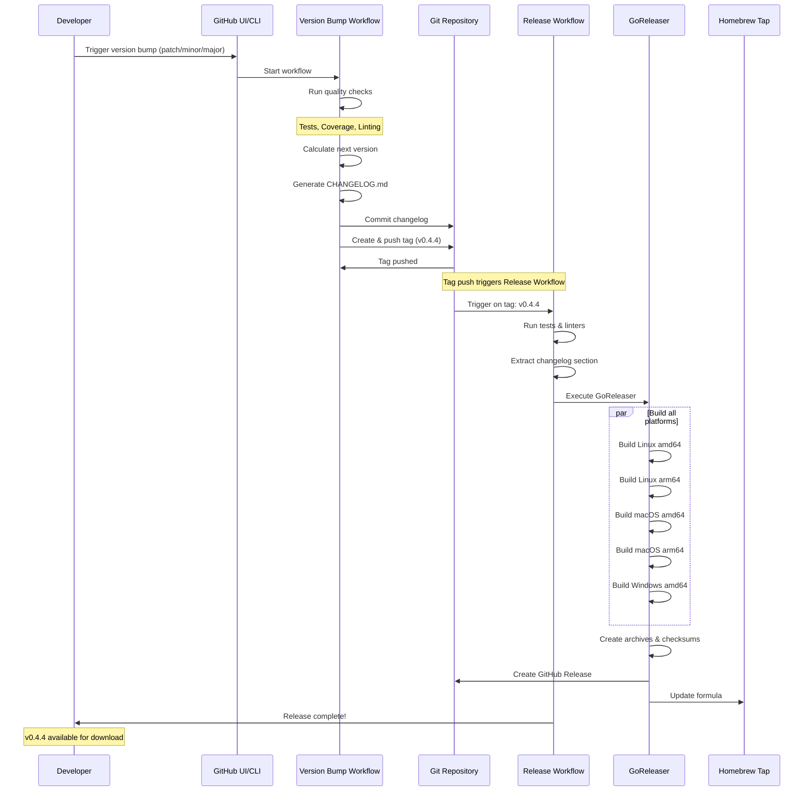

## Parallel Build Process

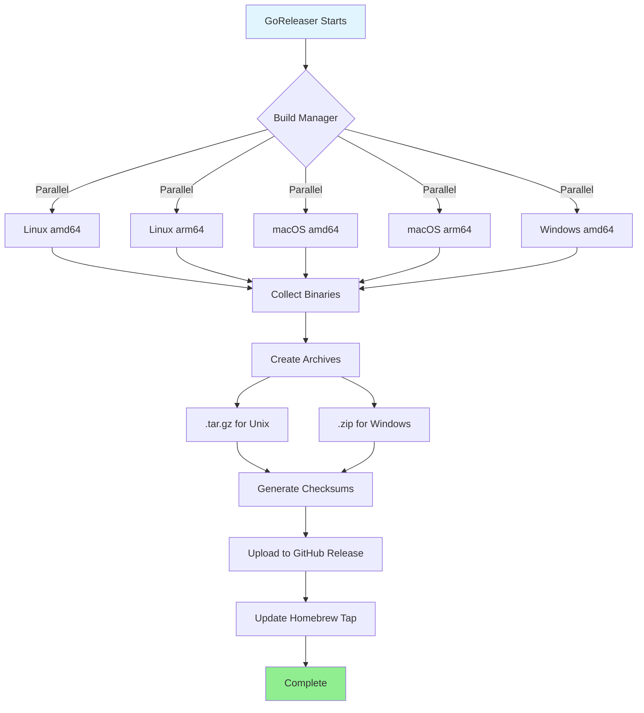

## Quality Gates

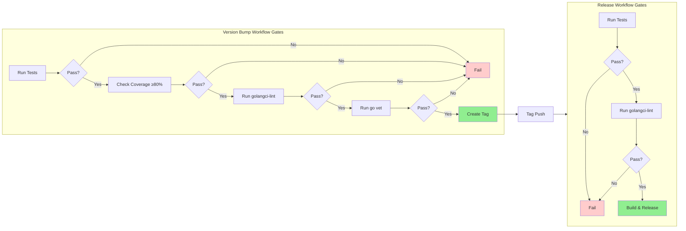

## Configuration Files Structure

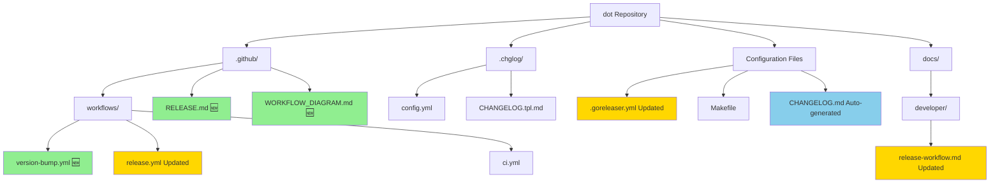

## Before vs After Comparison

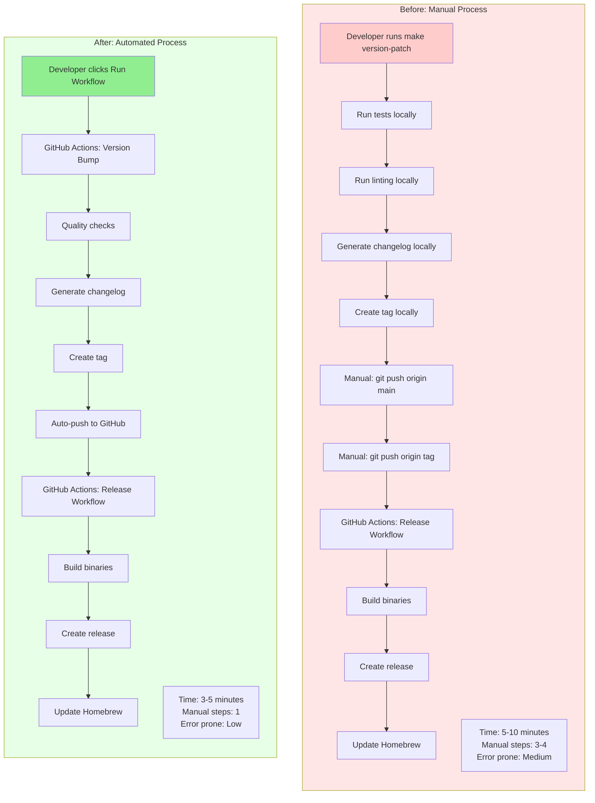

## Rollback Process

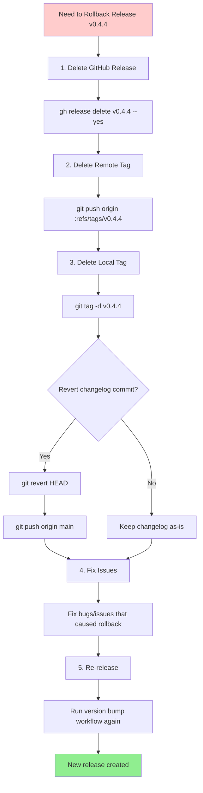

## Troubleshooting Flowchart

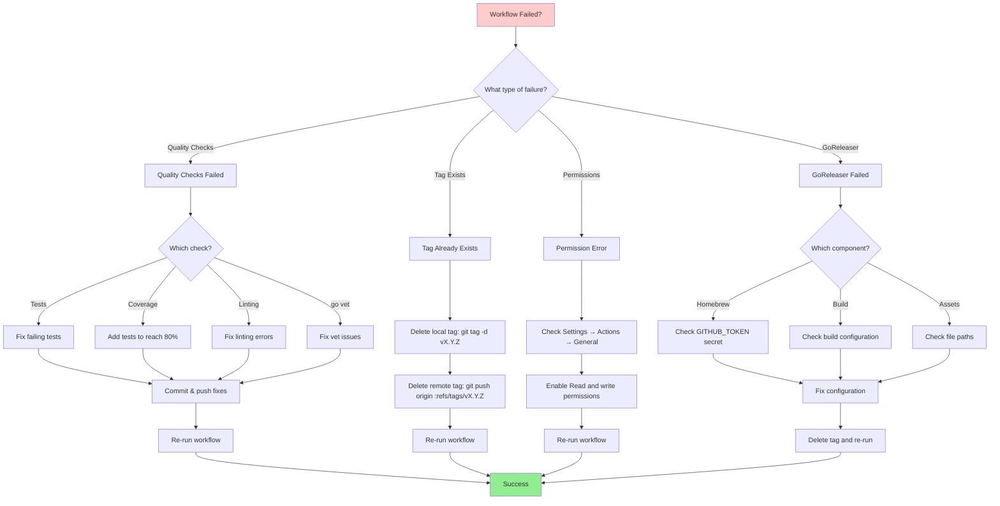

## Version Bump Decision Tree

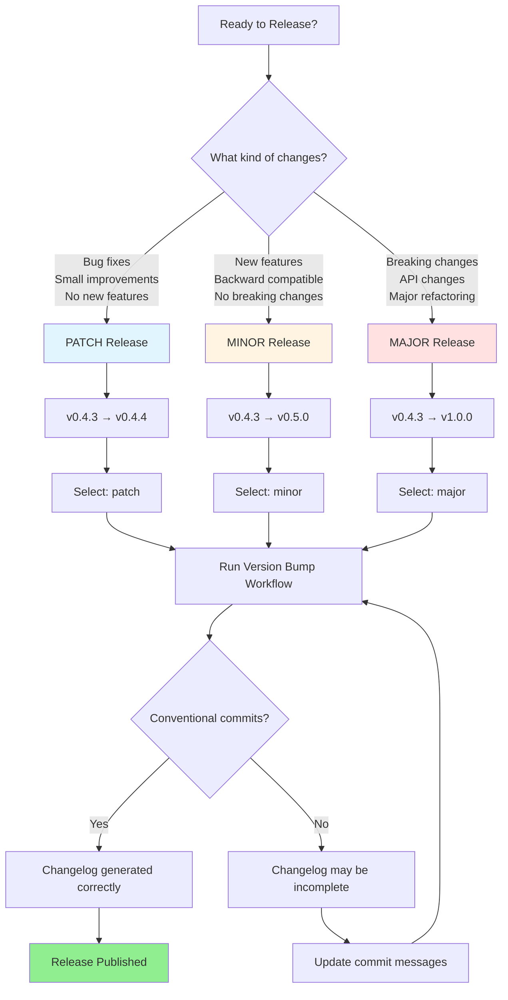

## Monitoring Workflow

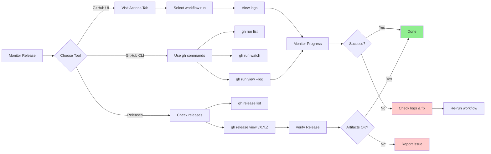

## Legend

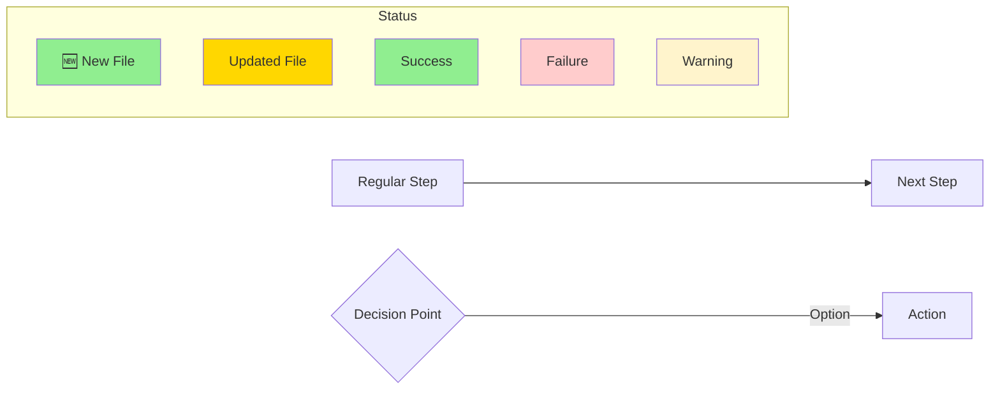

## Quick Reference Commands

| Action | GitHub UI | GitHub CLI |
|--------|-----------|------------|
| **Run patch release** | Actions → Version Bump → patch | `gh workflow run version-bump.yml -f version_type=patch` |
| **Run minor release** | Actions → Version Bump → minor | `gh workflow run version-bump.yml -f version_type=minor` |
| **Run major release** | Actions → Version Bump → major | `gh workflow run version-bump.yml -f version_type=major` |
| **Watch workflow** | Actions → View run | `gh run watch` |
| **View logs** | Actions → Run → Logs | `gh run view --log` |
| **List releases** | Releases tab | `gh release list` |
| **View release** | Click release | `gh release view vX.Y.Z` |
| **Download artifacts** | Release → Assets | `gh release download vX.Y.Z` |

## Best Practices Summary

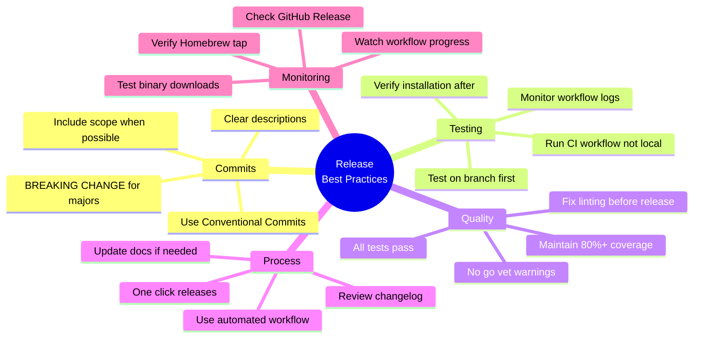
