# Release Workflow Diagram

## Overview

## Sequential Flow

## Parallel Build Process

## Quality Gates

```mermaid
flowchart LR
    subgraph VB [Version Bump Workflow Gates]
        A1[Run Tests] --> A2{Pass?}
        A2 -->|No| FAIL1[ Fail]
        A2 -->|Yes| A3[Check Coverage ≥80%]
        A3 --> A4{Pass?}
        A4 -->|No| FAIL1
        A4 -->|Yes| A5[Run golangci-lint]
        A5 --> A6{Pass?}
        A6 -->|No| FAIL1
        A6 -->|Yes| A7[Run go vet]
        A7 --> A8{Pass?}
        A8 -->|No| FAIL1
        A8 -->|Yes| PASS1[ Create Tag]
    end
    
    PASS1 --> TRIGGER[Tag Push]
    
    subgraph RW [Release Workflow Gates]
        B1[Run Tests] --> B2{Pass?}
        B2 -->|No| FAIL2[ Fail]
        B2 -->|Yes| B3[Run golangci-lint]
        B3 --> B4{Pass?}
        B4 -->|No| FAIL2
        B4 -->|Yes| PASS2[ Build & Release]
    end
    
    TRIGGER --> RW
    
    style PASS1 fill:#90EE90
    style PASS2 fill:#90EE90
    style FAIL1 fill:#ffcccc
    style FAIL2 fill:#ffcccc
```

## Configuration Files Structure

## Before vs After Comparison

## Rollback Process

## Troubleshooting Flowchart

```mermaid
flowchart TD
    A[Workflow Failed?] --> B{What type of failure?}
    
    B -->|Quality Checks| C[Quality Checks Failed]
    C --> C1{Which check?}
    C1 -->|Tests| C2[Fix failing tests]
    C1 -->|Coverage| C3[Add tests to reach 80%]
    C1 -->|Linting| C4[Fix linting errors]
    C1 -->|go vet| C5[Fix vet issues]
    C2 --> C6[Commit & push fixes]
    C3 --> C6
    C4 --> C6
    C5 --> C6
    C6 --> C7[Re-run workflow]
    
    B -->|Tag Exists| D[Tag Already Exists]
    D --> D1[Delete local tag: git tag -d vX.Y.Z]
    D1 --> D2[Delete remote tag: git push origin :refs/tags/vX.Y.Z]
    D2 --> D3[Re-run workflow]
    
    B -->|Permissions| E[Permission Error]
    E --> E1[Check Settings → Actions → General]
    E1 --> E2[Enable Read and write permissions]
    E2 --> E3[Re-run workflow]
    
    B -->|GoReleaser| F[GoReleaser Failed]
    F --> F1{Which component?}
    F1 -->|Homebrew| F2[Check GITHUB_TOKEN secret]
    F1 -->|Build| F3[Check build configuration]
    F1 -->|Assets| F4[Check file paths]
    F2 --> F5[Fix configuration]
    F3 --> F5
    F4 --> F5
    F5 --> F6[Delete tag and re-run]
    
    C7 --> G[ Success]
    D3 --> G
    E3 --> G
    F6 --> G
    
    style A fill:#ffcccc
    style G fill:#90EE90
```

## Version Bump Decision Tree

```mermaid
flowchart TD
    A[Ready to Release?] --> B{What kind of changes?}
    
    B -->|Bug fixes<br/>Small improvements<br/>No new features| C[PATCH Release]
    C --> C1[v0.4.3 → v0.4.4]
    C1 --> C2[Select: patch]
    
    B -->|New features<br/>Backward compatible<br/>No breaking changes| D[MINOR Release]
    D --> D1[v0.4.3 → v0.5.0]
    D1 --> D2[Select: minor]
    
    B -->|Breaking changes<br/>API changes<br/>Major refactoring| E[MAJOR Release]
    E --> E1[v0.4.3 → v1.0.0]
    E1 --> E2[Select: major]
    
    C2 --> F[Run Version Bump Workflow]
    D2 --> F
    E2 --> F
    
    F --> G{Conventional commits?}
    G -->|Yes| H[Changelog generated correctly]
    G -->|No| I[ Changelog may be incomplete]
    I --> J[Update commit messages]
    J --> F
    
    H --> K[ Release Published]
    
    style C fill:#e1f5ff
    style D fill:#fff4e1
    style E fill:#ffe1e1
    style K fill:#90EE90
```

## Monitoring Workflow

## Legend

## Quick Reference Commands

| Action | GitHub UI | GitHub CLI |
|--------|-----------|------------|
| **Run patch release** | Actions → Version Bump → patch | `gh workflow run version-bump.yml -f version_type=patch` |
| **Run minor release** | Actions → Version Bump → minor | `gh workflow run version-bump.yml -f version_type=minor` |
| **Run major release** | Actions → Version Bump → major | `gh workflow run version-bump.yml -f version_type=major` |
| **Watch workflow** | Actions → View run | `gh run watch` |
| **View logs** | Actions → Run → Logs | `gh run view --log` |
| **List releases** | Releases tab | `gh release list` |
| **View release** | Click release | `gh release view vX.Y.Z` |
| **Download artifacts** | Release → Assets | `gh release download vX.Y.Z` |

## Best Practices Summary

