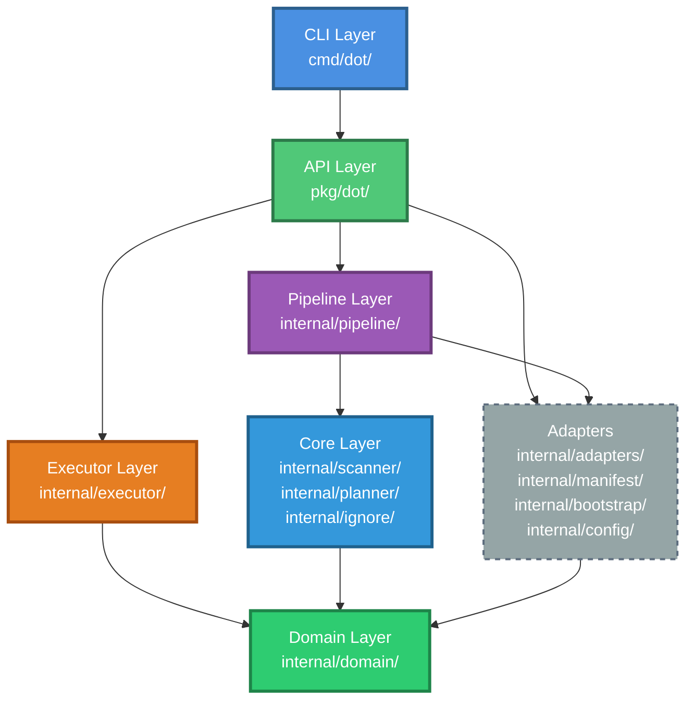
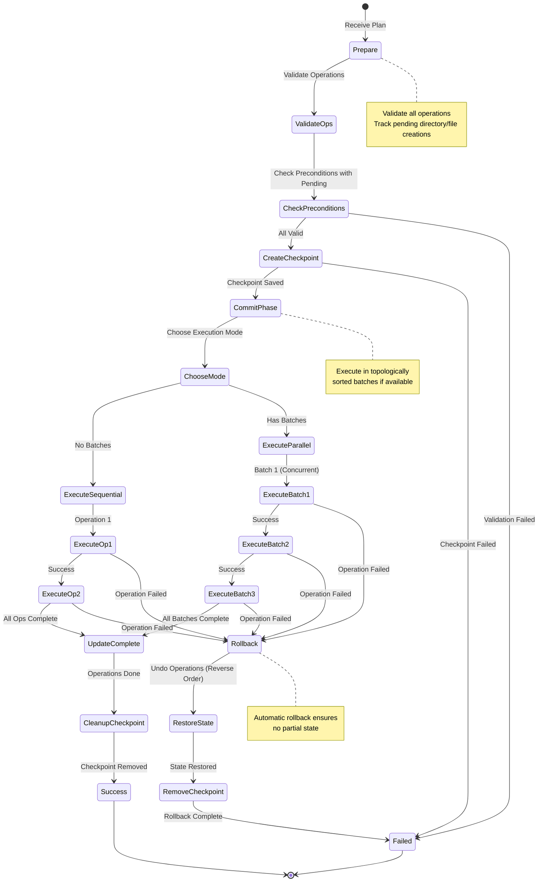
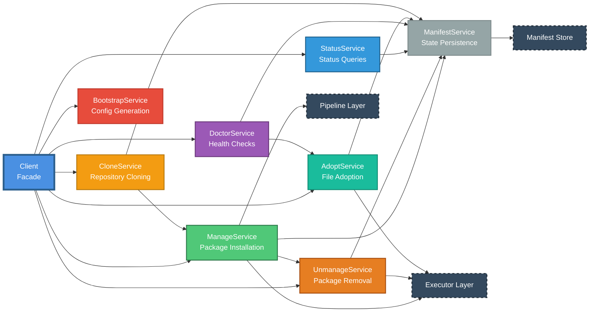
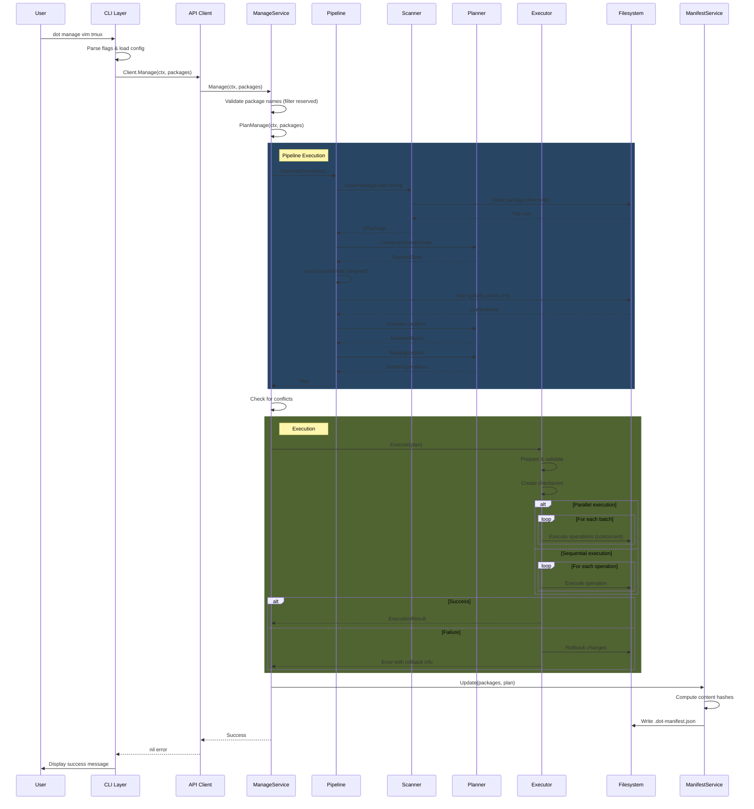
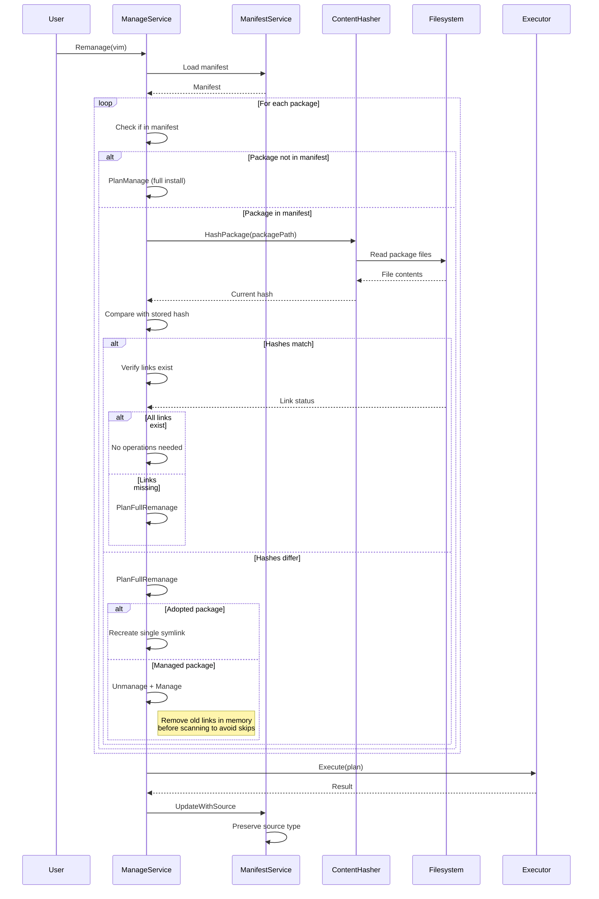
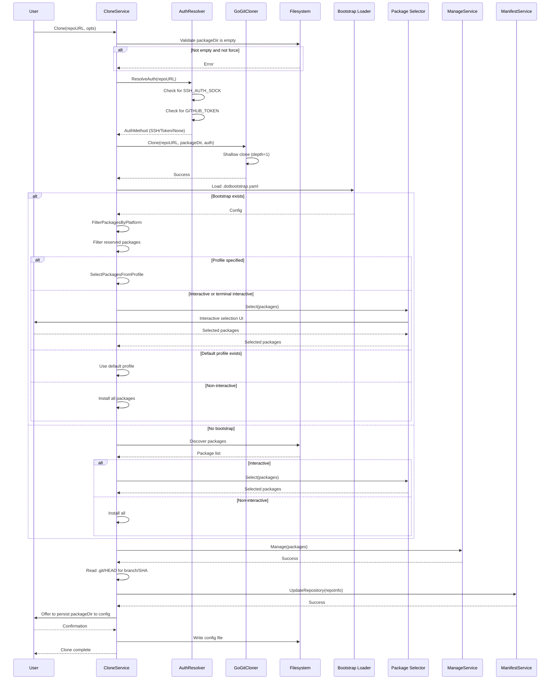
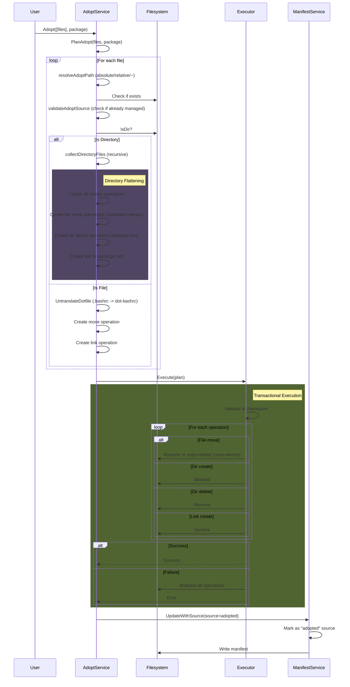
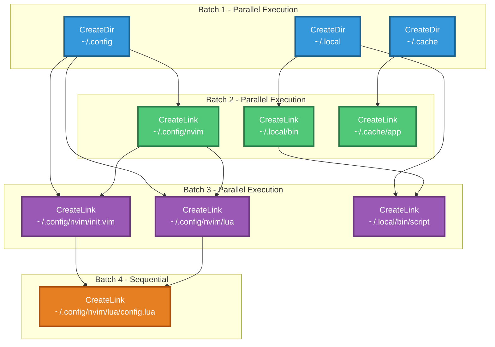
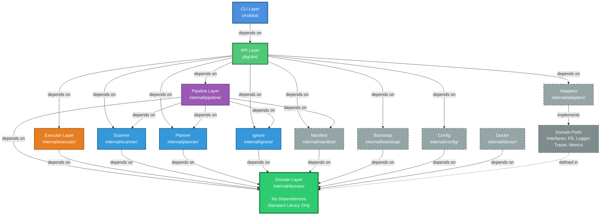

# Architecture Documentation (2025 Edition)

This document describes the technical architecture of dot, a type-safe symbolic link manager for configuration files.

## Table of Contents

- [Architecture Overview](#architecture-overview)
- [Architectural Layers](#architectural-layers)
- [Design Principles](#design-principles)
- [Component Structure](#component-structure)
- [Data Flow](#data-flow)
- [Type System](#type-system)
- [Error Handling](#error-handling)
- [Concurrency Model](#concurrency-model)
- [Testing Strategy](#testing-strategy)
- [Dependency Rules](#dependency-rules)
- [Performance Characteristics](#performance-characteristics)
- [Security Considerations](#security-considerations)

## Architecture Overview

dot follows a layered architecture inspired by hexagonal architecture (ports and adapters) and functional programming principles. The system separates pure functional logic from side-effecting operations, enabling deterministic testing and safe execution.

### Core Architecture Pattern

The architecture implements the "Functional Core, Imperative Shell" pattern:

- **Functional Core**: Pure domain logic with no side effects (scanning, planning, resolution)
- **Imperative Shell**: Side-effecting operations isolated to executor layer (filesystem modifications)

This separation enables:
- Deterministic testing of core logic without filesystem access
- Safe rollback of failed operations
- Property-based testing of algebraic laws
- Parallelization of independent operations

## Architectural Layers

The system comprises six distinct layers, each with specific responsibilities and dependency constraints.



### 1. Domain Layer

**Location**: `internal/domain/`

**Purpose**: Pure domain model defining core types, operations, and port interfaces.

**Key Components**:
- Domain entities: `Package`, `Node`, `Plan`, `Operation`
- Phantom-typed paths: `PackagePath`, `TargetPath`, `FilePath`
- Port interfaces: `FS`, `Logger`, `Tracer`, `Metrics`
- Result types: `Result[T]` for monadic error handling
- Operation types (9 concrete implementations):
  - `LinkCreate`: Create symbolic link
  - `LinkDelete`: Remove symbolic link
  - `DirCreate`: Create directory
  - `DirDelete`: Remove empty directory
  - `DirRemoveAll`: Recursively remove directory
  - `FileMove`: Move file (with cross-device support)
  - `FileBackup`: Create backup copy
  - `FileDelete`: Delete file
  - `DirCopy`: Recursive directory copy
- Conflict representations
- Error types

**Characteristics**:
- No external dependencies except standard library
- All operations are data structures with execute/rollback methods
- Phantom types provide compile-time path safety
- Defines contracts (interfaces) for infrastructure

**Dependencies**: None (depends only on Go standard library)

### 2. Core Layer

**Location**: `internal/scanner/`, `internal/planner/`, `internal/ignore/`

**Purpose**: Pure functional logic for scanning packages, computing desired state, and planning operations.

**Key Components**:

**Scanner** (`internal/scanner/`):
- Package scanning with per-package ignore patterns
- Filesystem tree construction
- Dotfile name translation (e.g., `dot-bashrc` to `.bashrc`)
- Reserved package name detection
- Large file handling with interactive prompts
- Configuration: `ScanConfig` with `PerPackageIgnore`, `MaxFileSize`, `Interactive`

**Planner** (`internal/planner/`):
- Desired state computation
- Conflict detection and resolution
- Dependency graph construction
- Topological sorting for operation ordering
- Parallel execution batch computation
- Resolution policies: Fail, Backup, Overwrite
- Conflict resolution with backup directory support

**Ignore** (`internal/ignore/`):
- Pattern matching for file exclusion (glob-based)
- Default ignore patterns
- Custom pattern support
- IgnoreSet for efficient matching

**Characteristics**:
- Pure functions with no side effects
- Deterministic outputs for given inputs
- Testable without filesystem access
- Uses Result types for error handling

**Dependencies**: Domain layer only

### 3. Pipeline Layer

**Location**: `internal/pipeline/`

**Purpose**: Composable pipeline stages with generic type parameters for operation orchestration.

**Key Components**:
- `Pipeline[TIn, TOut]`: Generic pipeline type
- `ScanStage()`: Package scanning stage
- `PlanStage()`: Desired state computation stage
- `ResolveStage()`: Conflict resolution stage with targeted scanning
- `SortStage()`: Topological sorting stage
- `ManagePipeline`: Composition of stages for manage operations

**Characteristics**:
- Generic type parameters for type safety
- Composable stages using function composition
- Context-aware for cancellation support
- Monadic error propagation through stages
- Optimized scanning: only checks paths relevant to desired state (not full directory traversal)

**Pipeline Composition Example**:
```
ScanInput -> ScanStage -> []Package -> PlanStage -> DesiredState -> ResolveStage -> ResolveResult -> SortStage -> Plan
```

**Dependencies**: Domain and Core layers, Adapters

### 4. Executor Layer

**Location**: `internal/executor/`

**Purpose**: Transactional execution of plans with two-phase commit and automatic rollback.

**Key Components**:
- `Executor`: Main execution engine
- `CheckpointStore`: State checkpoint for rollback (memory-based default)
- Precondition validation with pending operation tracking
- Operation execution (sequential or parallel)
- Automatic rollback on failure
- Parallel execution support via batches

**Execution Phases**:

1. **Prepare Phase**: Validate all operations before execution, track pending creations
2. **Checkpoint Creation**: Save state for potential rollback
3. **Commit Phase**: Execute operations (sequential or parallel batches)
4. **Rollback Phase**: Undo operations if failures occur (reverse order)
5. **Checkpoint Cleanup**: Remove checkpoint on success



**Precondition Validation**: Checks source exists, parent directories exist, permissions, but also accounts for pending directory/file creations from earlier operations in the plan.

**Characteristics**:
- All-or-nothing transaction semantics
- Automatic rollback on any failure
- Support for parallel execution of independent operations
- Comprehensive error tracking
- Operation-level execute and rollback methods

**Dependencies**: Domain layer for types and ports

### 5. API Layer

**Location**: `pkg/dot/`

**Purpose**: Clean public Go library interface for embedding dot in other applications.

**Key Components**:
- `Client`: Facade delegating to specialized services
- `Config`: Configuration structure with validation
- **Service implementations**:
  - `ManageService`: Package installation with incremental hash-based remanage
  - `UnmanageService`: Package removal with restore support
  - `StatusService`: Status queries
  - `DoctorService`: Health checks with parallel scanning, triage, and pattern categorization
  - `AdoptService`: File adoption with directory flattening
  - `CloneService`: Git cloning with bootstrap and authentication
  - `BootstrapService`: Bootstrap configuration generation
  - `ManifestService`: State persistence and backup management

**Service Pattern**:

The Client uses a service-based architecture where each major operation is implemented by a dedicated service. This provides:
- Single Responsibility Principle adherence
- Independent testing of each service
- Clear boundaries between concerns
- Maintainable codebase



**Characteristics**:
- Stable public API
- Thread-safe operations
- Service-based delegation
- Comprehensive validation
- Each service is independently testable

**Dependencies**: All internal layers

### 6. CLI Layer

**Location**: `cmd/dot/`

**Purpose**: Cobra-based command-line interface providing user interaction.

**Key Components**:
- Command definitions (manage, unmanage, status, doctor, list, adopt, clone, remanage, upgrade)
- Flag parsing and validation
- Configuration loading from files and environment
- Output formatting (table, JSON, YAML)
- Progress indicators
- Error rendering with suggestions
- Golden file testing for output validation

**Characteristics**:
- Cobra command structure
- Viper configuration management
- Multiple output formats
- Rich error messages with context
- Interactive prompts for triage and adoption

**Dependencies**: API layer only (does not import internal packages directly)

## Design Principles

### Functional Core, Imperative Shell

Pure functional logic (scanning, planning, resolution) is separated from side-effecting operations (filesystem modifications). This enables:

- Deterministic testing without filesystem access
- Property-based testing of algebraic laws
- Safe parallelization
- Reliable rollback mechanisms

### Type Safety

Phantom types encode path semantics at compile time:

```go
type PackagePath struct { path string }
type TargetPath struct { path string }
type FilePath struct { path string }
```

This prevents path-related bugs:
- Cannot pass target path where package path expected
- Cannot mix relative and absolute paths incorrectly
- Compile-time validation of path operations

### Explicit Error Handling

The system uses `Result[T]` types for monadic error handling:

```go
type Result[T any] struct {
    value T
    err   error
    isOk  bool
}
```

This provides:
- No silent failures
- Explicit error propagation
- Composable error handling (Map, FlatMap, Collect)
- Type-safe success values

### Transactional Operations

All operations use two-phase commit:

1. **Validate**: Check preconditions (including pending operations)
2. **Execute**: Apply changes
3. **Rollback**: Undo on failure

This ensures:
- Atomic operation sets
- Automatic cleanup on failure
- No partial state on errors
- Safe concurrent execution

### Dependency Inversion

Infrastructure dependencies are abstracted through port interfaces:

```go
type FS interface {
    Stat(ctx context.Context, path string) (FileInfo, error)
    ReadDir(ctx context.Context, path string) ([]DirEntry, error)
    Symlink(ctx context.Context, oldname, newname string) error
    // ... other operations
}
```

This enables:
- Testing with memory-based implementations
- Platform-specific adapters
- Mock implementations for testing
- Isolation of domain logic from infrastructure

## Component Structure

### Adapter Pattern

The system uses adapters to implement port interfaces:

**Filesystem Adapters** (`internal/adapters/`):
- `OSFilesystem`: Production filesystem using `os` package (with memfs wrapper for go-billy compatibility)
- `MemFilesystem`: In-memory filesystem for testing
- `NoopFilesystem`: No-op implementation for dry-run mode

**Logging Adapters** (`internal/adapters/`):
- `SlogLogger`: Production logger using `log/slog`
- `NoopLogger`: Silent logger for testing

**Git Adapters** (`internal/adapters/`):
- `GoGitCloner`: Git cloning using go-git library
- Authentication: `NoAuth`, `TokenAuth`, `SSHAuth`

This pattern provides:
- Swappable implementations
- Testability without real filesystem
- Dry-run mode support
- Platform-specific optimizations

### Manifest Persistence

**Location**: `internal/manifest/`

**Purpose**: State persistence for tracking installed packages.

**Components**:
- `Manifest`: Package installation record
- `ManifestStore`: Interface for persistence
- `FSManifestStore`: File-based implementation
- `ContentHasher`: SHA256 hash computation for change detection

**Manifest Structure**:
```go
type Manifest struct {
    Version    string
    UpdatedAt  time.Time
    Packages   map[string]PackageInfo
    Hashes     map[string]string
    Repository *RepositoryInfo
    Doctor     *DoctorState
}

type PackageInfo struct {
    Name        string
    InstalledAt time.Time
    LinkCount   int
    Links       []string
    Backups     map[string]string // target -> backup path
    Source      PackageSource     // "managed" or "adopted"
    TargetDir   string
    PackageDir  string
}

type RepositoryInfo struct {
    URL       string
    Branch    string
    ClonedAt  time.Time
    CommitSHA string
}

type DoctorState struct {
    IgnoredLinks    map[string]IgnoredLink
    IgnoredPatterns []string
}
```

**Persistence Location**: `<TargetDir>/.dot-manifest.json`

**Purpose**:
- Track installed packages with source type (managed vs adopted)
- Enable incremental updates via content hashing
- Support status queries without filesystem scanning
- Facilitate safe uninstall operations
- Track repository information for cloned dotfiles
- Store doctor triage decisions (ignored links and patterns)
- Track backup locations for restoration

### Configuration System

**Location**: `internal/config/`

**Purpose**: Configuration loading, validation, and marshaling.

**Features**:
- Multiple format support (YAML, JSON, TOML)
- Precedence handling (flags > environment > files > defaults)
- XDG Base Directory Specification compliance
- Schema validation
- Default value application
- Writer with comment support

**Configuration Sources** (in precedence order):
1. Command-line flags
2. Environment variables (`DOT_*` prefix)
3. Project-local config (`./.dotrc`)
4. User config (`~/.config/dot/config.yaml`)
5. System config (`/etc/dot/config.yaml`)
6. Default values

### Bootstrap System

**Location**: `internal/bootstrap/`

**Purpose**: Repository setup configuration for automated package installation.

**Components**:
- `Config`: Bootstrap configuration schema
- `Loader`: Configuration file loading
- `Generator`: Bootstrap config generation from existing installation
- `PackageSpec`: Package definition with platform filtering
- `Profile`: Named package sets
- `Defaults`: Default conflict resolution policies

**Bootstrap Configuration**:
```yaml
version: "1.0"
packages:
  - name: vim
    required: true
    platform: [linux, darwin]
  - name: tmux
    platform: [linux]
profiles:
  minimal:
    description: Minimal installation
    packages: [vim]
  full:
    description: Full installation
    packages: [vim, tmux]
defaults:
  on_conflict: backup
  profile: minimal
```

**Features**:
- Platform-specific package filtering
- Profile-based installation
- Per-package conflict policies
- Required package enforcement
- Validation with error reporting

## Data Flow

### Manage Operation Flow



### Remanage Operation Flow (Incremental)



### Doctor Health Check Flow with Triage

```mermaid
sequenceDiagram
    participant User
    participant CLI as CLI Layer
    participant DoctorSvc as DoctorService
    participant ManifestSvc as ManifestService
    participant FS as Filesystem
    participant HealthChecker as HealthChecker
    participant Workers as Worker Pool
    participant Categorizer as Pattern Categorizer
    
    User->>CLI: dot doctor --triage
    CLI->>DoctorSvc: DoctorWithScan(ctx, scanCfg)
    
    DoctorSvc->>ManifestSvc: Load manifest
    ManifestSvc-->>DoctorSvc: Manifest
    
    rect rgb(50, 80, 120)
        note right of DoctorSvc: Check Managed Packages
        loop For each package
            loop For each link
                DoctorSvc->>HealthChecker: CheckLink
                HealthChecker->>FS: Lstat link
                HealthChecker->>FS: ReadLink
                HealthChecker->>FS: Stat target
                HealthChecker-->>DoctorSvc: HealthCheckResult
            end
        end
    end
    
    rect rgb(70, 90, 70)
        note right of DoctorSvc: Orphan Scan (Parallel)
        DoctorSvc->>DoctorSvc: Determine scan directories
        DoctorSvc->>DoctorSvc: Build ignore set from manifest
        DoctorSvc->>Workers: Start worker pool (NumCPU)
        
        par Parallel directory scanning
            Workers->>FS: Scan directory 1
            Workers->>FS: Scan directory 2
            Workers->>FS: Scan directory N
        end
        
        Workers-->>DoctorSvc: Aggregate results
        
        note right of DoctorSvc: Respects MaxIssues budget<br/>Early cancellation on limit
    end
    
    DoctorSvc-->>CLI: DiagnosticReport
    
    alt Triage mode
        CLI->>DoctorSvc: Triage(scanCfg, opts)
        
        rect rgb(100, 70, 80)
            note right of DoctorSvc: Categorization
            loop For each orphaned link
                DoctorSvc->>FS: ReadLink to get target
                DoctorSvc->>Categorizer: CategorizeSymlink
                Categorizer-->>DoctorSvc: Category (high/medium/low confidence)
            end
        end
        
        rect rgb(90, 70, 100)
            note right of DoctorSvc: Interactive Triage
            DoctorSvc->>User: Display groups by category
            User->>DoctorSvc: Choose processing mode (category/linear/auto)
            
            alt Category mode
                loop For each category
                    DoctorSvc->>User: Display category info
                    User->>DoctorSvc: Action (ignore/review/skip)
                    
                    alt Ignore
                        DoctorSvc->>ManifestSvc: AddIgnoredPattern
                    else Review
                        loop For each link
                            User->>DoctorSvc: Action per link
                        end
                    end
                end
            else Auto mode
                DoctorSvc->>ManifestSvc: Auto-ignore high confidence
            end
            
            DoctorSvc->>ManifestSvc: Save manifest
        end
    end
    
    CLI->>User: Display report/triage results
```



### Clone Operation Flow



### Adopt Operation Flow



## Type System

### Phantom Types for Path Safety

Phantom types encode path semantics at the type level:

```go
// PackagePath represents a path within the package directory
type PackagePath struct {
    path string
}

// TargetPath represents a path in the target directory
type TargetPath struct {
    path string
}

// FilePath represents a generic file path
type FilePath struct {
    path string
}
```

**Benefits**:
- Compile-time prevention of path mix-ups
- Self-documenting function signatures
- Type-guided refactoring
- Elimination of path-related bugs

**Usage Example**:
```go
// Function signature clearly indicates path expectations
func scanPackage(path PackagePath) Result[Package]

// Compiler prevents incorrect usage
scanPackage(targetPath)  // Compile error: type mismatch
```

### Result Type for Error Handling

The `Result[T]` type provides monadic error handling:

```go
type Result[T any] struct {
    value T
    err   error
    isOk  bool
}

func (r Result[T]) IsOk() bool
func (r Result[T]) IsErr() bool
func (r Result[T]) Unwrap() T
func (r Result[T]) UnwrapErr() error
func (r Result[T]) UnwrapOr(defaultValue T) T
func (r Result[T]) OrElse(fn func() T) T
func (r Result[T]) OrDefault() T
```

**Monadic Operations**:
```go
func Map[T, U any](r Result[T], fn func(T) U) Result[U]
func FlatMap[T, U any](r Result[T], fn func(T) Result[U]) Result[U]
func Collect[T any](results []Result[T]) Result[[]T]
```

**Benefits**:
- Explicit success or failure states
- Type-safe value extraction
- Composable error handling
- No nil pointer dereferencing
- Functional composition support

### Operation Types

Operations are represented as an interface with 9 concrete implementations:

```go
type Operation interface {
    ID() OperationID
    Kind() OperationKind
    Validate() error
    Dependencies() []Operation
    Execute(ctx context.Context, fs FS) error
    Rollback(ctx context.Context, fs FS) error
    String() string
    Equals(other Operation) bool
}

// Concrete operation types:
type LinkCreate struct { OpID OperationID; Source FilePath; Target TargetPath }
type LinkDelete struct { OpID OperationID; Target TargetPath }
type DirCreate struct { OpID OperationID; Path FilePath }
type DirDelete struct { OpID OperationID; Path FilePath }
type DirRemoveAll struct { OpID OperationID; Path FilePath }
type FileMove struct { OpID OperationID; Source TargetPath; Dest FilePath }
type FileBackup struct { OpID OperationID; Source FilePath; Backup FilePath }
type FileDelete struct { OpID OperationID; Path FilePath }
type DirCopy struct { OpID OperationID; Source FilePath; Dest FilePath }
```

**Operation Kinds**:
- `OpKindLinkCreate`: Create symbolic link
- `OpKindLinkDelete`: Remove symbolic link
- `OpKindDirCreate`: Create directory
- `OpKindDirDelete`: Remove empty directory
- `OpKindDirRemoveAll`: Recursively remove directory
- `OpKindFileMove`: Move file (handles cross-device moves via copy+delete)
- `OpKindFileBackup`: Create backup copy
- `OpKindFileDelete`: Delete file
- `OpKindDirCopy`: Recursive directory copy

## Error Handling

### Error Type Hierarchy

Domain-specific errors with rich context:

```go
// Core errors
type ErrInvalidPath struct { Path string; Reason string }
type ErrPackageNotFound struct { Package string }
type ErrConflict struct { Path string; Reason string }
type ErrSourceNotFound struct { Path string }
type ErrParentNotFound struct { Path string }
type ErrPermissionDenied struct { Path string; Operation string }

// Execution errors
type ErrExecutionFailed struct {
    Executed   int
    Failed     int
    RolledBack int
    Errors     []error
}

// Planning errors
type ErrCyclicDependency struct { Cycle []Operation }
type ErrEmptyPlan struct {}

// Service errors
type ErrMultiple struct { Errors []error }
type ErrAuthFailed struct { Cause error }
type ErrCloneFailed struct { URL string; Cause error }
type ErrInvalidBootstrap struct { Reason string; Cause error }
type ErrProfileNotFound struct { Profile string }
type ErrPackageDirNotEmpty struct { Path string; Cause error }
type ErrBootstrapExists struct { Path string }
```

### Error Wrapping

Errors are wrapped with context using `fmt.Errorf` and `%w`:

```go
if err := operation.Execute(); err != nil {
    return fmt.Errorf("failed to execute %s: %w", operation.Kind(), err)
}
```

### Error Aggregation

Multiple errors are collected and reported together:

```go
type ExecutionResult struct {
    Executed   []OperationID
    Failed     []OperationID
    Errors     []error
    RolledBack []OperationID
}
```

## Concurrency Model

### Thread Safety

All public API operations are safe for concurrent use:

```go
client, _ := dot.NewClient(config)

// Safe to call from multiple goroutines
go client.Manage(ctx, "vim")
go client.Status(ctx)
```

### Parallel Execution

The planner computes parallel execution batches:

1. **Dependency Analysis**: Build dependency graph
2. **Topological Sort**: Order operations respecting dependencies
3. **Batch Computation**: Group independent operations
4. **Parallel Execution**: Execute batches concurrently

**Example**:
```
Batch 1 (parallel):
  - CreateDir ~/.config
  - CreateDir ~/.local

Batch 2 (parallel, depends on Batch 1):
  - CreateLink ~/.config/nvim
  - CreateLink ~/.local/bin/script

Batch 3 (depends on Batch 2):
  - CreateLink ~/.config/nvim/init.vim
```



### Doctor Parallel Scanning

The doctor service uses a worker pool for parallel directory scanning:

```go
// Determine worker count (default: NumCPU)
workers := scanCfg.MaxWorkers
if workers <= 0 {
    workers = runtime.NumCPU()
}

// Worker pool with cancellable context
workerCtx, cancel := context.WithCancel(ctx)
for i := 0; i < workers; i++ {
    go scanWorker(workerCtx, dirChan, resultChan)
}

// Early termination when MaxIssues reached
if len(issues) >= scanCfg.MaxIssues {
    cancel() // Cancel all workers
}
```

### Context Support

All operations support `context.Context` for cancellation:

```go
ctx, cancel := context.WithTimeout(context.Background(), 30*time.Second)
defer cancel()

err := client.Manage(ctx, packages...)
// Respects context cancellation and timeout
```

## Testing Strategy

### Layer-Specific Testing

**Domain Layer**:
- Pure function testing
- Property-based testing of algebraic laws
- No filesystem access required
- Result type composition testing

**Core Layer**:
- Table-driven tests
- Edge case coverage
- In-memory filesystem for deterministic tests
- Ignore pattern matching tests

**Pipeline Layer**:
- Integration tests with memory filesystem
- Error propagation verification
- Context cancellation testing
- Targeted scanning optimization tests

**Executor Layer**:
- Rollback mechanism verification
- Checkpoint functionality
- Failure scenario coverage
- Parallel execution testing
- Precondition validation with pending operations

**API Layer**:
- End-to-end integration tests
- Service interaction testing
- Manifest persistence verification
- Hash-based change detection tests
- Backup restoration tests

**CLI Layer**:
- Command parsing tests
- Output format verification
- Error message validation
- Golden file testing for output consistency

### Test Coverage Requirements

- Minimum 80% code coverage
- Critical paths require 100% coverage
- All error paths must be tested
- Edge cases must have explicit tests

### Testing Tools

- Standard library `testing` package
- `testify/assert` for assertions
- Table-driven test pattern
- Memory-based filesystem adapter (billy/memfs)
- Golden file testing for outputs

## Dependency Rules

### Inward Dependencies

Dependencies flow inward toward the domain:



**Rules**:
1. Domain layer has no dependencies (except standard library)
2. Core layer depends only on domain
3. Pipeline and Executor depend on domain and core
4. Adapters implement domain ports and depend only on domain
5. API layer depends on all internal layers
6. CLI layer depends only on API layer (not internal packages)

### Import Restrictions

**Prohibited**:
- Internal packages importing from `pkg/dot` (would create cycle)
- CLI importing from `internal/*` directly
- Domain importing from infrastructure packages
- Core importing from adapters

**Required**:
- All internal packages import from `internal/domain` for types
- API layer re-exports domain types for public consumption
- Type aliases in `pkg/dot` for stable public API

### Adapter Independence

Adapters are swappable implementations:

```go
// Production
cfg := dot.Config{
    FS:     adapters.NewOSFilesystem(),
    Logger: adapters.NewSlogLogger(os.Stderr),
}

// Testing
cfg := dot.Config{
    FS:     adapters.NewMemFilesystem(),
    Logger: adapters.NewNoopLogger(),
}

// Dry-run
cfg := dot.Config{
    FS:     adapters.NewNoopFilesystem(),
    Logger: adapters.NewSlogLogger(os.Stderr),
}
```

## Performance Characteristics

### Time Complexity

**Scanning**: O(n) where n is number of files in packages
**Planning**: O(m + e) where m is operations and e is dependency edges
**Topological Sort**: O(m + e) using depth-first search
**Execution (sequential)**: O(m) where m is number of operations
**Execution (parallel)**: O(b) where b is number of batches
**Doctor Orphan Scan (parallel)**: O(d/w) where d is directories and w is workers

### Space Complexity

**Manifest Storage**: O(p × l) where p is packages and l is links per package
**Dependency Graph**: O(m + e) where m is operations and e is edges
**Checkpoint**: O(m) to store operation state
**Content Hashes**: O(p × f) where p is packages and f is files per package

### Optimizations

1. **Targeted Current State Scanning**: Only checks paths relevant to desired state (not full directory traversal)
2. **Directory Folding**: Reduce symlink count when entire directory owned by package
3. **Incremental Updates**: Use SHA256 content hashing to detect changed packages
4. **Parallel Execution**: Execute independent operations concurrently in batches
5. **Parallel Doctor Scanning**: Use worker pool (NumCPU workers) for directory scanning
6. **Lazy Loading**: Load manifests on demand
7. **Efficient Scanning**: Skip ignored directories early in traversal
8. **Early Termination**: Stop scanning when MaxIssues limit reached
9. **Cross-Device Move Optimization**: Try rename first, fallback to copy+delete

## Security Considerations

### Path Traversal Prevention

- All paths validated before use
- Phantom types prevent path confusion
- Relative paths resolved before operations
- Symlink targets validated
- Package directory boundary enforcement

### Safe Rollback

- Checkpoint created before operations
- Atomic rollback on failure
- No partial state on errors
- Reverse order rollback

### Manifest Integrity

- Manifest stored in target directory (user-controlled)
- SHA256 content hashing for change detection
- Validation before loading
- DoctorState for triage decisions

### Authentication Security

- SSH agent support with key-based authentication
- Token-based authentication via environment variables
- No credential storage in configuration
- Authentication resolution per-operation

### Adoption Safety

- Validates files not already managed
- Prevents circular adoption
- Checks package directory boundaries
- Path resolution with tilde expansion

### Error Information Disclosure

- Error messages avoid exposing sensitive paths where possible
- Detailed errors logged but sanitized for display
- Security-relevant errors handled specially

## Future Architecture Considerations

### Potential Enhancements

1. **Distributed Locking**: Support for network filesystem coordination
2. **Streaming Manifest Updates**: Avoid full manifest rewrite for large installations
3. **Plugin System**: External conflict resolution strategies and custom operations
4. **Remote Package Sources**: Support for fetching packages from URLs/registries
5. **Advanced Caching**: Cache scanning results and hashes for large repositories
6. **Doctor Pattern Learning**: Machine learning for better categorization
7. **Webhook Integration**: Post-installation hooks for automation
8. **Differential Backups**: Only backup changed files

### Backward Compatibility

The architecture supports evolution while maintaining compatibility:

- Public API in `pkg/dot` with type aliases
- Internal implementation can change freely
- Manifest versioning for format changes (currently version 1.0)
- Deprecation warnings for API changes
- Bootstrap configuration schema versioning

## References

### Related Documentation

- [User Guide](../user/index.md) - End-user documentation
- [Contributing Guide](../../CONTRIBUTING.md) - Development guidelines
- [Release Workflow](release-workflow.md) - Release process
- [Doctor System CUJs](doctor-system-cujs.md) - Doctor critical user journeys
- [Doctor UX Design](doctor-system-ux-design.md) - Doctor user experience design
- [Testing Guide](testing.md) - Testing standards and practices

### External Resources

- [Hexagonal Architecture](https://alistair.cockburn.us/hexagonal-architecture/)
- [Functional Core, Imperative Shell](https://www.destroyallsoftware.com/screencasts/catalog/functional-core-imperative-shell)
- [Go Module Documentation](https://golang.org/ref/mod)
- [XDG Base Directory Specification](https://specifications.freedesktop.org/basedir-spec/basedir-spec-latest.html)
- [Result Type Pattern](https://doc.rust-lang.org/std/result/)


