# Architecture Documentation - Extended with Doctor System

This document extends the core architecture to include the comprehensive doctor system for diagnostics, analysis, repair, and health management.

## Table of Contents

- [Extension Overview](#extension-overview)
- [Doctor System Architecture](#doctor-system-architecture)
- [Extended Service Layer](#extended-service-layer)
- [Extended Domain Layer](#extended-domain-layer)
- [Check System](#check-system)
- [Triage System](#triage-system)
- [Repair System](#repair-system)
- [History and Undo System](#history-and-undo-system)
- [Profile System](#profile-system)
- [Migration System](#migration-system)
- [Security Audit System](#security-audit-system)
- [Extended Data Flows](#extended-data-flows)
- [Integration with Core Architecture](#integration-with-core-architecture)

## Extension Overview

The doctor system extends the core architecture with comprehensive health checking, diagnostic analysis, repair capabilities, and operational history tracking. This extension adheres to all core architectural principles while adding new capabilities.

### Core Principles Maintained

1. **Functional Core, Imperative Shell**: Diagnostic logic is pure, repairs use transactional execution
2. **Type Safety**: New phantom types for diagnostic contexts and issue classifications
3. **Explicit Error Handling**: Result types throughout diagnostic pipeline
4. **Transactional Operations**: All repairs use two-phase commit with rollback
5. **Dependency Inversion**: Port interfaces for extensibility

### New Architectural Components

```mermaid
graph TB
    subgraph "Extended Service Layer"
        DoctorService[Doctor Service<br/>Health Checks]:::newService
        CheckService[Check Service<br/>Diagnostic Runners]:::newService
        TriageService[Triage Service<br/>Issue Classification]:::newService
        RepairService[Repair Service<br/>Safe Fixes]:::newService
        HistoryService[History Service<br/>Operation Tracking]:::newService
        ProfileService[Profile Service<br/>Machine Validation]:::newService
        MigrationService[Migration Service<br/>Tool Migration]:::newService
        SecurityService[Security Service<br/>Audit & Scan]:::newService
    end
    
    subgraph "Extended Core Layer"
        CheckEngine[Check Engine<br/>Pluggable Checks]:::newCore
        IssueAnalyzer[Issue Analyzer<br/>Pattern Detection]:::newCore
        RepairPlanner[Repair Planner<br/>Fix Planning]:::newCore
        HistoryStore[History Store<br/>Operation Ledger]:::newCore
    end
    
    subgraph "Existing Core Architecture"
        ExistingServices[Manage/Unmanage/Status<br/>Services]:::existingLayer
        Pipeline[Pipeline Layer]:::existingLayer
        Executor[Executor Layer]:::existingLayer
        Domain[Domain Layer]:::existingLayer
    end
    
    DoctorService --> CheckService
    DoctorService --> TriageService
    CheckService --> CheckEngine
    TriageService --> IssueAnalyzer
    RepairService --> RepairPlanner
    RepairService --> Executor
    HistoryService --> HistoryStore
    
    CheckEngine --> Domain
    IssueAnalyzer --> Domain
    RepairPlanner --> Domain
    
    RepairService --> Pipeline
    
    style DoctorService fill:#9B59B6,stroke:#6C3A7C,color:#fff,stroke-width:3px
    style CheckService fill:#8E44AD,stroke:#6C3A7C,color:#fff
    style TriageService fill:#8E44AD,stroke:#6C3A7C,color:#fff
    style RepairService fill:#E67E22,stroke:#A84E0F,color:#fff,stroke-width:3px
    style HistoryService fill:#16A085,stroke:#0E6655,color:#fff
    style ProfileService fill:#2980B9,stroke:#1F618D,color:#fff
    style MigrationService fill:#27AE60,stroke:#1E8449,color:#fff
    style SecurityService fill:#C0392B,stroke:#922B21,color:#fff,stroke-width:3px
    
    style CheckEngine fill:#3498DB,stroke:#1F618D,color:#fff
    style IssueAnalyzer fill:#3498DB,stroke:#1F618D,color:#fff
    style RepairPlanner fill:#3498DB,stroke:#1F618D,color:#fff
    style HistoryStore fill:#3498DB,stroke:#1F618D,color:#fff
    
    style ExistingServices fill:#95A5A6,stroke:#5D6D7E,color:#fff
    style Pipeline fill:#95A5A6,stroke:#5D6D7E,color:#fff
    style Executor fill:#95A5A6,stroke:#5D6D7E,color:#fff
    style Domain fill:#2ECC71,stroke:#1E8449,color:#fff,stroke-width:4px
    
    classDef newService stroke-width:2px
    classDef newCore stroke-width:2px
    classDef existingLayer stroke-dasharray: 5 5
```

## Doctor System Architecture

The doctor system implements a multi-stage diagnostic and repair pipeline following the same architectural patterns as the core system.

### Doctor Pipeline Stages

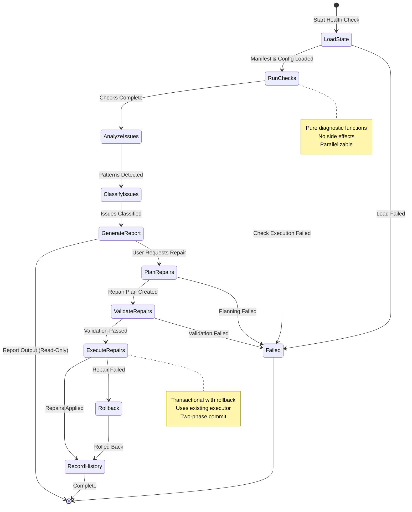

### Doctor Operation Modes

The doctor system operates in multiple modes, each with different characteristics:

| Mode | Purpose | Side Effects | Output |
|------|---------|--------------|--------|
| **Check** | Read-only health validation | None | Diagnostic report |
| **Deep** | Comprehensive scan with orphan detection | None | Extended report |
| **Analyze** | Pattern detection and dependency analysis | None | Analysis report |
| **Fix** | Interactive repair workflow | Filesystem modifications | Repair result |
| **Auto-Fix** | Automatic safe repairs | Filesystem modifications | Repair result |
| **Triage** | Guided issue resolution | Filesystem modifications | Resolution result |

## Extended Service Layer

### DoctorService

**Location**: `pkg/dot/doctor_service.go`, `pkg/dot/doctor_triage.go`

**Purpose**: Orchestrate health checking, issue detection, and coordinate repair operations.

**Key Responsibilities**:
- Run health checks across all or specified packages
- Coordinate check execution (sequential or parallel)
- Aggregate check results into diagnostic reports
- Trigger repair workflows
- Manage diagnostic history

**Public Interface**:
```go
type DoctorService struct {
    checkService   CheckService
    triageService  TriageService
    repairService  RepairService
    historyService HistoryService
    manifestStore  ManifestStore
    config         Config
}

// Health check operations
func (s *DoctorService) Check(ctx context.Context, opts CheckOptions) (*DiagnosticReport, error)
func (s *DoctorService) CheckPackages(ctx context.Context, packages []string, opts CheckOptions) (*DiagnosticReport, error)
func (s *DoctorService) CheckManifest(ctx context.Context) (*ManifestHealthReport, error)
func (s *DoctorService) CheckStructure(ctx context.Context) (*StructureReport, error)

// Specialized checks
func (s *DoctorService) CheckSecurity(ctx context.Context) (*SecurityReport, error)
func (s *DoctorService) CheckPlatform(ctx context.Context) (*PlatformReport, error)
func (s *DoctorService) CheckBootstrap(ctx context.Context, bootstrapConfig string) (*BootstrapValidationReport, error)

// Repair operations
func (s *DoctorService) Fix(ctx context.Context, opts FixOptions) (*RepairResult, error)
func (s *DoctorService) Triage(ctx context.Context, opts TriageOptions) (*TriageResult, error)
```

**Characteristics**:
- Delegates to specialized services
- Coordinates multi-stage diagnostic workflows
- Maintains separation between diagnosis and repair
- Supports both fast and deep scan modes

### CheckService

**Location**: `internal/doctor/check_service.go`

**Purpose**: Execute pluggable health checks and collect results.

**Key Responsibilities**:
- Manage registry of available checks
- Execute checks with proper context
- Collect and aggregate check results
- Support parallel check execution
- Handle check failures gracefully

**Public Interface**:
```go
type CheckService struct {
    registry  CheckRegistry
    executor  CheckExecutor
    logger    Logger
}

type Check interface {
    Name() string
    Description() string
    Category() CheckCategory
    Run(ctx context.Context, input CheckInput) CheckResult
}

func (s *CheckService) RunChecks(ctx context.Context, checks []Check, input CheckInput) []CheckResult
func (s *CheckService) RunChecksByCategory(ctx context.Context, category CheckCategory, input CheckInput) []CheckResult
func (s *CheckService) RegisterCheck(check Check) error
func (s *CheckService) GetCheck(name string) (Check, error)
```

**Check Categories**:
- **Integrity**: Manifest consistency, link validity, target existence
- **Structural**: Package structure, naming conventions, repository layout
- **Operational**: Permission issues, filesystem capabilities, writability
- **Security**: Secret detection, permission vulnerabilities, dangerous patterns
- **Platform**: OS compatibility, path portability, tool availability
- **Dependency**: Cross-package references, circular dependencies, missing dependencies

### TriageService

**Location**: `internal/doctor/triage_service.go`

**Purpose**: Classify issues, assess severity, and recommend resolution strategies.

**Key Responsibilities**:
- Classify issues by type and severity
- Detect patterns across multiple issues
- Recommend resolution strategies
- Prioritize issues for user attention
- Generate actionable suggestions

**Public Interface**:
```go
type TriageService struct {
    classifier   IssueClassifier
    analyzer     PatternAnalyzer
    recommender  RecommendationEngine
    logger       Logger
}

func (s *TriageService) ClassifyIssues(ctx context.Context, issues []Issue) []ClassifiedIssue
func (s *TriageService) DetectPatterns(ctx context.Context, issues []ClassifiedIssue) []IssuePattern
func (s *TriageService) RecommendResolutions(ctx context.Context, issues []ClassifiedIssue) []ResolutionRecommendation
func (s *TriageService) AssessSeverity(ctx context.Context, issue Issue) Severity
```

**Issue Classification**:
```go
type IssueType int

const (
    IssueTypeBrokenLink IssueType = iota
    IssueTypeMissingLink
    IssueTypeWrongTarget
    IssueTypeOrphanedLink
    IssueTypeConflict
    IssueTypeManifestInconsistency
    IssueTypeManifestCorruption
    IssueTypeCircularReference
    IssueTypePermissionDenied
    IssueTypeSecretExposure
    IssueTypeStructureViolation
    IssueTypePlatformIncompatibility
    IssueTypeDependencyMissing
    IssueTypeExternalInterference
)

type Severity int

const (
    SeverityInfo Severity = iota
    SeverityWarning
    SeverityError
    SeverityCritical
)
```

### RepairService

**Location**: `internal/doctor/repair_service.go`

**Purpose**: Plan and execute safe repair operations with transactional guarantees.

**Key Responsibilities**:
- Convert classified issues into repair plans
- Validate repair operations before execution
- Execute repairs using existing executor layer
- Ensure transactional semantics (all-or-nothing)
- Support dry-run mode for previewing changes
- Record repairs in operation history

**Public Interface**:
```go
type RepairService struct {
    planner      RepairPlanner
    executor     Executor
    historyStore HistoryStore
    validator    RepairValidator
    logger       Logger
}

func (s *RepairService) PlanRepair(ctx context.Context, issues []ClassifiedIssue) (*RepairPlan, error)
func (s *RepairService) ValidateRepair(ctx context.Context, plan *RepairPlan) error
func (s *RepairService) ExecuteRepair(ctx context.Context, plan *RepairPlan, opts RepairOptions) (*RepairResult, error)
func (s *RepairService) DryRunRepair(ctx context.Context, plan *RepairPlan) (*RepairPreview, error)
```

**Repair Types**:
```go
type RepairType int

const (
    RepairTypeRecreateLink RepairType = iota
    RepairTypeRemoveLink
    RepairTypeFixTarget
    RepairTypeUpdateManifest
    RepairTypeFixPermissions
    RepairTypeResolveConflict
    RepairTypeRemoveOrphan
    RepairTypeBreakCircular
    RepairTypeRestoreBackup
)
```

### HistoryService

**Location**: `internal/doctor/history_service.go`

**Purpose**: Track doctor operations and enable undo functionality.

**Key Responsibilities**:
- Record all doctor operations with full context
- Maintain operation history with timestamps
- Support undo/redo operations
- Prune old history entries
- Provide operation audit trail

**Public Interface**:
```go
type HistoryService struct {
    store  HistoryStore
    logger Logger
}

func (s *HistoryService) RecordOperation(ctx context.Context, op Operation) error
func (s *HistoryService) GetHistory(ctx context.Context, opts HistoryOptions) ([]HistoryEntry, error)
func (s *HistoryService) GetOperation(ctx context.Context, id string) (*HistoryEntry, error)
func (s *HistoryService) Undo(ctx context.Context, id string) (*UndoResult, error)
func (s *HistoryService) UndoLast(ctx context.Context) (*UndoResult, error)
```

**History Entry Structure**:
```go
type HistoryEntry struct {
    ID          string
    Timestamp   time.Time
    Operation   OperationType
    Details     OperationDetails
    Affected    []string        // Paths or packages affected
    Status      OperationStatus
    Reversible  bool
    Checkpoint  CheckpointRef   // Reference to rollback checkpoint
}
```

### ProfileService

**Location**: `internal/doctor/profile_service.go`

**Purpose**: Validate machine-specific package expectations and configuration profiles.

**Key Responsibilities**:
- Load and parse machine profiles
- Validate current state against profile expectations
- Detect profile violations
- Recommend profile alignment actions
- Support multiple profile formats

**Public Interface**:
```go
type ProfileService struct {
    loader    ProfileLoader
    validator ProfileValidator
    logger    Logger
}

func (s *ProfileService) LoadProfile(ctx context.Context, profilePath string) (*MachineProfile, error)
func (s *ProfileService) ValidateProfile(ctx context.Context, profile *MachineProfile) (*ProfileValidationReport, error)
func (s *ProfileService) CheckCompliance(ctx context.Context, profile *MachineProfile) (*ComplianceReport, error)
```

### MigrationService

**Location**: `internal/doctor/migration_service.go`

**Purpose**: Support migration from other dotfile managers (GNU Stow, homesick, etc.).

**Key Responsibilities**:
- Detect other tool installations
- Analyze existing symlink patterns
- Plan safe migration strategy
- Execute migration with validation
- Verify migration completeness

**Public Interface**:
```go
type MigrationService struct {
    detector  ToolDetector
    analyzer  LinkAnalyzer
    planner   MigrationPlanner
    executor  Executor
    logger    Logger
}

func (s *MigrationService) DetectTools(ctx context.Context) ([]DetectedTool, error)
func (s *MigrationService) AnalyzeStow(ctx context.Context, stowDir string) (*StowAnalysis, error)
func (s *MigrationService) PlanMigration(ctx context.Context, source MigrationSource) (*MigrationPlan, error)
func (s *MigrationService) ExecuteMigration(ctx context.Context, plan *MigrationPlan) (*MigrationResult, error)
```

### SecurityService

**Location**: `internal/doctor/security_service.go`

**Purpose**: Audit dotfiles for security issues including secrets, permissions, and dangerous patterns.

**Key Responsibilities**:
- Scan files for secret patterns
- Check file permissions for vulnerabilities
- Detect dangerous symlink targets
- Identify external references
- Generate security audit reports

**Public Interface**:
```go
type SecurityService struct {
    secretScanner    SecretScanner
    permissionChecker PermissionChecker
    linkValidator    LinkValidator
    logger           Logger
}

func (s *SecurityService) ScanSecrets(ctx context.Context, paths []string) ([]SecretDetection, error)
func (s *SecurityService) CheckPermissions(ctx context.Context, paths []string) ([]PermissionIssue, error)
func (s *SecurityService) ValidateLinks(ctx context.Context, links []string) ([]LinkSecurityIssue, error)
func (s *SecurityService) GenerateAuditReport(ctx context.Context) (*SecurityAuditReport, error)
```

## Extended Domain Layer

### Diagnostic Domain Types

**Location**: `internal/domain/diagnostic.go`

New domain types for diagnostic operations:

```go
// DiagnosticReport represents the result of a health check
type DiagnosticReport struct {
    Timestamp       time.Time
    Duration        time.Duration
    OverallHealth   HealthStatus
    PackageReports  []PackageHealthReport
    SystemChecks    []SystemCheckResult
    Statistics      DiagnosticStats
    Issues          []Issue
}

// PackageHealthReport represents health status of a single package
type PackageHealthReport struct {
    PackageName string
    Status      HealthStatus
    LinkCount   int
    ValidLinks  int
    BrokenLinks int
    Warnings    int
    Errors      int
    Issues      []Issue
}

// Issue represents a detected problem
type Issue struct {
    ID          string
    Type        IssueType
    Severity    Severity
    Package     string
    Path        string
    Description string
    Details     map[string]interface{}
    Suggestions []Suggestion
}

// Suggestion represents a recommended action
type Suggestion struct {
    Action      string
    Command     string
    Description string
    Automated   bool
    SafetyLevel SafetyLevel
}

// HealthStatus represents overall health
type HealthStatus int

const (
    HealthStatusHealthy HealthStatus = iota
    HealthStatusWarnings
    HealthStatusErrors
    HealthStatusCritical
)

// CheckResult represents the output of a single check
type CheckResult struct {
    CheckName   string
    Status      CheckStatus
    Duration    time.Duration
    Issues      []Issue
    Metadata    map[string]interface{}
}

// RepairPlan represents a planned set of repair operations
type RepairPlan struct {
    Issues      []ClassifiedIssue
    Operations  []RepairOperation
    DryRun      bool
    SafetyLevel SafetyLevel
    Dependencies []RepairDependency
}

// RepairOperation represents a single repair action
type RepairOperation struct {
    Type        RepairType
    Target      string
    Source      string
    Issue       Issue
    Reversible  bool
    SafetyLevel SafetyLevel
}

// ClassifiedIssue represents an issue with classification metadata
type ClassifiedIssue struct {
    Issue       Issue
    Type        IssueType
    Severity    Severity
    Category    IssueCategory
    Pattern     *IssuePattern
    Resolution  *ResolutionRecommendation
}

// IssuePattern represents a detected pattern across multiple issues
type IssuePattern struct {
    Name        string
    Description string
    Occurrences int
    Issues      []Issue
    RootCause   string
    Suggestion  string
}
```

### Check Domain Types

**Location**: `internal/domain/check.go`

```go
// Check represents a health check that can be executed
type Check interface {
    Name() string
    Description() string
    Category() CheckCategory
    Run(ctx context.Context, input CheckInput) CheckResult
}

// CheckCategory categorizes checks
type CheckCategory int

const (
    CheckCategoryIntegrity CheckCategory = iota
    CheckCategoryStructural
    CheckCategoryOperational
    CheckCategorySecurity
    CheckCategoryPlatform
    CheckCategoryDependency
)

// CheckInput provides context for check execution
type CheckInput struct {
    Manifest      *Manifest
    Packages      []string
    Config        Config
    TargetDir     string
    PackageDir    string
    ScanDepth     int
    IncludeOrphans bool
}

// CheckStatus represents the outcome of a check
type CheckStatus int

const (
    CheckStatusPass CheckStatus = iota
    CheckStatusWarn
    CheckStatusFail
    CheckStatusError
    CheckStatusSkipped
)
```

### History Domain Types

**Location**: `internal/domain/history.go`

```go
// OperationType classifies recorded operations
type OperationType int

const (
    OperationTypeManage OperationType = iota
    OperationTypeUnmanage
    OperationTypeRemanage
    OperationTypeFix
    OperationTypeTriage
    OperationTypeClean
    OperationTypeMigrate
    OperationTypeRecover
)

// OperationStatus tracks operation state
type OperationStatus int

const (
    OperationStatusPending OperationStatus = iota
    OperationStatusRunning
    OperationStatusCompleted
    OperationStatusFailed
    OperationStatusRolledBack
)

// UndoResult represents the outcome of an undo operation
type UndoResult struct {
    OperationID string
    Success     bool
    Actions     []string
    Errors      []error
}
```

## Check System

The check system provides a pluggable architecture for health checks. Each check is independent, focused, and testable.

### Check Architecture

```mermaid
graph TB
    CheckRegistry[Check Registry]:::registryNode
    
    subgraph "Integrity Checks"
        LinkValidityCheck[Link Validity Check]:::checkNode
        ManifestConsistencyCheck[Manifest Consistency Check]:::checkNode
        TargetExistenceCheck[Target Existence Check]:::checkNode
    end
    
    subgraph "Structural Checks"
        PackageStructureCheck[Package Structure Check]:::checkNode
        NamingConventionCheck[Naming Convention Check]:::checkNode
        RepositoryLayoutCheck[Repository Layout Check]:::checkNode
    end
    
    subgraph "Security Checks"
        SecretDetectionCheck[Secret Detection Check]:::checkNode
        PermissionCheck[Permission Check]:::checkNode
        DangerousLinkCheck[Dangerous Link Check]:::checkNode
    end
    
    subgraph "Platform Checks"
        OSCompatibilityCheck[OS Compatibility Check]:::checkNode
        PathPortabilityCheck[Path Portability Check]:::checkNode
        ToolAvailabilityCheck[Tool Availability Check]:::checkNode
    end
    
    CheckRegistry --> LinkValidityCheck
    CheckRegistry --> ManifestConsistencyCheck
    CheckRegistry --> TargetExistenceCheck
    CheckRegistry --> PackageStructureCheck
    CheckRegistry --> NamingConventionCheck
    CheckRegistry --> RepositoryLayoutCheck
    CheckRegistry --> SecretDetectionCheck
    CheckRegistry --> PermissionCheck
    CheckRegistry --> DangerousLinkCheck
    CheckRegistry --> OSCompatibilityCheck
    CheckRegistry --> PathPortabilityCheck
    CheckRegistry --> ToolAvailabilityCheck
    
    style CheckRegistry fill:#9B59B6,stroke:#6C3A7C,color:#fff,stroke-width:3px
    style LinkValidityCheck fill:#3498DB,stroke:#1F618D,color:#fff
    style ManifestConsistencyCheck fill:#3498DB,stroke:#1F618D,color:#fff
    style TargetExistenceCheck fill:#3498DB,stroke:#1F618D,color:#fff
    style PackageStructureCheck fill:#16A085,stroke:#0E6655,color:#fff
    style NamingConventionCheck fill:#16A085,stroke:#0E6655,color:#fff
    style RepositoryLayoutCheck fill:#16A085,stroke:#0E6655,color:#fff
    style SecretDetectionCheck fill:#C0392B,stroke:#922B21,color:#fff
    style PermissionCheck fill:#C0392B,stroke:#922B21,color:#fff
    style DangerousLinkCheck fill:#C0392B,stroke:#922B21,color:#fff
    style OSCompatibilityCheck fill:#F39C12,stroke:#B97A0F,color:#fff
    style PathPortabilityCheck fill:#F39C12,stroke:#B97A0F,color:#fff
    style ToolAvailabilityCheck fill:#F39C12,stroke:#B97A0F,color:#fff
```

### Built-in Checks

#### Integrity Checks

**LinkValidityCheck**:
- Verifies all manifest-tracked symlinks exist
- Checks symlinks point to expected targets
- Detects broken symlinks
- Fast execution (no filesystem scanning)

**ManifestConsistencyCheck**:
- Validates manifest JSON structure
- Verifies link counts match reality
- Detects phantom entries (manifest references non-existent links)
- Detects missing entries (links exist but not in manifest)

**TargetExistenceCheck**:
- Verifies symlink targets exist in package directories
- Checks package directories are accessible
- Validates relative vs absolute path handling

#### Structural Checks

**PackageStructureCheck**:
- Validates dot- prefix usage on package files
- Checks directory structure conventions
- Detects unconventional layouts

**NamingConventionCheck**:
- Verifies consistent naming patterns
- Detects naming conflicts
- Validates character restrictions

**RepositoryLayoutCheck**:
- Validates overall repository structure
- Checks for required files (README, .gitignore)
- Validates package organization

#### Security Checks

**SecretDetectionCheck**:
- Scans files for common secret patterns
  - API keys (GitHub, AWS, OpenAI, etc.)
  - Private keys (SSH, GPG)
  - Passwords and tokens
  - Connection strings
- Uses regex patterns and entropy analysis
- Configurable pattern database

**PermissionCheck**:
- Validates file permissions
- Detects world-readable sensitive files
- Detects world-writable files
- Checks executable permissions

**DangerousLinkCheck**:
- Detects symlinks to system directories
- Validates symlink targets are safe
- Checks for circular references
- Detects links outside home directory

#### Platform Checks

**OSCompatibilityCheck**:
- Detects OS-specific paths
- Identifies platform-specific tool references
- Validates path separators

**PathPortabilityCheck**:
- Detects hardcoded absolute paths
- Validates relative path usage
- Checks for username-specific paths

**ToolAvailabilityCheck**:
- Verifies required tools are installed
- Checks tool versions meet requirements
- Validates tool accessibility

### Check Execution Flow

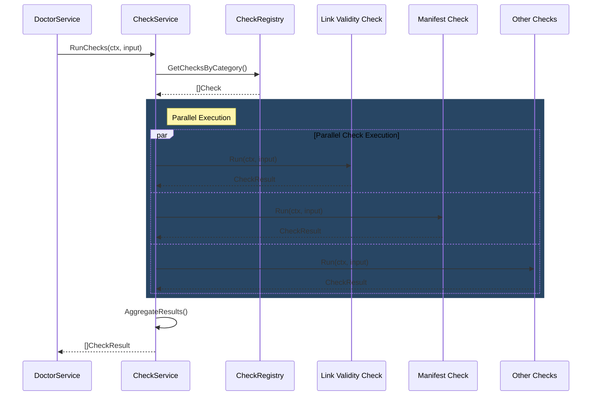

### Adding Custom Checks

Checks are pluggable via the `Check` interface:

```go
// Custom check implementation
type MyCustomCheck struct {
    config CustomCheckConfig
}

func (c *MyCustomCheck) Name() string {
    return "my-custom-check"
}

func (c *MyCustomCheck) Description() string {
    return "Validates custom business rules"
}

func (c *MyCustomCheck) Category() CheckCategory {
    return CheckCategoryOperational
}

func (c *MyCustomCheck) Run(ctx context.Context, input CheckInput) CheckResult {
    // Pure function - no side effects
    // Return CheckResult with any issues found
    
    result := CheckResult{
        CheckName: c.Name(),
        Status:    CheckStatusPass,
        Issues:    []Issue{},
    }
    
    // Check logic here
    
    return result
}

// Register custom check
checkService.RegisterCheck(&MyCustomCheck{})
```

## Triage System

The triage system analyzes issues, detects patterns, and recommends resolution strategies.

### Triage Pipeline

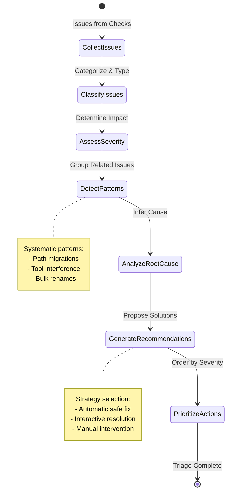

### Pattern Detection

The triage system detects common patterns:

**Path Migration Pattern**:
- Multiple broken links with similar path prefixes
- Suggests bulk path update
- Example: `/home/user` → `/home/username`

**External Tool Interference Pattern**:
- Links pointing to unexpected targets
- Targets match known tool patterns (stow, nix, system packages)
- Suggests ignore or restore strategies

**Package Structure Change Pattern**:
- Files renamed within package
- Manifest out of sync
- Suggests remanage operation

**Filesystem Corruption Pattern**:
- Circular symlinks
- Manifest JSON errors
- Multiple packages affected
- Suggests recovery procedures

### Resolution Strategies

Each issue type has preferred resolution strategies:

| Issue Type | Primary Strategy | Alternative Strategy | Safety Level |
|------------|------------------|---------------------|--------------|
| Broken Link | Recreate symlink | Remove link | High |
| Missing Link | Create symlink | Remanage package | High |
| Wrong Target | Fix target | Adopt new target | Medium |
| Orphaned Link | Ignore or adopt | Remove | Low |
| Manifest Inconsistency | Sync manifest | Rebuild manifest | High |
| Circular Reference | Break cycle | Manual intervention | Medium |
| Secret Exposure | Manual removal | None | Critical |
| Permission Issue | Fix permissions | None | High |

## Repair System

The repair system executes fixes using the same transactional executor as manage operations.

### Repair Execution Flow

```mermaid
sequenceDiagram
    participant User
    participant RepairService
    participant RepairPlanner
    participant RepairValidator
    participant Executor
    participant HistoryService
    participant FS as Filesystem
    
    User->>RepairService: ExecuteRepair(plan, opts)
    
    rect rgb(60, 50, 100)
        note right of RepairService: Planning Phase
        RepairService->>RepairPlanner: ConvertIssuesToOperations(issues)
        RepairPlanner->>RepairPlanner: Map issues to repair ops
        RepairPlanner->>RepairPlanner: Build dependency graph
        RepairPlanner-->>RepairService: RepairPlan with operations
    end
    
    rect rgb(40, 70, 100)
        note right of RepairService: Validation Phase
        RepairService->>RepairValidator: ValidateRepair(plan)
        RepairValidator->>RepairValidator: Check safety constraints
        RepairValidator->>RepairValidator: Verify preconditions
        RepairValidator-->>RepairService: Validation result
    end
    
    alt Validation Failed
        RepairService-->>User: Error (no changes made)
    end
    
    rect rgb(80, 100, 50)
        note right of RepairService: Execution Phase
        RepairService->>Executor: Execute(plan.Operations)
        Executor->>FS: Create checkpoint
        Executor->>FS: Apply operations
        
        alt Execution Success
            FS-->>Executor: Success
            Executor-->>RepairService: Success
        else Execution Failed
            FS-->>Executor: Error
            Executor->>FS: Rollback
            Executor-->>RepairService: Error (rolled back)
        end
    end
    
    rect rgb(90, 70, 80)
        note right of RepairService: History Recording
        RepairService->>HistoryService: RecordOperation(repair)
        HistoryService-->>RepairService: Operation ID
    end
    
    RepairService-->>User: RepairResult
```

### Safety Levels

Repairs are classified by safety level:

```go
type SafetyLevel int

const (
    SafetyLevelSafe SafetyLevel = iota       // No data loss possible
    SafetyLevelCautious                      // Low risk, reversible
    SafetyLevelRisky                         // Potential data loss, has backup
    SafetyLevelDangerous                     // Irreversible, requires confirmation
)
```

**Safe Operations** (auto-fixable):
- Recreate broken symlinks to existing targets
- Update manifest counts
- Create missing directories
- Fix symlink targets to correct package files

**Cautious Operations** (default confirm):
- Remove orphaned symlinks
- Adopt files into packages
- Restore from backups
- Fix permissions

**Risky Operations** (explicit confirm):
- Delete files
- Overwrite existing files
- Modify package contents
- Break circular references

**Dangerous Operations** (double confirm):
- Bulk deletions
- Manifest rebuilds from scratch
- Package directory moves
- System-wide changes

### Dry-Run Mode

All repairs support dry-run preview:

```go
// Preview changes without applying
preview, err := repairService.DryRunRepair(ctx, plan)

// Preview contains:
// - Operations that would be executed
// - Files that would be modified
// - Estimated impact
// - Safety assessment
```

### Repair Result Reporting

```go
type RepairResult struct {
    Success        bool
    OperationsRun  int
    OperationsOK   int
    OperationsFail int
    FilesModified  []string
    Errors         []error
    HistoryID      string    // For undo
    Duration       time.Duration
}
```

## History and Undo System

The history system provides an audit trail and undo capability for doctor operations.

### History Storage

**Location**: `internal/doctor/history_store.go`

History is persisted in JSON format at `<TargetDir>/.dot-history.json`:

```json
{
  "version": "1.0",
  "entries": [
    {
      "id": "f7d39c82-4b1e-4a9f-8e2a-1c3b9f5d8a7e",
      "timestamp": "2025-11-16T14:30:00Z",
      "operation": "fix",
      "details": {
        "issues_fixed": 3,
        "packages_affected": ["vim", "zsh"]
      },
      "affected": [
        "~/.vimrc",
        "~/.vim/colors/",
        "~/.zshrc"
      ],
      "status": "completed",
      "reversible": true,
      "checkpoint": ".dot-checkpoint-f7d39c82.json"
    }
  ]
}
```

### Undo Mechanism

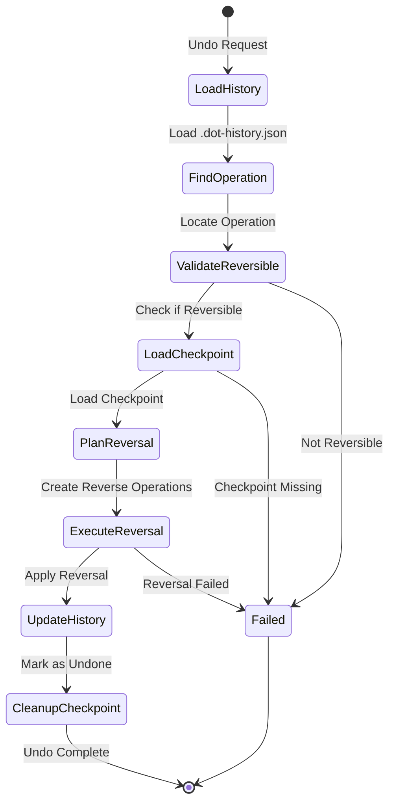

### Undo Constraints

Not all operations are reversible:

| Operation | Reversible | Constraint |
|-----------|------------|------------|
| Recreate Link | Yes | Original target preserved |
| Remove Link | Yes | Checkpoint contains link info |
| Fix Target | Yes | Old target recorded |
| Update Manifest | Yes | Old manifest backed up |
| Delete File | No | Data destruction |
| Adopt File | Partial | Can restore from backup if created |
| Bulk Operations | Yes | Individual operations tracked |

## Profile System

Machine profiles define expected package configuration per machine.

### Profile Format

**Location**: `~/.config/dot/profiles/<profile-name>.yaml`

```yaml
profile:
  name: work-laptop
  description: Work MacBook Pro configuration
  platform:
    os: darwin
    arch: arm64
    
packages:
  required:
    - vim
    - zsh
    - git
    - tmux
  optional:
    - alacritty
    - kitty
  excluded:
    - personal-scripts
    - gaming-tools
    
expectations:
  min_packages: 4
  allow_extra: false
  link_mode: relative
  
checks:
  enable:
    - integrity
    - structural
    - security
  disable:
    - platform  # Skip platform checks on this machine
```

### Profile Validation Flow

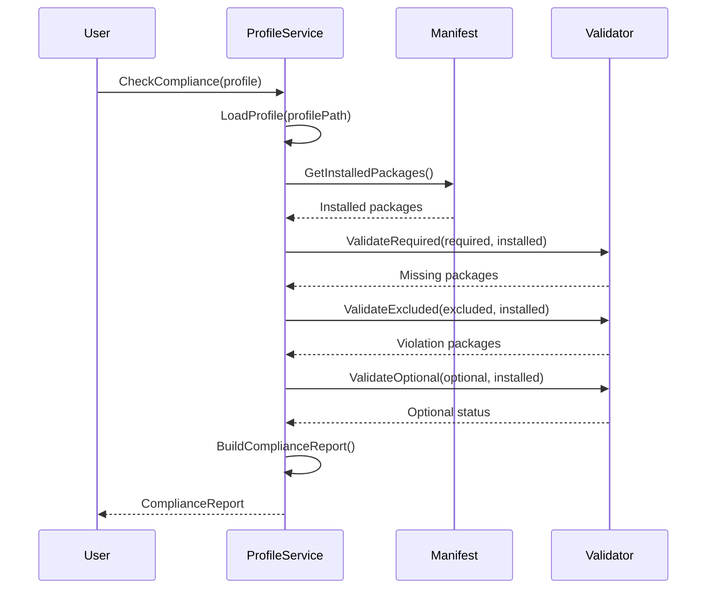

## Migration System

Support for migrating from other dotfile managers.

### GNU Stow Migration

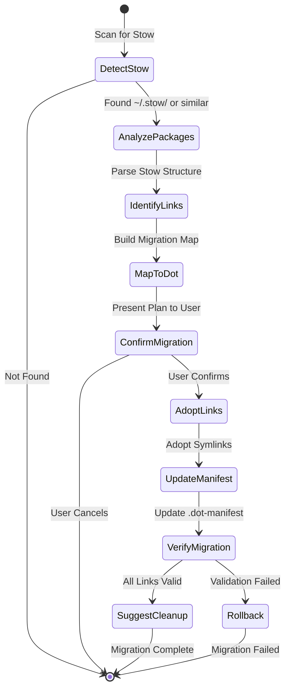

### Supported Migration Sources

- **GNU Stow**: Directory-based symlink management
- **Homesick**: Git-based dotfile management
- **Dotbot**: YAML-configured installations
- **Manual Symlinks**: User-created symlinks matching patterns

## Security Audit System

Comprehensive security scanning for dotfiles.

### Secret Detection

**Pattern Database**:
- GitHub Personal Access Tokens: `ghp_[a-zA-Z0-9]{36}`
- AWS Access Keys: `AKIA[0-9A-Z]{16}`
- OpenAI API Keys: `sk-[a-zA-Z0-9]{48}`
- SSH Private Keys: `-----BEGIN.*PRIVATE KEY-----`
- Generic secrets: High entropy strings in sensitive contexts

**Entropy Analysis**:
- Calculate Shannon entropy for strings
- Flag high-entropy strings in configuration contexts
- Reduce false positives with contextual analysis

### Permission Validation

Check for common permission issues:

```go
type PermissionIssue struct {
    Path        string
    Current     os.FileMode
    Recommended os.FileMode
    Severity    Severity
    Reason      string
}

// Examples:
// - SSH config should be 0600, not 0644
// - Private keys should be 0600
// - Executables should have +x
// - Config files should not be world-writable
```

### Security Report Format

```go
type SecurityAuditReport struct {
    Timestamp       time.Time
    TotalFiles      int
    FilesScanned    int
    IssuesFound     int
    CriticalIssues  int
    HighIssues      int
    MediumIssues    int
    LowIssues       int
    Secrets         []SecretDetection
    Permissions     []PermissionIssue
    DangerousLinks  []LinkSecurityIssue
    Recommendations []string
    SecurityScore   int  // 0-10
}
```

## Extended Data Flows

### Complete Doctor Check Flow

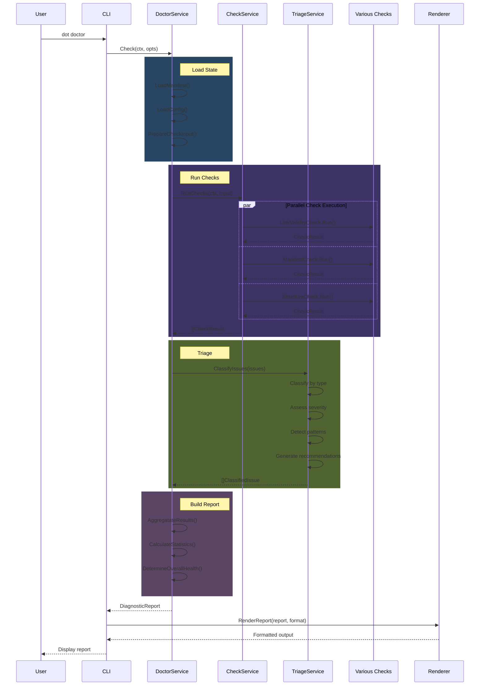

### Complete Repair Flow

```mermaid
sequenceDiagram
    participant User
    participant CLI
    participant DoctorService
    participant RepairService
    participant RepairPlanner
    participant Executor
    participant HistoryService
    
    User->>CLI: dot doctor fix
    CLI->>DoctorService: Fix(ctx, opts)
    
    rect rgb(40, 70, 100)
        note right of DoctorService: Detect Issues
        DoctorService->>DoctorService: Check() to find issues
    end
    
    rect rgb(60, 50, 100)
        note right of DoctorService: Plan Repair
        DoctorService->>RepairService: PlanRepair(issues)
        RepairService->>RepairPlanner: ConvertToOperations(issues)
        RepairPlanner->>RepairPlanner: Build operation graph
        RepairPlanner->>RepairPlanner: Topological sort
        RepairPlanner-->>RepairService: RepairPlan
        RepairService-->>DoctorService: RepairPlan
    end
    
    alt Interactive Mode
        DoctorService->>User: Preview repair plan
        User-->>DoctorService: Confirm or modify
    end
    
    rect rgb(80, 100, 50)
        note right of DoctorService: Execute Repair
        DoctorService->>RepairService: ExecuteRepair(plan)
        RepairService->>RepairService: ValidateRepair(plan)
        RepairService->>Executor: Execute(operations)
        
        Executor->>Executor: Create checkpoint
        Executor->>Executor: Execute operations
        
        alt Success
            Executor-->>RepairService: Success
        else Failure
            Executor->>Executor: Rollback
            Executor-->>RepairService: Error
        end
        
        RepairService-->>DoctorService: RepairResult
    end
    
    rect rgb(90, 70, 80)
        note right of DoctorService: Record History
        DoctorService->>HistoryService: RecordOperation(repair)
        HistoryService-->>DoctorService: HistoryID
    end
    
    DoctorService-->>CLI: RepairResult
    CLI-->>User: Display result
```

## Integration with Core Architecture

The doctor system integrates with the core architecture while maintaining separation of concerns.

### Service Integration

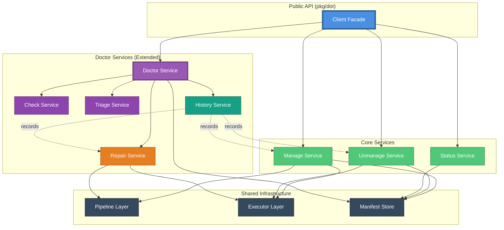

### Dependency Rules (Extended)

The doctor system adds new layers while respecting existing dependency rules:

**New Rules**:
1. Doctor services depend on check/triage/repair services
2. Check/triage services depend only on domain layer (pure functions)
3. Repair service depends on executor (reuses transaction system)
4. History service records all service operations (observer pattern)
5. CLI layer accesses doctor system only through Client facade

**Preserved Rules**:
1. Domain layer still has no dependencies
2. Core layer (scanner, planner, ignore) unchanged
3. Executor layer unchanged (reused by repair system)
4. Pipeline layer unchanged (reused by repair operations)
5. No circular dependencies introduced

### Shared Components

The doctor system reuses core components:

**Executor Layer**:
- Repair operations use existing transactional executor
- Checkpoint mechanism shared between manage and repair
- Rollback logic is identical

**Pipeline Layer**:
- Repair operations can use pipeline stages
- Scanning and planning stages reused for repairs

**Manifest Store**:
- Same manifest format and storage
- Doctor checks validate manifest integrity
- Repairs update manifest through same interface

**Adapters**:
- Same filesystem abstraction
- Same logger interface
- Dry-run mode uses NoopFilesystem

### Testing Strategy (Extended)

Doctor system testing follows same patterns:

**Check Layer**:
- Pure function tests with synthetic input
- No filesystem access required
- Property-based testing for issue classification

**Triage Layer**:
- Pattern detection tests with known issue sets
- Recommendation validation
- Edge case coverage

**Repair Layer**:
- Integration tests with MemFilesystem
- Rollback verification
- Transactional semantics testing

**History Layer**:
- Persistence tests
- Undo mechanism verification
- Checkpoint consistency tests

## Performance Considerations

### Check Execution Performance

**Fast Mode** (default):
- Only checks manifest-tracked links
- No filesystem scanning
- Time: O(n) where n is number of managed links
- Typical: < 2 seconds for 150 links

**Deep Mode** (--deep flag):
- Includes orphan detection
- Scans entire target directory
- Time: O(m) where m is total files in target directory
- Typical: 30-60 seconds for home directory

**Optimization Strategies**:
- Skip patterns for large directories
- Parallel check execution
- Incremental checking (check only changed packages)
- Result caching (future enhancement)

### Memory Usage

**Check Results**:
- O(i) where i is number of issues found
- Typical: < 10MB for complex scenarios

**History Storage**:
- O(h) where h is history depth
- Configurable maximum history entries
- Typical: < 1MB for 100 operations

### Parallelization

**Parallel Check Execution**:
- Independent checks run concurrently
- Worker pool with configurable size
- Respects context cancellation

**Sequential Requirements**:
- Repair operations remain sequential (safety)
- History recording is sequential (consistency)
- Manifest updates are sequential (atomicity)

## Future Enhancements

### Potential Doctor System Extensions

1. **Continuous Monitoring Mode**:
   - File watcher for real-time issue detection
   - Automatic health checks on package changes
   - Background validation

2. **Machine Learning Pattern Detection**:
   - Learn user-specific patterns
   - Improve resolution recommendations
   - Detect novel issue types

3. **Collaborative Diagnostics**:
   - Share diagnostic reports across team
   - Aggregate issues across fleet
   - Centralized health dashboard

4. **Advanced Security Scanning**:
   - Integration with vulnerability databases
   - Compliance checking (SOC2, HIPAA)
   - Automated secret rotation

5. **Predictive Health**:
   - Predict potential issues before they occur
   - Suggest preventive maintenance
   - Trend analysis over time

## Summary

The doctor system extends the core architecture with:

- **8 new services** for comprehensive health management
- **Pluggable check system** for extensibility
- **Intelligent triage** for issue classification and recommendations
- **Safe repair system** reusing transactional executor
- **Operation history** with undo capabilities
- **Profile validation** for machine-specific configuration
- **Migration support** from other dotfile managers
- **Security auditing** for secrets and permissions

All extensions maintain:
- Functional core principles
- Type safety with domain types
- Explicit error handling
- Transactional guarantees
- Dependency inversion
- Testability without filesystem access

The architecture remains clean, maintainable, and extensible while adding substantial new capabilities.


