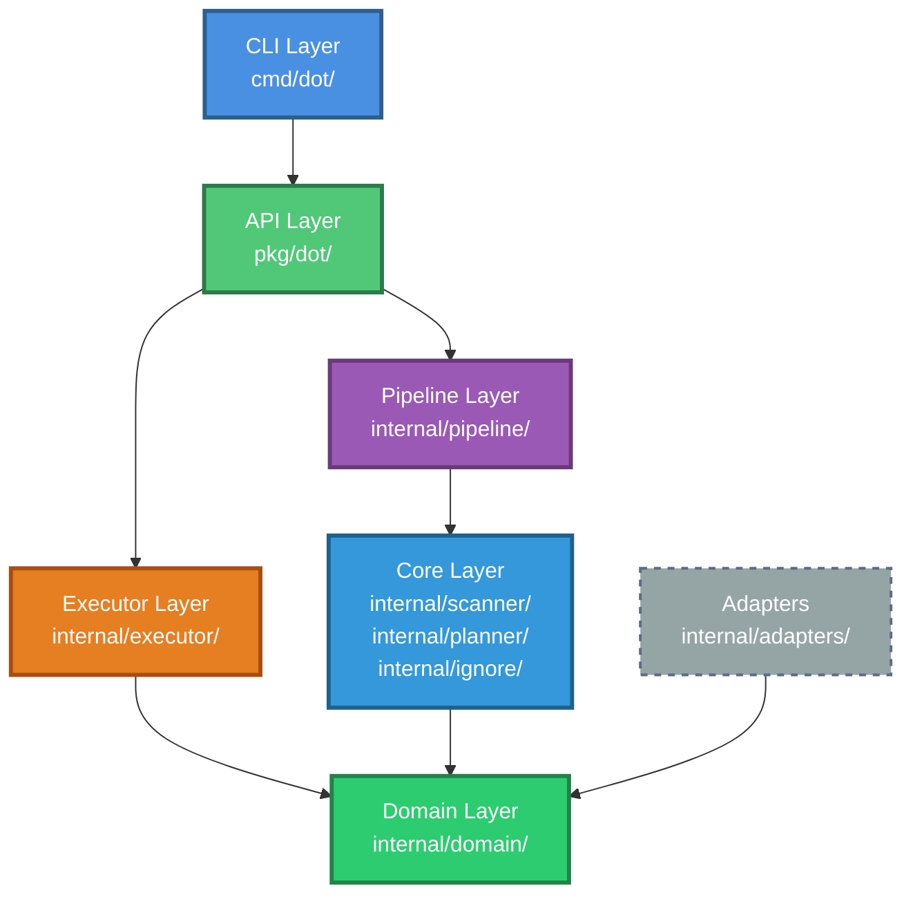
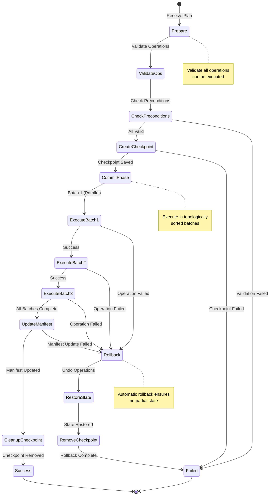
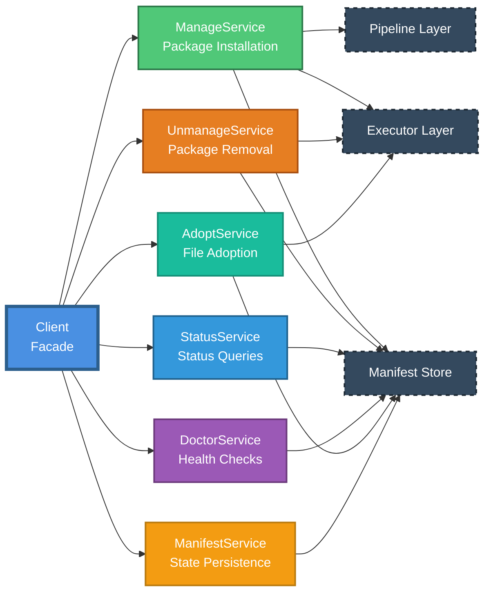
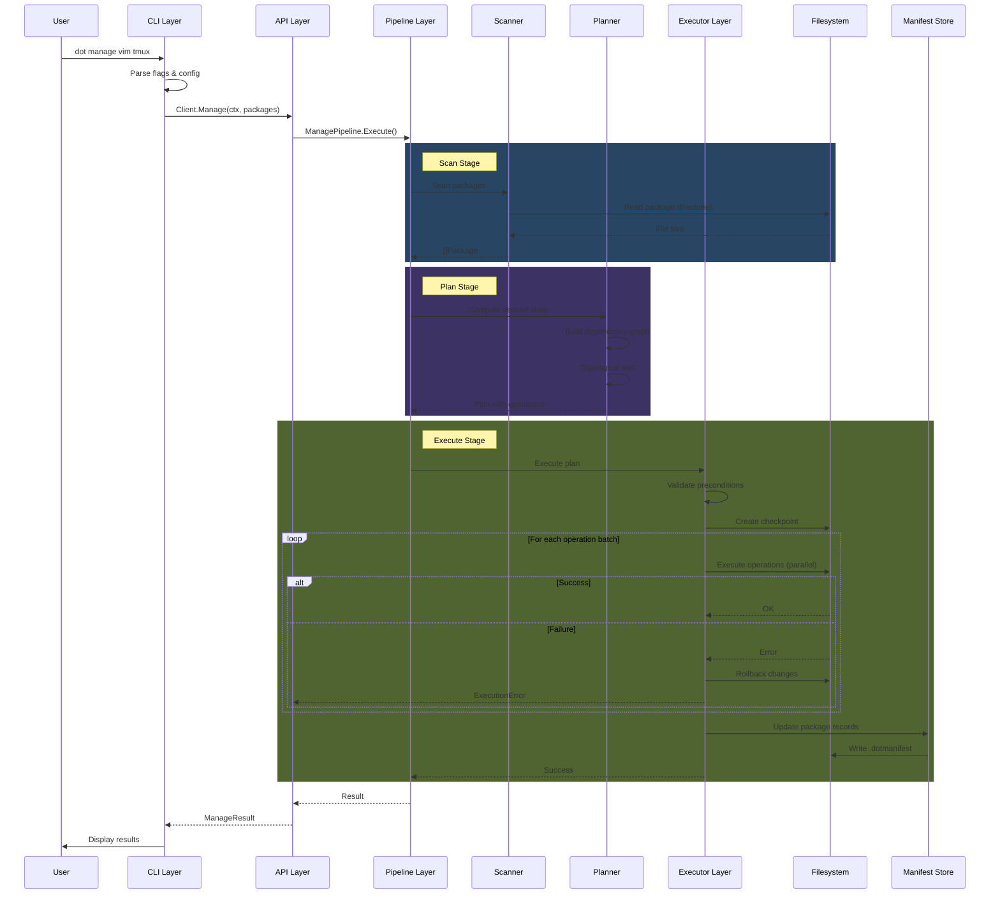
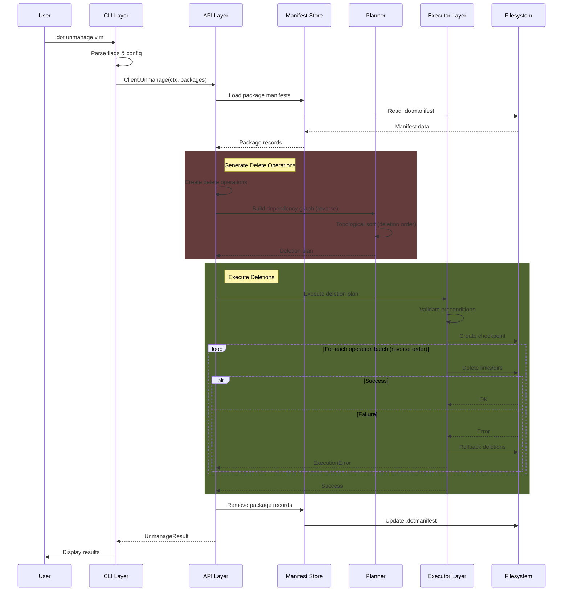
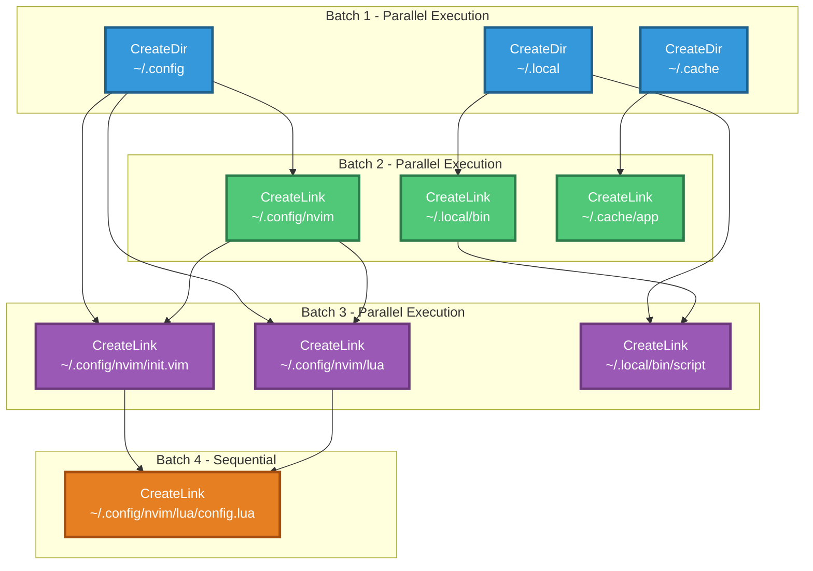
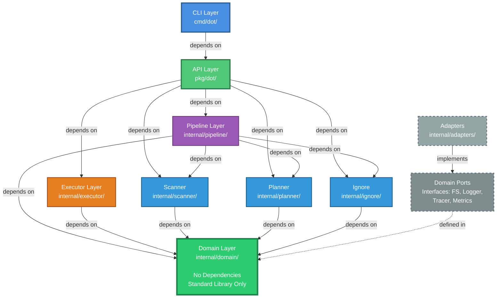

# Architecture Documentation

This document describes the technical architecture of dot, a type-safe symbolic link manager for configuration files.

## Table of Contents

- [Architecture Overview](#architecture-overview)
- [Architectural Layers](#architectural-layers)
- [Design Principles](#design-principles)
- [Component Structure](#component-structure)
- [Data Flow](#data-flow)
- [Type System](#type-system)
- [Error Handling](#error-handling)
- [Concurrency Model](#concurrency-model)
- [Testing Strategy](#testing-strategy)
- [Dependency Rules](#dependency-rules)

## Architecture Overview

dot follows a layered architecture inspired by hexagonal architecture (ports and adapters) and functional programming principles. The system separates pure functional logic from side-effecting operations, enabling deterministic testing and safe execution.

### Core Architecture Pattern

The architecture implements the "Functional Core, Imperative Shell" pattern:

- **Functional Core**: Pure domain logic with no side effects (scanning, planning, resolution)
- **Imperative Shell**: Side-effecting operations isolated to executor layer (filesystem modifications)

This separation enables:
- Deterministic testing of core logic without filesystem access
- Safe rollback of failed operations
- Property-based testing of algebraic laws
- Parallelization of independent operations

## Architectural Layers

The system comprises six distinct layers, each with specific responsibilities and dependency constraints.



### 1. Domain Layer

**Location**: `internal/domain/`

**Purpose**: Pure domain model defining core types, operations, and port interfaces.

**Key Components**:
- Domain entities: `Package`, `Node`, `Plan`, `Operation`
- Phantom-typed paths: `PackagePath`, `TargetPath`, `FilePath`
- Port interfaces: `FS`, `Logger`, `Tracer`, `Metrics`
- Result types: `Result[T]` for monadic error handling
- Conflict representations
- Error types

**Characteristics**:
- No external dependencies except standard library
- All functions are pure (no I/O operations)
- Phantom types provide compile-time path safety
- Defines contracts (interfaces) for infrastructure

**Dependencies**: None (depends only on Go standard library)

### 2. Core Layer

**Location**: `internal/scanner/`, `internal/planner/`, `internal/ignore/`

**Purpose**: Pure functional logic for scanning packages, computing desired state, and planning operations.

**Key Components**:

**Scanner** (`internal/scanner/`):
- Package scanning with ignore pattern support
- Filesystem tree construction
- Dotfile name translation (e.g., `dot-bashrc` to `.bashrc`)

**Planner** (`internal/planner/`):
- Desired state computation
- Conflict detection and resolution
- Dependency graph construction
- Topological sorting for operation ordering
- Parallel execution batch computation

**Ignore** (`internal/ignore/`):
- Pattern matching for file exclusion
- Default ignore patterns
- Custom pattern support

**Characteristics**:
- Pure functions with no side effects
- Deterministic outputs for given inputs
- Testable without filesystem access
- Uses Result types for error handling

**Dependencies**: Domain layer only

### 3. Pipeline Layer

**Location**: `internal/pipeline/`

**Purpose**: Composable pipeline stages with generic type parameters for operation orchestration.

**Key Components**:
- `Pipeline[TIn, TOut]`: Generic pipeline type
- `ScanStage()`: Package scanning stage
- `PlanStage()`: Desired state computation stage
- `ResolveStage()`: Conflict resolution stage
- `ManagePipeline`: Composition of stages for manage operations

**Characteristics**:
- Generic type parameters for type safety
- Composable stages using function composition
- Context-aware for cancellation support
- Monadic error propagation through stages

**Pipeline Composition Example**:
```
ScanInput -> ScanStage -> []Package -> PlanStage -> DesiredState -> ResolveStage -> Plan
```

**Dependencies**: Domain and Core layers

### 4. Executor Layer

**Location**: `internal/executor/`

**Purpose**: Transactional execution of plans with two-phase commit and automatic rollback.

**Key Components**:
- `Executor`: Main execution engine
- `CheckpointStore`: State checkpoint for rollback
- Precondition validation
- Operation execution
- Automatic rollback on failure
- Parallel execution support

**Execution Phases**:

1. **Prepare Phase**: Validate all operations before execution
2. **Checkpoint Creation**: Save state for potential rollback
3. **Commit Phase**: Execute operations (sequential or parallel)
4. **Rollback Phase**: Undo operations if failures occur
5. **Checkpoint Cleanup**: Remove checkpoint on success



**Characteristics**:
- All-or-nothing transaction semantics
- Automatic rollback on any failure
- Support for parallel execution of independent operations
- Comprehensive error tracking

**Dependencies**: Domain layer for types and ports

### 5. API Layer

**Location**: `pkg/dot/`

**Purpose**: Clean public Go library interface for embedding dot in other applications.

**Key Components**:
- `Client`: Facade delegating to specialized services
- `Config`: Configuration structure with validation
- Service implementations:
  - `ManageService`: Package installation
  - `UnmanageService`: Package removal
  - `StatusService`: Status queries
  - `DoctorService`: Health checks
  - `AdoptService`: File adoption
  - `ManifestService`: State persistence

**Service Pattern**:

The Client uses a service-based architecture where each major operation is implemented by a dedicated service. This provides:
- Single Responsibility Principle adherence
- Independent testing of each service
- Clear boundaries between concerns
- Maintainable codebase



**Characteristics**:
- Stable public API
- Thread-safe operations
- Service-based delegation
- Comprehensive validation

**Dependencies**: All internal layers

### 6. CLI Layer

**Location**: `cmd/dot/`

**Purpose**: Cobra-based command-line interface providing user interaction.

**Key Components**:
- Command definitions (manage, unmanage, status, doctor, list, adopt)
- Flag parsing and validation
- Configuration loading from files and environment
- Output formatting (table, JSON, YAML)
- Progress indicators
- Error rendering with suggestions

**Characteristics**:
- Cobra command structure
- Viper configuration management
- Multiple output formats
- Rich error messages with context

**Dependencies**: API layer only (does not import internal packages directly)

## Design Principles

### Functional Core, Imperative Shell

Pure functional logic (scanning, planning, resolution) is separated from side-effecting operations (filesystem modifications). This enables:

- Deterministic testing without filesystem access
- Property-based testing of algebraic laws
- Safe parallelization
- Reliable rollback mechanisms

### Type Safety

Phantom types encode path semantics at compile time:

```go
type PackagePath struct { path string }
type TargetPath struct { path string }
type FilePath struct { path string }
```

This prevents path-related bugs:
- Cannot pass target path where package path expected
- Cannot mix relative and absolute paths incorrectly
- Compile-time validation of path operations

### Explicit Error Handling

The system uses `Result[T]` types for monadic error handling:

```go
type Result[T any] struct {
    value T
    err   error
}
```

This provides:
- No silent failures
- Explicit error propagation
- Composable error handling
- Type-safe success values

### Transactional Operations

All operations use two-phase commit:

1. **Validate**: Check preconditions
2. **Execute**: Apply changes
3. **Rollback**: Undo on failure

This ensures:
- Atomic operation sets
- Automatic cleanup on failure
- No partial state on errors
- Safe concurrent execution

### Dependency Inversion

Infrastructure dependencies are abstracted through port interfaces:

```go
type FS interface {
    ReadFile(path string) ([]byte, error)
    WriteFile(path string, data []byte) error
    Symlink(oldname, newname string) error
    // ... other operations
}
```

This enables:
- Testing with memory-based implementations
- Platform-specific adapters
- Mock implementations for testing
- Isolation of domain logic from infrastructure

## Component Structure

### Adapter Pattern

The system uses adapters to implement port interfaces:

**Filesystem Adapters** (`internal/adapters/`):
- `OSFilesystem`: Production filesystem using `os` package
- `MemFilesystem`: In-memory filesystem for testing
- `NoopFilesystem`: No-op implementation for dry-run mode

**Logging Adapters** (`internal/adapters/`):
- `SlogLogger`: Production logger using `log/slog`
- `NoopLogger`: Silent logger for testing

This pattern provides:
- Swappable implementations
- Testability without real filesystem
- Dry-run mode support
- Platform-specific optimizations

### Manifest Persistence

**Location**: `internal/manifest/`

**Purpose**: State persistence for tracking installed packages.

**Components**:
- `Manifest`: Package installation record
- `ManifestStore`: Interface for persistence
- `FSManifestStore`: File-based implementation

**Manifest Structure**:
```go
type Manifest struct {
    Version      string
    Packages     map[string]PackageManifest
    LastModified time.Time
}

type PackageManifest struct {
    Name         string
    InstallDate  time.Time
    Links        []string
    ContentHash  string
}
```

**Persistence Location**: `<TargetDir>/.dotmanifest`

**Purpose**:
- Track installed packages
- Enable incremental updates (detect changed packages)
- Support status queries without filesystem scanning
- Facilitate safe uninstall operations

### Configuration System

**Location**: `internal/config/`

**Purpose**: Configuration loading, validation, and marshaling.

**Features**:
- Multiple format support (YAML, JSON, TOML)
- Precedence handling (flags > environment > files > defaults)
- XDG Base Directory Specification compliance
- Schema validation
- Default value application

**Configuration Sources** (in precedence order):
1. Command-line flags
2. Environment variables (`DOT_*` prefix)
3. Project-local config (`./.dotrc`)
4. User config (`~/.config/dot/config.yaml`)
5. System config (`/etc/dot/config.yaml`)
6. Default values

## Data Flow

### Manage Operation Flow



### Unmanage Operation Flow



### Status Query Flow

```mermaid
sequenceDiagram
    participant User
    participant CLI as CLI Layer
    participant API as API Layer
    participant StatusService as Status Service
    participant Manifest as Manifest Store
    participant FS as Filesystem
    participant Renderer as Output Renderer
    
    User->>CLI: dot status [packages]
    CLI->>CLI: Parse flags & config
    CLI->>API: Client.Status(ctx, packages)
    
    API->>StatusService: Query status
    
    rect rgb(50, 80, 120)
        note right of StatusService: Load Manifests
        StatusService->>Manifest: Load package manifests
        Manifest->>FS: Read .dotmanifest
        FS-->>Manifest: Manifest data
        Manifest-->>StatusService: Package records
    end
    
    rect rgb(70, 90, 70)
        note right of StatusService: Build Status
        StatusService->>StatusService: Build status structures
        StatusService->>StatusService: Compute installation state
        StatusService->>StatusService: Calculate timestamps
        StatusService->>StatusService: Count links per package
    end
    
    StatusService-->>API: StatusResult
    API-->>CLI: Status data
    
    rect rgb(90, 70, 100)
        note right of CLI: Render Output
        CLI->>Renderer: Format output (table/JSON/YAML)
        
        alt Table Format
            Renderer->>Renderer: Build table structure
            Renderer->>Renderer: Format columns
            Renderer-->>CLI: Table output
        else JSON Format
            Renderer->>Renderer: Marshal to JSON
            Renderer-->>CLI: JSON output
        else YAML Format
            Renderer->>Renderer: Marshal to YAML
            Renderer-->>CLI: YAML output
        end
    end
    
    CLI->>User: Display status
```



### Doctor Health Check Flow

```mermaid
sequenceDiagram
    participant User
    participant CLI as CLI Layer
    participant API as API Layer
    participant DoctorService as Doctor Service
    participant Manifest as Manifest Store
    participant FS as Filesystem
    participant Renderer as Diagnostic Renderer
    
    User->>CLI: dot doctor
    CLI->>CLI: Parse flags & config
    CLI->>API: Client.Doctor(ctx)
    
    API->>DoctorService: Run health checks
    
    rect rgb(50, 80, 120)
        note right of DoctorService: Load State
        DoctorService->>Manifest: Load all package manifests
        Manifest->>FS: Read .dotmanifest
        FS-->>Manifest: All package records
        Manifest-->>DoctorService: Installed packages
    end
    
    rect rgb(70, 90, 70)
        note right of DoctorService: Verify Links
        loop For each package
            DoctorService->>FS: Check symlink exists
            DoctorService->>FS: Read symlink target
            
            alt Link Valid
                FS-->>DoctorService: Target matches expected
                DoctorService->>DoctorService: Mark as healthy
            else Link Broken
                FS-->>DoctorService: Target missing/wrong
                DoctorService->>DoctorService: Record issue
            else Link Missing
                FS-->>DoctorService: Symlink not found
                DoctorService->>DoctorService: Record issue
            end
        end
    end
    
    rect rgb(100, 70, 80)
        note right of DoctorService: Detect Issues
        DoctorService->>FS: Scan target directory
        FS-->>DoctorService: All files/links
        
        DoctorService->>DoctorService: Detect broken links
        DoctorService->>DoctorService: Detect orphaned files
        DoctorService->>DoctorService: Detect conflicts
        DoctorService->>DoctorService: Detect wrong targets
        DoctorService->>DoctorService: Check manifest integrity
    end
    
    rect rgb(90, 70, 100)
        note right of DoctorService: Generate Report
        DoctorService->>DoctorService: Categorize issues by severity
        DoctorService->>DoctorService: Generate suggestions
        DoctorService->>DoctorService: Build diagnostic report
    end
    
    DoctorService-->>API: DiagnosticReport
    API-->>CLI: Report data
    
    CLI->>Renderer: Render diagnostics
    
    alt All Healthy
        Renderer->>Renderer: Format success message
        Renderer-->>CLI: Health report
    else Issues Found
        Renderer->>Renderer: Format issue list
        Renderer->>Renderer: Add suggestions
        Renderer->>Renderer: Add fix commands
        Renderer-->>CLI: Diagnostic report with fixes
    end
    
    CLI->>User: Display diagnostics
```



## Type System

### Phantom Types for Path Safety

Phantom types encode path semantics at the type level:

```go
// PackagePath represents a path within the package directory
type PackagePath struct {
    path string
}

// TargetPath represents a path in the target directory
type TargetPath struct {
    path string
}

// FilePath represents a generic file path
type FilePath struct {
    path string
}
```

**Benefits**:
- Compile-time prevention of path mix-ups
- Self-documenting function signatures
- Type-guided refactoring
- Elimination of path-related bugs

**Usage Example**:
```go
// Function signature clearly indicates path expectations
func scanPackage(path PackagePath) Result[Package]

// Compiler prevents incorrect usage
scanPackage(targetPath)  // Compile error: type mismatch
```

### Result Type for Error Handling

The `Result[T]` type provides monadic error handling:

```go
type Result[T any] struct {
    value T
    err   error
}

func (r Result[T]) IsOk() bool
func (r Result[T]) IsErr() bool
func (r Result[T]) Unwrap() T
func (r Result[T]) UnwrapErr() error
func (r Result[T]) UnwrapOr(defaultValue T) T
```

**Benefits**:
- Explicit success or failure states
- Type-safe value extraction
- Composable error handling
- No nil pointer dereferencing

### Operation Types

Operations are represented as an interface with concrete implementations:

```go
type Operation interface {
    Kind() OperationKind
    Validate() error
    Dependencies() []FilePath
    String() string
}

// Concrete operation types:
type LinkCreate struct { ... }
type LinkDelete struct { ... }
type DirCreate struct { ... }
type DirDelete struct { ... }
type FileBackup struct { ... }
```

**Operation Kinds**:
- `OpKindLinkCreate`: Create symbolic link
- `OpKindLinkDelete`: Remove symbolic link
- `OpKindDirCreate`: Create directory
- `OpKindDirDelete`: Remove directory
- `OpKindFileBackup`: Backup existing file

## Error Handling

### Error Type Hierarchy

Domain-specific errors with rich context:

```go
// Core errors
type ErrInvalidPath struct { Path string }
type ErrPackageNotFound struct { Package string }
type ErrConflict struct { Path string, Reason string }

// Execution errors
type ErrExecutionFailed struct {
    Executed   int
    Failed     int
    RolledBack int
    Errors     []error
}

// Planning errors
type ErrCyclicDependency struct { Cycle []Operation }
type ErrEmptyPlan struct {}
```

### Error Wrapping

Errors are wrapped with context using `fmt.Errorf` and `%w`:

```go
if err := operation.Execute(); err != nil {
    return fmt.Errorf("failed to execute %s: %w", operation.Kind(), err)
}
```

### Error Aggregation

Multiple errors are collected and reported together:

```go
type ExecutionResult struct {
    Executed   []Operation
    Failed     []Operation
    Errors     []error
    RolledBack []Operation
}
```

## Concurrency Model

### Thread Safety

All public API operations are safe for concurrent use:

```go
client, _ := dot.NewClient(config)

// Safe to call from multiple goroutines
go client.Manage(ctx, "vim")
go client.Status(ctx)
```

### Parallel Execution

The planner computes parallel execution batches:

1. **Dependency Analysis**: Build dependency graph
2. **Topological Sort**: Order operations respecting dependencies
3. **Batch Computation**: Group independent operations
4. **Parallel Execution**: Execute batches concurrently

**Example**:
```
Batch 1 (parallel):
  - CreateDir ~/.config
  - CreateDir ~/.local

Batch 2 (parallel, depends on Batch 1):
  - CreateLink ~/.config/nvim
  - CreateLink ~/.local/bin/script

Batch 3 (depends on Batch 2):
  - CreateLink ~/.config/nvim/init.vim
```



### Context Support

All operations support `context.Context` for cancellation:

```go
ctx, cancel := context.WithTimeout(context.Background(), 30*time.Second)
defer cancel()

err := client.Manage(ctx, packages...)
// Respects context cancellation and timeout
```

## Testing Strategy

### Layer-Specific Testing

**Domain Layer**:
- Pure function testing
- Property-based testing of algebraic laws
- No filesystem access required

**Core Layer**:
- Table-driven tests
- Edge case coverage
- In-memory filesystem for deterministic tests

**Pipeline Layer**:
- Integration tests with memory filesystem
- Error propagation verification
- Context cancellation testing

**Executor Layer**:
- Rollback mechanism verification
- Checkpoint functionality
- Failure scenario coverage

**API Layer**:
- End-to-end integration tests
- Service interaction testing
- Manifest persistence verification

**CLI Layer**:
- Command parsing tests
- Output format verification
- Error message validation

### Test Coverage Requirements

- Minimum 80% code coverage
- Critical paths require 100% coverage
- All error paths must be tested
- Edge cases must have explicit tests

### Testing Tools

- Standard library `testing` package
- `testify/assert` for assertions
- Table-driven test pattern
- Memory-based filesystem adapter
- Golden file testing for outputs

## Recent Architectural Improvements

### CLI State Management (2025-01)

**Problem**: The CLI layer used a global `globalCfg` variable to store parsed command-line flags, creating implicit dependencies and making testing difficult.

**Solution**: Refactored to use explicit `CLIFlags` struct passed as parameters:
- Eliminated global state from `cmd/dot/root.go`
- All functions accept `*CLIFlags` parameter explicitly
- Configuration flows explicitly through call chains
- Improved testability through dependency injection

**Impact**:
- Clearer data flow and dependencies
- Easier to test individual functions
- No hidden global state
- Aligns with functional programming principles

### Result[T] Usage Guidelines (2025-01)

**Problem**: The `Result[T]` monad's `Unwrap()` and `UnwrapErr()` methods panic if called on the wrong variant, creating potential runtime failures.

**Solution**: Established comprehensive usage guidelines in `internal/domain/doc.go`:
- Use `Result[T]` for functional core composition
- Prefer `(T, error)` for leaf functions and public APIs
- Always guard `Unwrap()` calls with `IsOk()`/`IsErr()` checks
- Use `UnwrapOr()` for safe access with defaults
- Avoid redundant path validation reconstruction

**Audit Findings**:
- All production `Unwrap()` calls are properly guarded
- Error propagation paths check before unwrapping
- No unsafe patterns found in codebase
- A few redundant but safe reconstructions identified

**Impact**:
- Safer error handling patterns
- Clear guidelines for contributors
- Reduced panic risk in production
- Better alignment with Go idioms at boundaries

### Executor Context Cancellation (2025-01)

**Problem**: Executor loops did not check for context cancellation, preventing graceful shutdown and proper resource cleanup.

**Solution**: Added explicit `ctx.Err()` checks at key points:
- Prepare phase: Check before validating each operation
- Sequential execution: Check before executing each operation
- Parallel execution: Check before executing each batch
- Rollback: Log cancellation but continue for consistency

**New Error Type**:
```go
type ErrExecutionCancelled struct {
    Executed int
    Skipped  int
}
```

**Cancellation Behavior**:
- Operations already executed are rolled back
- Remaining operations are skipped and counted
- Cancellation error returned with accurate metrics
- Rollback continues despite cancelled context

**Impact**:
- Graceful shutdown support
- Proper resource cleanup
- Better user experience for long operations
- System consistency maintained during cancellation

### Set Type Optimization (2025-01)

**Problem**: Many `map[string]bool` types were used as sets, wasting memory (1 byte per entry) and obscuring intent.

**Solution**: Replaced with `map[string]struct{}` where only key presence matters:
- `struct{}` has zero size vs `bool` (1 byte)
- Changed membership checks to comma-ok idiom
- Updated 15 files across internal packages

**Before**:
```go
set := make(map[string]bool)
set[key] = true
if set[key] { ... }
```

**After**:
```go
set := make(map[string]struct{})
set[key] = struct{}{}
if _, exists := set[key]; exists { ... }
```

**Affected Areas**:
- Executor: pending operations tracking
- Planner: current state directory tracking
- Pipeline: path checking during state scan
- Ignore system: visited path tracking
- Doctor: managed link and directory sets
- CLI: managed paths and excluded directories

**Impact**:
- Reduced memory overhead for large sets
- Clearer intent (set vs boolean map)
- More idiomatic Go code
- No behavior changes

## Dependency Rules

### Inward Dependencies

Dependencies flow inward toward the domain:



**Rules**:
1. Domain layer has no dependencies (except standard library)
2. Core layer depends only on domain
3. Pipeline and Executor depend on domain and core
4. API layer depends on all internal layers
5. CLI layer depends only on API layer (not internal packages)
6. Adapters depend only on domain ports

### Import Restrictions

**Prohibited**:
- Internal packages importing from `pkg/dot` (would create cycle)
- CLI importing from `internal/*` directly
- Domain importing from infrastructure packages

**Required**:
- All internal packages import from `internal/domain` for types
- API layer re-exports domain types for public consumption
- Type aliases in `pkg/dot` for stable public API

### Adapter Independence

Adapters are swappable implementations:

```go
// Production
cfg := dot.Config{
    FS:     adapters.NewOSFilesystem(),
    Logger: adapters.NewSlogLogger(os.Stderr),
}

// Testing
cfg := dot.Config{
    FS:     adapters.NewMemFilesystem(),
    Logger: adapters.NewNoopLogger(),
}

// Dry-run
cfg := dot.Config{
    FS:     adapters.NewNoopFilesystem(),
    Logger: adapters.NewSlogLogger(os.Stderr),
}
```

## Performance Characteristics

### Time Complexity

**Scanning**: O(n) where n is number of files in packages
**Planning**: O(m + e) where m is operations and e is dependency edges
**Topological Sort**: O(m + e) using depth-first search
**Execution (sequential)**: O(m) where m is number of operations
**Execution (parallel)**: O(b) where b is number of batches

### Space Complexity

**Manifest Storage**: O(p × l) where p is packages and l is links per package
**Dependency Graph**: O(m + e) where m is operations and e is edges
**Checkpoint**: O(m) to store operation state

### Optimizations

1. **Directory Folding**: Reduce symlink count when entire directory owned by package
2. **Incremental Updates**: Use content hashing to detect changed packages
3. **Parallel Execution**: Execute independent operations concurrently
4. **Lazy Loading**: Load manifests on demand
5. **Efficient Scanning**: Skip ignored directories early in traversal

## Extensibility Points

### Custom Filesystem Implementations

Implement `domain.FS` interface for:
- Cloud storage backends
- Version control system integration
- Virtual filesystem support

### Custom Conflict Resolution

Implement `planner.ResolutionPolicy` for:
- Interactive conflict resolution
- Custom backup strategies
- Automated merge conflict resolution

### Custom Output Formats

Implement `renderer.Renderer` interface for:
- Custom report formats
- Integration with monitoring systems
- Machine-readable structured output

### Metrics and Observability

Implement `domain.Metrics` interface for:
- Prometheus metrics collection
- StatsD integration
- Custom telemetry

## Security Considerations

### Path Traversal Prevention

- All paths validated before use
- Phantom types prevent path confusion
- Relative paths resolved before operations
- Symlink targets validated

### Safe Rollback

- Checkpoint created before operations
- Atomic rollback on failure
- No partial state on errors

### Manifest Integrity

- Manifest stored in target directory (user-controlled)
- Content hashing for change detection
- Validation before loading

### Error Information Disclosure

- Error messages avoid exposing sensitive paths
- Detailed errors logged but sanitized for display
- Security-relevant errors handled specially

## Future Architecture Considerations

### Potential Enhancements

1. **Distributed Locking**: Support for network filesystem coordination
2. **Incremental Manifest Updates**: Avoid full manifest rewrite
3. **Plugin System**: External conflict resolution strategies
4. **Remote Package Sources**: Support for fetching packages from URLs
5. **Advanced Caching**: Cache scanning results for large repositories

### Backward Compatibility

The architecture supports evolution while maintaining compatibility:

- Public API in `pkg/dot` with type aliases
- Internal implementation can change freely
- Manifest versioning for format changes
- Deprecation warnings for API changes

## References

### Related Documentation

- [User Guide](../user/index.md) - End-user documentation
- [Contributing Guide](../../CONTRIBUTING.md) - Development guidelines
- [Release Workflow](release-workflow.md) - Release process

### External Resources

- [Hexagonal Architecture](https://alistair.cockburn.us/hexagonal-architecture/)
- [Functional Core, Imperative Shell](https://www.destroyallsoftware.com/screencasts/catalog/functional-core-imperative-shell)
- [Go Module Documentation](https://golang.org/ref/mod)
- [XDG Base Directory Specification](https://specifications.freedesktop.org/basedir-spec/basedir-spec-latest.html)

