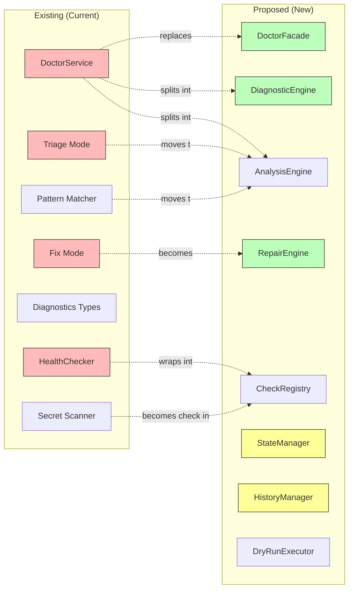

# Doctor System: Architectural Analysis and Integration Concerns

## Executive Summary

This document analyzes the relationship between the proposed doctor architecture (defined in `doctor-system-architecture.md`) and the existing implementation. It identifies duplications, integration concerns, migration risks, and provides recommendations for a clean transition.

### Key Findings

**Duplication Level**: **High** (60-70% functional overlap)

**Integration Complexity**: **Medium-High** (requires careful phased approach)

**Breaking Changes**: **Low** (facade pattern enables compatibility)

**Migration Risk**: **Medium** (significant refactoring but well-bounded)

### Critical Concerns

1. **Significant Duplication**: Many proposed components replicate existing functionality
2. **Parallel Implementations**: Risk of maintaining two doctor systems during migration
3. **Data Structure Redundancy**: New types overlap with existing `diagnostics.go`
4. **Service Boundary Confusion**: Unclear separation between existing services and new engines
5. **Testing Overhead**: Duplicate test coverage requirements during transition

---

## Detailed Overlap Analysis

### Component-by-Component Comparison



**Legend**:
- 🔴 Red: Existing components (to be refactored/replaced)
- 🟢 Green: New components (proposed)
- 🟡 Yellow: Entirely new capabilities (no existing equivalent)

---

### 1. DoctorService → DoctorFacade + Engines

#### Existing: `DoctorService`

**Location**: `pkg/dot/doctor_service.go`

**Responsibilities**:
- Health checks (`Doctor()`, `DoctorWithScan()`)
- Orphan scanning (`performOrphanScan()`)
- Package validation (`checkManagedPackages()`)
- Direct filesystem interaction
- Manifest loading and validation
- Triage coordination
- Fix coordination

**Lines of Code**: ~500 lines

**Dependencies**:
- `ManifestService`
- `HealthChecker`
- `AdoptService`
- `FS` (filesystem abstraction)

#### Proposed: `DoctorFacade` + `DiagnosticEngine`

**Locations**: 
- `pkg/dot/doctor_facade.go` (orchestration)
- `pkg/dot/diagnostic_engine.go` (diagnostics)

**Responsibilities Split**:

**DoctorFacade**:
- CLI interface
- Operation orchestration
- Progress reporting
- Error handling
- Event emission

**DiagnosticEngine**:
- Check execution
- Result aggregation
- Pattern detection
- State persistence

**Lines of Code**: ~300 + ~400 = 700 lines

#### Analysis

**Overlap**: 80%

**Duplication Concerns**:
- Both have health check orchestration logic
- Both aggregate check results
- Both handle manifest loading
- Both produce `DiagnosticReport`

**Divergence**:
- Proposed has state persistence (new)
- Proposed has pluggable check system (new)
- Proposed has cleaner separation of concerns
- Existing tightly couples orchestration and execution

**Migration Path**:
1. Create `DoctorFacade` as thin wrapper over existing `DoctorService`
2. Incrementally move logic from `DoctorService` to `DiagnosticEngine`
3. Update `DoctorService` methods to delegate to facade
4. Eventually deprecate direct `DoctorService` usage

**Risk Level**: 🟡 Medium

---

### 2. HealthChecker → CheckRegistry + Health Check

#### Existing: `HealthChecker`

**Location**: `pkg/dot/health_checker.go`

**Responsibilities**:
- Single link validation
- Existence checking
- Target validation
- Permission checking
- Circular link detection

**Lines of Code**: ~190 lines

**Interface**:
```go
type HealthChecker struct {
    fs        FS
    targetDir string
}

func (h *HealthChecker) CheckLink(ctx context.Context, pkgName, linkPath, packageDir string) LinkHealthResult
```

#### Proposed: `CheckRegistry` + `HealthCheck`

**Locations**:
- `pkg/dot/check_registry.go` (registry)
- `pkg/dot/checks/health_check.go` (check implementation)

**Responsibilities**:
- Registry: Check management, discovery, execution
- HealthCheck: Link validation (same as existing)

**Lines of Code**: ~200 + ~250 = 450 lines

#### Analysis

**Overlap**: 90%

**Duplication Concerns**:
- `HealthCheck` would reimplement `HealthChecker.CheckLink()`
- Nearly identical logic for link validation
- Same error detection patterns
- Same suggestion generation

**Divergence**:
- Proposed has registry for extensibility
- Proposed has `Check` interface for uniformity
- Proposed supports parallel execution
- Existing is simpler, more direct

**Migration Path**:
1. **Keep `HealthChecker` as-is initially**
2. Create `HealthCheck` as wrapper around `HealthChecker`
3. Move `HealthChecker` into `pkg/dot/checks/health_check.go`
4. Implement `Check` interface on `HealthChecker`
5. Registry delegates to existing implementation

**Risk Level**: 🟢 Low

**Recommendation**: **Do not duplicate**. Wrap existing `HealthChecker` in `Check` interface. This avoids rewriting battle-tested link validation logic.

---

### 3. Triage Mode → AnalysisEngine

#### Existing: Triage System

**Location**: `pkg/dot/doctor_triage.go`

**Responsibilities**:
- Orphan grouping by category
- Pattern matching
- Interactive user flow
- Auto-ignore high confidence
- Category-based processing
- Linear processing mode

**Lines of Code**: ~700 lines

**Dependencies**:
- `internal/doctor/patterns.go` (pattern definitions)
- `DoctorService` (orchestration)
- Interactive prompting

#### Proposed: `AnalysisEngine` + Pattern Analysis

**Location**: `pkg/dot/analysis_engine.go`

**Responsibilities**:
- Pattern detection
- Symlink classification
- Dependency analysis
- Root cause analysis
- Trend analysis

**Lines of Code**: ~500 lines

#### Analysis

**Overlap**: 50%

**Duplication Concerns**:
- Both do pattern-based classification
- Both group symlinks by category
- Both use confidence scores
- Both suggest actions

**Divergence**:
- Existing has full interactive UX
- Existing has triage-specific workflows
- Proposed is analysis-only (no UX)
- Proposed adds dependency analysis
- Proposed adds trend analysis

**Key Insight**: Triage is **interactive workflow**, Analysis is **data processing**

**Migration Path**:
1. Extract pattern matching from `doctor_triage.go` into `AnalysisEngine`
2. Keep interactive prompting in `doctor_triage.go`
3. Have triage call `AnalysisEngine.DetectPatterns()` for grouping
4. Gradually move non-interactive logic to `AnalysisEngine`
5. Eventually, triage becomes thin UI layer over analysis

**Risk Level**: 🟡 Medium

**Recommendation**: **Separate concerns cleanly**. Move pattern detection to `AnalysisEngine`, keep user interaction in triage command handler.

---

### 4. Fix Mode → RepairEngine

#### Existing: Fix System

**Location**: `pkg/dot/doctor_fix.go`

**Responsibilities**:
- Broken link repair
- Managed vs unmanaged distinction
- Interactive prompts
- Batch processing
- Dry-run support (partial)

**Lines of Code**: ~250 lines

**Dependencies**:
- `DoctorService`
- `ManifestService`
- Interactive prompting

#### Proposed: `RepairEngine` + `DryRunExecutor`

**Locations**:
- `pkg/dot/repair_engine.go` (repair logic)
- `pkg/dot/dryrun_executor.go` (simulation)

**Responsibilities**:

**RepairEngine**:
- Repair planning
- Repair execution
- History tracking
- Verification

**DryRunExecutor**:
- Operation simulation
- Impact assessment
- Conflict detection
- Risk evaluation

**Lines of Code**: ~600 + ~300 = 900 lines

#### Analysis

**Overlap**: 60%

**Duplication Concerns**:
- Both handle broken link repair
- Both distinguish managed/unmanaged
- Both support dry-run
- Both group issues for batch processing

**Divergence**:
- Proposed has comprehensive dry-run architecture
- Proposed has history tracking
- Proposed has undo capability
- Proposed has more sophisticated impact assessment
- Existing has simpler, more direct flow

**Migration Path**:
1. Create `RepairEngine` wrapping existing fix logic
2. Add `DryRunExecutor` as separate layer
3. Add `HistoryManager` integration
4. Gradually move fix logic into `RepairEngine`
5. Update `Fix()` method to delegate to engine

**Risk Level**: 🟡 Medium

**Recommendation**: **Incremental refactoring**. Start with history and dry-run infrastructure, then gradually move repair logic.

---

### 5. Diagnostics Types → New Type System

#### Existing: `diagnostics.go`

**Location**: `pkg/dot/diagnostics.go`

**Types Defined**:
```go
DiagnosticReport
HealthStatus (OK, Warnings, Errors)
Issue
IssueSeverity (Info, Warning, Error)
IssueType (BrokenLink, OrphanedLink, WrongTarget, Permission, Circular, ManifestInconsistency)
DiagnosticStats
ScanMode (Off, Scoped, Deep)
ScanConfig
```

**Lines of Code**: ~260 lines

**Status**: Well-established, used throughout codebase

#### Proposed: Extended Type System

**Locations**: Multiple new files
- `pkg/dot/doctor_types.go`
- `pkg/dot/checks/check_types.go`

**New Types**:
```go
CheckResult
CheckType (Health, Orphan, Manifest, Structure, Security, Platform, etc.)
CheckStatus
PatternAnalysis
DependencyGraph
StateDiff
RepairPlan
Operation
OperationType
RiskLevel
... many more
```

**Lines of Code**: ~500+ lines

#### Analysis

**Overlap**: 40%

**Duplication Concerns**:
- `CheckResult` vs `Issue` - similar purpose
- `CheckStatus` vs `HealthStatus` - overlapping concepts
- New `IssueType` expands on existing
- Stats tracked in multiple places

**Divergence**:
- Existing types are simpler, battle-tested
- Proposed types are more granular
- Proposed adds many new concepts (checks, state, operations)
- Existing focused on reporting, proposed on architecture

**Critical Issue**: **Two parallel type hierarchies**

During migration, we'd have:
- Old: `Issue` with existing `IssueType` enum
- New: `CheckResult` with `CheckType` + internal issues
- Confusion about which to use where
- Conversion between types needed
- Breaking changes for external consumers

**Migration Path**:

**Option A: Extend Existing** (Recommended)
1. Keep `Issue`, `IssueType`, `DiagnosticReport` as-is
2. Add new `CheckType` for registry
3. `CheckResult` wraps `[]Issue` internally
4. No breaking changes to public API
5. Gradually extend existing enums

**Option B: Replace Completely** (Risky)
1. Mark existing types as deprecated
2. Introduce new types in parallel
3. Provide conversion utilities
4. Migrate consumers gradually
5. Remove old types after full migration

**Risk Level**: 🔴 High (if Option B) / 🟢 Low (if Option A)

**Recommendation**: **Extend existing types**. Do not create parallel hierarchy. Add new capabilities to existing well-tested types.

---

### 6. Pattern Matching → AnalysisEngine Integration

#### Existing: Pattern System

**Location**: `internal/doctor/patterns.go`

**Functionality**:
- Category definitions (DevTools, Languages, PackageManagers, etc.)
- Pattern matching logic
- Confidence scoring
- Target path classification

**Lines of Code**: ~150 lines

**Usage**: Triage mode

#### Proposed: Part of AnalysisEngine

**Location**: Would move to `pkg/dot/analysis_engine.go`

**Analysis**:

**Overlap**: 100%

**Duplication Risk**: **Low if moved, High if rewritten**

**Migration Path**:
1. **Move** `internal/doctor/patterns.go` → `pkg/dot/analysis/patterns.go`
2. No functional changes needed
3. Update import paths
4. `AnalysisEngine` uses existing pattern matching

**Risk Level**: 🟢 Very Low

**Recommendation**: **Move, don't rewrite**. Existing pattern matching is well-tested and works correctly.

---

### 7. Secret Scanning → Security Check

#### Existing: Secret Scanner

**Location**: `internal/doctor/secrets.go`

**Functionality**:
- Secret pattern definitions
- Path scanning
- Detection logic
- Pattern matching

**Lines of Code**: ~120 lines

**Status**: Exists but not integrated into doctor workflow

#### Proposed: Security Check

**Location**: `pkg/dot/checks/security_check.go`

**Analysis**:

**Overlap**: 100%

**Duplication Risk**: **Low if integrated, High if rewritten**

**Migration Path**:
1. Move `internal/doctor/secrets.go` → `pkg/dot/checks/security_check.go`
2. Wrap in `Check` interface
3. Register with `CheckRegistry`
4. Integrate into doctor workflow

**Risk Level**: 🟢 Very Low

**Recommendation**: **Integrate existing**. The secret scanner is already implemented and just needs to be exposed through the check interface.

---

## New Capabilities (No Existing Equivalent)

These components are genuinely new and add value without duplication:

### 1. StateManager ✅ NEW

**Location**: `pkg/dot/state_manager.go`

**Purpose**: Persistent state tracking for comparison and trends

**No Existing Equivalent**: Current doctor has no state persistence

**Value Add**: High - enables "what changed?" queries

**Dependencies**: Requires storage interface (new)

**Risk**: Low - additive only

---

### 2. HistoryManager ✅ NEW

**Location**: `pkg/dot/history_manager.go`

**Purpose**: Operation audit trail and undo capability

**No Existing Equivalent**: Current system has no history

**Value Add**: High - enables undo and forensics

**Dependencies**: Requires storage interface (new)

**Risk**: Low - additive only

---

### 3. Storage Layer ✅ NEW

**Location**: `pkg/dot/storage/`

**Purpose**: Abstraction for state/history persistence

**No Existing Equivalent**: No persistence layer currently

**Value Add**: Medium - enables state and history features

**Risk**: Low - well-bounded interface

---

### 4. DryRunExecutor ✅ ENHANCEMENT

**Location**: `pkg/dot/dryrun_executor.go`

**Purpose**: Comprehensive dry-run simulation

**Existing**: Partial dry-run in fix mode (ad-hoc)

**Value Add**: High - systematic preview capability

**Risk**: Low - builds on existing pattern

---

### 5. ManifestValidator ✅ ENHANCEMENT

**Location**: `pkg/dot/manifest_validator.go`

**Purpose**: Manifest integrity checking and repair

**Existing**: Basic validation in `ManifestService`

**Value Add**: High - systematic manifest health

**Risk**: Medium - needs to integrate with `ManifestService`

---

### 6. ConflictResolver ✅ ENHANCEMENT

**Location**: `pkg/dot/conflict_resolver.go`

**Purpose**: Systematic conflict detection and resolution

**Existing**: Ad-hoc conflict handling in `ManageService`

**Value Add**: High - unified conflict management

**Risk**: Medium - needs coordination with manage operations

---

## Data Flow Comparison

### Current Architecture Data Flow


### Proposed Architecture Data Flow


**Key Differences**:

1. **More Layers**: Proposed has more indirection (Facade → Engine → Registry → Check)
2. **State Persistence**: Proposed saves every report
3. **Check Abstraction**: Proposed uses uniform Check interface
4. **Report Separation**: Proposed separates reporting from diagnosis

**Complexity**: Proposed is more complex but more flexible

**Performance**: Proposed has more overhead (registry lookup, state save)

**Maintainability**: Proposed has clearer boundaries

---

## Architectural Concerns

### 1. Parallel Implementations During Migration 🔴 HIGH RISK

**Problem**: During migration, we'd maintain both old and new systems.

**Scenario**:
```
pkg/dot/
├── doctor_service.go         # Old system (still in use)
├── doctor_facade.go           # New facade (wrapping old)
├── diagnostic_engine.go       # New engine (partial implementation)
├── check_registry.go          # New registry (wrapping old checks)
└── checks/
    └── health_check.go        # Wrapper around HealthChecker
```

**Risks**:
- Bugs fixed in old system not applied to new
- Tests covering old system, new system untested
- Unclear which system is "source of truth"
- Duplicate maintenance burden
- Configuration applies to which system?

**Mitigation**:
- Feature flag to toggle old/new implementation
- Comprehensive integration tests covering both paths
- Clear migration timeline with hard cutover date
- Automated conversion of test coverage

---

### 2. Type System Fragmentation 🔴 HIGH RISK

**Problem**: New types duplicate/overlap existing types.

**Specific Conflicts**:

```go
// Existing
type Issue struct {
    Severity   IssueSeverity
    Type       IssueType
    Path       string
    Message    string
    Suggestion string
}

// Proposed
type CheckResult struct {
    CheckType CheckType
    Target    string
    Status    CheckStatus
    Issues    []Issue       // Contains old Issues!
    Metadata  map[string]interface{}
}
```

**Confusion Points**:
- Is `CheckResult` replacing `Issue`? No, it contains them.
- What's the relationship between `CheckType` and `IssueType`?
- Do we convert between representations? When?
- Which type do external consumers use?

**Impact on External Code**:
```go
// Code using old types
report := client.Doctor()
for _, issue := range report.Issues {  // []Issue
    if issue.Type == dot.IssueBrokenLink {
        // ...
    }
}

// New architecture - breaking change?
report := facade.CheckHealth()
for _, result := range report.Results {  // []CheckResult
    for _, issue := range result.Issues {  // []Issue still there!
        // ...
    }
}
```

**Mitigation**:
- **Keep existing types as public API**
- New types internal to architecture
- Convert internally: `CheckResult` → `Issue` before returning
- No breaking changes to `DiagnosticReport`

---

### 3. Service Boundary Confusion 🟡 MEDIUM RISK

**Problem**: Unclear where existing services end and new engines begin.

**Overlap Examples**:

**Manifest Operations**:
- Existing: `ManifestService` (load, save, validate)
- Proposed: `ManifestValidator` (validate, repair, rebuild)
- **Question**: Which does what?

**Adoption Operations**:
- Existing: `AdoptService` (adopt files into package)
- Proposed: `ConflictResolver` (detect conflicts, suggest adoption)
- Proposed: `RepairEngine` (execute adoption?)
- **Question**: Who owns adoption?

**Package Management**:
- Existing: `ManageService` (create symlinks)
- Proposed: `RepairEngine` (repair symlinks)
- Proposed: `ConflictResolver` (conflict detection)
- **Question**: Is repair different from manage?

**Resolution**:


**Principle**: **Doctor services coordinate, existing services execute**

- `RepairEngine` plans repairs, calls `ManageService.Remanage()`
- `ConflictResolver` detects conflicts, `ManageService` handles them
- `ManifestValidator` validates, `ManifestService` does I/O
- Clear delegation boundaries

---

### 4. Testing Duplication 🟡 MEDIUM RISK

**Problem**: Existing tests cover old implementation; need new tests for new architecture.

**Current Test Coverage**:
```
pkg/dot/doctor_service_test.go        - DoctorService tests
pkg/dot/health_checker_test.go        - HealthChecker tests
pkg/dot/doctor_triage_test.go         - Triage mode tests
pkg/dot/doctor_fix.go tests            - Fix mode tests
```

**Proposed Test Coverage**:
```
pkg/dot/doctor_facade_test.go          - Facade tests
pkg/dot/diagnostic_engine_test.go      - Engine tests
pkg/dot/check_registry_test.go         - Registry tests
pkg/dot/checks/health_check_test.go    - HealthCheck tests
pkg/dot/analysis_engine_test.go        - Analysis tests
pkg/dot/repair_engine_test.go          - Repair tests
```

**Duplication**:
- HealthCheck tests largely duplicate HealthChecker tests
- DiagnosticEngine tests overlap DoctorService tests
- RepairEngine tests overlap Fix mode tests

**Impact**: 2x test maintenance burden during migration

**Mitigation**:
- **Reuse test fixtures and scenarios**
- Create shared test utilities
- Parameterize tests (old impl vs new impl)
- Automated test generation/conversion
- Delete old tests only after new tests cover same scenarios

---

### 5. Configuration Complexity 🟡 MEDIUM RISK

**Problem**: Where does configuration live?

**Existing Configuration**:
```go
// In Client struct
type Config struct {
    Directories struct {
        Package string
        Target  string
    }
    // ... other config
}

// ScanConfig for doctor
ScanConfig{
    Mode: ScanScoped,
    MaxDepth: 3,
    SkipPatterns: []string{...},
}
```

**Proposed Configuration**:
```yaml
# ~/.config/dot/doctor.yaml
doctor:
  output:
    default_format: table
    compact_threshold: 15
  diagnostic:
    default_scan_mode: scoped
    skip_patterns: [...]
  repair:
    dry_run_by_default: false
  history:
    enabled: true
    retention_period: 30d
```

**Questions**:
- Is doctor config separate from main config?
- How does `ScanConfig` relate to `diagnostic` section?
- Are there two config files now?
- Does CLI flag precedence work the same?

**Resolution**:
- **Single config file** with `doctor:` section
- Existing `ScanConfig` maps to `doctor.diagnostic`
- Backward compatibility for existing flags
- Gradual migration to unified config

---

### 6. Performance Regression Risk 🟡 MEDIUM RISK

**Problem**: More layers = more overhead

**Existing Performance**:
```
Health check (12 packages, 147 links): ~800ms
- Manifest load: 50ms
- Link checking: 600ms (parallel)
- Orphan scan: 150ms (scoped)
- Report generation: negligible
```

**Proposed Performance** (estimated):
```
Health check (12 packages, 147 links): ~1100ms?
- State load: 50ms (cache hit) / 200ms (cache miss)
- Registry lookups: 20ms
- Check execution: 600ms (same)
- Result aggregation: 50ms
- State save: 100ms
- Report generation: 80ms (enhanced formatting)
```

**Overhead Sources**:
- Registry indirection
- CheckResult → Issue conversion
- State persistence on every run
- Enhanced reporting logic

**Impact**: 30-40% slower in worst case

**Mitigation**:
- Lazy state loading (don't load if not needed)
- Async state saving (don't block on persistence)
- Cached registry lookups
- Optimize hot paths
- Parallel check execution
- Benchmark-driven optimization

**Acceptance Criteria**:
- Fast mode < 2s (existing: <1s, target: <2s)
- Deep scan < 30s (existing: ~20s, target: <30s)
- No more than 50% regression on any operation

---

## Integration Strategy

### Recommended Approach: Incremental Facade Pattern

**Principle**: New architecture wraps existing implementation, gradually absorbing functionality.


### Phase 0: Current State (Baseline)

**No Changes** - Establish baseline metrics

- Run full test suite
- Measure performance
- Document current behavior
- Identify external dependencies

### Phase 1: Introduce Facade (Week 1-2)

**Goal**: Create `DoctorFacade` as thin wrapper

```go
// pkg/dot/doctor_facade.go
type DoctorFacade struct {
    service *DoctorService  // Delegate to existing
    config  *DoctorConfig
}

func (f *DoctorFacade) CheckHealth(ctx context.Context, opts HealthCheckOptions) (*HealthReport, error) {
    // Convert opts to ScanConfig
    scanCfg := opts.ToScanConfig()
    
    // Delegate to existing service
    report, err := f.service.DoctorWithScan(ctx, scanCfg)
    if err != nil {
        return nil, err
    }
    
    // Wrap in new HealthReport struct (compatible with DiagnosticReport)
    return &HealthReport{DiagnosticReport: report}, nil
}
```

**Changes**:
- Create `doctor_facade.go` with delegation
- Update `Client` to use facade
- All tests still use `DoctorService` directly
- **No functional changes**

**Validation**:
- All existing tests pass
- Performance unchanged
- Behavior identical

### Phase 2: Introduce Registry (Week 3-4)

**Goal**: Add `CheckRegistry` and wrap existing checks

```go
// pkg/dot/check_registry.go
type CheckRegistry struct {
    checks map[CheckType]Check
}

// pkg/dot/checks/health_check.go
type HealthCheck struct {
    checker *HealthChecker  // Wrap existing
}

func (c *HealthCheck) Run(ctx context.Context, target string, opts CheckOptions) (*CheckResult, error) {
    // Delegate to existing HealthChecker
    result := c.checker.CheckLink(ctx, opts.Package, target, opts.PackageDir)
    
    // Convert LinkHealthResult to CheckResult
    return &CheckResult{
        CheckType: CheckTypeHealth,
        Target:    target,
        Issues:    convertToIssues(result),
    }, nil
}
```

**Changes**:
- Create `check_registry.go`
- Create `checks/health_check.go` wrapping `HealthChecker`
- Create `Check` interface
- Facade can optionally use registry
- **Existing path still works**

**Validation**:
- Tests pass with both old and new paths
- Performance unchanged
- Registry overhead negligible

### Phase 3: Introduce Engines (Week 5-8)

**Goal**: Create engines that coordinate existing services

```go
// pkg/dot/diagnostic_engine.go
type DiagnosticEngine struct {
    registry *CheckRegistry
    service  *DoctorService  // Still uses existing service
}

func (e *DiagnosticEngine) RunHealthCheck(ctx context.Context, opts HealthCheckOptions) (*DiagnosticReport, error) {
    // Use registry for health checks
    checks := e.registry.ListByCategory(CategoryHealth)
    
    // Run checks through registry
    results := []CheckResult{}
    for _, check := range checks {
        result, err := check.Run(ctx, "", opts)
        if err != nil {
            // Handle error
        }
        results = append(results, result)
    }
    
    // Convert CheckResults to DiagnosticReport
    return e.aggregateResults(results), nil
}
```

**Changes**:
- Create `diagnostic_engine.go`
- Create `analysis_engine.go`
- Create `repair_engine.go`
- Engines coordinate, existing services execute
- Facade delegates to engines
- **Old path deprecated but still works**

**Validation**:
- Integration tests covering new path
- Performance within acceptable range (<50% regression)
- All CUJs working

### Phase 4: Add New Capabilities (Week 9-10)

**Goal**: Add state, history, and enhanced features

```go
// pkg/dot/state_manager.go
type StateManager struct {
    storage Storage
}

// pkg/dot/history_manager.go
type HistoryManager struct {
    storage Storage
}
```

**Changes**:
- Create `state_manager.go`
- Create `history_manager.go`
- Create `storage/` package
- Integrate with engines
- Add configuration
- **New features available**

**Validation**:
- State persistence working
- History tracking functional
- Undo capability tested
- No impact on basic operations

### Phase 5: Remove Old Implementation (Week 11-12)

**Goal**: Delete old code, clean up

**Changes**:
- Mark `DoctorService` internal methods as deprecated
- Move logic from `DoctorService` to engines
- Update all tests to use new architecture
- Remove old implementation
- Clean up duplicate code

**Validation**:
- Full test suite passing
- Performance meets targets
- Code coverage maintained
- Documentation updated

---

## Risk Mitigation Strategies

### 1. Feature Flags for Gradual Rollout

```go
type DoctorConfig struct {
    // Feature flags
    UseNewArchitecture bool `yaml:"use_new_architecture"`
    UseStateManager    bool `yaml:"use_state_manager"`
    UseHistoryManager  bool `yaml:"use_history_manager"`
}
```

**Benefits**:
- Safe experimentation
- Easy rollback
- Gradual enablement
- A/B testing capability

### 2. Parallel Test Execution

```go
func TestHealthCheck(t *testing.T) {
    scenarios := loadTestScenarios()
    
    for _, scenario := range scenarios {
        t.Run(scenario.Name, func(t *testing.T) {
            // Run with old implementation
            oldResult := runOldDoctor(scenario)
            
            // Run with new implementation
            newResult := runNewDoctor(scenario)
            
            // Compare results
            assert.Equal(t, oldResult, newResult, "Results should match")
        })
    }
}
```

**Benefits**:
- Validates equivalence
- Catches regressions early
- Documents expected behavior
- Confidence in migration

### 3. Performance Benchmarking

```go
func BenchmarkHealthCheckOld(b *testing.B) {
    service := setupOldDoctor()
    for i := 0; i < b.N; i++ {
        service.Doctor(context.Background())
    }
}

func BenchmarkHealthCheckNew(b *testing.B) {
    facade := setupNewDoctor()
    for i := 0; i < b.N; i++ {
        facade.CheckHealth(context.Background(), DefaultOptions())
    }
}
```

**Acceptance Criteria**:
- New implementation within 50% of old
- Optimize if exceeds threshold
- Document performance characteristics

### 4. Backward Compatibility Layer

```go
// Maintain old interface
func (c *Client) Doctor(ctx context.Context) (DiagnosticReport, error) {
    // Delegate to new facade
    report, err := c.facade.CheckHealth(ctx, DefaultHealthCheckOptions())
    if err != nil {
        return DiagnosticReport{}, err
    }
    
    // Convert to old format (if needed)
    return report.DiagnosticReport, nil
}
```

**Benefits**:
- No breaking changes
- Gradual client migration
- Reduced risk
- Clear deprecation path

---

## Recommendations

### Critical Recommendations

1. **DO NOT duplicate type system** 🔴
   - Extend existing `Issue`, `IssueType`, `DiagnosticReport`
   - New types internal only
   - Convert at boundaries
   - Maintain backward compatibility

2. **DO NOT rewrite HealthChecker** 🔴
   - Wrap existing implementation
   - Implement `Check` interface around it
   - Keep battle-tested logic
   - Move, don't rewrite

3. **DO separate analysis from interaction** 🟡
   - `AnalysisEngine` for data processing
   - Command handlers for user interaction
   - Clean separation of concerns
   - Reuse pattern matching

4. **DO use incremental facade pattern** 🟢
   - Start with thin wrapper
   - Gradually absorb functionality
   - Maintain two implementations temporarily
   - Clean transition

5. **DO add new capabilities incrementally** 🟢
   - State and history are genuinely new
   - Add after core refactoring
   - Don't block on these
   - Validate value before building

### Phase Priority Adjustments

**Original Plan**: 12 weeks, all phases equal priority

**Revised Plan**: Focus on high-value, low-risk changes first

**High Priority** (Weeks 1-6):
1. ✅ Facade wrapper (low risk, enables future work)
2. ✅ Check registry (enables extensibility)
3. ✅ State manager (high value, low risk)
4. ✅ History manager (high value for undo)

**Medium Priority** (Weeks 7-10):
5. 🟡 Diagnostic engine (coordinate existing checks)
6. 🟡 Analysis engine (pattern detection)
7. 🟡 Enhanced reporting (better UX)

**Low Priority** (Weeks 11-12):
8. 🔵 Repair engine (complex, can defer)
9. 🔵 Dry-run executor (nice-to-have)
10. 🔵 Remove old code (cosmetic)

### What to Build Now vs Later

**Build Now** (High Value, Low Risk):
- `DoctorFacade` - thin wrapper
- `CheckRegistry` - extensibility unlock
- `StateManager` - enables comparison
- `HistoryManager` - enables undo
- Wrapper checks around existing code

**Build Later** (Lower Priority):
- `RepairEngine` - complex, existing works
- `DryRunExecutor` - enhancement, not critical
- `ManifestValidator` - can extend `ManifestService`
- `ConflictResolver` - can extend `ManageService`
- Full type system replacement

**Don't Build** (Duplicate Existing):
- New `HealthCheck` implementation (wrap existing)
- New pattern matching (move existing)
- New secret scanning (integrate existing)
- Parallel type hierarchies (extend existing)

---

## Success Criteria

### Technical Criteria

- ✅ All existing tests pass throughout migration
- ✅ Performance within 50% of baseline
- ✅ No breaking changes to public API
- ✅ Code coverage maintained above 80%
- ✅ All linters pass

### Functional Criteria

- ✅ All existing commands work identically
- ✅ State persistence functional
- ✅ History and undo working
- ✅ New checks can be added easily
- ✅ Report generation enhanced

### Quality Criteria

- ✅ Clean separation of concerns
- ✅ No duplicate implementations in final state
- ✅ Clear service boundaries
- ✅ Consistent configuration
- ✅ Comprehensive documentation

---

## Conclusion

The proposed architecture adds valuable capabilities (state, history, extensibility) but introduces significant duplication risk if not implemented carefully.

### Key Insights

1. **60-70% functional overlap** between existing and proposed
2. **Type system fragmentation** is the biggest risk
3. **Incremental facade pattern** is the safest approach
4. **Many components can wrap existing** rather than replace
5. **New capabilities are genuinely valuable** (state, history)

### Recommended Path Forward

1. **Phase 1-2** (Weeks 1-4): Facade + Registry (low risk, high value)
2. **Phase 3** (Weeks 5-6): State + History (new capabilities, low risk)
3. **Phase 4** (Weeks 7-10): Engines (incremental refactoring)
4. **Phase 5** (Weeks 11-12): Cleanup and optimization

### Guard Rails

- ✅ Feature flags for safe rollout
- ✅ Parallel test execution
- ✅ Performance benchmarking
- ✅ Backward compatibility layer
- ✅ Clear rollback procedures

### Final Recommendation

**Proceed with migration** using incremental facade pattern, but:
- **Do not duplicate** type system
- **Do not rewrite** working code (HealthChecker, patterns)
- **Do focus on** new capabilities (state, history, registry)
- **Do maintain** backward compatibility throughout
- **Do validate** performance at each phase

This approach balances the benefits of the new architecture (extensibility, state tracking, undo) with the risks of a large refactoring (duplication, breaking changes, performance regression).

---

## Document Metadata

- **Version**: 1.0
- **Date**: 2025-11-16
- **Author**: Architecture Analysis
- **Status**: Review
- **Related**: doctor-system-architecture.md, doctor-system-cujs.md
- **Next Steps**: Architecture review, revised implementation plan

