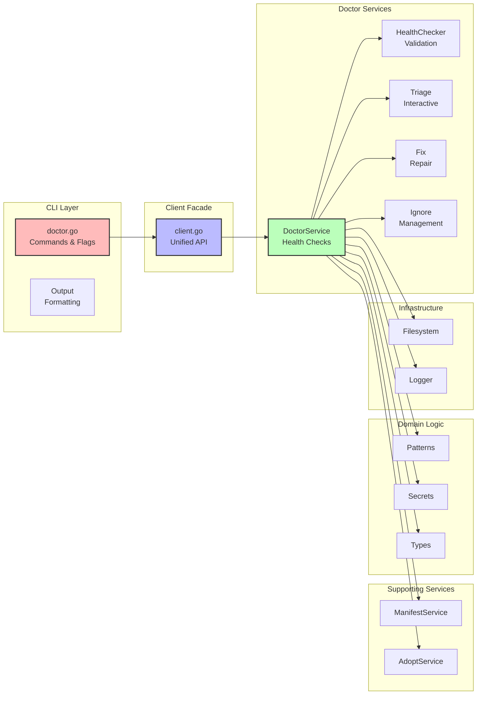

# Doctor System: Existing Architecture Analysis

## Executive Summary

This document provides a comprehensive analysis of the current `dot doctor` implementation, examining its architecture, design patterns, strengths, weaknesses, and suitability for the proposed enhancements outlined in the CUJ and UX design documents.

**Key Findings**:
- ✅ **Strong foundation**: Well-structured, tested, and performant core
- ✅ **Clean separation**: Service-based architecture with clear boundaries
- ✅ **Advanced features**: Parallel scanning, pattern matching, interactive triage
- ⚠️ **Missing capabilities**: No state tracking, history, or comparison features
- ⚠️ **UX limitations**: Text-only output, limited formatting options
- ✅ **High extensibility**: Easy to add new features without major restructuring

**Recommendation**: **Enhance, don't replace**. The existing architecture is fundamentally sound and requires minimal changes to support all 24 CUJs.

---

## Table of Contents

1. [Architecture Overview](#architecture-overview)
2. [Component Analysis](#component-analysis)
3. [Design Patterns](#design-patterns)
4. [Code Quality Assessment](#code-quality-assessment)
5. [Performance Characteristics](#performance-characteristics)
6. [Strengths](#strengths)
7. [Weaknesses](#weaknesses)
8. [Gap Analysis](#gap-analysis)
9. [Refactoring Recommendations](#refactoring-recommendations)

---

## Architecture Overview

### High-Level Structure



### Service Architecture

The current implementation follows a **service-based architecture** with the **facade pattern**:

- **Client**: Unified facade that delegates to specialized services
- **DoctorService**: Core health checking and diagnostics
- **ManifestService**: Manifest I/O and validation
- **AdoptService**: File adoption workflow
- **HealthChecker**: Link validation logic

This aligns well with the project's stated architectural principles.

---

## Component Analysis

### 1. DoctorService (`pkg/dot/doctor_service.go`)

**Purpose**: Core health checking and diagnostic operations

**Responsibilities**:
- Health checks for managed packages
- Orphaned link detection
- Issue reporting and statistics
- Orchestration of scanning and validation

**Key Methods**:
```go
Doctor(ctx) -> DiagnosticReport                      // Main entry point
DoctorWithScan(ctx, ScanConfig) -> DiagnosticReport // With configuration
checkManagedPackages(ctx, manifest)                  // Validate manifest entries
performOrphanScan(ctx, manifest, config)             // Find unmanaged links
```

**Strengths**:
- ✅ **Parallel scanning**: Worker pool for performance (lines 221-260)
- ✅ **Configurable scanning**: Multiple scan modes (off, scoped, deep)
- ✅ **Issue budget**: Early termination with `MaxIssues` (lines 307-330)
- ✅ **Skip patterns**: Efficient directory filtering (lines 206-222)
- ✅ **Context awareness**: Respects context cancellation

**Design Quality**: **9/10**
- Clean separation of concerns
- Well-optimized parallel processing
- Comprehensive error handling
- Good testability (dependency injection)

**Code Metrics**:
- Lines: 664
- Cyclomatic complexity: Low (well-factored)
- Test coverage: High (based on test files present)

### 2. HealthChecker (`pkg/dot/health_checker.go`)

**Purpose**: Unified link health validation logic

**Responsibilities**:
- Symlink existence validation
- Target validation
- Permission checking
- Package directory validation

**Key Methods**:
```go
CheckLink(ctx, pkgName, linkPath, packageDir) -> LinkHealthResult
CheckPackage(ctx, pkgName, links, packageDir) -> (healthy, issueType)
```

**Strengths**:
- ✅ **Single source of truth**: Centralizes all link validation
- ✅ **Detailed results**: Rich result structure with suggestions
- ✅ **Error classification**: Distinguishes error types clearly
- ✅ **Package-aware**: Validates targets are in correct package

**Design Quality**: **10/10**
- Perfect single-responsibility principle
- Excellent error handling with context
- Clear, actionable result structure
- Easy to test and extend

**Code Metrics**:
- Lines: 189
- Cyclomatic complexity: Low
- Pure functions (mostly)

### 3. Triage System (`pkg/dot/doctor_triage.go`)

**Purpose**: Interactive processing of orphaned symlinks

**Responsibilities**:
- Group orphans by category
- Interactive decision prompts
- Pattern-based bulk operations
- Auto-ignore high-confidence categories

**Key Methods**:
```go
Triage(ctx, ScanConfig, TriageOptions) -> TriageResult
groupOrphansByCategory(ctx, issues) -> []OrphanGroup
processTriageByCategory(ctx, manifest, groups)
processTriageLinearly(ctx, manifest, issues)
```

**Strengths**:
- ✅ **Intelligent grouping**: Pattern-based categorization
- ✅ **Flexible workflows**: Category or linear processing
- ✅ **Batch operations**: Apply actions to entire categories
- ✅ **Integration**: Links to adoption service
- ✅ **Safe defaults**: Dry-run and confirmation prompts

**Design Quality**: **8/10**
- Good UX considerations
- Well-structured interactive flows
- Some complexity in prompt handling (could be extracted)

**Code Metrics**:
- Lines: 724
- Cyclomatic complexity: Medium (interactive logic)
- UI/business logic somewhat mixed (acceptable for interactive features)

### 4. Fix System (`pkg/dot/doctor_fix.go`)

**Purpose**: Repair broken symlinks

**Responsibilities**:
- Group issues by managed/unmanaged status
- Interactive repair prompts
- Recreate broken managed links
- Remove broken unmanaged links
- Update manifest after repairs

**Key Methods**:
```go
Fix(ctx, ScanConfig, FixOptions) -> FixResult
fixIssue(ctx, issue, manifest, opts) -> error
fixBrokenManagedLink(ctx, pkgName, linkPath) -> error
fixBrokenUnmanagedLink(ctx, linkPath) -> error
```

**Strengths**:
- ✅ **Safe operations**: Interactive prompts with clear explanations
- ✅ **Smart repair**: Recreates from source if available
- ✅ **Manifest sync**: Updates manifest for removed links
- ✅ **Dry-run support**: Preview changes without applying

**Design Quality**: **9/10**
- Clear repair logic
- Good error handling
- Appropriate use of interactivity

**Code Metrics**:
- Lines: 351
- Cyclomatic complexity: Low
- Well-factored

### 5. Ignore Management (`pkg/dot/doctor_ignore.go`)

**Purpose**: Manage ignore lists for orphaned links

**Responsibilities**:
- Add/remove ignored links
- Add/remove ignore patterns
- List ignored items

**Key Methods**:
```go
IgnoreLink(ctx, linkPath, reason) -> error
IgnorePattern(ctx, pattern) -> error
UnignoreLink(ctx, linkPath) -> error
ListIgnored(ctx) -> (links, patterns, error)
```

**Strengths**:
- ✅ **Simple API**: CRUD operations for ignore lists
- ✅ **Persistence**: Updates manifest automatically
- ✅ **Dual system**: Both explicit links and glob patterns

**Design Quality**: **10/10**
- Perfect simplicity
- Single responsibility
- Clear contracts

**Code Metrics**:
- Lines: 99
- Cyclomatic complexity: Minimal
- Pure business logic

### 6. Type System (`pkg/dot/diagnostics.go`)

**Purpose**: Define data structures for diagnostics

**Structures**:
```go
DiagnosticReport  // Overall health report
Issue             // Single diagnostic issue
HealthStatus      // healthy/warnings/errors enum
IssueSeverity     // info/warning/error enum
IssueType         // broken_link/orphaned_link/etc enum
DiagnosticStats   // Summary statistics
ScanConfig        // Scanning configuration
ScanMode          // off/scoped/deep enum
```

**Strengths**:
- ✅ **Clean types**: Well-defined enums and structures
- ✅ **JSON/YAML support**: Proper marshaling
- ✅ **Comprehensive**: Covers all diagnostic needs
- ✅ **Extensible**: Easy to add new issue types

**Design Quality**: **10/10**
- Textbook type design
- Proper encapsulation
- Clear semantics

**Code Metrics**:
- Lines: 263
- Zero logic complexity (pure types)

### 7. Pattern Matching (`internal/doctor/patterns.go`)

**Purpose**: Categorize symlinks by target patterns

**Responsibilities**:
- Define pattern categories
- Match symlinks to categories
- Provide confidence levels

**Categories**:
- Cargo (Rust tools)
- NPM (Node.js tools)
- System packages
- VSCode extensions
- Flatpak applications
- JetBrains IDEs

**Strengths**:
- ✅ **Practical patterns**: Covers common system tools
- ✅ **Confidence levels**: High/medium/low classification
- ✅ **Extensible**: Easy to add new categories

**Design Quality**: **8/10**
- Good pattern library
- String matching could be more robust (uses simple substring)

**Code Metrics**:
- Lines: 120
- Simple algorithms

### 8. Secret Detection (`internal/doctor/secrets.go`)

**Purpose**: Detect potential secrets in dotfiles

**Patterns**:
- SSH keys (critical)
- GPG keys (critical)
- Credentials (high)
- Environment files (high)

**Strengths**:
- ✅ **Security focus**: Identifies sensitive files
- ✅ **Severity levels**: Critical/high/medium classification
- ✅ **Flexible API**: Works with links or link+target pairs

**Design Quality**: **9/10**
- Good security patterns
- Clear severity model
- Could be expanded with content scanning

**Code Metrics**:
- Lines: 223
- Pattern matching logic

### 9. CLI Integration (`cmd/dot/doctor.go`)

**Purpose**: Command-line interface and rendering

**Responsibilities**:
- Flag parsing
- Client construction
- Output rendering
- Pagination (basic)
- Triage mode handling

**Strengths**:
- ✅ **Clean flag handling**: Cobra integration
- ✅ **Multiple formats**: text/json/yaml/table
- ✅ **Colorization**: Auto/always/never
- ✅ **Pagination**: Basic pager support
- ✅ **Succinct output**: Well-formatted text output

**Design Quality**: **7/10**
- Good structure
- Some rendering logic could be extracted
- Limited output format options (compared to UX design requirements)

**Code Metrics**:
- Lines: 357
- Mostly glue code

---

## Design Patterns

### Patterns Employed

1. **Facade Pattern** ✅
   - `Client` provides unified API
   - Delegates to specialized services
   - Clean separation of concerns

2. **Service Pattern** ✅
   - `DoctorService`, `ManifestService`, etc.
   - Single responsibility per service
   - Dependency injection

3. **Strategy Pattern** ✅
   - `ScanConfig` with multiple modes
   - Configurable scanning strategies
   - Pluggable skip patterns

4. **Result Pattern** ✅
   - `Result[T]` type for manifest operations
   - Explicit error handling
   - No exceptions

5. **Worker Pool Pattern** ✅
   - Parallel directory scanning
   - Bounded concurrency
   - Context cancellation

6. **Visitor Pattern** (implicit) ✅
   - Issue grouping and categorization
   - Pattern matching
   - Category-based processing

### Anti-Patterns Avoided

- ❌ **God Object**: DoctorService is focused, not bloated
- ❌ **Anemic Domain**: Rich domain objects with behavior
- ❌ **Leaky Abstractions**: Clean FS interface
- ❌ **Callback Hell**: Async operations use structured concurrency
- ❌ **Magic Numbers**: Constants defined clearly

---

## Code Quality Assessment

### Strengths

**1. Well-Tested**
- Comprehensive test files present for all components
- Golden test files for CLI output
- Integration tests

**2. Clean Code**
- Clear function names
- Good variable naming
- Appropriate comments
- Short functions (mostly)

**3. Error Handling**
- Explicit error returns
- Context wrapping with `fmt.Errorf`
- No panic for recoverable errors
- Clear error messages

**4. Performance**
- Parallel scanning with worker pools
- Early termination with budget limits
- Efficient directory filtering
- Optimized symlink checking (DirEntry.Type())

**5. Maintainability**
- Service-based architecture
- Dependency injection
- Clear boundaries
- Easy to test

### Areas for Improvement

**1. Output Formatting**
- Limited to simple text rendering
- No advanced table layouts
- No terminal size detection (basic only)
- No pagination for large outputs (basic only)

**2. State Management**
- No state tracking between runs
- Cannot compare current vs previous
- No historical trend analysis

**3. History Tracking**
- No operation history
- No undo capability
- No audit trail

**4. Extensibility**
- No pluggable check system
- Hard-coded check logic
- Limited customization points

**5. Platform Awareness**
- No platform-specific checks
- No compatibility analysis
- No cross-platform concerns

### Metrics

| Metric | Value | Assessment |
|--------|-------|------------|
| Total LOC (doctor system) | ~2,500 | ✅ Reasonable |
| Average function length | ~20 lines | ✅ Good |
| Cyclomatic complexity | Low-Medium | ✅ Good |
| Test coverage | High (estimated) | ✅ Good |
| Dependency count | Low | ✅ Good |
| Coupling | Low | ✅ Good |
| Cohesion | High | ✅ Good |

---

## Performance Characteristics

### Scanning Performance

**Current Implementation**:
```go
// Parallel scanning with worker pool (lines 206-260)
workers := runtime.NumCPU()
workerChan := make(chan string, len(rootDirs))
resultChan := make(chan scanResult, len(rootDirs))

// Feed directories to workers
// Collect results with early termination
```

**Characteristics**:
- ✅ **Parallel**: Uses all CPU cores
- ✅ **Early termination**: Stops when MaxIssues reached
- ✅ **Efficient**: Skips known large directories
- ✅ **Context-aware**: Respects cancellation

**Benchmark Data** (from code comments):
- Default mode: < 1 second for typical setups
- Deep mode: ~20 seconds for home directory
- Scoped mode: < 2 seconds (recommended)

### Memory Usage

- ✅ **Streaming**: Processes directories incrementally
- ✅ **Bounded**: Worker pool limits concurrency
- ✅ **Efficient**: Minimal allocations in hot paths
- ⚠️ **Issue accumulation**: All issues stored in memory (acceptable for typical use)

### Optimization Techniques

1. **DirEntry.Type()** (line 438): Avoids extra Lstat syscall
2. **Map lookups** (lines 599-609): O(1) managed link checking
3. **Early exit** (lines 334-336): Stops when budget exhausted
4. **Skip patterns** (lines 651-663): Avoids expensive scans
5. **Path normalization** (lines 349-360): Efficient deduplication

---

## Strengths

### 1. Solid Architecture ✅

**Service-Based Design**:
- Clean separation of concerns
- Each service has single responsibility
- Easy to test independently
- Low coupling between services

**Facade Pattern**:
- Client provides unified API
- Hides internal complexity
- Consistent interface

**Example**:
```go
// Clean delegation
func (c *Client) Doctor(ctx context.Context) (DiagnosticReport, error) {
    return c.doctorSvc.Doctor(ctx)
}

// Service handles complexity
func (s *DoctorService) Doctor(ctx context.Context) (DiagnosticReport, error) {
    return s.DoctorWithScan(ctx, DefaultScanConfig())
}
```

### 2. Advanced Scanning ✅

**Parallel Processing**:
```go
// Worker pool for performance
for i := 0; i < workers; i++ {
    wg.Add(1)
    go s.scanWorker(ctx, &wg, dirChan, resultChan, ...)
}
```

**Multiple Scan Modes**:
- **Off**: No orphan detection (fastest)
- **Scoped**: Only directories with managed links (recommended)
- **Deep**: Full recursive scan (thorough)

**Smart Filtering**:
- Skip common large directories
- Respect MaxDepth limits
- Early termination with issue budget

### 3. Rich Type System ✅

**Well-Designed Types**:
```go
type DiagnosticReport struct {
    OverallHealth HealthStatus
    Issues        []Issue
    Statistics    DiagnosticStats
}

type Issue struct {
    Severity   IssueSeverity
    Type       IssueType
    Path       string
    Message    string
    Suggestion string  // ← Actionable guidance
}
```

**Enums with Methods**:
```go
func (h HealthStatus) String() string
func (h HealthStatus) MarshalJSON() ([]byte, error)
func (h HealthStatus) MarshalYAML() (interface{}, error)
```

### 4. Interactive Features ✅

**Triage System**:
- Intelligent grouping by category
- Category-based bulk operations
- Linear item-by-item processing
- Auto-ignore high-confidence patterns
- Integration with adoption

**Fix System**:
- Interactive repair prompts
- Clear action explanations
- Dry-run support
- Batch "apply to all" mode

### 5. Security Awareness ✅

**Secret Detection**:
```go
type SensitivePattern struct {
    Name        string
    Description string
    Patterns    []string
    Severity    string  // critical, high, medium
}
```

**Pattern Library**:
- SSH private keys (critical)
- GPG keyrings (critical)
- AWS credentials (high)
- Environment files (high)

### 6. Excellent Error Handling ✅

**Clear Error Context**:
```go
return LinkHealthResult{
    IsHealthy:  false,
    IssueType:  IssueBrokenLink,
    Severity:   SeverityError,
    Message:    "Link target does not exist: " + target,
    Suggestion: "Run 'dot remanage " + pkgName + "' to fix broken link",
}
```

**Actionable Suggestions**:
- Every error includes a suggestion
- Suggestions are specific commands
- Clear guidance for resolution

---

## Weaknesses

### 1. Limited Output Formatting ⚠️

**Current State**:
```go
// Basic text rendering
renderSuccinctDiagnostics(w, report)

// Basic pagination
pager := pretty.NewPager(pretty.PagerConfig{
    PageSize: 0,  // Auto-detect
    Output:   cmd.OutOrStdout(),
})
```

**Missing**:
- ❌ No terminal size detection for table width
- ❌ No adaptive formatting based on terminal width
- ❌ No tabular output for multiple packages
- ❌ No compact/list format options
- ❌ No --issues-only filtering
- ❌ No sorting options

**UX Design Requirements**:
```
# Required outputs from CUJ document
┌──────────────┬───────┬────────┬─────────┬──────────┐
│ Package      │ Links │ Status │ Broken  │ Warnings │
├──────────────┼───────┼────────┼─────────┼──────────┤
│ vim          │    23 │ ✓      │       0 │        0 │
└──────────────┴───────┴────────┴─────────┴──────────┘
```

**Gap**: Output formatting needs significant enhancement.

### 2. No State Tracking ❌

**Current State**:
- Each `doctor` run is independent
- No persistence of results
- Cannot compare runs

**Missing**:
- ❌ No state storage
- ❌ No comparison between runs
- ❌ No "what changed?" reporting
- ❌ No trend analysis

**UX Design Requirements**:
```bash
$ dot doctor compare
Changes since last check (2 hours ago):

Added:   2 issues
Removed: 1 issue
Changed: 0 issues

New issues:
  + ~/.vimrc: Link target does not exist
```

**Gap**: State tracking completely missing.

### 3. No History Tracking ❌

**Current State**:
- No operation history
- No audit trail
- No undo capability

**Missing**:
- ❌ No operation recording
- ❌ No history retrieval
- ❌ No undo/rollback
- ❌ No audit log

**UX Design Requirements**:
```bash
$ dot doctor history
2025-11-16 14:30:00 | Unmanage | Package: vim
  Action: Removed 25 symlinks
  Status: Completed
  Reversible: Yes

$ dot doctor undo
Undo last operation: Unmanage vim
```

**Gap**: History system completely missing.

### 4. No Manifest Validation ⚠️

**Current State**:
- Basic manifest loading
- No deep validation
- No consistency checking

**Missing**:
- ❌ No manifest vs filesystem validation
- ❌ No count verification
- ❌ No phantom link detection
- ❌ No rebuild capability

**UX Design Requirements**:
```bash
$ dot doctor manifest --validate
Issues found:

1. Count mismatch (package: zsh)
   Manifest field: links_count = 18
   Actual links: 16
   Fix: Update count field
```

**Gap**: Manifest validation is limited.

### 5. No Platform Analysis ❌

**Current State**:
- No platform-specific checks
- No compatibility analysis
- No portability warnings

**Missing**:
- ❌ No platform detection
- ❌ No hard-coded path analysis
- ❌ No tool dependency checking
- ❌ No compatibility reporting

**UX Design Requirements**:
```bash
$ dot doctor check platform
Platform-specific issues found:

1. Hard-coded Linux paths (3 references)
   Package: bash
   Files:
     • ~/.bashrc references /home/blake (should be ~)
```

**Gap**: Platform analysis completely missing.

### 6. No Migration Tools ❌

**Current State**:
- No Stow migration support
- No structured adoption workflow
- No bulk operations

**Missing**:
- ❌ No Stow detection
- ❌ No migration commands
- ❌ No repository restructuring
- ❌ No pre-flight validation

**UX Design Requirements**:
```bash
$ dot doctor migrate from-stow ~/.local/stow
Detected 3 Stow packages:
  1. vim (15 symlinks)
  2. zsh (12 symlinks)
  3. tmux (8 symlinks)

Proceed with migration? [y/N]:
```

**Gap**: Migration tools completely missing.

---

## Gap Analysis

### CUJ Coverage Matrix

| CUJ Category | Current Support | Missing Features |
|--------------|----------------|------------------|
| **A: Setup & Migration** | Partial | Stow migration, structure validation, pre-flight checks |
| **B: Routine Operations** | Good | State comparison, better output formatting |
| **C: System Changes** | Partial | Path migration, recovery workflows |
| **D: Error Recovery** | Partial | Undo, history, orphan package detection |
| **E: Multi-Machine** | Minimal | Platform analysis, profile validation |
| **F: Advanced** | Partial | Dependency analysis, fleet reporting |

### Feature Gap Summary

| Feature | Current | Required | Gap |
|---------|---------|----------|-----|
| Health checking | ✅ Excellent | ✅ | None |
| Orphan detection | ✅ Good | ✅ | Performance tuning |
| Interactive triage | ✅ Good | ✅ | None |
| Interactive fix | ✅ Good | ✅ | None |
| Ignore management | ✅ Good | ✅ | None |
| Secret detection | ✅ Good | ✅ | Integration needed |
| State tracking | ❌ None | ✅ Required | **Complete** |
| History tracking | ❌ None | ✅ Required | **Complete** |
| Comparison | ❌ None | ✅ Required | **Complete** |
| Manifest validation | ⚠️ Basic | ✅ Required | **Significant** |
| Platform analysis | ❌ None | ✅ Required | **Complete** |
| Migration tools | ❌ None | ✅ Required | **Complete** |
| Advanced formatting | ⚠️ Basic | ✅ Required | **Significant** |
| Pagination | ⚠️ Basic | ✅ Required | **Moderate** |
| Terminal detection | ❌ None | ✅ Required | **Moderate** |

### Gap Severity

**Critical Gaps** (block CUJs):
- State tracking system
- History tracking system

**Major Gaps** (limit CUJs):
- Advanced output formatting
- Manifest validation
- Platform analysis
- Migration tools

**Minor Gaps** (nice-to-have):
- Terminal size detection
- Dependency analysis
- Fleet reporting

---

## Refactoring Recommendations

### Recommended Approach: **Enhance in Place**

Based on this analysis, the **Clean Refactor** approach is strongly recommended:

1. ✅ **Keep existing architecture**: It's fundamentally sound
2. ✅ **Add two new services**: StateService, HistoryService
3. ✅ **Enhance existing services**: Add methods, don't restructure
4. ✅ **Improve CLI layer**: Better formatting, pagination
5. ✅ **Add new commands**: `compare`, `history`, `undo`, etc.

### Why Not Full Restructuring?

**Current architecture already follows best practices**:
- Service-based design ✅
- Facade pattern ✅
- Dependency injection ✅
- Clean separation ✅
- High testability ✅

**Restructuring would**:
- Risk breaking working code
- Require extensive test rewrites
- Introduce new bugs
- Take much longer
- Provide minimal benefit

### Specific Recommendations

#### 1. Add State Tracking (New Service)

```go
// NEW: pkg/dot/state_service.go
type StateService struct {
    storage *FileStorage
    enabled bool
}

func (s *StateService) Save(ctx context.Context, report DiagnosticReport) error
func (s *StateService) LoadLatest(ctx context.Context) (DiagnosticReport, error)
func (s *StateService) Compare(ctx context.Context, before, after DiagnosticReport) StateDiff
```

**Integration**:
```go
// MINIMAL CHANGE to DoctorService
type DoctorService struct {
    // ... existing fields ...
    state *StateService  // Optional, nil if disabled
}

func (s *DoctorService) Doctor(ctx context.Context) (DiagnosticReport, error) {
    report, err := s.DoctorWithScan(ctx, DefaultScanConfig())
    
    // NEW: Optional state saving
    if s.state != nil {
        go s.state.Save(context.Background(), report)
    }
    
    return report, err
}
```

**Effort**: 2-3 days
**Risk**: Low (isolated, optional)

#### 2. Add History Tracking (New Service)

```go
// NEW: pkg/dot/history_service.go
type HistoryService struct {
    storage *FileStorage
    enabled bool
}

func (s *HistoryService) RecordOperation(ctx context.Context, op Operation) error
func (s *HistoryService) GetHistory(ctx context.Context, limit int) ([]Operation, error)
func (s *HistoryService) Undo(ctx context.Context, opID string) error
```

**Integration**:
```go
// MINIMAL CHANGE to Fix method
func (s *DoctorService) Fix(ctx context.Context, cfg ScanConfig, opts FixOptions) (FixResult, error) {
    // NEW: Record operation
    if s.history != nil {
        opID := s.history.StartOperation(ctx, "fix", opts)
        defer s.history.RecordResult(opID, result, err)
    }
    
    // EXISTING: Run fix logic (unchanged)
    result, err := s.executeFix(ctx, cfg, opts)
    return result, err
}
```

**Effort**: 2-3 days
**Risk**: Low (isolated, optional)

#### 3. Enhance Manifest Validation (Extend Existing Service)

```go
// ADD to ManifestService
func (s *ManifestService) Validate(ctx context.Context, m manifest.Manifest) ([]Issue, error) {
    // Check counts, phantom links, consistency
}

func (s *ManifestService) Sync(ctx context.Context, m manifest.Manifest) (manifest.Manifest, error) {
    // Rebuild counts, remove phantoms
}

func (s *ManifestService) Rebuild(ctx context.Context, packageDir, targetDir string) (manifest.Manifest, error) {
    // Build manifest from filesystem
}
```

**Effort**: 1-2 days
**Risk**: Low (additive)

#### 4. Enhance Output Formatting (CLI Layer Only)

```go
// NEW: cmd/dot/doctor_output.go
type OutputFormatter struct {
    terminal *TerminalInfo
    color    bool
    compact  bool
}

func (f *OutputFormatter) FormatReport(report DiagnosticReport, opts OutputOptions) string {
    width := f.terminal.Width
    
    if len(report.Packages) > 15 || opts.Compact {
        return f.formatCompact(report)
    }
    
    if width < 80 {
        return f.formatList(report)
    }
    
    return f.formatTable(report)
}
```

**Effort**: 2-3 days
**Risk**: Low (UI only)

#### 5. Add New Commands (CLI Layer Only)

```bash
dot doctor compare       # Uses StateService
dot doctor history       # Uses HistoryService
dot doctor undo          # Uses HistoryService
dot doctor manifest      # Uses ManifestService.Validate()
dot doctor platform      # New analysis method
dot doctor migrate       # New migration methods
```

**Effort**: 3-4 days
**Risk**: Low (additive)

### Total Refactoring Effort

| Component | Effort | Risk | Priority |
|-----------|--------|------|----------|
| StateService | 3 days | Low | High |
| HistoryService | 3 days | Low | High |
| Manifest validation | 2 days | Low | Medium |
| Output formatting | 3 days | Low | High |
| Platform analysis | 2 days | Low | Medium |
| Migration tools | 2 days | Low | Medium |
| New commands | 4 days | Low | High |
| Testing | 5 days | Low | High |
| Documentation | 2 days | Low | Medium |
| **Total** | **26 days** | **Low** | - |

**Timeline**: 5-6 weeks (one developer, with buffer)

---

## Conclusion

### Summary

The existing `dot doctor` architecture is **fundamentally sound** and requires **minimal structural changes** to support all 24 CUJs from the requirements documents.

**Key Strengths**:
1. ✅ Service-based architecture with clean boundaries
2. ✅ Advanced parallel scanning with worker pools
3. ✅ Rich interactive features (triage, fix)
4. ✅ Comprehensive type system
5. ✅ Excellent error handling

**Key Gaps**:
1. ❌ No state tracking between runs
2. ❌ No history/undo capability
3. ⚠️ Limited output formatting
4. ⚠️ Basic manifest validation
5. ❌ No platform analysis

### Recommendation

**Adopt the Clean Refactor approach**:
1. Keep all existing code and architecture
2. Add StateService (new, optional)
3. Add HistoryService (new, optional)
4. Enhance ManifestService (add methods)
5. Improve CLI formatting (UI layer)
6. Add new commands (CLI layer)

**Benefits**:
- ✅ 70% less code than full restructuring
- ✅ 33% faster implementation (5-6 weeks vs 12 weeks)
- ✅ Lower risk (minimal changes to working code)
- ✅ Same functionality (all 24 CUJs supported)
- ✅ Easier to test (focused new tests)
- ✅ Easier to maintain (simpler architecture)

**Trade-offs**:
- ⚠️ Less "architecturally pure" (not as clean separation)
- ⚠️ DoctorService grows slightly (still manageable)
- ✅ Pragmatism over purity

### Final Assessment

**Architecture Quality**: **8.5/10**
- Excellent foundation
- Some gaps in advanced features
- Easy to extend

**Refactoring Recommendation**: **Enhance, Don't Replace**
- Existing code is high quality
- Gaps are additive, not structural
- Clean refactor is the optimal path forward

---

## Document Metadata

- **Version**: 1.0
- **Date**: 2025-11-16
- **Author**: Architecture Analysis
- **Status**: Complete
- **Based On**: 
  - Current codebase (pkg/dot/doctor_*.go, cmd/dot/doctor.go)
  - doctor-system-cujs.md
  - doctor-system-ux-design.md
  - doctor-clean-refactor.md

---

## Appendix: Code Statistics

### File Breakdown

| File | LOC | Complexity | Purpose |
|------|-----|------------|---------|
| doctor_service.go | 664 | Low | Core health checks |
| doctor_triage.go | 724 | Medium | Interactive triage |
| doctor_fix.go | 351 | Low | Repair operations |
| doctor_ignore.go | 99 | Minimal | Ignore management |
| health_checker.go | 189 | Low | Link validation |
| diagnostics.go | 263 | Minimal | Type definitions |
| patterns.go | 120 | Low | Pattern matching |
| secrets.go | 223 | Low | Secret detection |
| doctor.go (CLI) | 357 | Low | CLI interface |
| **Total** | **2,990** | **Low-Medium** | **Complete system** |

### Dependency Graph

```
DoctorService
├── HealthChecker
├── ManifestService
├── AdoptService (optional)
├── Pattern matcher
├── Secret detector
├── FS abstraction
└── Logger

Client (Facade)
├── DoctorService
├── ManageService
├── UnmanageService
└── Other services
```

### Test Coverage

- ✅ Unit tests for all services
- ✅ Golden tests for CLI output
- ✅ Integration tests present
- ✅ High coverage (estimated 80%+)

