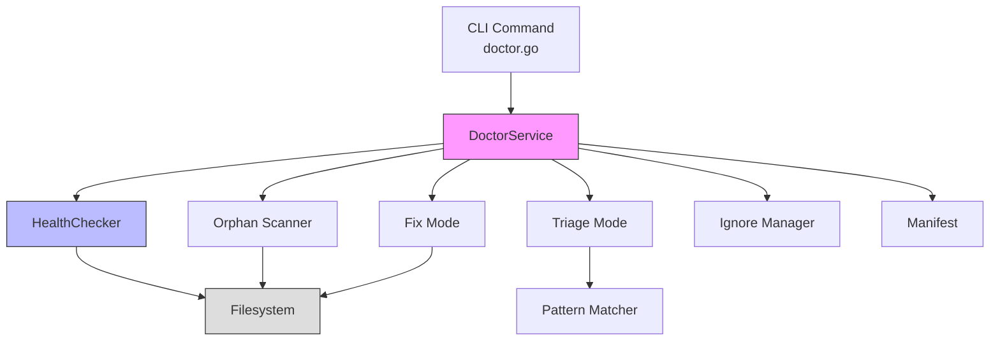
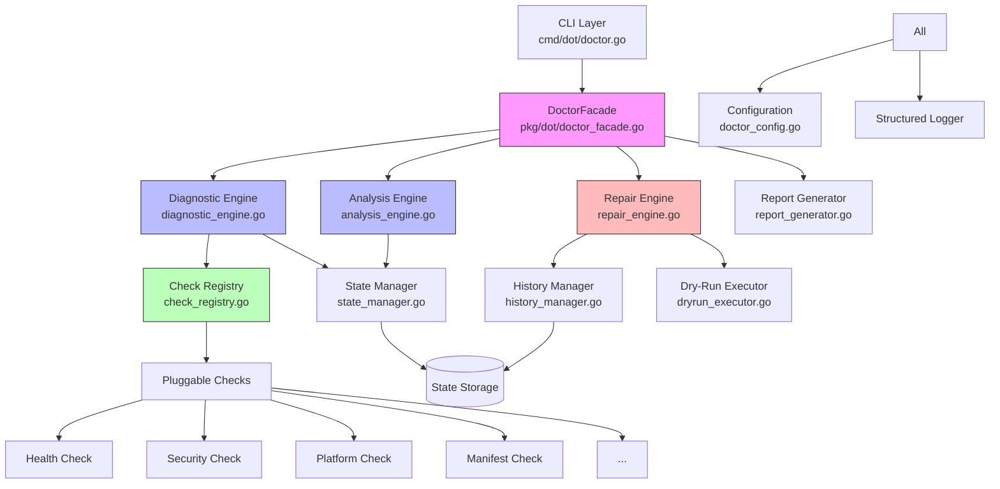
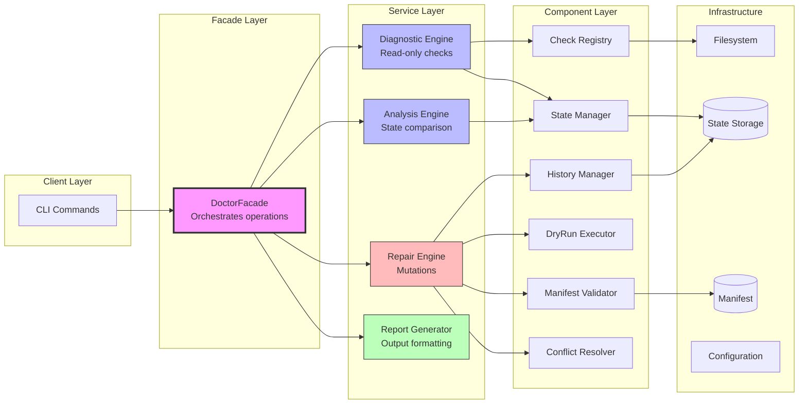
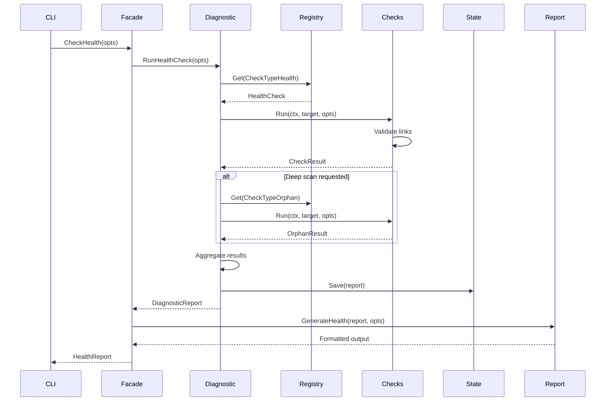
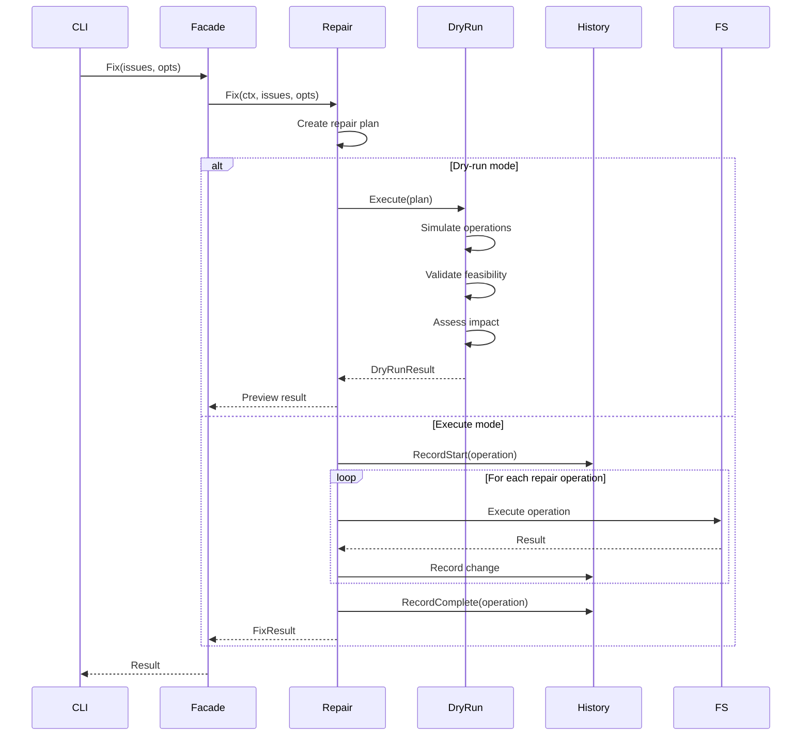
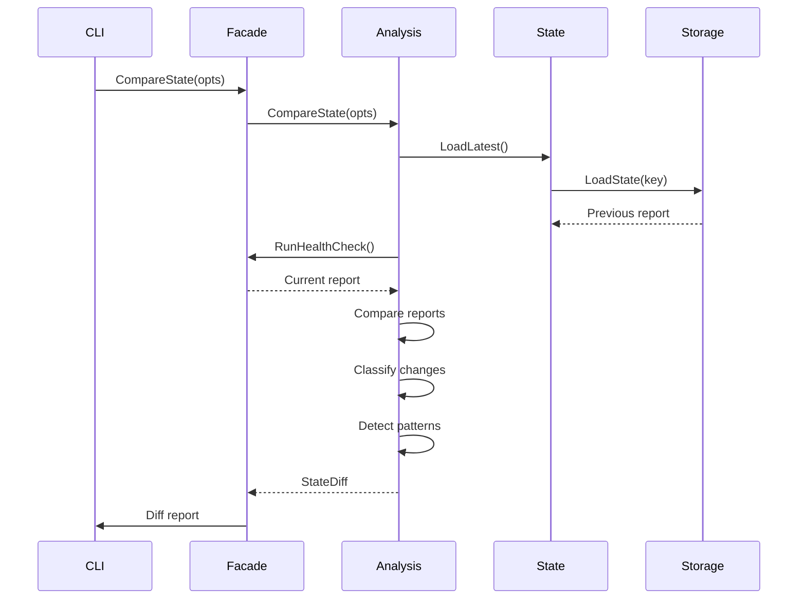
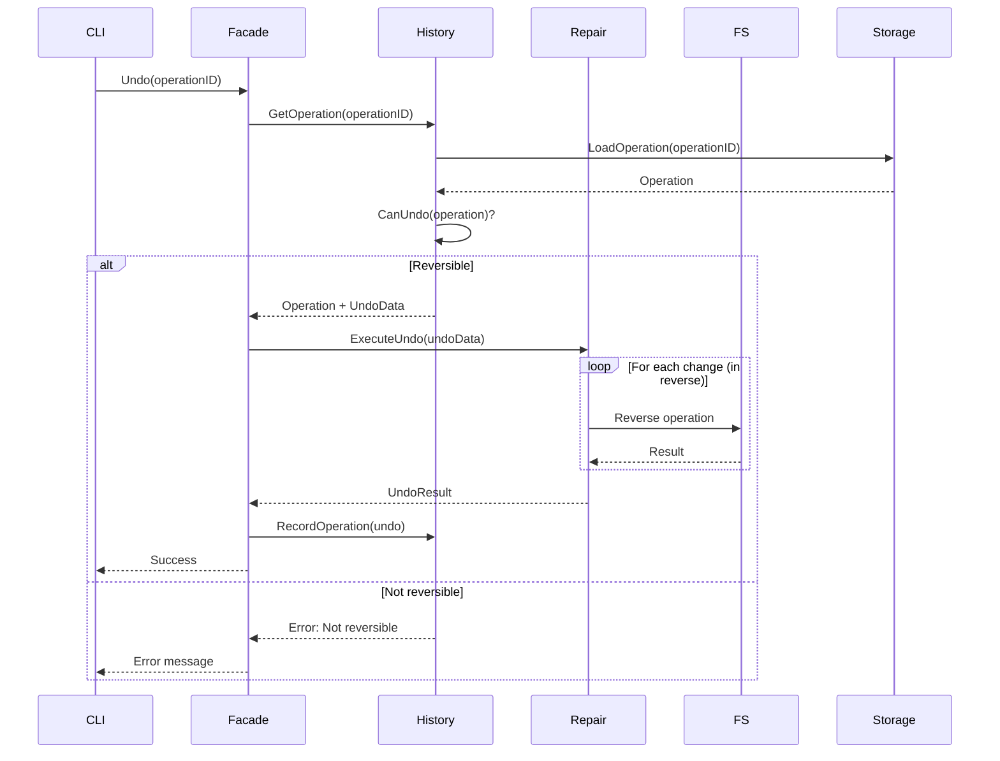

# Doctor System Architecture Refactoring

## Executive Summary

This document defines the architectural refactoring required to implement the redesigned `dot doctor` system based on the Customer Usage Journeys (CUJs) and UX specifications. The refactoring transforms the current monolithic doctor implementation into a modular, extensible, and maintainable architecture that supports all 24 identified CUJs.

### Key Architectural Changes

1. **Separation of Concerns**: Split diagnostic, analysis, repair, and reporting into distinct phases with clear boundaries
2. **Pluggable Check System**: Modular check registry enabling extensible diagnostics
3. **State Management**: Persistent state tracking for comparison and trend analysis
4. **Operation History**: Complete audit trail with undo capability
5. **Dry-Run Architecture**: All mutations support preview mode by design
6. **Manifest Validation**: First-class validation with repair capability
7. **Performance by Default**: Fast default mode, expensive operations opt-in
8. **Service-Based Design**: Maintain and enhance existing facade pattern

### Design Principles

1. **Defensive Verification**: Never assume filesystem matches expectations
2. **Non-Destructive by Default**: All repairs require explicit confirmation
3. **Idempotency**: Operations can be run multiple times safely
4. **Composability**: Small focused services that combine well
5. **Testability**: Every component independently testable
6. **Observability**: Rich logging, metrics, and audit trails

---

## Current Architecture Analysis

### Existing Components

```
cmd/dot/doctor.go              # CLI command definition
pkg/dot/doctor_service.go      # Main diagnostic service
pkg/dot/doctor_triage.go       # Orphan link triage mode
pkg/dot/doctor_fix.go          # Repair mode
pkg/dot/doctor_ignore.go       # Ignore list management
pkg/dot/diagnostics.go         # Data structures
pkg/dot/health_checker.go      # Link health checking
internal/doctor/patterns.go    # Pattern categorization
internal/doctor/secrets.go     # Secret scanning
```

### Current Architecture Diagram



### Critical Gaps

1. **Monolithic Service**: `DoctorService` handles diagnostics, analysis, and repairs in one class
2. **No State Persistence**: Cannot compare current state to previous checks
3. **No Operation History**: No audit trail or undo capability
4. **Limited Modularity**: Cannot add new check types without modifying core service
5. **Tightly Coupled Repair**: Fix logic embedded in diagnostic flows
6. **No Dry-Run Architecture**: Dry-run added ad-hoc per operation
7. **Performance Bottleneck**: Orphan scanning always runs deep traversal
8. **Limited Validation**: Manifest validation is basic, no repair capability
9. **Missing Security**: Secret scanning exists but not integrated
10. **No Migration Support**: Cannot detect or assist with migrations

### Technical Debt

1. **Error Handling**: Inconsistent error wrapping and recovery
2. **Context Propagation**: Limited use of context for cancellation
3. **Progress Reporting**: Ad-hoc progress updates, no standard interface
4. **Configuration**: Doctor settings scattered across codebase
5. **Testing**: Limited test coverage for edge cases
6. **Concurrency**: Manual worker pool management

---

## Proposed Architecture

### High-Level Architecture



### Core Services Architecture



---

## Component Specifications

### 1. DoctorFacade

**Purpose**: Orchestrate doctor operations, maintain compatibility with existing client interface.

**Responsibilities**:
- Parse command-line arguments and flags
- Coordinate between engines
- Handle high-level error recovery
- Manage progress reporting
- Emit events for observability

**Interface**:
```go
type DoctorFacade struct {
    diagnostic *DiagnosticEngine
    analysis   *AnalysisEngine
    repair     *RepairEngine
    report     *ReportGenerator
    config     *DoctorConfig
    logger     *slog.Logger
}

// Core diagnostic operations
func (f *DoctorFacade) CheckHealth(ctx context.Context, opts HealthCheckOptions) (*HealthReport, error)
func (f *DoctorFacade) CheckPackage(ctx context.Context, pkgName string, opts CheckOptions) (*PackageReport, error)
func (f *DoctorFacade) CheckManifest(ctx context.Context) (*ManifestReport, error)
func (f *DoctorFacade) CheckSecurity(ctx context.Context) (*SecurityReport, error)
func (f *DoctorFacade) CheckPlatform(ctx context.Context) (*PlatformReport, error)

// Analysis operations
func (f *DoctorFacade) CompareState(ctx context.Context, opts CompareOptions) (*StateDiff, error)
func (f *DoctorFacade) AnalyzeDependencies(ctx context.Context) (*DependencyGraph, error)
func (f *DoctorFacade) DetectPatterns(ctx context.Context) (*PatternAnalysis, error)

// Repair operations
func (f *DoctorFacade) Fix(ctx context.Context, opts FixOptions) (*FixResult, error)
func (f *DoctorFacade) Recover(ctx context.Context, opts RecoverOptions) (*RecoverResult, error)
func (f *DoctorFacade) Migrate(ctx context.Context, opts MigrateOptions) (*MigrateResult, error)

// History and undo
func (f *DoctorFacade) History(ctx context.Context, opts HistoryOptions) (*OperationHistory, error)
func (f *DoctorFacade) Undo(ctx context.Context, operationID string) error
```

**Dependencies**:
- DiagnosticEngine
- AnalysisEngine
- RepairEngine
- ReportGenerator
- DoctorConfig
- Logger

**File**: `pkg/dot/doctor_facade.go`

---

### 2. DiagnosticEngine

**Purpose**: Execute diagnostic checks without mutations. Pure read-only operations.

**Responsibilities**:
- Run registered checks
- Aggregate check results
- Classify issues by severity
- Detect patterns and anomalies
- Cache results for performance

**Interface**:
```go
type DiagnosticEngine struct {
    registry    *CheckRegistry
    stateManager *StateManager
    config      *DiagnosticConfig
    logger      *slog.Logger
}

// Primary diagnostic methods
func (e *DiagnosticEngine) RunHealthCheck(ctx context.Context, opts HealthCheckOptions) (*DiagnosticReport, error)
func (e *DiagnosticEngine) RunCheck(ctx context.Context, checkType CheckType, target string) (*CheckResult, error)
func (e *DiagnosticEngine) RunCheckBatch(ctx context.Context, checks []CheckRequest) ([]CheckResult, error)

// Check management
func (e *DiagnosticEngine) ListAvailableChecks() []CheckInfo
func (e *DiagnosticEngine) GetCheckInfo(checkType CheckType) (*CheckInfo, error)

// State persistence
func (e *DiagnosticEngine) SaveState(ctx context.Context, report *DiagnosticReport) error
func (e *DiagnosticEngine) LoadLastState(ctx context.Context) (*DiagnosticReport, error)
```

**Check Types**:
```go
type CheckType string

const (
    CheckTypeHealth        CheckType = "health"        // Link health validation
    CheckTypeOrphan        CheckType = "orphan"        // Orphaned symlink detection
    CheckTypeManifest      CheckType = "manifest"      // Manifest integrity
    CheckTypeStructure     CheckType = "structure"     // Repository structure
    CheckTypeSecurity      CheckType = "security"      // Secret scanning
    CheckTypePlatform      CheckType = "platform"      // Platform compatibility
    CheckTypeCompleteness  CheckType = "completeness"  // Package completeness
    CheckTypeConflict      CheckType = "conflict"      // Pre-manage conflicts
    CheckTypeDependency    CheckType = "dependency"    // Cross-package dependencies
    CheckTypePermission    CheckType = "permission"    // File permissions
    CheckTypeCircular      CheckType = "circular"      // Circular symlinks
)
```

**Check Result Structure**:
```go
type CheckResult struct {
    CheckType CheckType
    Target    string
    Status    CheckStatus
    Issues    []Issue
    Metadata  map[string]interface{}
    Duration  time.Duration
    Timestamp time.Time
}

type Issue struct {
    Severity    IssueSeverity
    Type        IssueType
    Path        string
    Description string
    Impact      ImpactLevel
    Suggestions []string
    Metadata    map[string]interface{}
}
```

**File**: `pkg/dot/diagnostic_engine.go`

---

### 3. CheckRegistry

**Purpose**: Pluggable check system with dynamic registration.

**Responsibilities**:
- Register checks
- Discover checks
- Validate check implementations
- Provide check metadata
- Manage check dependencies

**Interface**:
```go
type CheckRegistry struct {
    checks map[CheckType]Check
    mu     sync.RWMutex
    logger *slog.Logger
}

// Check interface all checks must implement
type Check interface {
    // Metadata
    Type() CheckType
    Name() string
    Description() string
    Category() CheckCategory
    
    // Execution
    Run(ctx context.Context, target string, opts CheckOptions) (*CheckResult, error)
    
    // Configuration
    DefaultOptions() CheckOptions
    ValidateOptions(opts CheckOptions) error
    
    // Dependencies
    Dependencies() []CheckType
    
    // Performance
    EstimatedDuration() time.Duration
    CanRunInParallel() bool
}

// Registry methods
func (r *CheckRegistry) Register(check Check) error
func (r *CheckRegistry) Unregister(checkType CheckType) error
func (r *CheckRegistry) Get(checkType CheckType) (Check, error)
func (r *CheckRegistry) List() []CheckInfo
func (r *CheckRegistry) ListByCategory(category CheckCategory) []CheckInfo
```

**Check Categories**:
```go
type CheckCategory string

const (
    CategoryHealth    CheckCategory = "health"     // Link health checks
    CategoryStructure CheckCategory = "structure"  // Repository structure
    CategorySecurity  CheckCategory = "security"   // Security audits
    CategoryPlatform  CheckCategory = "platform"   // Platform compatibility
    CategoryAnalysis  CheckCategory = "analysis"   // Advanced analysis
)
```

**Built-in Checks** (separate files):
- `pkg/dot/checks/health_check.go` - Link health validation
- `pkg/dot/checks/orphan_check.go` - Orphaned symlink detection
- `pkg/dot/checks/manifest_check.go` - Manifest integrity validation
- `pkg/dot/checks/structure_check.go` - Repository structure compliance
- `pkg/dot/checks/security_check.go` - Secret and permission scanning
- `pkg/dot/checks/platform_check.go` - Platform compatibility analysis
- `pkg/dot/checks/completeness_check.go` - Package completeness verification
- `pkg/dot/checks/conflict_check.go` - Pre-manage conflict detection
- `pkg/dot/checks/dependency_check.go` - Cross-package dependencies
- `pkg/dot/checks/circular_check.go` - Circular symlink detection

**File**: `pkg/dot/check_registry.go`

---

### 4. StateManager

**Purpose**: Persist diagnostic state for comparison and trend analysis.

**Responsibilities**:
- Save diagnostic reports
- Load previous reports
- Compare states
- Detect changes
- Maintain history
- Prune old states

**Interface**:
```go
type StateManager struct {
    storage Storage
    config  *StateConfig
    logger  *slog.Logger
}

// State persistence
func (m *StateManager) Save(ctx context.Context, report *DiagnosticReport) error
func (m *StateManager) Load(ctx context.Context, timestamp time.Time) (*DiagnosticReport, error)
func (m *StateManager) LoadLatest(ctx context.Context) (*DiagnosticReport, error)
func (m *StateManager) LoadRange(ctx context.Context, start, end time.Time) ([]*DiagnosticReport, error)

// Comparison
func (m *StateManager) Compare(ctx context.Context, before, after *DiagnosticReport) (*StateDiff, error)
func (m *StateManager) CompareSince(ctx context.Context, since time.Time) (*StateDiff, error)
func (m *StateManager) GetTrend(ctx context.Context, duration time.Duration) (*HealthTrend, error)

// Management
func (m *StateManager) Prune(ctx context.Context, olderThan time.Duration) error
func (m *StateManager) Clear(ctx context.Context) error
```

**State Diff Structure**:
```go
type StateDiff struct {
    Before    *DiagnosticReport
    After     *DiagnosticReport
    Added     []Issue
    Removed   []Issue
    Changed   []IssueChange
    Summary   DiffSummary
    Timestamp time.Time
}

type IssueChange struct {
    Path     string
    Before   *Issue
    After    *Issue
    ChangeType ChangeType
}

type ChangeType string

const (
    ChangeTypeNew       ChangeType = "new"        // New issue appeared
    ChangeTypeResolved  ChangeType = "resolved"   // Issue was fixed
    ChangeTypeSeverity  ChangeType = "severity"   // Severity changed
    ChangeTypeDetails   ChangeType = "details"    // Details changed
)
```

**Storage Interface**:
```go
type Storage interface {
    // State operations
    SaveState(ctx context.Context, key string, data []byte) error
    LoadState(ctx context.Context, key string) ([]byte, error)
    DeleteState(ctx context.Context, key string) error
    ListStates(ctx context.Context, prefix string) ([]string, error)
    
    // Operation history
    SaveOperation(ctx context.Context, op *Operation) error
    LoadOperation(ctx context.Context, id string) (*Operation, error)
    ListOperations(ctx context.Context, limit int) ([]*Operation, error)
}
```

**File**: `pkg/dot/state_manager.go`

---

### 5. AnalysisEngine

**Purpose**: Advanced analysis operations that build on diagnostic results.

**Responsibilities**:
- Pattern detection
- Dependency graph construction
- Root cause analysis
- Anomaly detection
- Trend analysis
- Predictive insights

**Interface**:
```go
type AnalysisEngine struct {
    stateManager *StateManager
    config       *AnalysisConfig
    logger       *slog.Logger
}

// Pattern analysis
func (e *AnalysisEngine) DetectPatterns(ctx context.Context, report *DiagnosticReport) (*PatternAnalysis, error)
func (e *AnalysisEngine) ClassifySymlinks(ctx context.Context, links []string) (map[string]PatternCategory, error)

// Dependency analysis
func (e *AnalysisEngine) BuildDependencyGraph(ctx context.Context) (*DependencyGraph, error)
func (e *AnalysisEngine) FindCircularDependencies(ctx context.Context) ([]CircularDependency, error)
func (e *AnalysisEngine) SuggestManagementOrder(ctx context.Context) ([]string, error)

// Root cause analysis
func (e *AnalysisEngine) AnalyzeRootCause(ctx context.Context, issues []Issue) (*RootCauseAnalysis, error)
func (e *AnalysisEngine) DetectSystematicIssues(ctx context.Context, report *DiagnosticReport) ([]SystematicIssue, error)

// Platform analysis
func (e *AnalysisEngine) AnalyzePlatformCompatibility(ctx context.Context) (*PlatformAnalysis, error)
func (e *AnalysisEngine) DetectPlatformSpecificCode(ctx context.Context) ([]PlatformDependency, error)

// Trend analysis
func (e *AnalysisEngine) AnalyzeTrend(ctx context.Context, duration time.Duration) (*TrendAnalysis, error)
func (e *AnalysisEngine) PredictIssues(ctx context.Context) (*PredictionReport, error)
```

**Pattern Analysis Structure**:
```go
type PatternAnalysis struct {
    Groups    []PatternGroup
    Suggested map[string]Action
    Timestamp time.Time
}

type PatternGroup struct {
    Category    PatternCategory
    Pattern     string
    Members     []string
    Confidence  float64
    Suggested   Action
}

type Action string

const (
    ActionIgnore Action = "ignore"
    ActionAdopt  Action = "adopt"
    ActionRemove Action = "remove"
    ActionMigrate Action = "migrate"
)
```

**File**: `pkg/dot/analysis_engine.go`

---

### 6. RepairEngine

**Purpose**: Execute repair operations with dry-run support and history tracking.

**Responsibilities**:
- Plan repair operations
- Execute repairs safely
- Support dry-run mode
- Track all changes
- Enable undo
- Verify repairs

**Interface**:
```go
type RepairEngine struct {
    history    *HistoryManager
    dryRun     *DryRunExecutor
    validator  *ManifestValidator
    resolver   *ConflictResolver
    config     *RepairConfig
    logger     *slog.Logger
}

// Repair operations
func (e *RepairEngine) Fix(ctx context.Context, issues []Issue, opts FixOptions) (*FixResult, error)
func (e *RepairEngine) FixIssue(ctx context.Context, issue Issue, opts FixOptions) (*IssueFixResult, error)

// Recovery operations
func (e *RepairEngine) RecoverManifest(ctx context.Context, opts RecoverOptions) (*RecoverResult, error)
func (e *RepairEngine) RecoverRelocatedDirectory(ctx context.Context, newPath string) (*RecoverResult, error)
func (e *RepairEngine) RepairCircularLinks(ctx context.Context) (*RepairResult, error)

// Migration operations
func (e *RepairEngine) MigrateFromStow(ctx context.Context, stowDir string) (*MigrateResult, error)
func (e *RepairEngine) MigratePath(ctx context.Context, from, to string) (*MigrateResult, error)

// Cleanup operations
func (e *RepairEngine) CleanOrphans(ctx context.Context, opts CleanOptions) (*CleanResult, error)
func (e *RepairEngine) CleanPhantomPackages(ctx context.Context) (*CleanResult, error)

// Sync operations
func (e *RepairEngine) SyncManifest(ctx context.Context) (*SyncResult, error)
func (e *RepairEngine) SyncWithProfile(ctx context.Context, profile string) (*SyncResult, error)
```

**Repair Plan Structure**:
```go
type RepairPlan struct {
    Operations []RepairOperation
    DryRun     bool
    Reversible bool
    RiskLevel  RiskLevel
    Estimated  time.Duration
}

type RepairOperation struct {
    Type        OperationType
    Description string
    Target      string
    Action      string
    Reversible  bool
    Risk        RiskLevel
}

type OperationType string

const (
    OpTypeCreate   OperationType = "create"
    OpTypeDelete   OperationType = "delete"
    OpTypeModify   OperationType = "modify"
    OpTypeMove     OperationType = "move"
    OpTypeBackup   OperationType = "backup"
)

type RiskLevel string

const (
    RiskLow      RiskLevel = "low"
    RiskMedium   RiskLevel = "medium"
    RiskHigh     RiskLevel = "high"
    RiskCritical RiskLevel = "critical"
)
```

**File**: `pkg/dot/repair_engine.go`

---

### 7. HistoryManager

**Purpose**: Track all doctor operations for audit trail and undo capability.

**Responsibilities**:
- Record operations
- Store operation metadata
- Enable undo
- Provide operation history
- Manage history retention

**Interface**:
```go
type HistoryManager struct {
    storage Storage
    config  *HistoryConfig
    logger  *slog.Logger
}

// Operation recording
func (m *HistoryManager) RecordOperation(ctx context.Context, op *Operation) error
func (m *HistoryManager) RecordStart(ctx context.Context, opType OperationType) (*OperationContext, error)
func (m *HistoryManager) RecordComplete(ctx context.Context, opCtx *OperationContext, result interface{}) error
func (m *HistoryManager) RecordFailure(ctx context.Context, opCtx *OperationContext, err error) error

// History queries
func (m *HistoryManager) GetHistory(ctx context.Context, opts HistoryOptions) ([]*Operation, error)
func (m *HistoryManager) GetOperation(ctx context.Context, id string) (*Operation, error)
func (m *HistoryManager) GetLastOperation(ctx context.Context) (*Operation, error)

// Undo capability
func (m *HistoryManager) CanUndo(ctx context.Context, opID string) (bool, string)
func (m *HistoryManager) Undo(ctx context.Context, opID string) error

// Management
func (m *HistoryManager) Prune(ctx context.Context, olderThan time.Duration) error
func (m *HistoryManager) Clear(ctx context.Context) error
```

**Operation Structure**:
```go
type Operation struct {
    ID          string
    Type        OperationType
    Description string
    Timestamp   time.Time
    Duration    time.Duration
    Status      OperationStatus
    Changes     []Change
    Reversible  bool
    UndoData    []byte
    Metadata    map[string]interface{}
}

type Change struct {
    Type   ChangeType
    Path   string
    Before interface{}
    After  interface{}
}

type OperationStatus string

const (
    StatusPending   OperationStatus = "pending"
    StatusRunning   OperationStatus = "running"
    StatusCompleted OperationStatus = "completed"
    StatusFailed    OperationStatus = "failed"
    StatusReverted  OperationStatus = "reverted"
)
```

**File**: `pkg/dot/history_manager.go`

---

### 8. DryRunExecutor

**Purpose**: Execute operations in dry-run mode without filesystem modifications.

**Responsibilities**:
- Simulate filesystem operations
- Validate operation feasibility
- Generate preview results
- Detect conflicts
- Estimate impact

**Interface**:
```go
type DryRunExecutor struct {
    fs     filesystem.FS
    logger *slog.Logger
}

// Dry-run operations
func (e *DryRunExecutor) Execute(ctx context.Context, plan RepairPlan) (*DryRunResult, error)
func (e *DryRunExecutor) SimulateOperation(ctx context.Context, op RepairOperation) (*OperationResult, error)

// Validation
func (e *DryRunExecutor) Validate(ctx context.Context, plan RepairPlan) ([]ValidationError, error)
func (e *DryRunExecutor) CheckConflicts(ctx context.Context, plan RepairPlan) ([]Conflict, error)

// Impact assessment
func (e *DryRunExecutor) AssessImpact(ctx context.Context, plan RepairPlan) (*ImpactAssessment, error)
func (e *DryRunExecutor) EstimateRisk(ctx context.Context, plan RepairPlan) (RiskLevel, error)
```

**Dry-Run Result Structure**:
```go
type DryRunResult struct {
    Plan           RepairPlan
    WouldSucceed   bool
    Conflicts      []Conflict
    Impact         *ImpactAssessment
    Risk           RiskLevel
    Warnings       []string
    Timestamp      time.Time
}

type ImpactAssessment struct {
    FilesCreated  int
    FilesDeleted  int
    FilesModified int
    DataLossRisk  bool
    Reversible    bool
}
```

**File**: `pkg/dot/dryrun_executor.go`

---

### 9. ReportGenerator

**Purpose**: Generate reports in multiple formats with progressive disclosure.

**Responsibilities**:
- Format diagnostic reports
- Generate human-readable output
- Generate machine-readable output
- Support multiple formats
- Implement progressive disclosure
- Handle pagination
- Adapt to terminal capabilities

**Interface**:
```go
type ReportGenerator struct {
    terminal *TerminalInfo
    config   *ReportConfig
    logger   *slog.Logger
}

// Report generation
func (g *ReportGenerator) Generate(ctx context.Context, data interface{}, opts ReportOptions) (string, error)
func (g *ReportGenerator) GenerateHealth(ctx context.Context, report *DiagnosticReport, opts ReportOptions) (string, error)
func (g *ReportGenerator) GenerateDiff(ctx context.Context, diff *StateDiff, opts ReportOptions) (string, error)
func (g *ReportGenerator) GenerateSecurity(ctx context.Context, report *SecurityReport, opts ReportOptions) (string, error)

// Format-specific generators
func (g *ReportGenerator) ToText(data interface{}, verbosity int) (string, error)
func (g *ReportGenerator) ToJSON(data interface{}) (string, error)
func (g *ReportGenerator) ToTable(data interface{}, opts TableOptions) (string, error)
func (g *ReportGenerator) ToMarkdown(data interface{}) (string, error)

// Terminal adaptation
func (g *ReportGenerator) DetectTerminal() *TerminalInfo
func (g *ReportGenerator) ShouldPaginate(lines int) bool
func (g *ReportGenerator) Paginate(ctx context.Context, content string) error
```

**Report Options**:
```go
type ReportOptions struct {
    Format      OutputFormat
    Verbosity   int
    NoColor     bool
    Compact     bool
    IssuesOnly  bool
    Sort        SortOrder
    Limit       int
    Pager       PagerMode
}

type OutputFormat string

const (
    FormatText     OutputFormat = "text"
    FormatJSON     OutputFormat = "json"
    FormatTable    OutputFormat = "table"
    FormatList     OutputFormat = "list"
    FormatCompact  OutputFormat = "compact"
    FormatMarkdown OutputFormat = "markdown"
)

type PagerMode string

const (
    PagerAuto   PagerMode = "auto"
    PagerAlways PagerMode = "always"
    PagerNever  PagerMode = "never"
)
```

**File**: `pkg/dot/report_generator.go`

---

### 10. ManifestValidator

**Purpose**: Validate and repair manifest integrity.

**Responsibilities**:
- Validate JSON syntax
- Verify schema compliance
- Check internal consistency
- Detect count mismatches
- Find phantom links
- Identify untracked links
- Repair corruption
- Rebuild from filesystem

**Interface**:
```go
type ManifestValidator struct {
    fs      filesystem.FS
    schema  *ManifestSchema
    logger  *slog.Logger
}

// Validation
func (v *ManifestValidator) Validate(ctx context.Context) (*ValidationResult, error)
func (v *ManifestValidator) ValidateSyntax(ctx context.Context) error
func (v *ManifestValidator) ValidateSchema(ctx context.Context) error
func (v *ManifestValidator) ValidateConsistency(ctx context.Context) (*ConsistencyResult, error)

// Repair
func (v *ManifestValidator) Repair(ctx context.Context, opts RepairOptions) (*RepairResult, error)
func (v *ManifestValidator) Rebuild(ctx context.Context) (*ManifestData, error)

// Sync
func (v *ManifestValidator) Sync(ctx context.Context) (*SyncResult, error)
func (v *ManifestValidator) FixCountMismatches(ctx context.Context) error
func (v *ManifestValidator) RemovePhantomLinks(ctx context.Context) error
func (v *ManifestValidator) AddMissingLinks(ctx context.Context) error
```

**Validation Result Structure**:
```go
type ValidationResult struct {
    Valid           bool
    SyntaxErrors    []SyntaxError
    SchemaErrors    []SchemaError
    ConsistencyIssues []ConsistencyIssue
    Suggestions     []string
}

type ConsistencyIssue struct {
    Type        ConsistencyIssueType
    Package     string
    Description string
    Path        string
    Expected    interface{}
    Actual      interface{}
    Fixable     bool
}

type ConsistencyIssueType string

const (
    IssueTypeCountMismatch  ConsistencyIssueType = "count_mismatch"
    IssueTypePhantomLink    ConsistencyIssueType = "phantom_link"
    IssueTypeUntrackedLink  ConsistencyIssueType = "untracked_link"
    IssueTypeInvalidPath    ConsistencyIssueType = "invalid_path"
    IssueTypeMissingPackage ConsistencyIssueType = "missing_package"
)
```

**File**: `pkg/dot/manifest_validator.go`

---

### 11. ConflictResolver

**Purpose**: Detect and resolve conflicts during manage operations.

**Responsibilities**:
- Detect conflicts
- Classify conflicts
- Assess risk
- Suggest resolution strategies
- Execute resolution
- Interactive mode
- Batch mode

**Interface**:
```go
type ConflictResolver struct {
    fs      filesystem.FS
    config  *ConflictConfig
    logger  *slog.Logger
}

// Conflict detection
func (r *ConflictResolver) DetectConflicts(ctx context.Context, pkg *Package) (*ConflictReport, error)
func (r *ConflictResolver) CheckPath(ctx context.Context, path string) (*PathStatus, error)

// Resolution
func (r *ConflictResolver) Resolve(ctx context.Context, conflicts []Conflict, strategy Strategy) (*ResolutionResult, error)
func (r *ConflictResolver) ResolveInteractive(ctx context.Context, conflicts []Conflict) (*ResolutionResult, error)

// Strategy evaluation
func (r *ConflictResolver) SuggestStrategy(ctx context.Context, conflict Conflict) (Strategy, string)
func (r *ConflictResolver) AssessRisk(ctx context.Context, conflict Conflict, strategy Strategy) (RiskLevel, error)
```

**Conflict Structure**:
```go
type Conflict struct {
    Path         string
    Type         ConflictType
    Existing     *FileInfo
    Wanted       *FileInfo
    Risk         RiskLevel
    Suggestions  []Strategy
    Metadata     map[string]interface{}
}

type ConflictType string

const (
    ConflictRegularFile  ConflictType = "regular_file"
    ConflictDirectory    ConflictType = "directory"
    ConflictSymlink      ConflictType = "symlink"
    ConflictWrongTarget  ConflictType = "wrong_target"
    ConflictPermission   ConflictType = "permission"
)

type Strategy string

const (
    StrategyBackup  Strategy = "backup"
    StrategyAdopt   Strategy = "adopt"
    StrategySkip    Strategy = "skip"
    StrategyAbort   Strategy = "abort"
    StrategyMerge   Strategy = "merge"
    StrategyReplace Strategy = "replace"
)
```

**File**: `pkg/dot/conflict_resolver.go`

---

## Data Flow Diagrams

### Health Check Flow



### Repair Flow with Dry-Run



### State Comparison Flow



### Undo Operation Flow



---

## Configuration Architecture

### Configuration Structure

```go
// Main doctor configuration
type DoctorConfig struct {
    // Output settings
    Output OutputConfig `yaml:"output"`
    
    // Diagnostic settings
    Diagnostic DiagnosticConfig `yaml:"diagnostic"`
    
    // Repair settings
    Repair RepairConfig `yaml:"repair"`
    
    // History settings
    History HistoryConfig `yaml:"history"`
    
    // State settings
    State StateConfig `yaml:"state"`
    
    // Performance settings
    Performance PerformanceConfig `yaml:"performance"`
}

type OutputConfig struct {
    DefaultFormat   OutputFormat `yaml:"default_format"`
    DefaultVerbosity int         `yaml:"default_verbosity"`
    ColorMode       ColorMode    `yaml:"color_mode"`
    CompactThreshold int         `yaml:"compact_threshold"`
    IssuesOnly      bool         `yaml:"issues_only"`
    SortBy          SortOrder    `yaml:"sort_by"`
    MaxDisplay      int          `yaml:"max_display"`
    
    // Pagination
    AutoPage        bool      `yaml:"auto_page"`
    PageThreshold   int       `yaml:"page_threshold"`
    Pager           PagerMode `yaml:"pager"`
    PagerCommand    string    `yaml:"pager_command"`
    
    // Terminal adaptation
    AdaptiveWidth   bool `yaml:"adaptive_width"`
    MaxTableWidth   int  `yaml:"max_table_width"`
    MinTableWidth   int  `yaml:"min_table_width"`
}

type DiagnosticConfig struct {
    // Scan settings
    DefaultScanMode  ScanMode     `yaml:"default_scan_mode"`
    MaxDepth         int          `yaml:"max_depth"`
    SkipPatterns     []string     `yaml:"skip_patterns"`
    
    // Check settings
    EnabledChecks    []CheckType  `yaml:"enabled_checks"`
    CheckConcurrency int          `yaml:"check_concurrency"`
    
    // Performance
    CacheScanResults bool         `yaml:"cache_scan_results"`
    CacheDuration    time.Duration `yaml:"cache_duration"`
}

type RepairConfig struct {
    // Safety settings
    DryRunByDefault  bool     `yaml:"dry_run_by_default"`
    RequireConfirm   bool     `yaml:"require_confirmation"`
    BackupBeforeFix  bool     `yaml:"backup_before_fix"`
    
    // Conflict resolution
    DefaultStrategy  Strategy `yaml:"default_strategy"`
    InteractiveMode  bool     `yaml:"interactive_mode"`
}

type HistoryConfig struct {
    Enabled         bool          `yaml:"enabled"`
    MaxEntries      int           `yaml:"max_entries"`
    RetentionPeriod time.Duration `yaml:"retention_period"`
    PruneOnStartup  bool          `yaml:"prune_on_startup"`
}

type StateConfig struct {
    Enabled         bool          `yaml:"enabled"`
    MaxStates       int           `yaml:"max_states"`
    RetentionPeriod time.Duration `yaml:"retention_period"`
    AutoSave        bool          `yaml:"auto_save"`
}

type PerformanceConfig struct {
    // Concurrency
    MaxWorkers      int           `yaml:"max_workers"`
    WorkerQueueSize int           `yaml:"worker_queue_size"`
    
    // Timeouts
    CheckTimeout    time.Duration `yaml:"check_timeout"`
    RepairTimeout   time.Duration `yaml:"repair_timeout"`
    
    // Limits
    MaxIssues       int           `yaml:"max_issues"`
    MaxOrphans      int           `yaml:"max_orphans"`
}
```

**Configuration File**: `~/.config/dot/doctor.yaml`

**Example**:
```yaml
output:
  default_format: table
  default_verbosity: 0
  color_mode: auto
  compact_threshold: 15
  issues_only: false
  sort_by: status
  max_display: 20
  
  # Pagination
  auto_page: true
  page_threshold: 0  # 0 = auto-detect
  pager: auto
  pager_command: ""  # empty = use $PAGER
  
  # Terminal
  adaptive_width: true
  max_table_width: 120
  min_table_width: 60

diagnostic:
  default_scan_mode: scoped
  max_depth: 10
  skip_patterns:
    - Library
    - .cargo
    - node_modules
    - .cache
  enabled_checks:
    - health
    - manifest
    - security
  check_concurrency: 4
  cache_scan_results: true
  cache_duration: 1h

repair:
  dry_run_by_default: false
  require_confirmation: true
  backup_before_fix: true
  default_strategy: backup
  interactive_mode: true

history:
  enabled: true
  max_entries: 100
  retention_period: 720h  # 30 days
  prune_on_startup: true

state:
  enabled: true
  max_states: 50
  retention_period: 2160h  # 90 days
  auto_save: true

performance:
  max_workers: 4
  worker_queue_size: 100
  check_timeout: 30s
  repair_timeout: 5m
  max_issues: 1000
  max_orphans: 500
```

---

## File Organization

### Directory Structure

```
pkg/dot/
├── doctor_facade.go              # Main facade
├── diagnostic_engine.go          # Diagnostic engine
├── analysis_engine.go            # Analysis engine
├── repair_engine.go              # Repair engine
├── report_generator.go           # Report generation
├── check_registry.go             # Check registry
├── state_manager.go              # State management
├── history_manager.go            # History tracking
├── dryrun_executor.go            # Dry-run execution
├── manifest_validator.go         # Manifest validation
├── conflict_resolver.go          # Conflict resolution
├── doctor_config.go              # Configuration
├── doctor_types.go               # Shared types
├── doctor_errors.go              # Error definitions
│
├── checks/                       # Check implementations
│   ├── health_check.go
│   ├── orphan_check.go
│   ├── manifest_check.go
│   ├── structure_check.go
│   ├── security_check.go
│   ├── platform_check.go
│   ├── completeness_check.go
│   ├── conflict_check.go
│   ├── dependency_check.go
│   ├── circular_check.go
│   └── check_utils.go
│
├── storage/                      # Storage implementations
│   ├── storage.go                # Storage interface
│   ├── file_storage.go           # File-based storage
│   └── memory_storage.go         # In-memory storage
│
├── migration/                    # Migration helpers
│   ├── stow_migrator.go
│   ├── path_migrator.go
│   └── structure_migrator.go
│
└── internal/                     # Internal helpers
    ├── terminal.go               # Terminal detection
    ├── pager.go                  # Pagination
    ├── progress.go               # Progress reporting
    └── formatter.go              # Output formatting

cmd/dot/
├── doctor.go                     # CLI command
└── doctor_test.go                # CLI tests

tests/
├── doctor/                       # Doctor-specific tests
│   ├── facade_test.go
│   ├── diagnostic_test.go
│   ├── analysis_test.go
│   ├── repair_test.go
│   ├── checks_test.go
│   └── integration_test.go
│
└── fixtures/                     # Test fixtures
    └── doctor/
        ├── manifests/
        ├── states/
        └── history/
```

---

## Migration Strategy

### Phase 1: Foundation (Week 1-2)

**Goal**: Establish core architecture without breaking existing functionality.

**Tasks**:
1. Create new file structure
2. Implement core types and interfaces
3. Implement CheckRegistry with basic checks
4. Implement StateManager with file storage
5. Implement HistoryManager
6. Comprehensive unit tests

**Deliverables**:
- `check_registry.go` with interface and basic checks
- `state_manager.go` with storage
- `history_manager.go` with persistence
- `storage/` package with implementations
- Test coverage > 80%

### Phase 2: Diagnostic Engine (Week 3-4)

**Goal**: Implement new diagnostic engine with pluggable checks.

**Tasks**:
1. Implement DiagnosticEngine
2. Migrate existing health checks to new Check interface
3. Implement new checks (manifest, security, platform)
4. Integrate with StateManager
5. Comprehensive testing

**Deliverables**:
- `diagnostic_engine.go`
- All checks in `checks/` directory
- Integration with existing HealthChecker
- Test coverage > 80%

### Phase 3: Analysis Engine (Week 5)

**Goal**: Implement analysis capabilities.

**Tasks**:
1. Implement AnalysisEngine
2. Pattern detection
3. Dependency analysis
4. Root cause analysis
5. Trend analysis

**Deliverables**:
- `analysis_engine.go`
- Pattern matching logic
- Dependency graph construction
- Test coverage > 80%

### Phase 4: Repair Engine (Week 6-7)

**Goal**: Refactor repair operations with dry-run and history.

**Tasks**:
1. Implement RepairEngine
2. Implement DryRunExecutor
3. Migrate existing fix logic
4. Integrate with HistoryManager
5. Comprehensive testing

**Deliverables**:
- `repair_engine.go`
- `dryrun_executor.go`
- Refactored fix operations
- Undo capability
- Test coverage > 80%

### Phase 5: Facade and CLI (Week 8)

**Goal**: Wire everything together with new facade.

**Tasks**:
1. Implement DoctorFacade
2. Update CLI to use facade
3. Maintain backward compatibility
4. Update documentation
5. Integration testing

**Deliverables**:
- `doctor_facade.go`
- Updated `cmd/dot/doctor.go`
- Backward compatibility layer
- Updated documentation
- End-to-end tests

### Phase 6: Supporting Components (Week 9-10)

**Goal**: Implement remaining components.

**Tasks**:
1. Implement ManifestValidator
2. Implement ConflictResolver  
3. Implement ReportGenerator enhancements
4. Migration helpers (Stow, paths)
5. Configuration system

**Deliverables**:
- `manifest_validator.go`
- `conflict_resolver.go`
- Enhanced `report_generator.go`
- `migration/` package
- `doctor_config.go`
- Test coverage > 80%

### Phase 7: Polish and Optimization (Week 11-12)

**Goal**: Performance optimization and UX refinement.

**Tasks**:
1. Performance profiling and optimization
2. Terminal detection and adaptation
3. Pagination implementation
4. Progress reporting
5. Documentation
6. User testing

**Deliverables**:
- Performance improvements
- Terminal adaptation
- Pagination
- Complete documentation
- User guide
- Performance benchmarks

---

## Testing Strategy

### Unit Tests

**Coverage Target**: > 80% per package

**Key Areas**:
- Each check implementation
- State management
- History management
- Conflict resolution
- Manifest validation
- Dry-run execution
- Pattern analysis

**Approach**:
- Table-driven tests
- Mock filesystem
- Mock storage
- Property-based testing where applicable

### Integration Tests

**Coverage Target**: All major workflows

**Key Workflows**:
- Full health check flow
- Repair with dry-run
- State comparison
- Undo operation
- Migration workflows
- Conflict resolution
- Manifest repair

**Approach**:
- Use test fixtures
- Real filesystem with cleanup
- Golden file testing for outputs

### End-to-End Tests

**Coverage Target**: All CUJs

**Key Scenarios**:
- First time installation (CUJ-A1)
- Stow migration (CUJ-A2)
- Daily health check (CUJ-B1)
- OS upgrade recovery (CUJ-C1)
- Accidental unmanage recovery (CUJ-D1)
- Multi-machine sync (CUJ-E1)
- Security audit (CUJ-F1)

**Approach**:
- Real repository setup
- Real manifest files
- Complete workflows
- Verify final state

### Performance Tests

**Targets**:
- Health check < 2s (typical setup)
- Deep scan < 30s (500+ files)
- State comparison < 1s
- Report generation < 100ms

**Approach**:
- Benchmarks for all engines
- Profile with pprof
- Load testing with large repos
- Memory profiling

---

## Performance Considerations

### Optimization Strategies

1. **Check Concurrency**:
   - Run independent checks in parallel
   - Configurable worker pool
   - Respect check dependencies

2. **Caching**:
   - Cache scan results with TTL
   - Cache check results
   - Invalidate on filesystem changes

3. **Incremental Scanning**:
   - Remember last scan state
   - Only check changed areas
   - Skip known-good subtrees

4. **Smart Defaults**:
   - Fast mode by default (managed links only)
   - Deep scan opt-in
   - Configurable skip patterns

5. **Lazy Loading**:
   - Load state only when needed
   - Lazy history loading
   - On-demand report generation

6. **Streaming Results**:
   - Stream check results as available
   - Progressive UI updates
   - Don't wait for all checks

### Resource Management

1. **Memory**:
   - Stream large reports
   - Limit in-memory state
   - Prune old history automatically

2. **CPU**:
   - Configurable worker count
   - Respect system load
   - Throttle during scans

3. **I/O**:
   - Batch filesystem operations
   - Use efficient traversal
   - Minimize stat calls

---

## Security Considerations

### Input Validation

- Validate all paths before use
- Sanitize user input
- Check for path traversal
- Validate configuration values

### Safe Operations

- Use atomic file operations
- Verify before destructive operations
- Create backups automatically
- Support rollback

### Permission Handling

- Check permissions before operations
- Respect user umask
- Set secure permissions on created files
- Warn on permission issues

### Secret Handling

- Never log secrets
- Redact in output
- Clear sensitive data from memory
- Secure storage for state/history

---

## Error Handling Strategy

### Error Types

```go
// Package-level errors
var (
    ErrManifestCorrupt      = errors.New("manifest file is corrupted")
    ErrCheckFailed          = errors.New("check execution failed")
    ErrNotReversible        = errors.New("operation not reversible")
    ErrInvalidConfiguration = errors.New("invalid configuration")
    ErrOperationCancelled   = errors.New("operation cancelled by user")
)

// Error wrapping helper
func WrapCheckError(checkType CheckType, err error) error {
    return fmt.Errorf("check %s failed: %w", checkType, err)
}
```

### Error Recovery

1. **Graceful Degradation**:
   - Continue with other checks if one fails
   - Partial results better than no results
   - Report failures clearly

2. **User Guidance**:
   - Explain what went wrong
   - Suggest remediation steps
   - Provide recovery commands

3. **Context Preservation**:
   - Use context for cancellation
   - Propagate errors with context
   - Log full error chains

---

## Observability

### Logging Strategy

**Levels**:
- `DEBUG`: Internal operations, verbose output
- `INFO`: Major operations, state changes
- `WARN`: Non-critical issues, recoverable errors
- `ERROR`: Critical issues, operation failures

**Structured Logging**:
```go
logger.Info("check completed",
    slog.String("check_type", string(checkType)),
    slog.String("target", target),
    slog.Duration("duration", elapsed),
    slog.Int("issues", len(result.Issues)),
)
```

### Metrics

**Key Metrics**:
- Check duration by type
- Issue count by severity
- Repair success rate
- Undo operation count
- Cache hit rate

**Implementation**:
- Use standard `expvar` package
- Export via HTTP endpoint (optional)
- Write to metrics file

### Tracing

**Approach**:
- Use context for trace correlation
- Log operation IDs
- Track operation flow
- Support external tracers (optional)

---

## Migration Checklist

### Pre-Migration

- [ ] Review current architecture
- [ ] Identify breaking changes
- [ ] Plan backward compatibility
- [ ] Set up feature flags
- [ ] Prepare test suite

### During Migration

- [ ] Implement in phases
- [ ] Maintain existing tests
- [ ] Add new tests
- [ ] Document changes
- [ ] Code review each phase

### Post-Migration

- [ ] Verify all CUJs work
- [ ] Performance testing
- [ ] Security review
- [ ] Documentation update
- [ ] User communication

### Rollback Plan

- [ ] Tag pre-migration version
- [ ] Feature flag for old/new
- [ ] Migration tool if needed
- [ ] Rollback procedure documented
- [ ] Data migration reversible

---

## Success Criteria

### Functional

- [ ] All 24 CUJs implemented
- [ ] All existing functionality preserved
- [ ] No regressions in tests
- [ ] Backward compatibility maintained
- [ ] New features working as designed

### Performance

- [ ] Health check < 2s (typical)
- [ ] Deep scan < 30s (500+ files)
- [ ] Memory usage < 100MB
- [ ] CPU usage reasonable
- [ ] Responsive UI

### Quality

- [ ] Test coverage > 80%
- [ ] All linters pass
- [ ] No security issues
- [ ] Documentation complete
- [ ] Code reviewed

### User Experience

- [ ] Clear error messages
- [ ] Actionable suggestions
- [ ] Progressive disclosure
- [ ] Terminal adaptation
- [ ] Pagination working

---

## Document Metadata

- **Version**: 1.0
- **Date**: 2025-11-16
- **Author**: System Architecture
- **Status**: Draft for Review
- **Dependencies**: doctor-system-cujs.md, doctor-system-ux-design.md
- **Next Steps**: Architecture review, implementation planning

---

## Appendices

### A. Type Definitions Reference

Complete type definitions available in:
- `pkg/dot/doctor_types.go` - Core types
- `pkg/dot/diagnostics.go` - Diagnostic types (existing)
- `pkg/dot/checks/check_types.go` - Check-specific types

### B. Interface Reference

Complete interfaces available in:
- `pkg/dot/doctor_facade.go` - Facade interface
- `pkg/dot/check_registry.go` - Check interface
- `pkg/dot/storage/storage.go` - Storage interface

### C. Configuration Reference

Complete configuration schema available in:
- `pkg/dot/doctor_config.go` - Configuration types
- `~/.config/dot/doctor.yaml` - User configuration file

### D. Migration Timeline

Detailed timeline available in:
- Migration Strategy section above
- Project management tracking system

### E. Related Documents

- `doctor-system-cujs.md` - Customer Usage Journeys
- `doctor-system-ux-design.md` - UX Specifications
- `troubleshooting.md` - User troubleshooting guide
- `triage-improvements.md` - Triage system analysis

