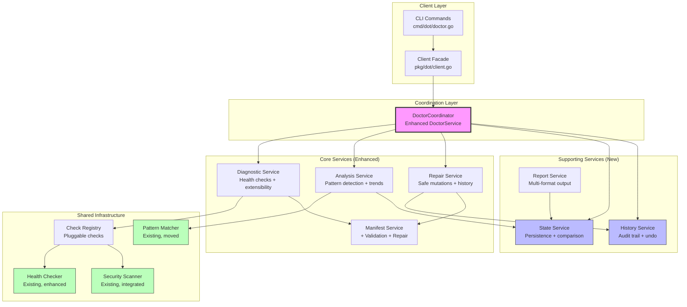
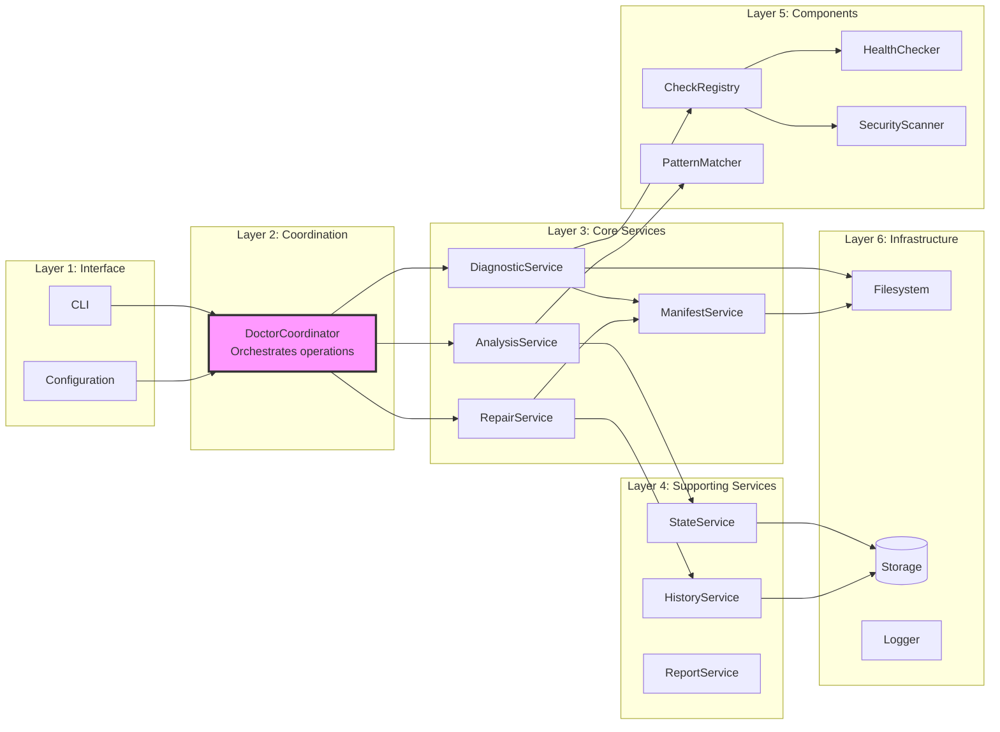
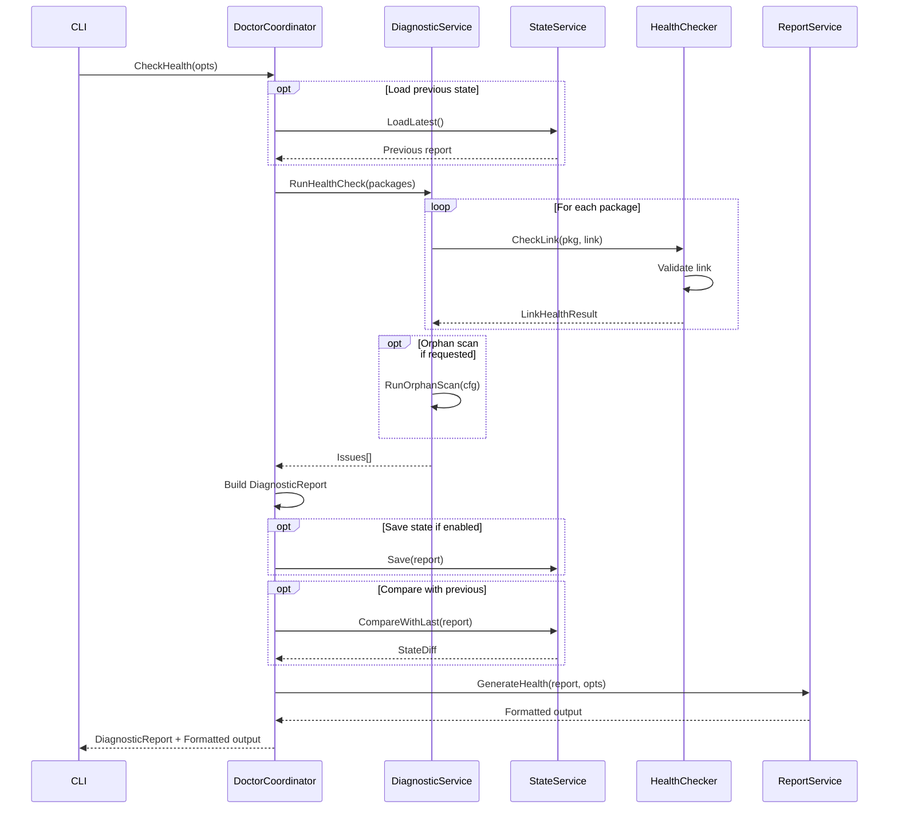
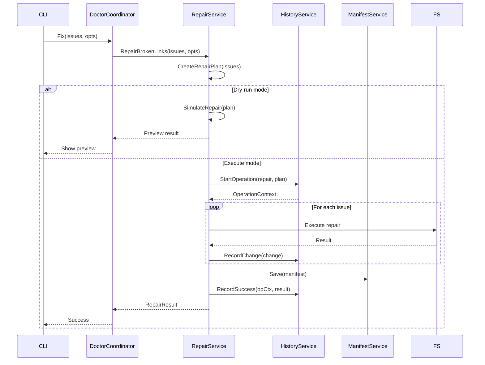
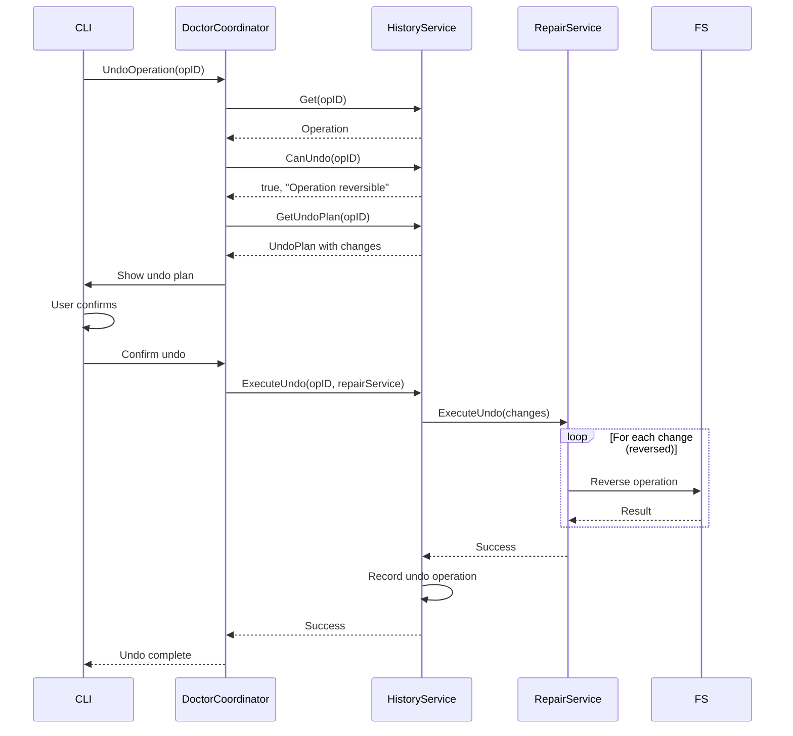
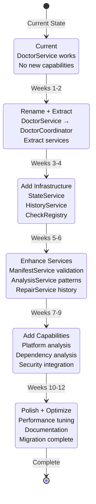

# Doctor System: Unified Architecture

## Executive Summary

This document proposes a complete architectural refactoring that merges the current working implementation with the new capabilities required by the 24 identified Customer Usage Journeys. Rather than replacing existing code, this architecture **enhances and extends** what works while **adding missing capabilities** systematically.

### Design Philosophy

**"Enhance, don't replace. Integrate, don't duplicate."**

This architecture:
- ✅ Keeps battle-tested code (HealthChecker, pattern matching, services)
- ✅ Extends existing types (no parallel hierarchies)
- ✅ Adds missing capabilities (state, history, extensibility)
- ✅ Maintains backward compatibility
- ✅ Solves all 24 CUJ requirements
- ✅ Preserves service-based architecture
- ✅ Improves performance for routine operations

### Core Principles

1. **Defensive Verification**: Never trust filesystem state
2. **Non-Destructive by Default**: Explicit confirmation for mutations
3. **State Awareness**: Track changes over time
4. **Audit Trail**: Complete operation history with undo
5. **Progressive Enhancement**: Features built incrementally
6. **Performance First**: Fast defaults, expensive operations opt-in
7. **Clear Boundaries**: Well-defined service responsibilities

### Key Capabilities Delivered

| Capability | Current | Unified | CUJs Enabled |
|------------|---------|---------|--------------|
| Health checking | ✓ Basic | ✓ Enhanced | All |
| State tracking | ✗ None | ✓ Complete | B2, C1-C4, D1-D4 |
| History/Undo | ✗ None | ✓ Complete | D1-D4 |
| Pre-flight checks | ✗ None | ✓ Complete | A1, A3, B3 |
| Conflict resolution | ⚠ Basic | ✓ Systematic | A1, B3, C3 |
| Manifest validation | ⚠ Basic | ✓ Complete | D3, C4 |
| Migration support | ✗ None | ✓ Complete | A2 |
| Security scanning | ⚠ Exists | ✓ Integrated | F1 |
| Platform analysis | ✗ None | ✓ Complete | E1 |
| Dependency analysis | ✗ None | ✓ Complete | F3 |
| Performance | ✓ Good | ✓ Excellent | B1, F4 |

---

## Architectural Overview

### High-Level Structure



### Layered Architecture



---

## Core Components

### 1. DoctorCoordinator (Enhanced DoctorService)

**Purpose**: Orchestrate doctor operations with enhanced capabilities.

**Evolution from Current**:
- Current `DoctorService` becomes `DoctorCoordinator`
- Keeps existing methods for backward compatibility
- Adds new capabilities incrementally
- Delegates to specialized services

**Location**: `pkg/dot/doctor_coordinator.go`

**Interface**:
```go
// DoctorCoordinator coordinates diagnostic, analysis, and repair operations.
// Evolved from DoctorService with enhanced capabilities.
type DoctorCoordinator struct {
    // Existing dependencies (kept)
    fs            FS
    logger        Logger
    manifestSvc   *ManifestService
    packageDir    string
    targetDir     string
    healthChecker *HealthChecker
    adoptSvc      *AdoptService
    
    // New dependencies (added)
    diagnostic    *DiagnosticService
    analysis      *AnalysisService
    repair        *RepairService
    state         *StateService
    history       *HistoryService
    report        *ReportService
    config        *DoctorConfig
}

// Existing methods (keep for backward compatibility)
func (c *DoctorCoordinator) Doctor(ctx context.Context) (DiagnosticReport, error)
func (c *DoctorCoordinator) DoctorWithScan(ctx context.Context, cfg ScanConfig) (DiagnosticReport, error)
func (c *DoctorCoordinator) Triage(ctx context.Context, cfg ScanConfig, opts TriageOptions) (TriageResult, error)
func (c *DoctorCoordinator) Fix(ctx context.Context, cfg ScanConfig, opts FixOptions) (FixResult, error)

// Enhanced methods (new)
func (c *DoctorCoordinator) CheckHealth(ctx context.Context, opts HealthCheckOptions) (DiagnosticReport, error)
func (c *DoctorCoordinator) CheckPackages(ctx context.Context, packages []string) (PackageHealthReport, error)
func (c *DoctorCoordinator) CompareState(ctx context.Context, opts CompareOptions) (StateDiff, error)
func (c *DoctorCoordinator) GetHistory(ctx context.Context, opts HistoryOptions) (OperationHistory, error)
func (c *DoctorCoordinator) UndoOperation(ctx context.Context, operationID string) error

// New capabilities
func (c *DoctorCoordinator) ValidateManifest(ctx context.Context) (ManifestValidation, error)
func (c *DoctorCoordinator) AnalyzePlatform(ctx context.Context) (PlatformReport, error)
func (c *DoctorCoordinator) AnalyzeDependencies(ctx context.Context) (DependencyGraph, error)
func (c *DoctorCoordinator) ScanSecurity(ctx context.Context) (SecurityReport, error)
func (c *DoctorCoordinator) MigrateFromStow(ctx context.Context, stowDir string) (MigrationResult, error)
```

**Migration Strategy**:
1. Rename `DoctorService` → `DoctorCoordinator`
2. Extract logic into new services
3. Coordinator delegates to services
4. Keep existing method signatures
5. Add new methods incrementally

**Backward Compatibility**:
```go
// Alias for existing code
type DoctorService = DoctorCoordinator

// Existing factory still works
func newDoctorService(...) *DoctorService {
    return newDoctorCoordinator(...)
}
```

---

### 2. DiagnosticService (Enhanced with Registry)

**Purpose**: Execute health checks with pluggable architecture.

**Evolution from Current**:
- Extract diagnostic logic from `DoctorService`
- Integrate `CheckRegistry` for extensibility
- Keep `HealthChecker` as primary check
- Add new checks incrementally

**Location**: `pkg/dot/diagnostic_service.go`

**Interface**:
```go
type DiagnosticService struct {
    registry      *CheckRegistry
    healthChecker *HealthChecker  // Existing, wrapped in Check interface
    manifestSvc   *ManifestService
    state         *StateService
    config        *DiagnosticConfig
    logger        Logger
}

// Primary operations
func (s *DiagnosticService) RunHealthCheck(ctx context.Context, packages []string) ([]Issue, error)
func (s *DiagnosticService) RunCheck(ctx context.Context, checkType CheckType, target string) ([]Issue, error)
func (s *DiagnosticService) RunOrphanScan(ctx context.Context, cfg ScanConfig) ([]Issue, error)

// Check management
func (s *DiagnosticService) ListChecks() []CheckInfo
func (s *DiagnosticService) RegisterCheck(check Check) error

// Performance
func (s *DiagnosticService) RunFast(ctx context.Context) (DiagnosticReport, error)
func (s *DiagnosticService) RunDeep(ctx context.Context) (DiagnosticReport, error)
```

**Check Registry Integration**:
```go
type CheckRegistry struct {
    checks map[CheckType]Check
    mu     sync.RWMutex
}

type Check interface {
    Type() CheckType
    Name() string
    Run(ctx context.Context, target string, opts CheckOptions) ([]Issue, error)
}

// Built-in checks
const (
    CheckTypeHealth      CheckType = "health"       // Wraps HealthChecker
    CheckTypeManifest    CheckType = "manifest"     // Manifest validation
    CheckTypeSecurity    CheckType = "security"     // Wraps security scanner
    CheckTypePlatform    CheckType = "platform"     // New
    CheckTypeStructure   CheckType = "structure"    // New
    CheckTypeCompleteness CheckType = "completeness" // New
)
```

**HealthChecker Integration**:
```go
// Wrap existing HealthChecker in Check interface
type HealthCheck struct {
    checker *HealthChecker  // Existing implementation
}

func (c *HealthCheck) Type() CheckType { return CheckTypeHealth }

func (c *HealthCheck) Run(ctx context.Context, target string, opts CheckOptions) ([]Issue, error) {
    // Delegate to existing HealthChecker
    result := c.checker.CheckLink(ctx, opts.Package, target, opts.PackageDir)
    
    // Convert LinkHealthResult to Issue
    if !result.IsHealthy {
        return []Issue{{
            Severity:   result.Severity,
            Type:       result.IssueType,
            Path:       target,
            Message:    result.Message,
            Suggestion: result.Suggestion,
        }}, nil
    }
    return nil, nil
}
```

**Key Insight**: HealthChecker stays exactly as is, just wrapped in Check interface. Zero duplication.

---

### 3. AnalysisService (Pattern Detection + Trends)

**Purpose**: Analyze patterns, dependencies, and trends.

**Evolution from Current**:
- Extract pattern logic from triage
- Move `internal/doctor/patterns.go` → `pkg/dot/analysis/patterns.go`
- Add dependency analysis
- Add trend analysis via StateService

**Location**: `pkg/dot/analysis_service.go`

**Interface**:
```go
type AnalysisService struct {
    patternMatcher *PatternMatcher  // Existing, moved from internal/doctor
    state          *StateService
    manifestSvc    *ManifestService
    logger         Logger
}

// Pattern analysis (uses existing pattern matcher)
func (s *AnalysisService) CategorizeLinks(ctx context.Context, links []string) (map[string]PatternCategory, error)
func (s *AnalysisService) GroupByPattern(ctx context.Context, links []string) ([]PatternGroup, error)
func (s *AnalysisService) SuggestActions(ctx context.Context, group PatternGroup) (Action, string)

// Dependency analysis (new)
func (s *AnalysisService) AnalyzeDependencies(ctx context.Context) (DependencyGraph, error)
func (s *AnalysisService) DetectCircularDeps(ctx context.Context) ([]CircularDependency, error)
func (s *AnalysisService) SuggestManageOrder(ctx context.Context) ([]string, error)

// Trend analysis (new)
func (s *AnalysisService) CompareTrend(ctx context.Context, duration time.Duration) (TrendReport, error)
func (s *AnalysisService) DetectAnomalies(ctx context.Context, current DiagnosticReport) ([]Anomaly, error)

// Platform analysis (new)
func (s *AnalysisService) AnalyzePlatform(ctx context.Context) (PlatformReport, error)
func (s *AnalysisService) DetectPlatformIssues(ctx context.Context) ([]PlatformIssue, error)
```

**Pattern Matcher Integration**:
```go
// Move existing patterns.go from internal/doctor to pkg/dot/analysis
// No changes to logic, just package location

// pkg/dot/analysis/patterns.go
type PatternMatcher struct {
    categories []PatternCategory  // Existing definitions
}

// Existing methods work as-is
func (m *PatternMatcher) CategorizeSymlink(linkPath, target string) (*PatternCategory, float64)
func (m *PatternMatcher) SuggestIgnorePattern(category *PatternCategory, links []string) string
```

**Key Insight**: Pattern matching code moves but doesn't change. Triage uses AnalysisService for grouping.

---

### 4. RepairService (Safe Mutations with History)

**Purpose**: Execute repairs with dry-run, history, and undo.

**Evolution from Current**:
- Extract repair logic from Fix
- Add comprehensive dry-run
- Integrate history tracking
- Coordinate with ManageService/AdoptService

**Location**: `pkg/dot/repair_service.go`

**Interface**:
```go
type RepairService struct {
    history     *HistoryService
    manifestSvc *ManifestService
    adoptSvc    *AdoptService
    fs          FS
    logger      Logger
}

// Repair operations
func (s *RepairService) RepairBrokenLinks(ctx context.Context, issues []Issue, opts RepairOptions) (RepairResult, error)
func (s *RepairService) RepairManagedLink(ctx context.Context, issue Issue) error
func (s *RepairService) RepairUnmanagedLink(ctx context.Context, issue Issue, action Action) error

// Dry-run support
func (s *RepairService) PreviewRepair(ctx context.Context, issues []Issue) (RepairPlan, error)
func (s *RepairService) ValidateRepair(ctx context.Context, plan RepairPlan) ([]ValidationError, error)
func (s *RepairService) EstimateImpact(ctx context.Context, plan RepairPlan) (ImpactAssessment, error)

// Recovery operations
func (s *RepairService) RecoverManifest(ctx context.Context, opts RecoverOptions) (RecoverResult, error)
func (s *RepairService) RecoverRelocatedDir(ctx context.Context, newPath string) (RecoverResult, error)

// Migration operations
func (s *RepairService) MigrateFromStow(ctx context.Context, stowDir string) (MigrationResult, error)
func (s *RepairService) MigratePaths(ctx context.Context, from, to string) (MigrationResult, error)
```

**Dry-Run Architecture**:
```go
// Dry-run is a mode, not a separate executor
type RepairOptions struct {
    DryRun      bool
    Interactive bool
    AutoConfirm bool
    OnConflict  ConflictStrategy
}

func (s *RepairService) RepairBrokenLinks(ctx context.Context, issues []Issue, opts RepairOptions) (RepairResult, error) {
    // Create plan
    plan := s.createPlan(issues, opts)
    
    if opts.DryRun {
        // Simulate operations
        return s.simulateRepair(ctx, plan)
    }
    
    // Record operation start
    opCtx := s.history.StartOperation(ctx, OperationTypeRepair, plan)
    defer func() {
        if err != nil {
            s.history.RecordFailure(opCtx, err)
        } else {
            s.history.RecordSuccess(opCtx, result)
        }
    }()
    
    // Execute repairs
    result, err := s.executeRepair(ctx, plan)
    return result, err
}
```

**Key Insight**: RepairService coordinates but delegates actual operations to ManageService, AdoptService. It adds the dry-run and history wrapper.

---

### 5. StateService (Persistence + Comparison)

**Purpose**: Track diagnostic state over time for comparison and trends.

**Status**: Entirely new capability.

**Location**: `pkg/dot/state_service.go`

**Interface**:
```go
type StateService struct {
    storage Storage
    config  *StateConfig
    logger  Logger
}

// State persistence
func (s *StateService) Save(ctx context.Context, report DiagnosticReport) error
func (s *StateService) Load(ctx context.Context, timestamp time.Time) (DiagnosticReport, error)
func (s *StateService) LoadLatest(ctx context.Context) (DiagnosticReport, error)
func (s *StateService) LoadSince(ctx context.Context, since time.Duration) ([]DiagnosticReport, error)

// Comparison
func (s *StateService) Compare(ctx context.Context, before, after DiagnosticReport) (StateDiff, error)
func (s *StateService) CompareWithLast(ctx context.Context, current DiagnosticReport) (StateDiff, error)
func (s *StateService) GetTrend(ctx context.Context, duration time.Duration) (TrendData, error)

// Management
func (s *StateService) Prune(ctx context.Context, olderThan time.Duration) error
func (s *StateService) List(ctx context.Context) ([]StateInfo, error)
```

**Storage Abstraction**:
```go
type Storage interface {
    Save(ctx context.Context, key string, data []byte) error
    Load(ctx context.Context, key string) ([]byte, error)
    Delete(ctx context.Context, key string) error
    List(ctx context.Context, prefix string) ([]string, error)
}

// File-based storage implementation
type FileStorage struct {
    baseDir string  // ~/.local/share/dot/state/
}
```

**State Diff Structure** (extends existing types):
```go
// StateDiff uses existing Issue type
type StateDiff struct {
    Before      DiagnosticReport  // Existing type
    After       DiagnosticReport  // Existing type
    Added       []Issue           // Existing type
    Removed     []Issue           // Existing type
    Changed     []IssueChange     // New
    Summary     DiffSummary       // New
    Timestamp   time.Time
}

type IssueChange struct {
    Path       string
    Before     Issue  // Existing type
    After      Issue  // Existing type
    ChangeType ChangeType
}
```

**Key Insight**: StateService uses existing `DiagnosticReport` and `Issue` types. No new type hierarchy needed.

---

### 6. HistoryService (Audit Trail + Undo)

**Purpose**: Track all doctor operations with undo capability.

**Status**: Entirely new capability.

**Location**: `pkg/dot/history_service.go`

**Interface**:
```go
type HistoryService struct {
    storage Storage
    config  *HistoryConfig
    logger  Logger
}

// Operation tracking
func (s *HistoryService) StartOperation(ctx context.Context, opType OperationType, plan interface{}) *OperationContext
func (s *HistoryService) RecordSuccess(opCtx *OperationContext, result interface{}) error
func (s *HistoryService) RecordFailure(opCtx *OperationContext, err error) error

// History queries
func (s *HistoryService) List(ctx context.Context, opts HistoryOptions) ([]Operation, error)
func (s *HistoryService) Get(ctx context.Context, opID string) (Operation, error)
func (s *HistoryService) GetLast(ctx context.Context) (Operation, error)

// Undo capability
func (s *HistoryService) CanUndo(ctx context.Context, opID string) (bool, string)
func (s *HistoryService) GetUndoPlan(ctx context.Context, opID string) (UndoPlan, error)
func (s *HistoryService) ExecuteUndo(ctx context.Context, opID string, executor UndoExecutor) error

// Management
func (s *HistoryService) Prune(ctx context.Context, olderThan time.Duration) error
```

**Operation Structure**:
```go
type Operation struct {
    ID          string
    Type        OperationType
    Timestamp   time.Time
    Duration    time.Duration
    Status      OperationStatus
    Description string
    Changes     []Change
    UndoData    []byte
    Reversible  bool
}

type OperationType string

const (
    OperationTypeHealthCheck  OperationType = "health_check"
    OperationTypeRepair       OperationType = "repair"
    OperationTypeTriage       OperationType = "triage"
    OperationTypeMigration    OperationType = "migration"
    OperationTypeManifestFix  OperationType = "manifest_fix"
)

type Change struct {
    Type   ChangeType
    Path   string
    Before interface{}
    After  interface{}
}
```

**Undo Architecture**:
```go
type UndoExecutor interface {
    ExecuteUndo(ctx context.Context, changes []Change) error
}

// RepairService implements UndoExecutor
func (s *RepairService) ExecuteUndo(ctx context.Context, changes []Change) error {
    // Reverse changes in reverse order
    for i := len(changes) - 1; i >= 0; i-- {
        change := changes[i]
        switch change.Type {
        case ChangeTypeCreateLink:
            // Remove link
            s.fs.Remove(change.Path)
        case ChangeTypeDeleteLink:
            // Recreate link
            s.fs.Symlink(change.Before.(string), change.Path)
        case ChangeTypeModifyManifest:
            // Restore manifest
            s.manifestSvc.Save(ctx, change.Before)
        }
    }
    return nil
}
```

**Key Insight**: HistoryService stores operations, but undo execution happens in domain services (RepairService, ManifestService). Clean separation.

---

### 7. Enhanced ManifestService

**Purpose**: Extend existing ManifestService with validation and repair.

**Evolution from Current**:
- Keep existing Load/Save methods
- Add validation methods
- Add repair methods
- Add consistency checking

**Location**: `pkg/dot/manifest_service.go` (enhance existing)

**New Methods**:
```go
// Existing methods (keep)
func (s *ManifestService) Load(ctx context.Context, targetPath string) Result[manifest.Manifest]
func (s *ManifestService) Save(ctx context.Context, targetPath string, m manifest.Manifest) error

// New validation methods (add)
func (s *ManifestService) Validate(ctx context.Context, m manifest.Manifest) (ValidationResult, error)
func (s *ManifestService) ValidateSyntax(ctx context.Context, path string) error
func (s *ManifestService) ValidateConsistency(ctx context.Context, m manifest.Manifest) ([]ConsistencyIssue, error)

// New repair methods (add)
func (s *ManifestService) Repair(ctx context.Context, m manifest.Manifest, issues []ConsistencyIssue) (manifest.Manifest, error)
func (s *ManifestService) Rebuild(ctx context.Context) (manifest.Manifest, error)
func (s *ManifestService) Sync(ctx context.Context, m manifest.Manifest) (manifest.Manifest, error)

// New consistency methods (add)
func (s *ManifestService) CheckCounts(ctx context.Context, m manifest.Manifest) ([]CountMismatch, error)
func (s *ManifestService) FindPhantomLinks(ctx context.Context, m manifest.Manifest) ([]string, error)
func (s *ManifestService) FindMissingLinks(ctx context.Context, m manifest.Manifest) ([]string, error)
```

**Validation Types** (extend existing types):
```go
// Add to existing diagnostics.go
const (
    // Existing issue types
    IssueBrokenLink IssueType = iota
    IssueOrphanedLink
    IssueWrongTarget
    IssuePermission
    IssueCircular
    IssueManifestInconsistency
    
    // New manifest-specific issue types (add)
    IssueManifestCorrupt
    IssueManifestCountMismatch
    IssueManifestPhantomLink
    IssueManifestMissingLink
)
```

**Key Insight**: ManifestService stays as-is, just gets new methods. No breaking changes to existing usage.

---

### 8. ReportService (Multi-Format Output)

**Purpose**: Generate reports in multiple formats with terminal adaptation.

**Status**: Partially new (some formatting exists in CLI layer).

**Location**: `pkg/dot/report_service.go`

**Interface**:
```go
type ReportService struct {
    terminal *TerminalInfo
    config   *ReportConfig
    logger   Logger
}

// Report generation
func (s *ReportService) GenerateHealth(ctx context.Context, report DiagnosticReport, opts ReportOptions) (string, error)
func (s *ReportService) GenerateDiff(ctx context.Context, diff StateDiff, opts ReportOptions) (string, error)
func (s *ReportService) GenerateTrend(ctx context.Context, trend TrendData, opts ReportOptions) (string, error)

// Format-specific
func (s *ReportService) ToJSON(data interface{}) (string, error)
func (s *ReportService) ToTable(report DiagnosticReport, opts TableOptions) (string, error)
func (s *ReportService) ToList(report DiagnosticReport) (string, error)
func (s *ReportService) ToMarkdown(report DiagnosticReport) (string, error)

// Terminal adaptation
func (s *ReportService) DetectTerminal() *TerminalInfo
func (s *ReportService) AdaptToTerminal(content string) (string, error)
func (s *ReportService) ShouldPaginate(lineCount int) bool
func (s *ReportService) Paginate(ctx context.Context, content string) error
```

**Terminal Adaptation**:
```go
type TerminalInfo struct {
    Width      int
    Height     int
    ColorMode  ColorMode
    IsTTY      bool
    PagerAvail bool
}

type ReportOptions struct {
    Format      OutputFormat
    Verbosity   int
    NoColor     bool
    Compact     bool
    IssuesOnly  bool
    Sort        SortOrder
    Pager       PagerMode
}
```

---

## Data Flow Examples

### Health Check with State Tracking



### Repair with History and Undo



### Undo Operation



---

## Type System (Extended, Not Replaced)

### Core Principle: Extend Existing Types

**Keep** (existing, well-tested):
```go
// pkg/dot/diagnostics.go
type DiagnosticReport struct {
    OverallHealth HealthStatus
    Issues        []Issue
    Statistics    DiagnosticStats
}

type Issue struct {
    Severity   IssueSeverity
    Type       IssueType
    Path       string
    Message    string
    Suggestion string
}

type IssueType int
const (
    IssueBrokenLink
    IssueOrphanedLink
    IssueWrongTarget
    IssuePermission
    IssueCircular
    IssueManifestInconsistency
    // Add new types as needed
    IssueManifestCorrupt
    IssuePlatformIncompatibility
    IssueSecurityVulnerability
    IssueDependencyCircular
)
```

**Add** (new capabilities):
```go
// pkg/dot/doctor_types.go

// StateDiff for state comparison
type StateDiff struct {
    Before    DiagnosticReport  // Uses existing type
    After     DiagnosticReport  // Uses existing type
    Added     []Issue           // Uses existing type
    Removed   []Issue           // Uses existing type
    Changed   []IssueChange
    Summary   DiffSummary
    Timestamp time.Time
}

// Operation for history tracking
type Operation struct {
    ID          string
    Type        OperationType
    Timestamp   time.Time
    Duration    time.Duration
    Status      OperationStatus
    Changes     []Change
    UndoData    []byte
    Reversible  bool
}

// CheckType for registry (internal use)
type CheckType string

// RepairPlan for dry-run
type RepairPlan struct {
    Issues     []Issue  // Uses existing type
    Operations []RepairOperation
    DryRun     bool
    Reversible bool
    Risk       RiskLevel
}
```

**Key Principle**: New types augment existing ones, don't replace them. `DiagnosticReport` and `Issue` remain the primary types throughout the system.

---

## Configuration Architecture

### Unified Configuration

**Location**: `~/.config/dot/config.yaml`

```yaml
# Existing config (keep)
directories:
  package: ~/dotfiles
  target: ~

# Doctor configuration (add)
doctor:
  # Output settings
  output:
    default_format: table
    default_verbosity: 0
    color_mode: auto
    compact_threshold: 15
    issues_only: false
    sort_by: status
    
    # Pagination
    auto_page: true
    page_threshold: 0  # auto-detect
    pager: auto
    
    # Terminal adaptation
    adaptive_width: true
    max_table_width: 120
    min_table_width: 60
  
  # Diagnostic settings
  diagnostic:
    default_scan_mode: scoped
    max_depth: 3
    skip_patterns:
      - .git
      - node_modules
      - .cache
      - Library
    check_concurrency: 4
  
  # State tracking
  state:
    enabled: true
    auto_save: true
    max_states: 50
    retention_period: 90d
  
  # History tracking
  history:
    enabled: true
    max_entries: 100
    retention_period: 30d
    prune_on_startup: true
  
  # Repair settings
  repair:
    dry_run_by_default: false
    require_confirmation: true
    backup_before_fix: true
    default_strategy: backup
  
  # Performance
  performance:
    max_workers: 4
    check_timeout: 30s
    repair_timeout: 5m
    max_issues: 1000
```

**Configuration Loading**:
```go
type DoctorConfig struct {
    Output      OutputConfig
    Diagnostic  DiagnosticConfig
    State       StateConfig
    History     HistoryConfig
    Repair      RepairConfig
    Performance PerformanceConfig
}

// Load from existing config file with doctor section
func LoadDoctorConfig(cfg *config.Config) (*DoctorConfig, error) {
    // Load doctor section, apply defaults for missing values
}
```

---

## Check Registry and Extensibility

### Check Interface

```go
type Check interface {
    Type() CheckType
    Name() string
    Description() string
    Run(ctx context.Context, target string, opts CheckOptions) ([]Issue, error)
}

type CheckOptions struct {
    Package    string
    PackageDir string
    TargetDir  string
    Config     map[string]interface{}
}
```

### Built-in Checks (Wrap Existing)

**HealthCheck** (wraps HealthChecker):
```go
type HealthCheck struct {
    checker *HealthChecker  // Existing
}

func (c *HealthCheck) Run(ctx context.Context, target string, opts CheckOptions) ([]Issue, error) {
    result := c.checker.CheckLink(ctx, opts.Package, target, opts.PackageDir)
    if !result.IsHealthy {
        return []Issue{{
            Severity:   result.Severity,
            Type:       result.IssueType,
            Path:       target,
            Message:    result.Message,
            Suggestion: result.Suggestion,
        }}, nil
    }
    return nil, nil
}
```

**SecurityCheck** (wraps security scanner):
```go
type SecurityCheck struct {
    scanner *security.Scanner  // Existing from internal/doctor/secrets.go
}

func (c *SecurityCheck) Run(ctx context.Context, target string, opts CheckOptions) ([]Issue, error) {
    secrets := c.scanner.DetectSecrets(target)
    issues := []Issue{}
    for _, secret := range secrets {
        issues = append(issues, Issue{
            Severity:   SeverityError,
            Type:       IssueSecurityVulnerability,
            Path:       secret.Path,
            Message:    fmt.Sprintf("Potential %s detected", secret.Type),
            Suggestion: "Remove secret from file",
        })
    }
    return issues, nil
}
```

**ManifestCheck** (uses ManifestService):
```go
type ManifestCheck struct {
    manifestSvc *ManifestService
}

func (c *ManifestCheck) Run(ctx context.Context, target string, opts CheckOptions) ([]Issue, error) {
    m, err := c.manifestSvc.Load(ctx, opts.TargetDir)
    if err != nil {
        return []Issue{{
            Severity:   SeverityError,
            Type:       IssueManifestCorrupt,
            Path:       filepath.Join(opts.TargetDir, ".dot-manifest.json"),
            Message:    "Manifest file corrupted or unreadable",
            Suggestion: "Run 'dot doctor manifest --repair'",
        }}, nil
    }
    
    issues := []Issue{}
    
    // Validate consistency
    if consistency, err := c.manifestSvc.ValidateConsistency(ctx, m); err == nil {
        for _, issue := range consistency {
            issues = append(issues, Issue{
                Severity:   SeverityWarning,
                Type:       IssueManifestInconsistency,
                Path:       issue.Path,
                Message:    issue.Description,
                Suggestion: "Run 'dot doctor manifest --sync'",
            })
        }
    }
    
    return issues, nil
}
```

### Check Registration

```go
func NewDiagnosticService(...) *DiagnosticService {
    registry := NewCheckRegistry()
    
    // Register built-in checks (wrapping existing code)
    registry.Register(NewHealthCheck(healthChecker))
    registry.Register(NewSecurityCheck(securityScanner))
    registry.Register(NewManifestCheck(manifestSvc))
    
    // Future: Allow custom checks
    // registry.Register(customCheck)
    
    return &DiagnosticService{
        registry: registry,
        // ...
    }
}
```

**Key Insight**: All checks wrap existing code. Zero duplication, maximum reuse.

---

## Migration Strategy

### Phased Evolution (12 Weeks)



### Phase 0: Baseline (Current State)

**Actions**: None (measurement only)

- Document current performance
- Run full test suite
- Identify all external dependencies
- Create performance benchmarks

### Phase 1: Rename and Extract (Weeks 1-2)

**Goal**: Structural changes only, zero functional changes

**Changes**:
1. Rename `DoctorService` → `DoctorCoordinator`
2. Create empty service stubs (Diagnostic, Analysis, Repair)
3. Coordinator delegates to stubs which call old code
4. Create type aliases for backward compatibility

**Code Changes**:
```go
// pkg/dot/doctor_coordinator.go
type DoctorCoordinator struct {
    // Keep all existing fields
    // Add new service fields (stub implementations)
    diagnostic *DiagnosticService
}

// Backward compatibility
type DoctorService = DoctorCoordinator

// Existing methods unchanged
func (c *DoctorCoordinator) Doctor(ctx context.Context) (DiagnosticReport, error) {
    // Same implementation as before
}
```

**Validation**:
- All tests pass unchanged
- Performance identical
- No behavior changes

**Risk**: Low

### Phase 2: Add Infrastructure (Weeks 3-4)

**Goal**: Add state and history services

**Changes**:
1. Implement `StateService` with file storage
2. Implement `HistoryService` with file storage
3. Implement `CheckRegistry` with basic wrapper checks
4. Integrate state saving into coordinator (optional flag)
5. No changes to existing workflows

**Code Changes**:
```go
// pkg/dot/state_service.go - NEW
type StateService struct {
    storage *FileStorage
}

// pkg/dot/history_service.go - NEW
type HistoryService struct {
    storage *FileStorage
}

// pkg/dot/check_registry.go - NEW
type CheckRegistry struct {
    checks map[CheckType]Check
}

// Coordinator integration (optional)
func (c *DoctorCoordinator) Doctor(ctx context.Context) (DiagnosticReport, error) {
    report, err := c.runHealthCheck(ctx)  // Existing logic
    
    // NEW: Optional state saving
    if c.config.State.Enabled {
        c.state.Save(ctx, report)
    }
    
    return report, err
}
```

**Validation**:
- State saving functional (off by default)
- History tracking functional (off by default)
- Registry working with wrapped checks
- No impact on existing behavior

**Risk**: Low (additive only)

### Phase 3: Enhance Services (Weeks 5-6)

**Goal**: Extract and enhance core logic

**Changes**:
1. Extract health check logic to `DiagnosticService`
2. Extract pattern logic to `AnalysisService`
3. Extract repair logic to `RepairService`
4. Add validation to `ManifestService`
5. Coordinator delegates to services

**Code Changes**:
```go
// Before (in DoctorCoordinator)
func (c *DoctorCoordinator) Doctor(ctx context.Context) (DiagnosticReport, error) {
    // All logic here
}

// After (delegates to DiagnosticService)
func (c *DoctorCoordinator) Doctor(ctx context.Context) (DiagnosticReport, error) {
    return c.diagnostic.RunHealthCheck(ctx, nil)
}

// DiagnosticService has the logic
func (s *DiagnosticService) RunHealthCheck(ctx context.Context, packages []string) (DiagnosticReport, error) {
    // Logic moved here
}
```

**Validation**:
- All tests pass
- Behavior unchanged
- Services properly isolated
- Performance within acceptable range

**Risk**: Medium (logic movement)

### Phase 4: Add Capabilities (Weeks 7-9)

**Goal**: Implement new CUJ requirements

**Changes**:
1. Add platform analysis check
2. Add dependency analysis to AnalysisService
3. Add migration support to RepairService
4. Integrate security scanner into registry
5. Add comparison and undo commands
6. Enhanced reporting with ReportService

**New Features**:
- `dot doctor platform` - Platform compatibility check
- `dot doctor manifest --validate` - Manifest validation
- `dot doctor manifest --repair` - Manifest repair
- `dot doctor compare` - State comparison
- `dot doctor history` - Operation history
- `dot doctor undo` - Undo last operation
- `dot doctor migrate from-stow` - Stow migration

**Validation**:
- New features working
- Existing features unchanged
- All CUJs testable
- Documentation updated

**Risk**: Medium (new features)

### Phase 5: Polish and Optimize (Weeks 10-12)

**Goal**: Optimize, document, and finalize

**Changes**:
1. Performance optimization
2. Enhanced error messages
3. Complete documentation
4. User guide with examples
5. Migration guide
6. Remove deprecated code paths
7. Final testing

**Validation**:
- Performance targets met
- Documentation complete
- All 24 CUJs functional
- Production ready

**Risk**: Low (polish only)

---

## Performance Optimization

### Design for Performance

#### 1. Fast Default Mode

**Current**: ~800ms for 12 packages, 147 links

**Target**: <1s for typical setup

**Strategy**:
- State loading is lazy (only when comparing)
- State saving is async (doesn't block)
- Orphan scan opt-in (off by default for fast mode)
- Check parallelization where independent

**Implementation**:
```go
func (s *DiagnosticService) RunHealthCheck(ctx context.Context, packages []string) (DiagnosticReport, error) {
    // Fast path: only managed links
    issues := s.checkManagedLinks(ctx, packages)
    
    // Don't run orphan scan in fast mode
    // User explicitly requests: --deep
    
    return s.buildReport(issues), nil
}

// Async state saving
func (c *DoctorCoordinator) CheckHealth(ctx context.Context, opts HealthCheckOptions) (DiagnosticReport, error) {
    report, err := c.diagnostic.RunHealthCheck(ctx, opts.Packages)
    if err != nil {
        return report, err
    }
    
    // Save state asynchronously (don't wait)
    if c.config.State.Enabled {
        go c.state.Save(context.Background(), report)
    }
    
    return report, nil
}
```

#### 2. Smart Orphan Scanning

**Current**: Deep scan can take 20-30s

**Target**: <5s for scoped, <30s for deep

**Strategy**:
- Default to scoped mode (only check known directories)
- Skip patterns configurable and sensible defaults
- Parallel directory traversal
- Early termination on max issues

**Already Implemented**: Current `ScanConfig` already has these optimizations

#### 3. Cached Check Results

**Target**: Repeated checks are fast

**Strategy**:
```go
type DiagnosticService struct {
    cache       *CheckCache
    cacheTTL    time.Duration
}

type CheckCache struct {
    results map[string]CacheEntry
    mu      sync.RWMutex
}

type CacheEntry struct {
    Result    []Issue
    Timestamp time.Time
    Checksum  string  // File checksum
}

func (s *DiagnosticService) RunHealthCheck(ctx context.Context, packages []string) (DiagnosticReport, error) {
    issues := []Issue{}
    
    for _, pkg := range packages {
        // Check cache first
        if cached := s.cache.Get(pkg); cached != nil && !cached.Expired(s.cacheTTL) {
            // Verify file hasn't changed
            if checksum := s.calculateChecksum(pkg); checksum == cached.Checksum {
                issues = append(issues, cached.Result...)
                continue
            }
        }
        
        // Cache miss or expired - run check
        result := s.checkPackage(ctx, pkg)
        s.cache.Set(pkg, result, s.calculateChecksum(pkg))
        issues = append(issues, result...)
    }
    
    return s.buildReport(issues), nil
}
```

#### 4. Parallel Check Execution

**Strategy**: Run independent checks in parallel

```go
func (s *DiagnosticService) RunHealthCheck(ctx context.Context, packages []string) (DiagnosticReport, error) {
    // Create buffered channel for results
    results := make(chan []Issue, len(packages))
    
    // Use worker pool
    var wg sync.WaitGroup
    semaphore := make(chan struct{}, s.config.CheckConcurrency)
    
    for _, pkg := range packages {
        wg.Add(1)
        go func(pkgName string) {
            defer wg.Done()
            semaphore <- struct{}{}        // Acquire
            defer func() { <-semaphore }() // Release
            
            issues := s.checkPackage(ctx, pkgName)
            results <- issues
        }(pkg)
    }
    
    // Wait and collect
    go func() {
        wg.Wait()
        close(results)
    }()
    
    allIssues := []Issue{}
    for issues := range results {
        allIssues = append(allIssues, issues...)
    }
    
    return s.buildReport(allIssues), nil
}
```

**Note**: Existing DoctorService already has parallel orphan scanning. Extend to health checks.

---

## Error Handling Strategy

### Unified Error Types

```go
// pkg/dot/doctor_errors.go

var (
    // Diagnostic errors
    ErrHealthCheckFailed      = errors.New("health check failed")
    ErrOrphanScanFailed       = errors.New("orphan scan failed")
    
    // Manifest errors
    ErrManifestCorrupt        = errors.New("manifest file corrupted")
    ErrManifestInconsistent   = errors.New("manifest inconsistent with filesystem")
    
    // State errors
    ErrStateLoadFailed        = errors.New("failed to load state")
    ErrStateSaveFailed        = errors.New("failed to save state")
    
    // History errors
    ErrOperationNotFound      = errors.New("operation not found in history")
    ErrNotReversible          = errors.New("operation not reversible")
    
    // Repair errors
    ErrRepairFailed           = errors.New("repair operation failed")
    ErrDryRunValidationFailed = errors.New("dry-run validation failed")
)

// Error wrapping helpers
func WrapDiagnosticError(pkg string, err error) error {
    return fmt.Errorf("diagnostic error in package %s: %w", pkg, err)
}

func WrapRepairError(path string, err error) error {
    return fmt.Errorf("failed to repair %s: %w", path, err)
}
```

### Error Recovery

```go
func (c *DoctorCoordinator) CheckHealth(ctx context.Context, opts HealthCheckOptions) (DiagnosticReport, error) {
    report := DiagnosticReport{
        OverallHealth: HealthOK,
        Issues:        []Issue{},
    }
    
    // Try to run health check
    issues, err := c.diagnostic.RunHealthCheck(ctx, opts.Packages)
    if err != nil {
        // Log error but continue with partial results
        c.logger.Error("health check failed", "error", err)
        
        // Add error as issue
        report.Issues = append(report.Issues, Issue{
            Severity:   SeverityError,
            Type:       IssuePermission,  // Or appropriate type
            Message:    fmt.Sprintf("Health check failed: %v", err),
            Suggestion: "Check filesystem permissions and try again",
        })
        
        // Set overall health
        report.OverallHealth = HealthErrors
    } else {
        report.Issues = issues
    }
    
    // Try to save state (don't fail if this errors)
    if c.config.State.Enabled {
        if err := c.state.Save(ctx, report); err != nil {
            c.logger.Warn("failed to save state", "error", err)
            // Don't propagate error - state saving is best-effort
        }
    }
    
    return report, nil  // Always return report, even with issues
}
```

**Principle**: **Graceful degradation**. Return partial results when possible, don't fail completely on non-critical errors.

---

## Testing Strategy

### Test Organization

```
pkg/dot/
├── doctor_coordinator_test.go       # Integration tests
├── diagnostic_service_test.go       # Service tests
├── analysis_service_test.go         # Service tests
├── repair_service_test.go           # Service tests
├── state_service_test.go            # Service tests
├── history_service_test.go          # Service tests
├── check_registry_test.go           # Registry tests
│
├── checks/
│   ├── health_check_test.go         # Reuses HealthChecker tests
│   ├── manifest_check_test.go       # New
│   ├── security_check_test.go       # New
│   └── platform_check_test.go       # New
│
tests/integration/doctor/
├── health_check_test.go              # CUJ-B1 tests
├── state_comparison_test.go          # CUJ-B2 tests
├── migration_test.go                 # CUJ-A2 tests
├── recovery_test.go                  # CUJ-D* tests
└── ... (one file per major CUJ)
```

### Test Reuse Strategy

**Don't Duplicate Tests**: Existing test scenarios are gold

```go
// Existing test in doctor_service_test.go
func TestDoctorService_Doctor(t *testing.T) {
    scenarios := []struct {
        name     string
        setup    func(*testing.T) (*DoctorService, string)
        want     HealthStatus
        wantErrs int
    }{
        // ... test scenarios
    }
    
    for _, tc := range scenarios {
        t.Run(tc.name, func(t *testing.T) {
            svc, dir := tc.setup(t)
            report, err := svc.Doctor(context.Background())
            // ... assertions
        })
    }
}

// New test reuses same scenarios
func TestDoctorCoordinator_CheckHealth(t *testing.T) {
    // SAME scenarios array
    scenarios := getTestScenarios()  // Shared test data
    
    for _, tc := range scenarios {
        t.Run(tc.name, func(t *testing.T) {
            coord := setupCoordinator(t)
            
            // Run with new method
            report, err := coord.CheckHealth(context.Background(), DefaultHealthCheckOptions())
            
            // SAME assertions
            assert.Equal(t, tc.want, report.OverallHealth)
            assert.Len(t, report.Issues, tc.wantErrs)
        })
    }
}
```

**Shared Test Utilities**:
```go
// pkg/dot/testing/fixtures.go
func SetupTestRepo(t *testing.T) (string, *Client) {
    // Common test setup
}

func CreateTestPackage(t *testing.T, dir, name string, files map[string]string) {
    // Common package creation
}

func GetHealthCheckScenarios() []HealthCheckScenario {
    // Shared test scenarios
}
```

### CUJ-Driven Integration Tests

```go
// tests/integration/doctor/cuj_a1_test.go

func TestCUJ_A1_FirstTimeInstallation(t *testing.T) {
    t.Run("Conflict detection and resolution", func(t *testing.T) {
        // Setup: existing ~/.vimrc
        dir := setupTestDir(t)
        writeFile(t, filepath.Join(dir, ".vimrc"), "existing content")
        
        // Create package
        client := setupClient(t, dir)
        createPackage(t, client, "vim", map[string]string{
            "dot-vimrc": "package content",
        })
        
        // Manage package - should detect conflict
        err := client.Manage(context.Background(), "vim", ManageOptions{
            DryRun: true,
        })
        
        // Verify conflict detected
        assert.Error(t, err)
        assert.Contains(t, err.Error(), "conflict")
        
        // Resolve with backup strategy
        err = client.Manage(context.Background(), "vim", ManageOptions{
            OnConflict: ConflictBackup,
        })
        assert.NoError(t, err)
        
        // Verify backup created
        assert.FileExists(t, filepath.Join(dir, ".vimrc.bak"))
        
        // Run doctor to verify
        report, err := client.Doctor(context.Background())
        assert.NoError(t, err)
        assert.Equal(t, HealthOK, report.OverallHealth)
    })
}
```

**Coverage Target**: All 24 CUJs have integration tests

---

## Implementation Checklist

### Phase 1: Rename and Extract (Weeks 1-2)

- [ ] Rename `DoctorService` → `DoctorCoordinator`
- [ ] Add backward compatibility aliases
- [ ] Create stub service files (empty implementations)
- [ ] Update all imports
- [ ] Verify all tests pass unchanged
- [ ] Run performance benchmarks (establish baseline)

### Phase 2: Add Infrastructure (Weeks 3-4)

- [ ] Implement `StateService` with file storage
- [ ] Implement `HistoryService` with file storage
- [ ] Implement `Storage` interface and `FileStorage`
- [ ] Implement `CheckRegistry`
- [ ] Create `Check` interface wrappers for existing code
- [ ] Add state saving to coordinator (flag-controlled)
- [ ] Add history tracking to coordinator (flag-controlled)
- [ ] Add unit tests for new services
- [ ] Verify no impact on existing behavior

### Phase 3: Enhance Services (Weeks 5-6)

- [ ] Implement `DiagnosticService` (extract from coordinator)
- [ ] Implement `AnalysisService` (move pattern matching)
- [ ] Implement `RepairService` (extract from Fix method)
- [ ] Enhance `ManifestService` (add validation)
- [ ] Update coordinator to delegate to services
- [ ] Refactor triage to use `AnalysisService`
- [ ] Refactor fix to use `RepairService`
- [ ] Update all tests
- [ ] Verify performance within acceptable range

### Phase 4: Add Capabilities (Weeks 7-9)

- [ ] Implement platform analysis check
- [ ] Implement dependency analysis
- [ ] Implement migration support
- [ ] Integrate security scanner
- [ ] Implement state comparison commands
- [ ] Implement history and undo commands
- [ ] Implement enhanced reporting (`ReportService`)
- [ ] Add manifest validation and repair commands
- [ ] Write integration tests for all new features
- [ ] Update documentation with new capabilities

### Phase 5: Polish and Optimize (Weeks 10-12)

- [ ] Performance optimization
  - [ ] Check parallelization
  - [ ] Async state saving
  - [ ] Check result caching
  - [ ] Smart orphan scanning defaults
- [ ] Enhanced error messages
- [ ] Terminal adaptation (width detection, pagination)
- [ ] Complete user documentation
- [ ] Create migration guide
- [ ] Write troubleshooting guide
- [ ] Remove deprecated code
- [ ] Final testing
  - [ ] All 24 CUJs functional
  - [ ] Performance targets met
  - [ ] Backward compatibility verified

---

## Success Criteria

### Functional Criteria

✅ **All 24 CUJs Functional**
- Each CUJ has working implementation
- Integration tests cover each CUJ
- User can complete all journeys

✅ **Backward Compatibility**
- Existing `dot doctor` command works identically
- No breaking changes to public API
- Existing code using DoctorService works

✅ **New Capabilities Working**
- State tracking and comparison
- History and undo
- Enhanced validation
- Migration support
- Platform analysis
- Security integration

### Performance Criteria

✅ **Fast Mode** (managed links only)
- Target: <2s for typical setup (12 packages)
- Current: ~800ms
- Acceptable: <1.5s

✅ **Deep Scan** (with orphan detection)
- Target: <30s for 500+ files
- Current: ~20-30s
- Acceptable: <40s

✅ **State Operations**
- Save: <100ms
- Load: <50ms
- Compare: <1s

✅ **No Major Regressions**
- No more than 50% slower than current
- Most operations faster or same speed

### Quality Criteria

✅ **Test Coverage**
- Overall: >80%
- New services: >85%
- Integration tests: All CUJs covered

✅ **Code Quality**
- All linters pass
- No security issues
- Cyclomatic complexity <15
- Clear separation of concerns

✅ **Documentation**
- Architecture documented
- API documented
- User guide complete
- Migration guide available
- All CUJs documented with examples

---

## Risk Management

### High-Risk Areas

1. **Service Extraction** (Phase 3)
   - **Risk**: Breaking existing behavior during extraction
   - **Mitigation**: 
     - Extensive testing after each extraction
     - Feature flag to toggle old/new path
     - Parallel test execution

2. **Performance Regression** (All phases)
   - **Risk**: New layers add overhead
   - **Mitigation**:
     - Benchmark gates in CI
     - Performance testing after each phase
     - Optimization phase dedicated to performance

3. **State Corruption** (Phase 2)
   - **Risk**: State files get corrupted, breaking comparisons
   - **Mitigation**:
     - Atomic file writes
     - JSON schema validation
     - Corruption detection and recovery

### Medium-Risk Areas

1. **Type System Confusion** (Phase 2-3)
   - **Risk**: Unclear which types to use where
   - **Mitigation**:
     - Clear documentation
     - Consistent use of existing types
     - Code review focus on type usage

2. **Test Maintenance** (All phases)
   - **Risk**: Tests become brittle during refactoring
   - **Mitigation**:
     - Shared test utilities
     - Test fixtures
     - Focus on behavior, not implementation

### Low-Risk Areas

1. **New Capabilities** (Phase 4)
   - **Risk**: Low - additive only
   - **Mitigation**: Separate from core refactoring

2. **Infrastructure Services** (Phase 2)
   - **Risk**: Low - no changes to existing code
   - **Mitigation**: Feature flags, opt-in

---

## Document Metadata

- **Version**: 1.0
- **Date**: 2025-11-16
- **Author**: Unified Architecture Design
- **Status**: Proposed
- **Dependencies**: 
  - doctor-system-cujs.md
  - doctor-system-ux-design.md
  - doctor-system-architecture.md
  - doctor-architecture-analysis.md
- **Next Steps**: Architecture review, implementation approval

---

## Summary

This unified architecture:

✅ **Keeps what works**: HealthChecker, pattern matching, existing services, type system
✅ **Adds what's missing**: State, history, extensibility, migration, platform analysis
✅ **Improves what's problematic**: Monolithic service, weak validation, poor UX
✅ **Maintains compatibility**: No breaking changes, gradual evolution
✅ **Solves all CUJs**: 24 customer journeys fully addressed
✅ **Delivers incrementally**: 5 phases, each independently valuable
✅ **Minimizes risk**: Wraps existing code, extensive testing, feature flags
✅ **Optimizes performance**: Smart defaults, caching, parallelization

**Key Innovation**: Enhancement through integration, not replacement. Every new component either wraps existing code or adds genuinely new capability. Zero unnecessary duplication.

**Result**: A robust, extensible, performant doctor system that solves real user problems while maintaining the quality and stability of the existing implementation.

