# Testing Strategy and Paradigms

This document describes the comprehensive testing strategy employed by the dot project, including Test-Driven Development practices, testing patterns, infrastructure, and execution flows.

## Table of Contents

- [Testing Philosophy](#testing-philosophy)
- [Test Categories](#test-categories)
- [Testing Infrastructure](#testing-infrastructure)
- [Layer-Specific Testing](#layer-specific-testing)
- [Testing Patterns](#testing-patterns)
- [Test Execution Flows](#test-execution-flows)
- [Coverage Requirements](#coverage-requirements)
- [Running Tests](#running-tests)

## Testing Philosophy

The dot project follows strict Test-Driven Development (TDD) principles with a focus on deterministic, isolated, and maintainable tests.

### Core Principles

1. **Test-First Development**: Tests are written before implementation code
2. **Red-Green-Refactor**: Follow the TDD cycle strictly
3. **Deterministic Tests**: Tests produce consistent results across environments
4. **Test Isolation**: Each test runs independently without shared state
5. **Fast Feedback**: Tests execute quickly to enable rapid iteration
6. **Comprehensive Coverage**: Minimum 75% code coverage with 100% for critical paths

### Testing Pyramid

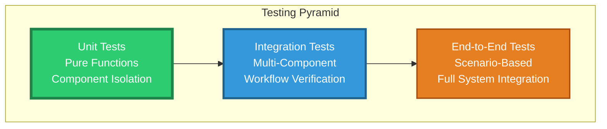

## Test Categories

### Unit Tests

**Purpose**: Test individual functions and components in isolation.

**Characteristics**:
- No external dependencies (filesystem, network, database)
- Use memory-based adapters and mocks
- Fast execution (milliseconds)
- High coverage of edge cases
- Table-driven test patterns

**Location**: Colocated with implementation files (`*_test.go`)

**Example**:
```go
func TestScanPackage_ValidStructure(t *testing.T) {
    fs := adapters.NewMemFilesystem()
    // Setup in-memory filesystem
    // Test scanning logic
}
```

### Integration Tests

**Purpose**: Test multiple components working together.

**Characteristics**:
- Test complete workflows
- Use real component interactions
- Isolated temporary directories
- Verify state transitions
- Test error propagation

**Location**: `tests/integration/`

**Categories**:
- `e2e_test.go`: Complete workflows (manage, unmanage, remanage)
- `concurrent_test.go`: Parallel operations and race conditions
- `recovery_test.go`: Error recovery and rollback mechanisms
- `conflict_test.go`: Conflict detection and resolution
- `state_test.go`: Manifest persistence and state management
- `query_test.go`: Status, doctor, and list commands
- `cli_test.go`: CLI integration with flags and options
- `platform_test.go`: Cross-platform compatibility
- `scenario_test.go`: Realistic user workflows

### End-to-End Tests

**Purpose**: Validate complete system behavior from user perspective.

**Characteristics**:
- Test full CLI commands
- Verify user-facing outputs
- Test configuration precedence
- Validate error messages
- Cross-platform compatibility

### Benchmark Tests

**Purpose**: Detect performance regressions and measure operation costs.

**Location**: `tests/integration/benchmark_test.go`

**Benchmarks**:
- Single package operations
- Multiple package operations (10, 100, 1000 packages)
- Large file tree scenarios
- Query operation performance

## Testing Infrastructure

### Test Utilities Package

**Location**: `tests/integration/testutil/`

The testutil package provides comprehensive testing infrastructure:

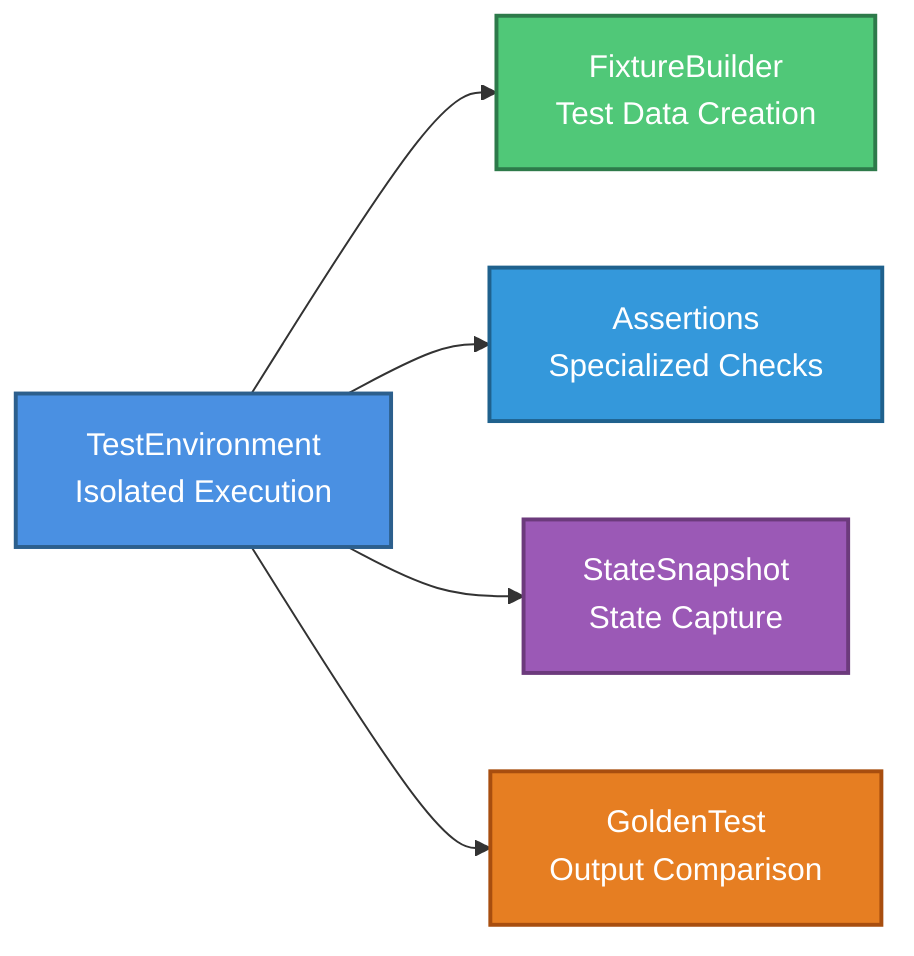

#### TestEnvironment

Provides isolated test execution with automatic cleanup:

**Features**:
- Temporary directory creation
- Automatic cleanup on test completion
- Package and target directory setup
- Client instance creation
- Environment variable isolation

**Usage**:
```go
func TestExample(t *testing.T) {
    env := testutil.NewTestEnvironment(t)
    // Test code here
    // Automatic cleanup via defer
}
```

#### FixtureBuilder

Declarative test data creation:

**Features**:
- Package structure creation
- File and directory generation
- Symlink creation
- Content specification
- Nested structure support

**Usage**:
```go
env.FixtureBuilder().Package("vim").
    WithFile("dot-vimrc", "set nocompatible").
    WithDirectory("dot-vim").
    WithFile("dot-vim/colors.vim", "colorscheme desert").
    Create()
```

#### Assertions

Specialized assertion functions for filesystem verification:

**Functions**:
- `AssertSymlinkExists`: Verify symlink presence
- `AssertSymlinkTarget`: Verify symlink points to correct target
- `AssertFileExists`: Verify file presence
- `AssertFileContent`: Verify file contents
- `AssertDirectoryExists`: Verify directory presence
- `AssertPathNotExists`: Verify path absence

#### StateSnapshot

Filesystem state capture and comparison:

**Features**:
- Capture directory tree state
- Compare states before/after operations
- Detect new files and directories
- Detect deletions
- Generate diff reports

#### GoldenTest

Compare test outputs against golden files:

**Features**:
- Save expected outputs as golden files
- Automatic comparison
- Update mode for golden file regeneration
- Diff display on mismatches

### Test Fixtures

**Location**: `tests/fixtures/`

Pre-built test scenarios and sample packages:

**Structure**:
```
tests/fixtures/
├── scenarios/       # Complete test scenarios
│   ├── simple/     # Basic dotfiles setup
│   ├── complex/    # Multi-package configuration
│   ├── conflicts/  # Conflict scenarios
│   └── migration/  # Stow migration tests
├── packages/       # Sample package templates
│   ├── dotfiles/   # Common dotfiles
│   ├── nvim/       # Neovim configuration
│   └── shell/      # Shell configuration
└── golden/         # Expected outputs
    ├── status/     # Status command outputs
    ├── list/       # List command outputs
    └── doctor/     # Doctor command outputs
```

## Layer-Specific Testing

### Domain Layer Testing

**Focus**: Pure function testing without side effects.

**Test Strategy**:
- Unit tests for all domain types
- Property-based testing for algebraic laws
- Result type behavior verification
- Error type construction
- Phantom type safety

**No Dependencies Required**:
- No filesystem access
- No external services
- Pure computation only

**Example Test Flow**:

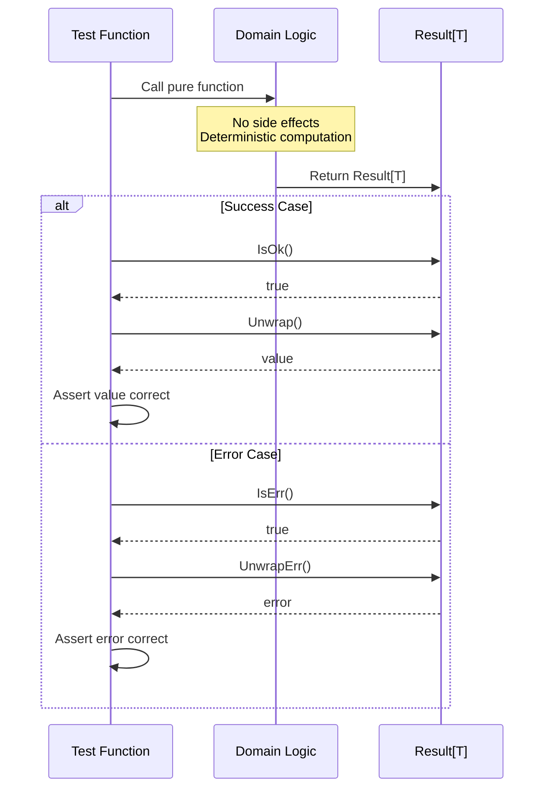

### Core Layer Testing

**Focus**: Scanning, planning, and conflict resolution logic.

**Test Strategy**:
- Table-driven tests for multiple scenarios
- In-memory filesystem adapter
- Edge case coverage
- Error path verification

**Components Tested**:
- Scanner: Package structure traversal
- Planner: Operation dependency graphs
- Ignore: Pattern matching logic

**Example Test Flow**:

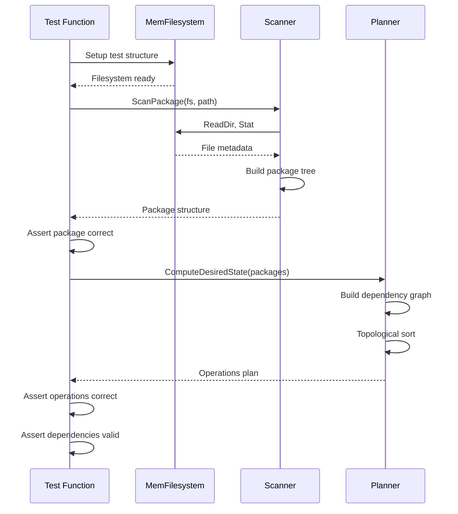

### Pipeline Layer Testing

**Focus**: Stage composition and data flow.

**Test Strategy**:
- Integration tests with memory filesystem
- Error propagation through stages
- Context cancellation handling
- Type safety verification

**Test Flow**:

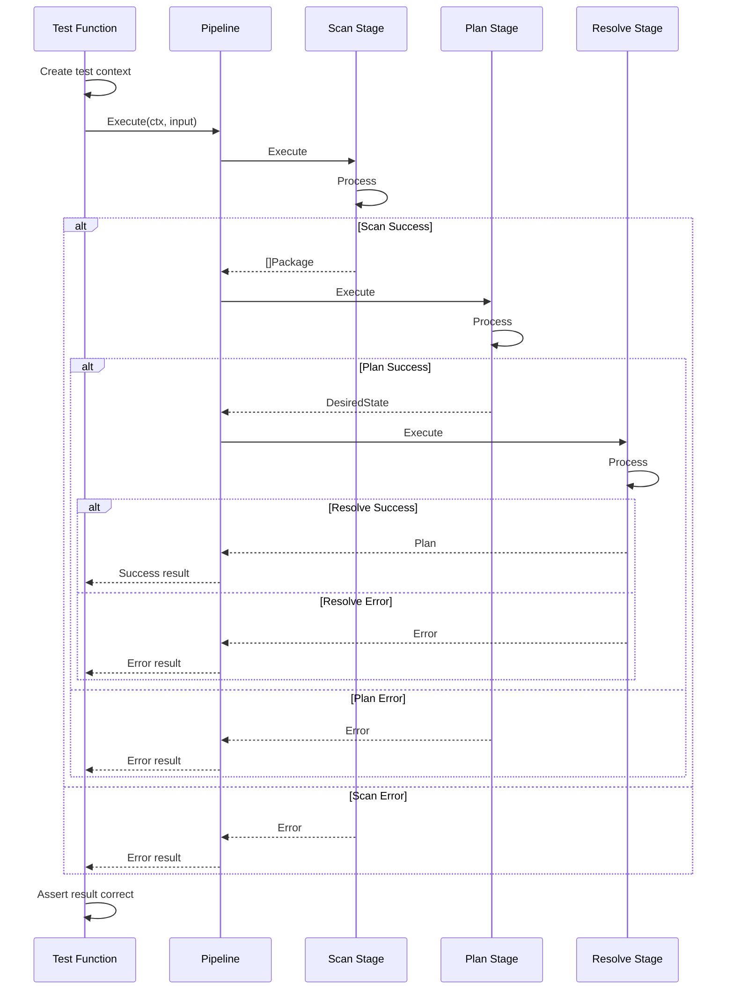

### Executor Layer Testing

**Focus**: Transaction execution, rollback, and checkpointing.

**Test Strategy**:
- Verify precondition validation
- Test checkpoint creation and restoration
- Verify rollback on failure
- Test parallel execution
- Verify atomic guarantees

**Two-Phase Commit Test Flow**:

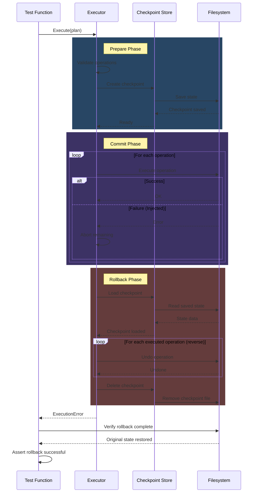

### API Layer Testing

**Focus**: Service integration and client operations.

**Test Strategy**:
- End-to-end service testing
- Manifest persistence verification
- Service interaction validation
- Configuration handling

### CLI Layer Testing

**Focus**: Command execution and user interaction.

**Test Strategy**:
- Command parsing verification
- Flag and option handling
- Output format testing
- Exit code validation
- Error message verification

## Testing Patterns

### Table-Driven Testing

Table-driven tests enable comprehensive scenario coverage with minimal code duplication.

**Pattern**:
```go
func TestOperation(t *testing.T) {
    tests := []struct {
        name     string
        input    Input
        want     Output
        wantErr  bool
    }{
        {
            name: "valid input",
            input: Input{...},
            want: Output{...},
            wantErr: false,
        },
        {
            name: "invalid input",
            input: Input{...},
            wantErr: true,
        },
    }
    
    for _, tt := range tests {
        t.Run(tt.name, func(t *testing.T) {
            got, err := Operation(tt.input)
            if (err != nil) != tt.wantErr {
                t.Errorf("unexpected error: %v", err)
            }
            if !tt.wantErr && !reflect.DeepEqual(got, tt.want) {
                t.Errorf("got %v, want %v", got, tt.want)
            }
        })
    }
}
```

**Table-Driven Test Flow**:

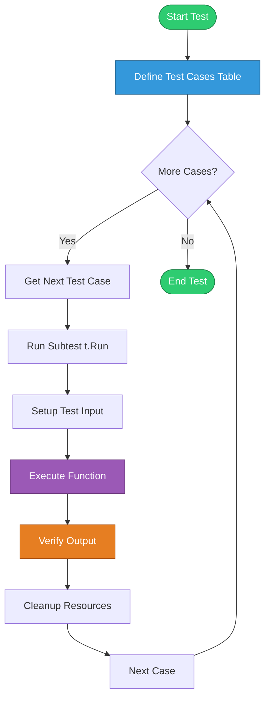

### Property-Based Testing

Property-based testing verifies algebraic laws and invariants.

**Pattern**:
```go
func TestResultMonad_IdentityLaw(t *testing.T) {
    // For any value v:
    // Return(v).Bind(f) == f(v)
    
    v := 42
    f := func(x int) Result[int] {
        return Ok(x * 2)
    }
    
    left := Ok(v).Bind(f)
    right := f(v)
    
    assert.Equal(t, left, right)
}
```

### Golden File Testing

Golden file tests compare outputs against reference files.

**Test Flow**:

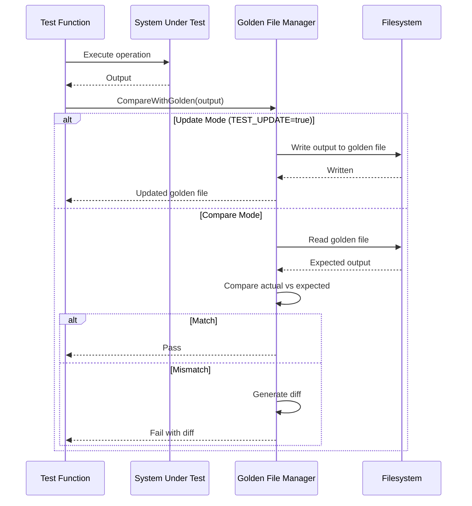

### Concurrent Testing

Concurrent tests verify thread safety and race condition freedom.

**Test Strategy**:
- Use `t.Parallel()` for concurrent test execution
- Run with `-race` flag to detect data races
- Test concurrent client operations
- Verify manifest locking
- Test parallel operation execution

**Concurrent Test Flow**:

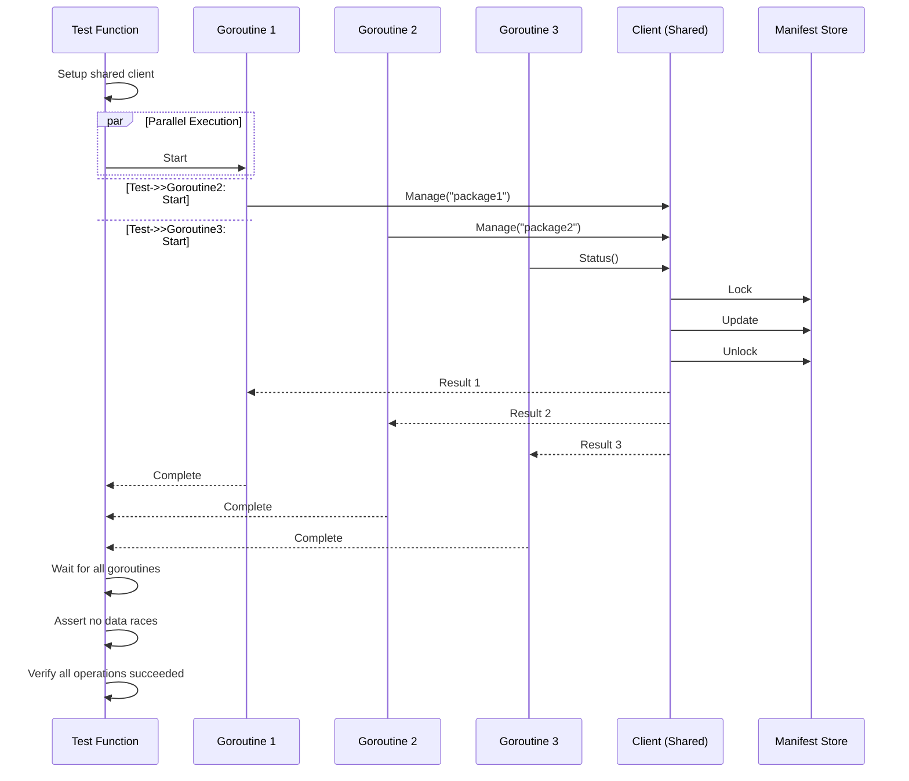

## Test Execution Flows

### TDD Cycle

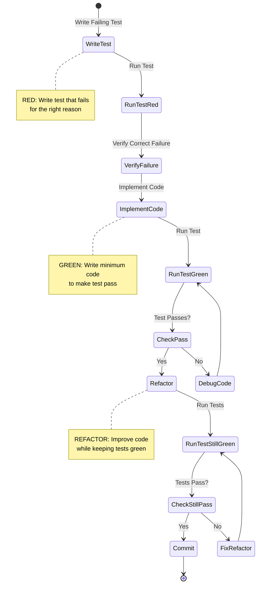

### Complete Test Execution Flow

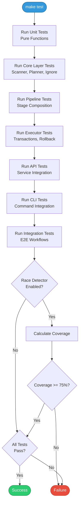

### Integration Test Execution

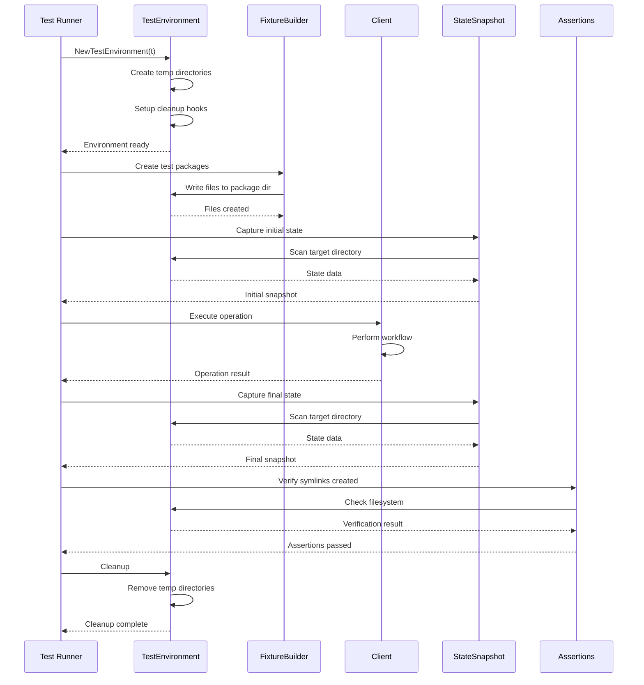

## Coverage Requirements

### Minimum Coverage Thresholds

- **Overall Project**: 75% minimum
- **Domain Layer**: 100% (critical path)
- **Core Layer**: 95% minimum
- **Pipeline Layer**: 90% minimum
- **Executor Layer**: 100% (critical path)
- **API Layer**: 85% minimum
- **CLI Layer**: 75% minimum

### Coverage Verification

```bash
# Generate coverage report
make coverage

# View coverage in browser
go tool cover -html=coverage.out

# Check coverage threshold
go test -cover ./... | grep -E "coverage: [0-9]+\.[0-9]+%"
```

### Critical Paths Requiring 100% Coverage

1. **Operation Execution**: All operation types
2. **Rollback Mechanism**: Complete rollback path
3. **Manifest Persistence**: Read, write, validation
4. **Error Handling**: All error types and wrapping
5. **Path Validation**: Security-critical path operations

## Running Tests

### Basic Test Execution

```bash
# All tests
make test

# With race detection
go test -race ./...

# With coverage
make test-coverage

# Verbose output
go test -v ./...
```

### Test Categories

```bash
# Unit tests only
go test ./internal/...

# Integration tests only
go test ./tests/integration/...

# Specific test function
go test -run TestManage_SinglePackage ./tests/integration/

# Specific test file
go test ./internal/scanner/scanner_test.go
```

### Test Options

```bash
# Short mode (skip slow tests)
go test -short ./...

# Parallel execution
go test -parallel 4 ./...

# With timeout
go test -timeout 30s ./...

# Benchmarks
go test -bench=. ./tests/integration/

# CPU profiling
go test -cpuprofile=cpu.prof ./...

# Memory profiling
go test -memprofile=mem.prof ./...
```

### Continuous Integration

```bash
# CI-friendly test execution
make check

# Human-friendly test output
make qa
```

### Test Debugging

```bash
# Run single test with verbose output
go test -v -run TestSpecificTest ./internal/package/

# Print test logs
go test -v ./... 2>&1 | tee test.log

# Use delve debugger
dlv test ./internal/package/ -- -test.run TestSpecificTest
```

## Test Maintenance

### Adding New Tests

1. **Identify Test Category**: Unit, integration, or E2E
2. **Create Test File**: Follow naming convention `*_test.go`
3. **Write Test First**: Follow TDD red-green-refactor
4. **Use Table-Driven Pattern**: For multiple scenarios
5. **Add Documentation**: Document test purpose and setup
6. **Verify Coverage**: Ensure coverage thresholds met

### Test Naming Conventions

```
Test<Layer>_<Component>_<Scenario>
Benchmark<Operation>_<Scenario>
Example<Function>_<UseCase>
```

**Examples**:
- `TestScanner_ScanPackage_ValidStructure`
- `TestExecutor_Rollback_OnFailure`
- `TestClient_Manage_MultiplePackages`
- `BenchmarkManage_100Packages`

### Updating Golden Files

```bash
# Update all golden files
TEST_UPDATE=1 go test ./tests/integration/

# Update specific test golden files
TEST_UPDATE=1 go test -run TestStatus ./tests/integration/
```

## Test Architecture Best Practices

1. **Arrange-Act-Assert**: Structure tests with clear phases
2. **Single Assertion Focus**: Each test verifies one behavior
3. **Descriptive Names**: Test names document expected behavior
4. **Minimal Setup**: Keep test setup simple and focused
5. **Isolated State**: No shared state between tests
6. **Fast Execution**: Optimize for quick feedback
7. **Deterministic Results**: Tests pass consistently
8. **Comprehensive Error Testing**: Test all error paths

## References

### Related Documentation

- [Architecture Documentation](architecture.md) - System design and layers
- [Contributing Guide](../../CONTRIBUTING.md) - Development workflow
- [Integration Tests README](../../tests/integration/README.md) - Integration test details

### External Resources

- [Test-Driven Development](https://martinfowler.com/bliki/TestDrivenDevelopment.html)
- [Table-Driven Tests in Go](https://dave.cheney.net/2019/05/07/prefer-table-driven-tests)
- [Go Testing Package](https://pkg.go.dev/testing)
- [testify](https://github.com/stretchr/testify) - Assertion library

## Navigation

**[↑ Back to Documentation Index](../README.md)** | [Architecture](architecture.md) | [Release Workflow](release-workflow.md)

