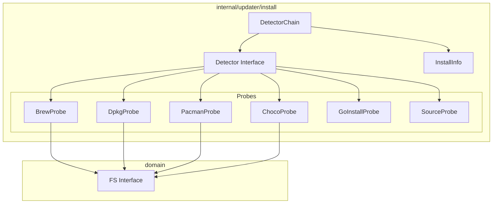

# Installation Detection Library Design

## Comparison: Club vs Dot Upgrade Approaches

### Club's Upgrade Model

Club uses a **self-upgrading binary** pattern:

```
┌─────────────────────────────────────────────────────────────┐
│                    Club Upgrade Flow                        │
├─────────────────────────────────────────────────────────────┤
│  1. Check Artifactory for latest version                    │
│  2. Download new binary directly                            │
│  3. Write version to cache file                             │
│  4. Wrapper script (clubw) runs correct version             │
└─────────────────────────────────────────────────────────────┘
```

**Key characteristics:**
- Single upgrade source (Artifactory)
- Ignores installation method
- Self-replacing binary pattern
- Wrapper script for version management
- No package manager awareness

### Why This Model Does Not Fit Dot

| Factor | Club | Dot |
|--------|------|-----|
| Distribution | Private Artifactory | Public GitHub + Homebrew |
| User expectation | Corporate tool, single source | OSS tool, package managers |
| Binary management | Wrapper script (clubw) | Direct execution |
| Rollback | Version cache | Package manager handles |

Dot users expect `brew upgrade dot` to work. The upgrade command should be **advisory** and **aware** of installation context.

### Dot's Upgrade Model

```
┌─────────────────────────────────────────────────────────────┐
│                    Dot Upgrade Flow                         │
├─────────────────────────────────────────────────────────────┤
│  1. Detect installation source (pure Go, no exec)          │
│  2. Check GitHub for latest version                         │
│  3. Compare versions                                        │
│  4. Provide appropriate upgrade instructions                │
│  5. For manual installs: offer direct download              │
└─────────────────────────────────────────────────────────────┘
```

---

## Design Principles

1. **No Shell Execution**: All detection uses Go standard library filesystem operations and binary introspection
2. **Interface-Driven**: Follows the `domain/adapters` pattern established in the codebase
3. **Testable**: All components are mockable via interfaces
4. **Platform-Aware**: Uses `runtime.GOOS` and build tags where appropriate
5. **Fail-Safe**: Unknown installations gracefully fall back to manual upgrade

## Installation Sources

| Source | Platform | Detection Method |
|--------|----------|------------------|
| Homebrew | darwin, linux | Executable path in Cellar directory |
| APT/dpkg | linux | Parse `/var/lib/dpkg/status` text file |
| Pacman | linux | Parse `/var/lib/pacman/local/*/desc` files |
| Chocolatey | windows | Executable path in chocolatey directory |
| Go Install | any | `runtime/debug.ReadBuildInfo()` module path |
| Source Build | any | Version == "dev" or binary in working directory |
| Manual/Unknown | any | Fallback when no other source detected |

## Architecture



## Type Definitions

### Core Types

```go
package install

import (
    "context"
    "runtime/debug"
)

// Source identifies how dot was installed.
type Source string

const (
    SourceHomebrew   Source = "homebrew"
    SourceApt        Source = "apt"
    SourcePacman     Source = "pacman"
    SourceChocolatey Source = "chocolatey"
    SourceGoInstall  Source = "go-install"
    SourceBuild      Source = "source"
    SourceManual     Source = "manual"
)

// Info contains installation detection results.
type Info struct {
    // Source identifies the installation method.
    Source Source
    
    // Version is the installed version if detectable.
    // Empty string if version cannot be determined.
    Version string
    
    // ExecutablePath is the resolved path to the dot binary.
    ExecutablePath string
    
    // Metadata contains source-specific information.
    // For Homebrew: formula name, cellar path, tap
    // For dpkg: package name, architecture
    // For Go install: module path
    Metadata map[string]string
    
    // CanAutoUpgrade indicates if automatic upgrade is possible.
    CanAutoUpgrade bool
    
    // UpgradeInstructions provides human-readable upgrade guidance.
    UpgradeInstructions string
}

// Probe detects a specific installation source.
type Probe interface {
    // Name returns the probe identifier.
    Name() string
    
    // Platforms returns the platforms this probe supports.
    // Empty slice means all platforms.
    Platforms() []string
    
    // Detect checks if this probe matches the installation.
    // Returns nil if this probe does not match.
    Detect(ctx context.Context, execPath string) (*Info, error)
}
```

### File Reader Interface (for testability)

```go
// FileSystem abstracts filesystem operations for testing.
type FileSystem interface {
    ReadFile(path string) ([]byte, error)
    ReadDir(path string) ([]os.DirEntry, error)
    Stat(path string) (os.FileInfo, error)
}

// OSFileSystem is the real filesystem implementation.
type OSFileSystem struct{}

func (OSFileSystem) ReadFile(path string) ([]byte, error) {
    return os.ReadFile(path)
}

func (OSFileSystem) ReadDir(path string) ([]os.DirEntry, error) {
    return os.ReadDir(path)
}

func (OSFileSystem) Stat(path string) (os.FileInfo, error) {
    return os.Stat(path)
}
```

### Detector Interface

```go
// Detector discovers how dot was installed.
type Detector interface {
    // Detect returns installation information.
    Detect(ctx context.Context) (*Info, error)
}

// detector implements Detector using a chain of probes.
type detector struct {
    fs           FileSystem
    probes       []Probe
    execResolver func() (string, error)
    buildInfo    func() (*debug.BuildInfo, bool)
    version      string // Current version from ldflags
}

// Option configures the detector.
type Option func(*detector)

// WithFileSystem sets a custom filesystem (for testing).
func WithFileSystem(fs FileSystem) Option {
    return func(d *detector) {
        d.fs = fs
    }
}

// WithProbes sets custom probes (for testing).
func WithProbes(probes ...Probe) Option {
    return func(d *detector) {
        d.probes = probes
    }
}

// WithVersion sets the current version.
func WithVersion(version string) Option {
    return func(d *detector) {
        d.version = version
    }
}

// NewDetector creates a detector with platform-appropriate probes.
func NewDetector(opts ...Option) Detector {
    d := &detector{
        fs:           OSFileSystem{},
        execResolver: os.Executable,
        buildInfo:    debug.ReadBuildInfo,
        version:      "unknown",
    }
    
    for _, opt := range opts {
        opt(d)
    }
    
    if d.probes == nil {
        d.probes = defaultProbes(d.fs, d.version)
    }
    
    return d
}
```

## Probe Implementations

### Homebrew Probe

Detects installation via Homebrew by examining the executable path.

```go
package install

import (
    "context"
    "encoding/json"
    "path/filepath"
    "runtime"
    "strings"
)

// BrewProbe detects Homebrew installations.
type BrewProbe struct {
    fs FileSystem
}

// Known Homebrew Cellar locations by platform.
var brewCellarPaths = map[string][]string{
    "darwin": {
        "/opt/homebrew/Cellar",      // Apple Silicon
        "/usr/local/Cellar",         // Intel
    },
    "linux": {
        "/home/linuxbrew/.linuxbrew/Cellar",
        "/usr/local/Cellar",
    },
}

func NewBrewProbe(fs FileSystem) *BrewProbe {
    return &BrewProbe{fs: fs}
}

func (p *BrewProbe) Name() string {
    return "homebrew"
}

func (p *BrewProbe) Platforms() []string {
    return []string{"darwin", "linux"}
}

func (p *BrewProbe) Detect(ctx context.Context, execPath string) (*Info, error) {
    // Resolve symlinks to get the real path
    realPath, err := filepath.EvalSymlinks(execPath)
    if err != nil {
        return nil, nil // Not a symlink or error - not Homebrew
    }
    
    // Check if path is within a known Cellar location
    cellars, ok := brewCellarPaths[runtime.GOOS]
    if !ok {
        return nil, nil
    }
    
    for _, cellar := range cellars {
        if strings.HasPrefix(realPath, cellar) {
            return p.parseBrewInstall(realPath, cellar)
        }
    }
    
    return nil, nil
}

func (p *BrewProbe) parseBrewInstall(realPath, cellar string) (*Info, error) {
    // Path format: /opt/homebrew/Cellar/dot/0.6.3/bin/dot
    // Extract version from path
    relPath, err := filepath.Rel(cellar, realPath)
    if err != nil {
        return nil, nil
    }
    
    // relPath: "dot/0.6.3/bin/dot"
    parts := strings.Split(relPath, string(filepath.Separator))
    if len(parts) < 2 {
        return nil, nil
    }
    
    formulaName := parts[0]
    version := parts[1]
    
    // Build metadata
    metadata := map[string]string{
        "formula": formulaName,
        "cellar":  cellar,
    }
    
    // Try to read INSTALL_RECEIPT.json for tap information
    receiptPath := filepath.Join(cellar, formulaName, version, "INSTALL_RECEIPT.json")
    if data, err := p.fs.ReadFile(receiptPath); err == nil {
        var receipt struct {
            Source struct {
                Tap string `json:"tap"`
            } `json:"source"`
        }
        if json.Unmarshal(data, &receipt) == nil && receipt.Source.Tap != "" {
            metadata["tap"] = receipt.Source.Tap
        }
    }
    
    // Build formula reference for upgrade command
    formulaRef := formulaName
    if tap, ok := metadata["tap"]; ok && tap != "" {
        formulaRef = tap + "/" + formulaName
    }
    
    return &Info{
        Source:              SourceHomebrew,
        Version:             version,
        ExecutablePath:      realPath,
        Metadata:            metadata,
        CanAutoUpgrade:      true,
        UpgradeInstructions: "brew upgrade " + formulaRef,
    }, nil
}
```

### dpkg Probe

Parses the dpkg status file directly to detect APT installations.

```go
// DpkgProbe detects APT/dpkg installations on Debian-based systems.
type DpkgProbe struct {
    fs         FileSystem
    statusFile string // Default: /var/lib/dpkg/status
}

func NewDpkgProbe(fs FileSystem) *DpkgProbe {
    return &DpkgProbe{
        fs:         fs,
        statusFile: "/var/lib/dpkg/status",
    }
}

func (p *DpkgProbe) Name() string {
    return "dpkg"
}

func (p *DpkgProbe) Platforms() []string {
    return []string{"linux"}
}

func (p *DpkgProbe) Detect(ctx context.Context, execPath string) (*Info, error) {
    // Check if executable is in standard dpkg location
    if !strings.HasPrefix(execPath, "/usr/bin/") && 
       !strings.HasPrefix(execPath, "/usr/local/bin/") {
        return nil, nil
    }
    
    // Read and parse dpkg status file
    data, err := p.fs.ReadFile(p.statusFile)
    if err != nil {
        return nil, nil // dpkg not available
    }
    
    // Parse the status file format
    pkg := p.findPackage(string(data), "dot")
    if pkg == nil {
        return nil, nil
    }
    
    return &Info{
        Source:         SourceApt,
        Version:        pkg.version,
        ExecutablePath: execPath,
        Metadata: map[string]string{
            "package":      pkg.name,
            "architecture": pkg.arch,
            "status":       pkg.status,
        },
        CanAutoUpgrade:      true,
        UpgradeInstructions: "sudo apt update && sudo apt upgrade dot",
    }, nil
}

type dpkgPackage struct {
    name    string
    version string
    arch    string
    status  string
}

// findPackage parses dpkg status file format.
// Format is RFC 822-style with blank line separating entries.
func (p *DpkgProbe) findPackage(data, pkgName string) *dpkgPackage {
    entries := strings.Split(data, "\n\n")
    
    for _, entry := range entries {
        pkg := &dpkgPackage{}
        
        for _, line := range strings.Split(entry, "\n") {
            switch {
            case strings.HasPrefix(line, "Package: "):
                pkg.name = strings.TrimPrefix(line, "Package: ")
            case strings.HasPrefix(line, "Version: "):
                pkg.version = strings.TrimPrefix(line, "Version: ")
            case strings.HasPrefix(line, "Architecture: "):
                pkg.arch = strings.TrimPrefix(line, "Architecture: ")
            case strings.HasPrefix(line, "Status: "):
                pkg.status = strings.TrimPrefix(line, "Status: ")
            }
        }
        
        if pkg.name == pkgName && strings.Contains(pkg.status, "installed") {
            return pkg
        }
    }
    
    return nil
}
```

### Pacman Probe

Reads pacman's local database directly.

```go
// PacmanProbe detects Pacman installations on Arch-based systems.
type PacmanProbe struct {
    fs     FileSystem
    dbPath string // Default: /var/lib/pacman/local
}

func NewPacmanProbe(fs FileSystem) *PacmanProbe {
    return &PacmanProbe{
        fs:     fs,
        dbPath: "/var/lib/pacman/local",
    }
}

func (p *PacmanProbe) Name() string {
    return "pacman"
}

func (p *PacmanProbe) Platforms() []string {
    return []string{"linux"}
}

func (p *PacmanProbe) Detect(ctx context.Context, execPath string) (*Info, error) {
    if !strings.HasPrefix(execPath, "/usr/bin/") {
        return nil, nil
    }
    
    // Find package directory matching "dot-*"
    entries, err := p.fs.ReadDir(p.dbPath)
    if err != nil {
        return nil, nil // pacman not available
    }
    
    for _, entry := range entries {
        if !entry.IsDir() {
            continue
        }
        
        // Package dirs are named: pkgname-version
        name := entry.Name()
        if strings.HasPrefix(name, "dot-") {
            return p.parsePackage(name)
        }
    }
    
    return nil, nil
}

func (p *PacmanProbe) parsePackage(dirName string) (*Info, error) {
    descPath := filepath.Join(p.dbPath, dirName, "desc")
    
    data, err := p.fs.ReadFile(descPath)
    if err != nil {
        return nil, nil
    }
    
    // Parse desc file format
    version := p.parseDescField(string(data), "%VERSION%")
    pkgName := p.parseDescField(string(data), "%NAME%")
    
    if pkgName == "" {
        pkgName = "dot"
    }
    
    return &Info{
        Source:              SourcePacman,
        Version:             version,
        ExecutablePath:      "/usr/bin/dot",
        Metadata:            map[string]string{"package": pkgName},
        CanAutoUpgrade:      true,
        UpgradeInstructions: "sudo pacman -Syu dot",
    }, nil
}

func (p *PacmanProbe) parseDescField(data, field string) string {
    idx := strings.Index(data, field)
    if idx == -1 {
        return ""
    }
    
    rest := data[idx+len(field):]
    lines := strings.Split(rest, "\n")
    
    for _, line := range lines {
        line = strings.TrimSpace(line)
        if line == "" {
            continue
        }
        if strings.HasPrefix(line, "%") {
            break
        }
        return line
    }
    
    return ""
}
```

### Chocolatey Probe (Windows)

```go
// ChocoProbe detects Chocolatey installations on Windows.
type ChocoProbe struct {
    fs FileSystem
}

func NewChocoProbe(fs FileSystem) *ChocoProbe {
    return &ChocoProbe{fs: fs}
}

func (p *ChocoProbe) Name() string {
    return "chocolatey"
}

func (p *ChocoProbe) Platforms() []string {
    return []string{"windows"}
}

func (p *ChocoProbe) Detect(ctx context.Context, execPath string) (*Info, error) {
    execPath = filepath.Clean(execPath)
    
    // Chocolatey installs to: C:\ProgramData\chocolatey\bin\
    programData := os.Getenv("PROGRAMDATA")
    if programData == "" {
        programData = `C:\ProgramData`
    }
    
    chocoPath := filepath.Join(programData, "chocolatey")
    binPath := filepath.Join(chocoPath, "bin")
    
    if !strings.HasPrefix(strings.ToLower(execPath), strings.ToLower(binPath)) {
        return nil, nil
    }
    
    // Check for package in lib directory
    libPath := filepath.Join(chocoPath, "lib", "dot")
    if _, err := p.fs.Stat(libPath); err != nil {
        return nil, nil
    }
    
    // Try to read version from .nuspec file
    version := p.readVersion(libPath)
    
    return &Info{
        Source:              SourceChocolatey,
        Version:             version,
        ExecutablePath:      execPath,
        Metadata:            map[string]string{"package": "dot", "libPath": libPath},
        CanAutoUpgrade:      true,
        UpgradeInstructions: "choco upgrade dot -y",
    }, nil
}

func (p *ChocoProbe) readVersion(libPath string) string {
    entries, err := p.fs.ReadDir(libPath)
    if err != nil {
        return ""
    }
    
    for _, entry := range entries {
        if strings.HasSuffix(entry.Name(), ".nuspec") {
            nuspecPath := filepath.Join(libPath, entry.Name())
            data, err := p.fs.ReadFile(nuspecPath)
            if err != nil {
                continue
            }
            
            // Simple extraction: <version>x.y.z</version>
            content := string(data)
            start := strings.Index(content, "<version>")
            if start == -1 {
                continue
            }
            start += len("<version>")
            end := strings.Index(content[start:], "</version>")
            if end == -1 {
                continue
            }
            return content[start : start+end]
        }
    }
    
    return ""
}
```

### Go Install Probe

Uses `runtime/debug.ReadBuildInfo()` to detect `go install` installations.

```go
// GoInstallProbe detects installations via `go install`.
type GoInstallProbe struct {
    buildInfo func() (*debug.BuildInfo, bool)
}

func NewGoInstallProbe() *GoInstallProbe {
    return &GoInstallProbe{
        buildInfo: debug.ReadBuildInfo,
    }
}

func (p *GoInstallProbe) Name() string {
    return "go-install"
}

func (p *GoInstallProbe) Platforms() []string {
    return nil // All platforms
}

func (p *GoInstallProbe) Detect(ctx context.Context, execPath string) (*Info, error) {
    getBuildInfo := p.buildInfo
    if getBuildInfo == nil {
        getBuildInfo = debug.ReadBuildInfo
    }
    
    info, ok := getBuildInfo()
    if !ok || info.Main.Path == "" {
        return nil, nil
    }
    
    // Check if path is in known Go binary locations
    gobin := os.Getenv("GOBIN")
    gopath := os.Getenv("GOPATH")
    if gopath == "" {
        home, _ := os.UserHomeDir()
        gopath = filepath.Join(home, "go")
    }
    
    gopathBin := filepath.Join(gopath, "bin")
    
    isGoInstall := false
    if gobin != "" && strings.HasPrefix(execPath, gobin) {
        isGoInstall = true
    } else if strings.HasPrefix(execPath, gopathBin) {
        isGoInstall = true
    }
    
    if !isGoInstall {
        return nil, nil
    }
    
    version := info.Main.Version
    if version == "(devel)" {
        version = ""
    }
    
    modulePath := info.Main.Path
    
    return &Info{
        Source:              SourceGoInstall,
        Version:             version,
        ExecutablePath:      execPath,
        Metadata:            map[string]string{"module": modulePath, "goVersion": info.GoVersion},
        CanAutoUpgrade:      true,
        UpgradeInstructions: "go install " + modulePath + "@latest",
    }, nil
}
```

### Source Build Probe

Detects when running a development/source build.

```go
// SourceProbe detects source/development builds.
type SourceProbe struct {
    version string // Current version from ldflags
}

func NewSourceProbe(version string) *SourceProbe {
    return &SourceProbe{version: version}
}

func (p *SourceProbe) Name() string {
    return "source"
}

func (p *SourceProbe) Platforms() []string {
    return nil // All platforms
}

func (p *SourceProbe) Detect(ctx context.Context, execPath string) (*Info, error) {
    isDev := p.version == "dev" || 
             p.version == "unknown" || 
             p.version == "" ||
             strings.HasSuffix(p.version, "-dirty") ||
             strings.Contains(p.version, "-g") // Git describe format: v0.6.2-6-g48cd1a7
    
    if !isDev {
        // Check if binary is in current working directory
        cwd, err := os.Getwd()
        if err == nil {
            execDir := filepath.Dir(execPath)
            if execDir == cwd {
                isDev = true
            }
        }
    }
    
    if !isDev {
        return nil, nil
    }
    
    return &Info{
        Source:              SourceBuild,
        Version:             p.version,
        ExecutablePath:      execPath,
        Metadata:            map[string]string{"buildType": "development"},
        CanAutoUpgrade:      false,
        UpgradeInstructions: "This is a development build. Run 'make build' or 'go build' to update, or download from GitHub releases.",
    }, nil
}
```

## Detector Implementation

```go
// defaultProbes returns platform-appropriate probes in priority order.
func defaultProbes(fs FileSystem, version string) []Probe {
    probes := []Probe{}
    
    switch runtime.GOOS {
    case "darwin":
        probes = append(probes,
            NewBrewProbe(fs),
        )
    case "linux":
        probes = append(probes,
            NewBrewProbe(fs),      // Linuxbrew
            NewDpkgProbe(fs),      // Debian/Ubuntu
            NewPacmanProbe(fs),    // Arch
        )
    case "windows":
        probes = append(probes,
            NewChocoProbe(fs),
        )
    }
    
    // Cross-platform probes (lower priority)
    probes = append(probes,
        NewGoInstallProbe(),
        NewSourceProbe(version),
    )
    
    return probes
}

func (d *detector) Detect(ctx context.Context) (*Info, error) {
    // Get executable path
    execPath, err := d.execResolver()
    if err != nil {
        return &Info{
            Source:              SourceManual,
            CanAutoUpgrade:      false,
            UpgradeInstructions: "Download the latest release from GitHub: https://github.com/yaklabco/dot/releases",
        }, nil
    }
    
    // Resolve symlinks
    realPath, err := filepath.EvalSymlinks(execPath)
    if err != nil {
        realPath = execPath
    }
    
    // Try each probe in order
    for _, probe := range d.probes {
        // Check platform compatibility
        platforms := probe.Platforms()
        if len(platforms) > 0 {
            supported := false
            for _, p := range platforms {
                if p == runtime.GOOS {
                    supported = true
                    break
                }
            }
            if !supported {
                continue
            }
        }
        
        info, err := probe.Detect(ctx, realPath)
        if err != nil {
            continue // Try next probe
        }
        if info != nil {
            return info, nil
        }
    }
    
    // No probe matched - manual installation
    return &Info{
        Source:              SourceManual,
        ExecutablePath:      realPath,
        CanAutoUpgrade:      false,
        UpgradeInstructions: "Download the latest release from GitHub: https://github.com/yaklabco/dot/releases",
    }, nil
}
```

## File Structure

```
internal/
  updater/
    install/
      doc.go           # Package documentation
      types.go         # Core types (Source, Info, Probe, Detector)
      fs.go            # FileSystem interface
      detector.go      # Detector implementation
      probe_brew.go    # BrewProbe
      probe_dpkg.go    # DpkgProbe  
      probe_pacman.go  # PacmanProbe
      probe_choco.go   # ChocoProbe (build tag: windows)
      probe_goinstall.go # GoInstallProbe
      probe_source.go  # SourceProbe
      detector_test.go # Integration tests
      probe_brew_test.go
      probe_dpkg_test.go
      probe_pacman_test.go
      probe_choco_test.go
      probe_goinstall_test.go
      probe_source_test.go
```

## Integration with Upgrade Command

```go
// cmd/dot/upgrade.go

func runUpgrade(currentVersion string, yes, checkOnly bool) error {
    cfg, err := loadConfig()
    if err != nil {
        cfg = dot.DefaultExtendedConfig()
    }

    // Detect installation source
    detector := install.NewDetector(install.WithVersion(currentVersion))
    installInfo, err := detector.Detect(context.Background())
    if err != nil {
        return fmt.Errorf("detect installation: %w", err)
    }
    
    // Check for updates via GitHub API
    checker := dot.NewVersionChecker(cfg.Update.Repository)
    latestRelease, hasUpdate, err := checker.CheckForUpdate(currentVersion, cfg.Update.IncludePrerelease)
    if err != nil {
        return fmt.Errorf("check for updates: %w", err)
    }
    
    colorize := shouldUseColor()
    c := render.NewColorizer(colorize)
    
    if !hasUpdate {
        fmt.Printf("%s You are already running the latest version (%s)\n", 
            c.Success("[check]"), currentVersion)
        return nil
    }
    
    // Display information
    fmt.Printf("\n%s A new version is available\n\n", c.Info("[info]"))
    fmt.Printf("  Current version:  %s\n", c.Accent(currentVersion))
    fmt.Printf("  Latest version:   %s\n", c.Accent(latestRelease.TagName))
    fmt.Printf("  Installation:     %s\n", c.Dim(string(installInfo.Source)))
    fmt.Printf("  Release URL:      %s\n\n", c.Dim(latestRelease.HTMLURL))
    
    if checkOnly {
        return nil
    }
    
    // Show upgrade instructions
    fmt.Printf("%s To upgrade:\n\n", c.Bold("Upgrade Instructions"))
    fmt.Printf("  %s\n\n", c.Accent(installInfo.UpgradeInstructions))
    
    return nil
}
```

## Testing Strategy

### Unit Tests with Mocked Filesystem

```go
func TestBrewProbe_Detect(t *testing.T) {
    tests := []struct {
        name       string
        execPath   string
        files      map[string]string
        wantSource install.Source
        wantVer    string
    }{
        {
            name:     "apple silicon homebrew",
            execPath: "/opt/homebrew/Cellar/dot/0.6.3/bin/dot",
            files: map[string]string{
                "/opt/homebrew/Cellar/dot/0.6.3/INSTALL_RECEIPT.json": `{
                    "source": {"tap": "yaklabco/dot"}
                }`,
            },
            wantSource: install.SourceHomebrew,
            wantVer:    "0.6.3",
        },
        {
            name:       "not homebrew path",
            execPath:   "/usr/bin/dot",
            wantSource: "",
        },
    }
    
    for _, tt := range tests {
        t.Run(tt.name, func(t *testing.T) {
            fs := &mockFS{files: tt.files}
            probe := install.NewBrewProbe(fs)
            
            info, err := probe.Detect(context.Background(), tt.execPath)
            
            require.NoError(t, err)
            if tt.wantSource == "" {
                assert.Nil(t, info)
            } else {
                require.NotNil(t, info)
                assert.Equal(t, tt.wantSource, info.Source)
                assert.Equal(t, tt.wantVer, info.Version)
            }
        })
    }
}
```

---

## Upgrade Execution

For package manager installations, the upgrade command can execute the upgrade automatically with user confirmation. This section defines the secure, type-safe upgrade execution system.

### Security Principles

1. **No shell interpolation**: Never use `sh -c` or string concatenation
2. **Whitelisted commands**: Only predefined command structures are allowed
3. **Argument validation**: All arguments are validated against patterns
4. **No user input in commands**: Commands are constructed from known values only
5. **Explicit command arrays**: Use `exec.Command(name, args...)` directly

### Upgrade Command Types

```go
package install

import (
    "context"
    "errors"
    "fmt"
    "os"
    "os/exec"
    "regexp"
    "strings"
    "time"
)

// UpgradeResult contains the outcome of an upgrade attempt.
type UpgradeResult struct {
    Success        bool
    PreviousVersion string
    NewVersion     string
    Output         string
    Error          error
}

// Upgrader executes upgrades for a specific installation source.
type Upgrader interface {
    // CanUpgrade returns true if this upgrader can handle the installation.
    CanUpgrade(info *Info) bool
    
    // Upgrade executes the upgrade and returns the result.
    Upgrade(ctx context.Context, info *Info) (*UpgradeResult, error)
    
    // VerifyUpgrade checks if the upgrade was successful.
    VerifyUpgrade(ctx context.Context, expectedVersion string) (bool, error)
}
```

### Command Builder (Type-Safe)

```go
// Command represents a validated, executable command.
// This type ensures commands cannot be constructed with arbitrary strings.
type Command struct {
    name string
    args []string
}

// commandSpec defines an allowed command structure.
type commandSpec struct {
    name         string
    allowedArgs  []string           // Exact allowed arguments
    dynamicArgs  map[int]*regexp.Regexp // Positional args with validation patterns
}

// Predefined command specifications (whitelist).
var allowedCommands = map[Source]commandSpec{
    SourceHomebrew: {
        name:        "brew",
        allowedArgs: []string{"upgrade"},
        dynamicArgs: map[int]*regexp.Regexp{
            1: regexp.MustCompile(`^[a-z0-9][-a-z0-9]*(/[a-z0-9][-a-z0-9]*){0,2}$`), // formula
        },
    },
    SourceApt: {
        name:        "sudo",
        allowedArgs: []string{"apt-get", "install", "--only-upgrade", "-y"},
        dynamicArgs: map[int]*regexp.Regexp{
            5: regexp.MustCompile(`^[a-z0-9][-a-z0-9+.]*$`), // package name
        },
    },
    SourcePacman: {
        name:        "sudo",
        allowedArgs: []string{"pacman", "-S", "--noconfirm"},
        dynamicArgs: map[int]*regexp.Regexp{
            3: regexp.MustCompile(`^[a-z0-9][-a-z0-9]*$`), // package name
        },
    },
    SourceChocolatey: {
        name:        "choco",
        allowedArgs: []string{"upgrade", "-y"},
        dynamicArgs: map[int]*regexp.Regexp{
            1: regexp.MustCompile(`^[a-zA-Z0-9][-a-zA-Z0-9.]*$`), // package name
        },
    },
    SourceGoInstall: {
        name:        "go",
        allowedArgs: []string{"install"},
        dynamicArgs: map[int]*regexp.Regexp{
            1: regexp.MustCompile(`^[a-zA-Z0-9][-a-zA-Z0-9./]*@(latest|v[0-9]+\.[0-9]+\.[0-9]+.*)$`), // module@version
        },
    },
}

// NewCommand creates a validated command for the given source.
// Returns an error if the command cannot be safely constructed.
func NewCommand(source Source, dynamicValues ...string) (*Command, error) {
    spec, ok := allowedCommands[source]
    if !ok {
        return nil, fmt.Errorf("no command spec for source: %s", source)
    }
    
    // Build argument list
    args := make([]string, 0, len(spec.allowedArgs)+len(dynamicValues))
    args = append(args, spec.allowedArgs...)
    
    // Validate and append dynamic arguments
    for i, val := range dynamicValues {
        expectedPos := len(spec.allowedArgs) + i
        pattern, ok := spec.dynamicArgs[expectedPos]
        if !ok {
            return nil, fmt.Errorf("unexpected dynamic argument at position %d", expectedPos)
        }
        
        if !pattern.MatchString(val) {
            return nil, fmt.Errorf("invalid argument %q at position %d: does not match pattern", val, expectedPos)
        }
        
        // Additional security: reject shell metacharacters
        if containsShellMetachars(val) {
            return nil, fmt.Errorf("invalid argument %q: contains shell metacharacters", val)
        }
        
        args = append(args, val)
    }
    
    return &Command{name: spec.name, args: args}, nil
}

// containsShellMetachars checks for dangerous shell metacharacters.
func containsShellMetachars(s string) bool {
    dangerous := []string{";", "&", "|", "`", "$", "(", ")", "<", ">", "\n", "\r", "\\", "'", "\""}
    for _, char := range dangerous {
        if strings.Contains(s, char) {
            return true
        }
    }
    return false
}

// String returns the command as a human-readable string.
func (c *Command) String() string {
    parts := append([]string{c.name}, c.args...)
    return strings.Join(parts, " ")
}
```

### Command Executor

```go
// Executor runs validated commands with safety constraints.
type Executor struct {
    stdout   io.Writer
    stderr   io.Writer
    stdin    io.Reader
    timeout  time.Duration
    dryRun   bool
}

// ExecutorOption configures the executor.
type ExecutorOption func(*Executor)

// WithOutput sets stdout/stderr for command output.
func WithOutput(stdout, stderr io.Writer) ExecutorOption {
    return func(e *Executor) {
        e.stdout = stdout
        e.stderr = stderr
    }
}

// WithInput sets stdin for command input.
func WithInput(stdin io.Reader) ExecutorOption {
    return func(e *Executor) {
        e.stdin = stdin
    }
}

// WithTimeout sets the maximum execution time.
func WithTimeout(d time.Duration) ExecutorOption {
    return func(e *Executor) {
        e.timeout = d
    }
}

// WithDryRun enables dry-run mode (no actual execution).
func WithDryRun(dryRun bool) ExecutorOption {
    return func(e *Executor) {
        e.dryRun = dryRun
    }
}

// NewExecutor creates a new command executor.
func NewExecutor(opts ...ExecutorOption) *Executor {
    e := &Executor{
        stdout:  os.Stdout,
        stderr:  os.Stderr,
        stdin:   os.Stdin,
        timeout: 5 * time.Minute,
    }
    for _, opt := range opts {
        opt(e)
    }
    return e
}

// Execute runs the validated command.
func (e *Executor) Execute(ctx context.Context, cmd *Command) error {
    if cmd == nil {
        return errors.New("nil command")
    }
    
    if e.dryRun {
        fmt.Fprintf(e.stdout, "[dry-run] Would execute: %s\n", cmd.String())
        return nil
    }
    
    // Apply timeout
    if e.timeout > 0 {
        var cancel context.CancelFunc
        ctx, cancel = context.WithTimeout(ctx, e.timeout)
        defer cancel()
    }
    
    // Create command - note: NO shell invocation
    // #nosec G204 -- Command is validated via NewCommand whitelist
    execCmd := exec.CommandContext(ctx, cmd.name, cmd.args...)
    execCmd.Stdout = e.stdout
    execCmd.Stderr = e.stderr
    execCmd.Stdin = e.stdin
    
    // Execute
    if err := execCmd.Run(); err != nil {
        if ctx.Err() == context.DeadlineExceeded {
            return fmt.Errorf("command timed out after %v", e.timeout)
        }
        return fmt.Errorf("command failed: %w", err)
    }
    
    return nil
}
```

### Source-Specific Upgraders

#### Homebrew Upgrader

```go
// BrewUpgrader handles Homebrew upgrades.
type BrewUpgrader struct {
    executor *Executor
    fs       FileSystem
}

func NewBrewUpgrader(executor *Executor, fs FileSystem) *BrewUpgrader {
    return &BrewUpgrader{executor: executor, fs: fs}
}

func (u *BrewUpgrader) CanUpgrade(info *Info) bool {
    return info.Source == SourceHomebrew
}

func (u *BrewUpgrader) Upgrade(ctx context.Context, info *Info) (*UpgradeResult, error) {
    result := &UpgradeResult{
        PreviousVersion: info.Version,
    }
    
    // Build the formula reference
    formulaRef := info.Metadata["formula"]
    if tap := info.Metadata["tap"]; tap != "" {
        formulaRef = tap + "/" + info.Metadata["formula"]
    }
    
    // Construct validated command
    cmd, err := NewCommand(SourceHomebrew, formulaRef)
    if err != nil {
        result.Error = fmt.Errorf("build command: %w", err)
        return result, result.Error
    }
    
    // Execute upgrade
    if err := u.executor.Execute(ctx, cmd); err != nil {
        result.Error = err
        return result, err
    }
    
    result.Success = true
    return result, nil
}

func (u *BrewUpgrader) VerifyUpgrade(ctx context.Context, expectedVersion string) (bool, error) {
    // Get current executable path and re-detect version
    execPath, err := os.Executable()
    if err != nil {
        return false, fmt.Errorf("get executable: %w", err)
    }
    
    realPath, err := filepath.EvalSymlinks(execPath)
    if err != nil {
        return false, fmt.Errorf("resolve symlinks: %w", err)
    }
    
    // Extract version from Cellar path
    probe := NewBrewProbe(u.fs)
    info, err := probe.Detect(ctx, realPath)
    if err != nil {
        return false, fmt.Errorf("detect version: %w", err)
    }
    
    if info == nil {
        return false, errors.New("could not detect installed version")
    }
    
    // Compare versions (strip 'v' prefix for comparison)
    installed := strings.TrimPrefix(info.Version, "v")
    expected := strings.TrimPrefix(expectedVersion, "v")
    
    return installed == expected, nil
}
```

#### APT Upgrader

```go
// AptUpgrader handles APT/dpkg upgrades.
type AptUpgrader struct {
    executor *Executor
    fs       FileSystem
}

func NewAptUpgrader(executor *Executor, fs FileSystem) *AptUpgrader {
    return &AptUpgrader{executor: executor, fs: fs}
}

func (u *AptUpgrader) CanUpgrade(info *Info) bool {
    return info.Source == SourceApt
}

func (u *AptUpgrader) Upgrade(ctx context.Context, info *Info) (*UpgradeResult, error) {
    result := &UpgradeResult{
        PreviousVersion: info.Version,
    }
    
    pkgName := info.Metadata["package"]
    if pkgName == "" {
        pkgName = "dot"
    }
    
    // Construct validated command
    cmd, err := NewCommand(SourceApt, pkgName)
    if err != nil {
        result.Error = fmt.Errorf("build command: %w", err)
        return result, result.Error
    }
    
    // Execute upgrade
    if err := u.executor.Execute(ctx, cmd); err != nil {
        result.Error = err
        return result, err
    }
    
    result.Success = true
    return result, nil
}

func (u *AptUpgrader) VerifyUpgrade(ctx context.Context, expectedVersion string) (bool, error) {
    probe := NewDpkgProbe(u.fs)
    info, err := probe.Detect(ctx, "/usr/bin/dot")
    if err != nil {
        return false, err
    }
    if info == nil {
        return false, errors.New("package not found")
    }
    
    installed := strings.TrimPrefix(info.Version, "v")
    expected := strings.TrimPrefix(expectedVersion, "v")
    
    return installed == expected, nil
}
```

#### Go Install Upgrader

```go
// GoInstallUpgrader handles go install upgrades.
type GoInstallUpgrader struct {
    executor  *Executor
    buildInfo func() (*debug.BuildInfo, bool)
}

func NewGoInstallUpgrader(executor *Executor) *GoInstallUpgrader {
    return &GoInstallUpgrader{
        executor:  executor,
        buildInfo: debug.ReadBuildInfo,
    }
}

func (u *GoInstallUpgrader) CanUpgrade(info *Info) bool {
    return info.Source == SourceGoInstall
}

func (u *GoInstallUpgrader) Upgrade(ctx context.Context, info *Info) (*UpgradeResult, error) {
    result := &UpgradeResult{
        PreviousVersion: info.Version,
    }
    
    modulePath := info.Metadata["module"]
    if modulePath == "" {
        result.Error = errors.New("module path not found in metadata")
        return result, result.Error
    }
    
    // Construct module@latest reference
    moduleRef := modulePath + "@latest"
    
    cmd, err := NewCommand(SourceGoInstall, moduleRef)
    if err != nil {
        result.Error = fmt.Errorf("build command: %w", err)
        return result, result.Error
    }
    
    if err := u.executor.Execute(ctx, cmd); err != nil {
        result.Error = err
        return result, err
    }
    
    result.Success = true
    return result, nil
}

func (u *GoInstallUpgrader) VerifyUpgrade(ctx context.Context, expectedVersion string) (bool, error) {
    info, ok := u.buildInfo()
    if !ok {
        return false, errors.New("could not read build info")
    }
    
    installed := strings.TrimPrefix(info.Main.Version, "v")
    expected := strings.TrimPrefix(expectedVersion, "v")
    
    return installed == expected, nil
}
```

### Upgrade Orchestrator

```go
// UpgradeOrchestrator coordinates the upgrade process.
type UpgradeOrchestrator struct {
    detector  Detector
    upgraders map[Source]Upgrader
    executor  *Executor
    fs        FileSystem
}

// NewUpgradeOrchestrator creates a new orchestrator with default upgraders.
func NewUpgradeOrchestrator(opts ...ExecutorOption) *UpgradeOrchestrator {
    fs := OSFileSystem{}
    executor := NewExecutor(opts...)
    
    return &UpgradeOrchestrator{
        detector: NewDetector(),
        executor: executor,
        fs:       fs,
        upgraders: map[Source]Upgrader{
            SourceHomebrew:   NewBrewUpgrader(executor, fs),
            SourceApt:        NewAptUpgrader(executor, fs),
            SourcePacman:     NewPacmanUpgrader(executor, fs),
            SourceChocolatey: NewChocoUpgrader(executor, fs),
            SourceGoInstall:  NewGoInstallUpgrader(executor),
        },
    }
}

// UpgradeOptions configures the upgrade process.
type UpgradeOptions struct {
    DryRun          bool
    SkipVerify      bool
    ExpectedVersion string
    Timeout         time.Duration
}

// Upgrade performs the complete upgrade process.
func (o *UpgradeOrchestrator) Upgrade(ctx context.Context, opts UpgradeOptions) (*UpgradeResult, error) {
    // Detect installation source
    info, err := o.detector.Detect(ctx)
    if err != nil {
        return nil, fmt.Errorf("detect installation: %w", err)
    }
    
    // Check if auto-upgrade is supported
    if !info.CanAutoUpgrade {
        return &UpgradeResult{
            Success: false,
            Error:   fmt.Errorf("automatic upgrade not available for %s installation", info.Source),
        }, nil
    }
    
    // Find appropriate upgrader
    upgrader, ok := o.upgraders[info.Source]
    if !ok {
        return &UpgradeResult{
            Success: false,
            Error:   fmt.Errorf("no upgrader available for %s", info.Source),
        }, nil
    }
    
    // Execute upgrade
    result, err := upgrader.Upgrade(ctx, info)
    if err != nil {
        return result, err
    }
    
    // Verify upgrade if requested
    if !opts.SkipVerify && opts.ExpectedVersion != "" {
        verified, verifyErr := upgrader.VerifyUpgrade(ctx, opts.ExpectedVersion)
        if verifyErr != nil {
            result.Error = fmt.Errorf("verify upgrade: %w", verifyErr)
            result.Success = false
        } else if !verified {
            result.Error = fmt.Errorf("upgrade verification failed: expected %s", opts.ExpectedVersion)
            result.Success = false
        } else {
            result.NewVersion = opts.ExpectedVersion
        }
    }
    
    return result, nil
}
```

### CLI Integration

```go
// cmd/dot/upgrade.go

func runUpgrade(currentVersion string, yes, checkOnly bool) error {
    ctx := context.Background()
    
    cfg, err := loadConfig()
    if err != nil {
        cfg = dot.DefaultExtendedConfig()
    }

    colorize := shouldUseColor()
    c := render.NewColorizer(colorize)

    // Detect installation source
    detector := install.NewDetector(install.WithVersion(currentVersion))
    installInfo, err := detector.Detect(ctx)
    if err != nil {
        return fmt.Errorf("detect installation: %w", err)
    }
    
    // Check for updates via GitHub API
    fmt.Println("Checking for updates...")
    checker := dot.NewVersionChecker(cfg.Update.Repository)
    latestRelease, hasUpdate, err := checker.CheckForUpdate(currentVersion, cfg.Update.IncludePrerelease)
    if err != nil {
        return fmt.Errorf("check for updates: %w", err)
    }
    
    if !hasUpdate {
        fmt.Printf("%s You are already running the latest version (%s)\n", 
            c.Success("[OK]"), currentVersion)
        return nil
    }
    
    // Display update information
    fmt.Printf("\n%s A new version is available\n\n", c.Info("[i]"))
    fmt.Printf("  Current version:  %s\n", c.Dim(currentVersion))
    fmt.Printf("  Latest version:   %s\n", c.Accent(latestRelease.TagName))
    fmt.Printf("  Installation:     %s\n", c.Dim(string(installInfo.Source)))
    fmt.Printf("  Release URL:      %s\n\n", c.Dim(latestRelease.HTMLURL))
    
    if checkOnly {
        fmt.Printf("Run %s to upgrade.\n", c.Accent("dot upgrade"))
        return nil
    }
    
    // Check if auto-upgrade is available
    if !installInfo.CanAutoUpgrade {
        fmt.Printf("%s Automatic upgrade is not available for this installation.\n\n", c.Warning("[!]"))
        fmt.Printf("To upgrade manually:\n\n")
        fmt.Printf("  %s\n\n", c.Accent(installInfo.UpgradeInstructions))
        return nil
    }
    
    // Show what will be executed
    fmt.Printf("Upgrade command:\n\n")
    fmt.Printf("  %s\n\n", c.Accent(installInfo.UpgradeInstructions))
    
    // Confirm upgrade
    if !yes {
        if !confirmUpgrade() {
            fmt.Println("Upgrade cancelled.")
            return nil
        }
    }
    
    // Execute upgrade
    fmt.Printf("\n%s Upgrading...\n\n", c.Info("[>]"))
    
    orchestrator := install.NewUpgradeOrchestrator(
        install.WithOutput(os.Stdout, os.Stderr),
        install.WithInput(os.Stdin),
        install.WithTimeout(10 * time.Minute),
    )
    
    result, err := orchestrator.Upgrade(ctx, install.UpgradeOptions{
        ExpectedVersion: latestRelease.TagName,
        SkipVerify:      false,
    })
    
    if err != nil {
        return fmt.Errorf("upgrade failed: %w", err)
    }
    
    if !result.Success {
        if result.Error != nil {
            return fmt.Errorf("upgrade failed: %w", result.Error)
        }
        return errors.New("upgrade failed")
    }
    
    // Success
    fmt.Printf("\n%s Upgrade completed successfully\n", c.Success("[OK]"))
    if result.NewVersion != "" {
        fmt.Printf("  Upgraded to: %s\n", c.Accent(result.NewVersion))
    }
    fmt.Printf("\nRun %s to verify.\n", c.Accent("dot --version"))
    
    return nil
}

func confirmUpgrade() bool {
    fmt.Printf("Do you want to upgrade now? [y/N]: ")
    var response string
    fmt.Scanln(&response)
    response = strings.ToLower(strings.TrimSpace(response))
    return response == "y" || response == "yes"
}
```

### Testing the Upgrade System

```go
func TestCommand_Security(t *testing.T) {
    tests := []struct {
        name       string
        source     Source
        args       []string
        wantErr    bool
        errContains string
    }{
        {
            name:    "valid homebrew formula",
            source:  SourceHomebrew,
            args:    []string{"yaklabco/dot/dot"},
            wantErr: false,
        },
        {
            name:       "homebrew with shell injection",
            source:     SourceHomebrew,
            args:       []string{"dot; rm -rf /"},
            wantErr:    true,
            errContains: "does not match pattern",
        },
        {
            name:       "homebrew with pipe",
            source:     SourceHomebrew,
            args:       []string{"dot | cat"},
            wantErr:    true,
            errContains: "shell metacharacters",
        },
        {
            name:       "homebrew with backtick",
            source:     SourceHomebrew,
            args:       []string{"`whoami`"},
            wantErr:    true,
            errContains: "does not match pattern",
        },
        {
            name:    "valid apt package",
            source:  SourceApt,
            args:    []string{"dot"},
            wantErr: false,
        },
        {
            name:       "apt with command substitution",
            source:     SourceApt,
            args:       []string{"$(cat /etc/passwd)"},
            wantErr:    true,
            errContains: "shell metacharacters",
        },
        {
            name:    "valid go install",
            source:  SourceGoInstall,
            args:    []string{"github.com/yaklabco/dot/cmd/dot@latest"},
            wantErr: false,
        },
        {
            name:    "valid go install with version",
            source:  SourceGoInstall,
            args:    []string{"github.com/yaklabco/dot/cmd/dot@v0.6.3"},
            wantErr: false,
        },
    }
    
    for _, tt := range tests {
        t.Run(tt.name, func(t *testing.T) {
            cmd, err := NewCommand(tt.source, tt.args...)
            
            if tt.wantErr {
                require.Error(t, err)
                if tt.errContains != "" {
                    assert.Contains(t, err.Error(), tt.errContains)
                }
                assert.Nil(t, cmd)
            } else {
                require.NoError(t, err)
                require.NotNil(t, cmd)
            }
        })
    }
}

func TestExecutor_DryRun(t *testing.T) {
    var buf bytes.Buffer
    executor := NewExecutor(
        WithOutput(&buf, &buf),
        WithDryRun(true),
    )
    
    cmd, err := NewCommand(SourceHomebrew, "yaklabco/dot/dot")
    require.NoError(t, err)
    
    err = executor.Execute(context.Background(), cmd)
    require.NoError(t, err)
    
    assert.Contains(t, buf.String(), "[dry-run]")
    assert.Contains(t, buf.String(), "brew upgrade yaklabco/dot/dot")
}
```

---

## Key Design Decisions

### 1. Detection Without Shell Execution

All detection is performed via:
- `os.Executable()` - Get current binary path
- `filepath.EvalSymlinks()` - Resolve symbolic links
- `os.ReadFile()` / `os.ReadDir()` - Read filesystem
- `runtime/debug.ReadBuildInfo()` - Introspect binary
- `os.Stat()` - Check file existence

### 2. Upgrade With Secure Shell Execution

For package manager upgrades:
- Commands are whitelisted by source type
- Arguments are validated against regex patterns
- Shell metacharacters are explicitly rejected
- No shell interpolation (`sh -c`) is ever used
- `exec.Command(name, args...)` is used directly

### 3. Type-Safe Command Builder

The `Command` type cannot be constructed with arbitrary strings:
- Factory function validates all inputs
- Predefined `commandSpec` defines allowed structures
- Dynamic arguments must match validation patterns

### 4. Verification After Upgrade

Each upgrader implements `VerifyUpgrade` to confirm:
- The new binary is actually installed
- The version matches what was expected
- Detection works correctly post-upgrade

### 5. Lessons from Club

While club uses a self-upgrading model, dot maintains package manager awareness because:
- Public distribution via Homebrew
- Users expect `brew upgrade` to work
- Package managers handle rollback/dependencies better

---

## File Structure (Updated)

```
internal/
  updater/
    install/
      doc.go              # Package documentation
      types.go            # Core types (Source, Info, Probe, Detector)
      fs.go               # FileSystem interface
      detector.go         # Detector implementation
      command.go          # Command builder (type-safe)
      executor.go         # Command executor
      upgrader.go         # Upgrader interface
      upgrader_brew.go    # BrewUpgrader
      upgrader_apt.go     # AptUpgrader
      upgrader_pacman.go  # PacmanUpgrader
      upgrader_choco.go   # ChocoUpgrader
      upgrader_go.go      # GoInstallUpgrader
      orchestrator.go     # UpgradeOrchestrator
      probe_brew.go       # BrewProbe
      probe_dpkg.go       # DpkgProbe  
      probe_pacman.go     # PacmanProbe
      probe_choco.go      # ChocoProbe
      probe_goinstall.go  # GoInstallProbe
      probe_source.go     # SourceProbe
      *_test.go           # Tests for each file
```

## Security Checklist

- [ ] No `sh -c` or shell invocation
- [ ] All commands use `exec.Command(name, args...)` directly
- [ ] Command arguments validated against whitelist patterns
- [ ] Shell metacharacters explicitly rejected
- [ ] No user input directly in commands
- [ ] Timeout enforced on all executions
- [ ] Context cancellation respected
- [ ] Dry-run mode available for testing
- [ ] Verification after upgrade execution
